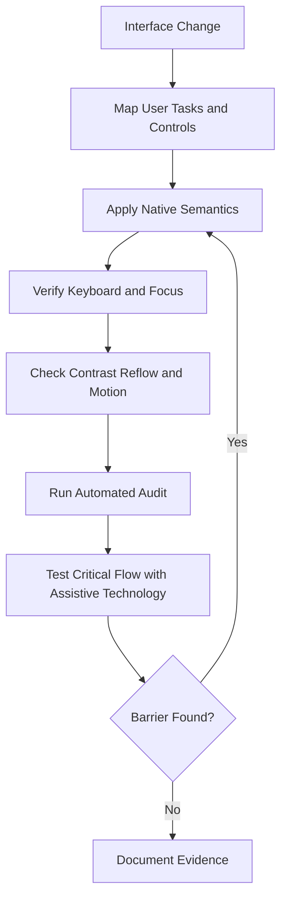
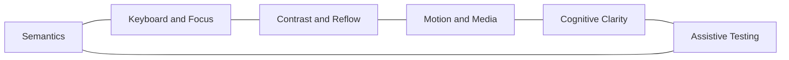

# Accessibility Engineering Reference

## Overview

This reference governs accessible interaction, semantics, keyboard operation, screen-reader behavior, contrast, zoom, reduced motion, cognitive clarity, and automated plus manual accessibility verification.

---

## How AI Agents Should Use This Skill

Load this reference for user interfaces, terminal interfaces, documents, charts, forms, navigation, media, and interactive controls. Accessibility is a functional requirement and must be verified in rendered behavior, not inferred only from source markup.

### Activation Triggers

- HTML, React, SwiftUI, mobile UI, desktop UI, TUI, or documents.
- Forms, dialogs, menus, tables, charts, media, drag-and-drop, or gestures.
- ARIA, screen readers, keyboard navigation, focus, contrast, or reduced motion.
- Accessibility audits, WCAG conformance, or assistive technology testing.

### Step-by-Step Agent Workflow

1. Identify users, tasks, controls, content structure, and input methods.
2. Prefer native semantic elements and platform controls.
3. Define keyboard order, focus movement, names, roles, states, and errors.
4. Check contrast, resizing, reflow, motion, and non-color cues.
5. Run automated checks and manually exercise critical flows.
6. Report unresolved barriers by severity and affected task.

---

## Mermaid Accessibility Verification Flow

## Mermaid Accessibility Domain Map

---

## Global Guards

### Forbidden Behaviors

- Replacing native controls with generic elements without equivalent behavior.
- Removing focus indicators or requiring pointer-only interaction.
- Encoding meaning by color alone.
- Announcing every visual change through a live region.
- Claiming accessibility solely because an automated scanner passes.

### Required Behaviors

- Provide programmatic names, roles, values, and states.
- Preserve logical heading, landmark, reading, and tab order.
- Support zoom, text resizing, reflow, and reduced motion.
- Associate errors with fields and explain recovery.
- Test critical paths with keyboard and assistive technology.

## Domain Rules

### Semantics and Forms

- Prefer native elements before ARIA.
- Keep labels persistent and instructions available before input.

### Keyboard and Focus

- Every action must be keyboard reachable.
- Move focus only when context changes require it.
- Restore focus when transient UI closes.

### Visual and Motion

- Meet WCAG contrast requirements.
- Avoid content loss at zoom and narrow widths.
- Disable nonessential motion under reduced-motion preferences.

### Testing

- Combine automated scanning with manual task-based checks.
- Test errors, loading, empty states, and dynamic updates.

## Verification Checklist

- Keyboard-only completion works.
- Focus is visible and ordered.
- Names, roles, states, and errors are announced correctly.
- Contrast and reflow pass.
- Reduced motion is honored.
- Critical assistive-technology paths are exercised.

## Integration Map

- Use `frontend_design.md` for layout and responsive design.
- Use `visual_motion.md` for motion behavior.
- Use `browser_automation.md` for automated accessibility checks.
- Use `cli_tui_engineering.md` for terminal accessibility.

## Completion Contract

Accessibility work is complete only when critical tasks remain understandable and operable across keyboard, visual adaptation, and assistive technology.
