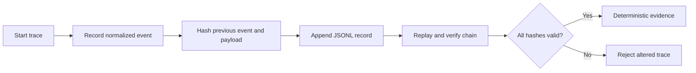
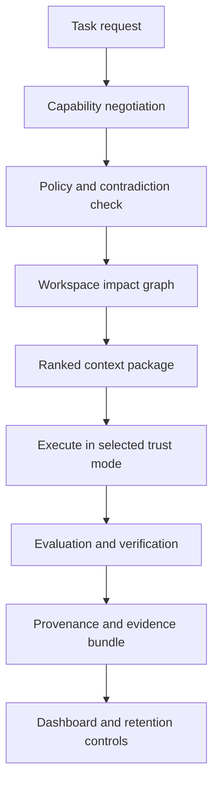

# Agent Reliability Runtime Reference

## How the AI Uses This Reference

Use this reference when a task needs reproducible agent behavior, capability
negotiation, policy enforcement, provenance, evaluation, context budgeting,
workspace impact analysis, privacy controls, or operational evidence.

The AI should select only the tools needed for the current risk. Routine edits
do not require a trace, provenance graph, and evidence bundle simultaneously.
Strict or security-sensitive work should use all three.

## Activation Triggers

- The user asks for deterministic replay or an audit trail.
- Instructions from multiple sources may conflict.
- A host has an unknown tool set or context budget.
- Supporting references must be ranked or packed into a token budget.
- A change may affect generated files, tests, security boundaries, or releases.
- Persistent artifacts require retention, sensitivity, or deletion controls.
- Munch-enabled output must be compared with a baseline.
- A reference extension pack is installed or reviewed.

## Ordered Workflow

1. Call `negotiate_capabilities` with the host's actual capabilities.
2. Call `compile_policy` after changing `SKILL.md`.
3. Use `detect_contradictions` before acting on competing directives.
4. Select `strict`, `balanced`, or `experimental` trust mode.
5. Start a trace for long, risky, or externally reviewed work.
6. Build a workspace graph and predict change impact before broad edits.
7. Score references and build a token-budgeted context package.
8. Record provenance for consequential decisions or imported knowledge.
9. Run evaluations against repeatable expectations and optional baselines.
10. Create an evidence bundle after verification.
11. Inspect `/dashboard` or `get_control_snapshot` for runtime health.
12. Apply retention with `purge_expired_data` only after explicit confirmation.

## Trust Modes

### Strict

- Require evidence before mutation.
- Reject unverified updates and extension packs.
- Prefer deterministic traces for multi-step work.
- Require contradiction resolution before execution.
- Use full verification gates before completion.

### Balanced

- Use traces for risky or long-running tasks.
- Use selective reference loading.
- Permit ordinary edits with focused tests.
- Produce evidence bundles for release-facing changes.

### Experimental

- Permit exploratory strategies and broader candidate generation.
- Keep security boundaries and explicit mutation confirmations unchanged.
- Label speculative output and retain rollback information.

## Policy Compiler

The policy compiler extracts required and conditional directives from
`SKILL.md`, hashes the source, and writes a machine-readable artifact. Agents
must recompile after changing instruction semantics and treat source hash drift
as a failed generated-artifact gate.

## Deterministic Replay

Replay traces are append-only JSONL files. Every event includes the previous
event hash and its own SHA-256 hash. A replay is deterministic only when the
entire chain validates. Trace payloads should contain tool names, normalized
arguments, result summaries, decisions, and verification outcomes. Secrets
must not be inserted into traces.

## Capability Negotiation

Capability negotiation is evidence-based. The agent provides the actual host,
tool names, context budget, filesystem level, network state, and transport.
The result determines verification depth, context strategy, and restrictions.
Never infer write access from read access.

## Contradiction Resolution

Statements should include their source and priority. User instructions outrank
framework defaults unless correctness, security, or accessibility would be
violated. Equal-priority conflicts remain unresolved and must not be silently
merged.

## Reference Quality and Context Packaging

Reference ranking combines task keyword match, core priority, recorded usage,
success rate, freshness, and estimated token cost. Context packaging includes
whole references while staying within the requested budget. A high score does
not override an explicit user exclusion.

## Provenance Graph

Each consequential memory or decision node records:

- Kind and normalized content.
- Source and confidence from zero to one.
- Content hash and timestamp.
- Evidence links.
- Superseded nodes.

Superseded information remains visible for auditability but should not be
treated as current.

## Evaluation Harness

Evaluation cases contain a stable ID, expected result, Munch-enabled output,
optional baseline output, and matcher. Prefer exact matching for structured
contracts, inclusion for semantic requirements, and regular expressions for
bounded format checks. Report enabled score, baseline score, and improvement.

## Workspace Knowledge and Impact

Workspace graph scans must remain inside the active working directory unless
an explicit external-scan environment permission is set. Ignore dependency,
build, coverage, and VCS directories. Impact predictions should identify
reverse import dependents, related tests, generated-artifact checks, security
boundary risks, and recommended commands.

## Reference Extension Packs

Reference packs are local, independently versioned directories with a
`munch-reference-pack.json` manifest. The manifest declares an ID, semantic
version, compatible core major, and SHA-256 for every installed file.
Installation requires `MUNCH_ALLOW_REFERENCE_PACK_INSTALL=true` and explicit
tool confirmation. Reject path traversal, missing files, incompatible majors,
and checksum mismatch.

## Privacy and Retention

Runtime settings classify traces, provenance, evidence, and evaluations as
public, internal, or sensitive. Retention defaults to ninety days. Purging is
explicit and applies to expired runtime files plus timestamped memory lessons,
fixes, and conversation summaries. Redaction remains mandatory before storage.

## Control Dashboard

The authenticated `/dashboard` page exposes runtime status, trust mode, trace
count, provenance count, evidence count, installed extension packs, and storage
paths. `/control.json` exposes the same state for automation. Neither endpoint
may bypass the HTTP bearer token.

## Verification Checklist

- Compiled policy source hash matches `SKILL.md`.
- Trace replay validates every hash link.
- Contradictions identify the winning source or remain unresolved.
- Reference package stays inside its token budget.
- Extension pack checksums and core compatibility pass.
- Workspace scans remain within the allowed root.
- Evidence bundles contain test status and hashes.
- Dashboard requires authentication.
- Retention deletion requires explicit confirmation.
- HKLM PowerShell IFEO support remains present in the explicit installer.

## Integration Map

- `ai_agent_engineering.md` for orchestration and tool contracts.
- `persistent_memory.md` for durable memory behavior.
- `security_engineering.md` for trust boundaries and integrity checks.
- `testing_strategy.md` for repeatable evaluations.
- `documentation_engineering.md` for evidence and generated artifacts.
- `package_release.md` for checksummed extension and release assets.

## Completion Contract

The reliability runtime is complete only when its policy, traces, provenance,
evaluation, context, graph, extension, privacy, and dashboard surfaces are
implemented as callable tools; mutation-sensitive actions require explicit
permission; generated artifacts are current; and integration tests exercise
the real compiled MCP server.
