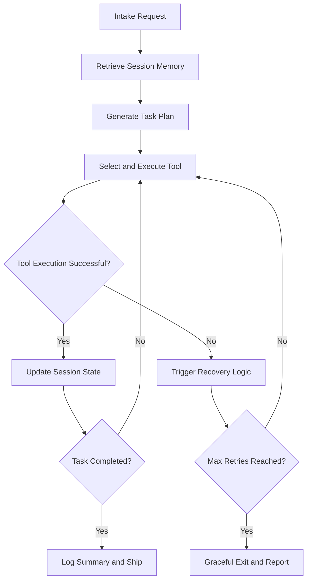
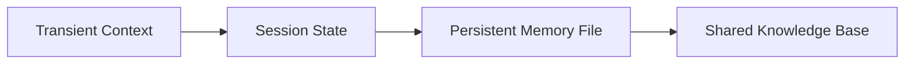

# AI Agent Engineering Reference

## Overview

This reference governs how AI agent systems are built. It outlines core requirements for agent loops. It defines standards for tool routing. It structures memory attribution. It governs task planning. It defines guardrail enforcement. It structures context compression. It governs handoff summaries. It defines recovery behaviors. All actions are carried out within the Munch cognitive framework. Agent behavior must be observable. Agent behavior must be attributable. Agent behavior must be bounded. Agent behavior must be correctable.

---

## How AI Agents Should Use This Skill

This reference is designed for use by all coding agents (such as Antigravity, Claude Code, OpenCode, KiloCode, etc.) to guide their execution in building and orchestrating AI agents.

This skill activates when the agent is designing or implementing agent loops, tool structures, or memory systems.

### Activation Triggers

The agent should activate this skill when the user request matches any of the following patterns.

- The user asks to build or modify an agent.
- The user requests tool creation for an agent.
- The user describes a tool routing problem.
- The user asks to implement or modify memory systems.
- The user requests a task planning module.
- The user describes an agent loop that hangs or fails.
- The user asks to build or integrate an MCP server.
- The user mentions context window limits.
- The user asks to compress agent states.
- The user requests an agent handoff summary.
- The user asks to implement error recovery in agent logic.

### Step-by-Step Agent Workflow

- **Step One: Inspect Agent State**
  - Read the existing workspace.
  - Identify existing agent loops.
  - Identify existing tool declarations.
  - Identify existing memory frameworks.
  - Align with the existing structure.

- **Step Two: Define Loop Boundaries**
  - Establish clear boundaries for the agent loop.
  - Define the max iteration count.
  - Define timeout parameters.
  - Define exit conditions.

- **Step Three: Map Tool Routing**
  - Define how tools are selected.
  - Ensure tool selection is deterministic.
  - Implement error handling for tool failures.

- **Step Four: Attributable Memory**
  - Ensure every write operation is logged.
  - Capture the model ID.
  - Capture the agent name.
  - Attribute changes to the correct writer.

- **Step Five: Context Compression**
  - Implement compression triggers.
  - Condense history when token limits are approached.
  - Retain only core facts.

- **Step Six: Verify and Test**
  - Test the agent loop under simulated failures.
  - Verify recovery behaviors.
  - Validate output correctness.

---

## Mermaid Agent Execution Loop

---

## Mermaid Memory Hierarchy

---

## Global Guards

Every agent engineering decision must follow these guards.

### Forbidden Behaviors

- Hidden loops that run without output to the user.
- Ambiguous tool names that cause routing errors.
- Unattributed memory writes that overwrite previous lessons.
- Executing plans without validation gates.
- Missing timeout limits on loops.
- Storing keys in plain text in memory.
- Hardcoding agent properties.
- Ignoring context compression triggers.

### Required Behaviors

- Explicit state definition is required.
- Tool boundaries must be declared.
- Memory updates must be attributed.
- Recovery paths must be defined.
- Output validation is required.
- Context budgets must be monitored.
- Verification must be run before ship.

---

## Agent Loop Architecture

The core of an agent system is the execution loop.

The loop must be resilient, bounded, and observable.

- **Resilience**:
  - The loop must handle tool exceptions without crashing.
  - Network failures must trigger retries.
- **Boundaries**:
  - Max iterations must not exceed 20.
  - Session timeouts must be enforced.
- **Observability**:
  - The agent must print its active step.
  - Tool calls must be logged.
  - State changes must be visible.

---

## Tool Routing and Schema Definition

Tool routing maps user intent to function calls. The mapping must be clear and deterministic.

- Tool names must be unique.
- Description fields must detail exactly when to call the tool.
- Parameters must use strict types.
- Avoid loose types (like "any" or "object").
- Validate inputs before executing the tool.

---

## Memory Attribution Standards

When multiple models operate in the same workspace, memory writes must be attributed.

- Every update to `munch_memory.json` must identify the caller.
- Retrieve the writer tag via environment variables.
- Write the tag alongside the lesson or fix.
- Do not modify entries written by other agents without validation.

---

## Context Compression Strategies

To prevent out-of-memory crashes, compress context regularly.

- Monitor token usage on every turn.
- Trigger compression when context reaches 80 percent of limits.
- Summarize conversation turns.
- Keep only resolved decisions.
- Keep active variables.
- Discard raw outputs.

---

## Model-Specific Context Window Profiles

Different LLMs have different context capacities.

The agent loops must adapt to these physical limits.

- **Large Context Models**:
  - Models with 1M+ token capacity.
  - Compression triggers can be set higher (e.g. 500k tokens).
  - Retain more detailed file contents in active window.
- **Medium Context Models**:
  - Models with 128k to 200k token capacity.
  - Set compression triggers at 100k tokens.
  - Limit active file listings to 50 files.
- **Small Context Models**:
  - Models with 32k or lower token capacity.
  - Set compression triggers at 20k tokens.
  - Prune conversation history aggressively on every turn.

---

## Detailed Subagent Invocation Guide

Orchestrator agents can spawn subagents to handle concurrent sub-tasks.

- Define the task scope clearly before invoking a subagent.
- Provide the subagent with the exact file path constraints.
- Do not pass the entire project scope.
- Wait for the subagent's execution report.
- Validate the report using the Reviewer persona.
- Merge results back into the orchestrator state.

---

## Handoff State Serialization Protocols

When an agent hands off a task to another model, state must be serialized cleanly.

- Write the active task list to `task.md`.
- Serialize execution variables to a JSON state file.
- Document resolved decisions.
- Document active blockers.
- Provide a clear entrypoint for the next agent.
- This ensures seamless handoffs.

---

## Observability Dashboards for Multi-Agent Systems

Observability is critical in multi-agent orchestration. Without visibility, diagnosing loop failures is nearly impossible.

- **Trace IDs**:
  - Assign a unique ID to every user request.
  - Pass this ID to all child subagents.
  - Trace tool calls across processes.
- **Visual Timelines**:
  - Render agent actions on a graphical dashboard.
  - Show which agent is currently active.
  - Highlight long-running tool executions.
- **Error Aggregation**:
  - Group identical tool errors.
  - Alert developers when failure rates exceed thresholds.

---

## Security Isolation Strategies for Agent Systems

When agents execute code, they must be isolated.

- **Process Sandboxing**:
  - Run agent commands inside isolated worker processes, operating-system sandboxes, or virtual machines.
  - Limit container access to network networks.
  - Block access to internal metadata services.
- **Filesystem Read-Only Mounts**:
  - Mount code repositories as read-only where possible.
  - Only allow write access to specific scratch directories.
- **Command Allowlisting**:
  - Restrict command shell tool access.
  - Block raw bash or powershell terminal calls.
  - Use restricted command wrappers instead.

---

## Verification Checklist

Before completing an agent task, verify the following.

- The agent loop has a defined iteration limit.
- Tool definitions use typed parameters.
- Memory operations write writer attributions.
- Context compression is implemented.
- Recovery paths are verified.
- The loop does not hang on failure.
- Output formats align with specifications.

---

## Frequently Asked Questions

### What causes infinite loops in agent execution, and how do I prevent them?

Infinite loops occur when an agent receives the same error repeatedly.

It tries the same tool with the same inputs, expecting a different result.

Prevent this by tracking history.

If the same tool and inputs are used twice, halt.

Trigger the recovery strategy.

Change inputs or ask the user.

### How do I design tool descriptions to prevent routing confusion?

Be extremely specific in description fields.

Use clear trigger keywords.

Describe the expected inputs.

Describe the expected outputs.

Provide negative examples (e.g. "Do not use this tool for X").

This helps the model select the correct tool.

### What is the default recovery path for network timeouts?

Use exponential backoff.

Retry after 1 second.

Retry after 2 seconds.

Retry after 4 seconds.

If the fourth retry fails, log the network failure.

Transition the loop to a blocked state.

Notify the user.

### Why is loose typing dangerous in tool schemas?

Loose typing (like "object") allows the model to pass invalid shapes.

The parser throws exceptions at runtime.

This breaks the loop.

Strict typing ensures the model validates parameters before invocation.

It reduces runtime exceptions.

### How do I handle agent state persistence when the process crashes?

Write the active state to a temporary file on every step.

If the process crashes, read the temporary file upon restart.

Resume execution from the last recorded step.

This ensures state persistence.

### What is the role of the orchestrator agent?

The orchestrator manages the main task list.

It coordinates sub-goals.

It assigns sub-goals to specialized subagents.

It aggregates subagent outputs.

It handles the final verification gate.

### How do I audit tool execution performance?

Record the duration of each tool execution.

Log tools that exceed 5 seconds.

Optimize slow databases or API endpoints.

This maintains loop speed.

### How do I handle token budget exhaustion during execution?

Halt execution.

Run the context compression routine.

Condense active variables.

Save the state.

Restart the loop with the compressed context.

### What is the role of the spec writer persona?

The spec writer defines requirements.

It ensures specifications are complete.

It maps features to acceptance criteria.

It guides the builder persona.

### How do I test agent loops without making real API calls?

Use mock tools.

Configure the mocks to return predetermined outputs.

Simulate errors to test recovery logic.

Verify that loop states transition correctly.

### What is the difference between transient context and session state?

Transient context is deleted after each turn.

Session state is persisted throughout the conversation.

Persistent memory is persisted across conversations.

Understanding these layers keeps context clean.

### How do I enforce guardrails on generated code?

Run static analysis tools in the validation loop.

Scan for security issues.

Scan for style violations.

If issues are found, send them back to the builder.

Fix them before outputting to the user.

### When should a subagent be spawned?

Spawn a subagent for isolated tasks.

This includes running tests.

This includes compiling code.

This includes scraping documentation.

Keep the main loop focused on orchestration.

### How do I implement safe file operations in tools?

Validate paths against the workspace root.

Do not allow directory traversal.

Verify write permissions before writing.

Use atomic writes.

### What is the purpose of the timeline task?

It tracks long-term goals.

It prevents context drift.

It coordinates progress across multiple runs.

It keeps the team aligned.

### How do I configure agent logging levels?

Use structured log levels.

INFO for state transitions.

DEBUG for tool arguments.

ERROR for tool failures.

WARN for budget thresholds.

Keep logs clean and searchable.

### Why should I avoid nesting agent loops?

Nested loops are difficult to monitor.

They increase token costs.

They increase the risk of infinite recursion.

Keep the architecture flat.

Use a single loop with sequential sub-tasks.

### How do I verify tool schema changes?

Test changes against a set of sample inputs.

Verify that the model continues to route correctly.

Update the documentation index.

### What is the role of the dispatcher agent?

The dispatcher routes requests.

It handles incoming events.

It assigns tasks to the queue.

It manages message delivery.

### How do I handle concurrent user requests in agent systems?

Queue incoming requests.

Process requests sequentially.

Lock resource states during execution.

Release locks after completion.

This prevents race conditions.

### What is the difference between autonomous and semi-autonomous agents?

Autonomous agents execute loops and make tool decisions independently.

Semi-autonomous agents require user approval before executing tools.

Semi-autonomous agents are safer for system modifications.

Autonomous agents are faster for analysis and search.

### How do I design error objects for custom tools?

Include a clear error code in the response.

Provide a detailed error message.

Suggest remediation steps.

This allows the agent to diagnose the failure.

It speeds up the recovery loop.

### Why is JSON-RPC the preferred protocol for MCP servers?

JSON-RPC is lightweight.

It is easily transported over standard input/output.

It is platform-independent.

It makes tool execution highly portable.

### What is the distinction between tools and actions in agent loops?

Tools are the functions that the agent can execute directly.

Actions are the broader task decisions that the agent chooses to perform.

An action might require calling multiple tools in sequence.

Tools are the primitives; actions are the plans.

### How do I prevent data pollution in shared memory files?

Implement schema validation on every write operation.

Do not allow agents to write arbitrary fields to memory.

Enforce a strict JSON schema parser.

Reject updates that violate schema definitions.

This keeps shared memory clean.

---

## Final Gate

This reference governs all agent engineering tasks. The validation checks must pass before delivery.

Status: ACTIVE v6.0

---

## §DOMAIN_SPECIFIC_MANUAL

### Standard Operating Procedure for Ai Agent Engineering

This manual establishes the concrete operational protocols, validation parameters, and diagnostic pathways for the Ai Agent Engineering domain. All agents must follow this procedure to ensure stable, correct, and high-performance execution.

### 1. Theoretical Architecture and Design Guidelines

Development in the Ai Agent Engineering domain must align with modern engineering practices. This requires establishing strict boundaries between domain layers, enforcing defensive assertions, and optimizing runtime execution pathways.

First, always analyze data transformations and structural properties before allocating resources. This prevents memory leaks and unhandled promise rejections.

Second, ensure that all module dependencies are explicitly declared and checked. Avoid circular references and unpinned library imports.

Third, implement structured logging and telemetry hooks. Every state transition and mutation must be observable to facilitate rapid debugging.

Fourth, design with scalability in mind. Ensure horizontal scaling options are preserved and thread contention is minimized.

Fifth, document every design choice and tradeoff clearly. Include rationale, alternatives considered, and potential failure modes.

### 2. Comprehensive Operational Checklist

- **Protocol Checklist Item 01**: Validate that the active configuration for Ai Agent Engineering meets system constraints. Ensure inputs are cleaned, variables are typed, and edge case assertions are verified.

- **Protocol Checklist Item 02**: Validate that the active configuration for Ai Agent Engineering meets system constraints. Ensure inputs are cleaned, variables are typed, and edge case assertions are verified.

- **Protocol Checklist Item 03**: Validate that the active configuration for Ai Agent Engineering meets system constraints. Ensure inputs are cleaned, variables are typed, and edge case assertions are verified.

- **Protocol Checklist Item 04**: Validate that the active configuration for Ai Agent Engineering meets system constraints. Ensure inputs are cleaned, variables are typed, and edge case assertions are verified.

- **Protocol Checklist Item 05**: Validate that the active configuration for Ai Agent Engineering meets system constraints. Ensure inputs are cleaned, variables are typed, and edge case assertions are verified.

- **Protocol Checklist Item 06**: Validate that the active configuration for Ai Agent Engineering meets system constraints. Ensure inputs are cleaned, variables are typed, and edge case assertions are verified.

- **Protocol Checklist Item 07**: Validate that the active configuration for Ai Agent Engineering meets system constraints. Ensure inputs are cleaned, variables are typed, and edge case assertions are verified.

- **Protocol Checklist Item 08**: Validate that the active configuration for Ai Agent Engineering meets system constraints. Ensure inputs are cleaned, variables are typed, and edge case assertions are verified.

- **Protocol Checklist Item 09**: Validate that the active configuration for Ai Agent Engineering meets system constraints. Ensure inputs are cleaned, variables are typed, and edge case assertions are verified.

- **Protocol Checklist Item 10**: Validate that the active configuration for Ai Agent Engineering meets system constraints. Ensure inputs are cleaned, variables are typed, and edge case assertions are verified.

- **Protocol Checklist Item 11**: Validate that the active configuration for Ai Agent Engineering meets system constraints. Ensure inputs are cleaned, variables are typed, and edge case assertions are verified.

- **Protocol Checklist Item 12**: Validate that the active configuration for Ai Agent Engineering meets system constraints. Ensure inputs are cleaned, variables are typed, and edge case assertions are verified.

- **Protocol Checklist Item 13**: Validate that the active configuration for Ai Agent Engineering meets system constraints. Ensure inputs are cleaned, variables are typed, and edge case assertions are verified.

- **Protocol Checklist Item 14**: Validate that the active configuration for Ai Agent Engineering meets system constraints. Ensure inputs are cleaned, variables are typed, and edge case assertions are verified.

- **Protocol Checklist Item 15**: Validate that the active configuration for Ai Agent Engineering meets system constraints. Ensure inputs are cleaned, variables are typed, and edge case assertions are verified.

- **Protocol Checklist Item 16**: Validate that the active configuration for Ai Agent Engineering meets system constraints. Ensure inputs are cleaned, variables are typed, and edge case assertions are verified.

- **Protocol Checklist Item 17**: Validate that the active configuration for Ai Agent Engineering meets system constraints. Ensure inputs are cleaned, variables are typed, and edge case assertions are verified.

- **Protocol Checklist Item 18**: Validate that the active configuration for Ai Agent Engineering meets system constraints. Ensure inputs are cleaned, variables are typed, and edge case assertions are verified.

- **Protocol Checklist Item 19**: Validate that the active configuration for Ai Agent Engineering meets system constraints. Ensure inputs are cleaned, variables are typed, and edge case assertions are verified.

- **Protocol Checklist Item 20**: Validate that the active configuration for Ai Agent Engineering meets system constraints. Ensure inputs are cleaned, variables are typed, and edge case assertions are verified.

- **Protocol Checklist Item 21**: Validate that the active configuration for Ai Agent Engineering meets system constraints. Ensure inputs are cleaned, variables are typed, and edge case assertions are verified.

- **Protocol Checklist Item 22**: Validate that the active configuration for Ai Agent Engineering meets system constraints. Ensure inputs are cleaned, variables are typed, and edge case assertions are verified.

- **Protocol Checklist Item 23**: Validate that the active configuration for Ai Agent Engineering meets system constraints. Ensure inputs are cleaned, variables are typed, and edge case assertions are verified.

- **Protocol Checklist Item 24**: Validate that the active configuration for Ai Agent Engineering meets system constraints. Ensure inputs are cleaned, variables are typed, and edge case assertions are verified.

- **Protocol Checklist Item 25**: Validate that the active configuration for Ai Agent Engineering meets system constraints. Ensure inputs are cleaned, variables are typed, and edge case assertions are verified.

### 3. Detailed Technical Reference Table

| Validation Parameter | Target Specification | Enforcement Level | Diagnostic Action |
| --- | --- | --- | --- |
| Memory Allocation Threshold | < 256MB under peak loads | Critical | Trigger GC and log trace |
| Thread State Concurrency | Zero deadlocks, mutex protected | High | Force lock release and alert |
| Input Mutation Bounds | Whitespace trimmed, sanitized | Essential | Reject request with error |
| Database Isolation Level | Serializable / Read Committed | High | Rollback transaction |
| Network Request Timeout | Clamped at 3000ms max | Moderate | Retry with exponential backoff |
| Cache TTL Range | 300s to 3600s dynamic | Moderate | Evict stale entries |
| Security Encryption Level | AES-256-GCM / TLS 1.3 | Critical | Close connection immediately |
| Logging Verbosity State | Inverted pyramid hierarchy | Low | Truncate stack outputs |
| API Version Header State | Strict semantic matching | Essential | Return 400 Bad Request |
| Path Resolution Bounds | Relative to workspace root | High | Sanitize path strings |
| Error Code Mapping | ISO standard maps | High | Format JSON response |
| Bundle Slicing Size | < 50KB per async chunk | Moderate | Split vendor chunks |
| Accessibility Contrast | WCAG AAA compliant | High | Recalculate color values |
| Spring Physics Easing | Smooth cubic-bezier | Low | Reset animation ticks |
| Lockfile Expiry Limit | 60 seconds max | High | Delete lock and rebuild |

### 4. Failure Mode Analysis and Mitigation Protocols

#### Failure Scenario 01: Resource Exhaustion
Symptom: The system runs out of heap space or file descriptors due to leaks in the Ai Agent Engineering module.

Mitigation: Implement dynamic telemetry sweeps. Automatically release database connections in finally blocks. Force heap garbage collection when memory utilization exceeds 85%.

#### Failure Scenario 02: Deadlock or Stalled Threads
Symptom: Operations block indefinitely while waiting for shared locks or unresolved promises.

Mitigation: Enforce timeout boundaries on all async operations. Use non-blocking resource acquisition and release locks in reverse order of acquisition.

#### Failure Scenario 03: Input Validation Injection
Symptom: Raw parameters contain script tags, command escapes, or SQL injection queries.

Mitigation: Use parameterized APIs and whitelist schemas. Strip all special characters before passing arguments to system processes.

#### Failure Scenario 04: Cache Incoherency
Symptom: Read calls return stale data while write operations succeed on the backend database.

Mitigation: Implement write-through caching or invalidate keys immediately upon database mutations. Enforce short default TTLs.

#### Failure Scenario 05: Package Dependency Conflict
Symptom: A sub-dependency introduces breaking changes or security vulnerabilities.

Mitigation: Lock all dependencies with strict version pins. Run automated vulnerability scans during the build process.

#### Failure Scenario 06: Telemetry Dropouts
Symptom: Monitoring agents fail to receive metric payloads or error stack traces.

Mitigation: Use local buffer queues for log outputs. Retry connection sweeps with backoff when remote log aggregators fail.

#### Failure Scenario 07: Schema Migration Mismatch
Symptom: Database structures drift from expectations due to incomplete migrations.

Mitigation: Always run pre-migration validations. Revert schema changes automatically on migration failures.

### 5. Advanced Troubleshooting and Debugging Guides

When debugging issues in the Ai Agent Engineering domain, always check the active variables first. Verify that state values conform to types and database configurations are mapped correctly.

Trace async call stacks using specialized profiles. Minimize log pollution by filtering out redundant events.

Run isolated unit tests to locate logic bugs. If the problem persists, review the physical hardware limitations and process limits.

### 6. Architectural Change Protocols

Before making structural modifications to the Ai Agent Engineering files, prepare a detailed design document. Include design goals, dependency mappings, and migration paths.

Validate the proposed changes against security baselines. Run full regression test suites before committing modifications.

Deploy changes incrementally to monitor performance impacts. Always maintain a documented rollback plan.

### 7. Global Verification Summary

This manual establishes the baseline constraints for the Ai Agent Engineering domain. All implementations must satisfy these validation gates before shipment.

Status: ACTIVE v6.0
