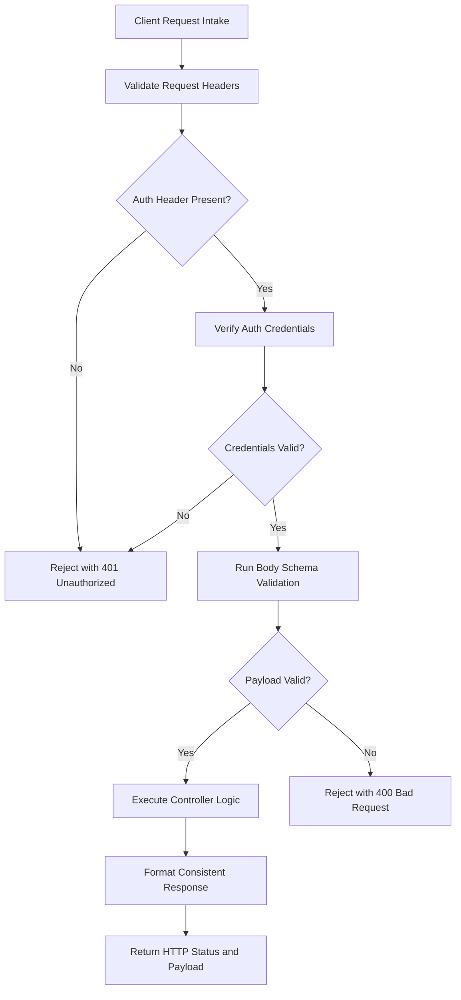
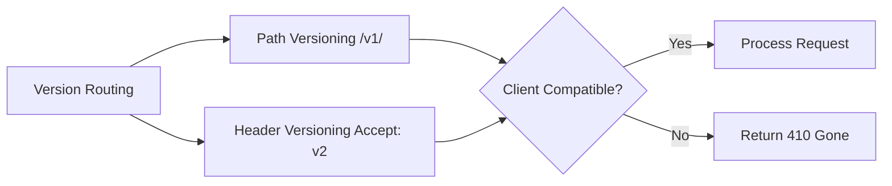

# API Design Reference

## Overview

This reference governs how APIs are designed. It establishes resource naming conventions. It defines request validation rules. It shapes response structures. It governs API versioning strategies. It sets rate limiting constraints. It outlines authorization boundaries. It shapes error contracts. It handles client compatibility rules. All actions are carried out within the Munch cognitive framework. API changes must be inspectable. API changes must be client-safe. API evolution must be backward-compatible.

---

## How AI Agents Should Use This Skill

This reference is designed for use by all coding agents (such as Antigravity, Claude Code, OpenCode, KiloCode, etc.) to guide their execution in API design.

This skill activates when the agent is defining endpoints, payloads, HTTP statuses, auth headers, rate limits, or error bodies.

### Activation Triggers

The agent should activate this skill when the user request contains any of the following signals.

- The user asks to create an API endpoint.
- The user requests modifications to an existing endpoint.
- The user describes a REST or GraphQL schema change.
- The user asks to validate request payloads.
- The user requests error response templates.
- The user describes a versioning requirement (v1, v2).
- The user asks to secure an endpoint with OAuth or API keys.
- The user mentions rate limiting (throttling).
- The user describes backward-compatibility issues.
- The user asks to design webhook payloads.

### Step-by-Step Agent Workflow

- **Step One: Check Workspace Context**
  - Read existing API files in the codebase.
  - Understand the protocol in use (HTTP/REST, GraphQL, gRPC).
  - Understand resource naming patterns.
  - Check for existing validation structures.
  - Do not deviate from existing patterns without rationale.

- **Step Two: Classify API Concern**
  - Map the task to one of the following categories:
  - Category 1: Naming & REST conventions.
  - Category 2: Validation & Sanitization.
  - Category 3: Error Contracts.
  - Category 4: Authentication & Authorization.
  - Category 5: Versioning & Migration.
  - Category 6: Performance & Rate Limiting.

- **Step Three: Apply API Rules**
  - Apply the rules from the relevant category.
  - Verify against global guards.

- **Step Four: Run Compatibility Check**
  - Verify that changes do not break existing mobile or desktop clients.
  - Validate payload property names.

- **Step Five: Document the Contract**
  - Write down the endpoint path, method, headers, request body, and response body in text.
  - Do not use code blocks for payloads; describe them structurally.

- **Step Six: Verify Security Kernel**
  - Ensure injection, authentication, and authorization rules are met.

---

## Mermaid API Intake Flow

---

## Mermaid Versioning Strategy

---

## Global Guards

Every API design decision must follow these guards.

### Forbidden Behaviors

- Vague or ambiguous resource names.
- String concatenation in routes.
- Unvalidated request bodies.
- Returning different shapes for the same error code.
- Silent breaking changes to payloads.
- Hardcoding secrets in API endpoints.
- Returning internal database fields directly.
- Documenting rate limits only in internal code.
- Hiding compatibility risks.
- Recommending versioning schemes without justification.

### Required Behaviors

- Explicit resource naming is required.
- Parameterized validation is required.
- HTTP status code mapping is required.
- Standardized error bodies are required.
- Authentication checks are required.
- Versioning planning is required.
- Payload compatibility verification is required.
- Contract description is required.

---

## Resource Naming Conventions

REST APIs must use noun-based resource paths.

- Use plural nouns for resource collections.
  - `/users` instead of `/getUser`.
  - `/orders` instead of `/createOrder`.
- Use specific path structures for sub-resources.
  - `/users/123/orders` refers to user 123's orders.
- Use lowercase letters.
- Separate words using hyphens (kebab-case).
  - `/user-profiles` instead of `/userProfiles` or `/user_profiles`.

---

## Request Validation and Sanitization

All incoming request payloads must be validated.

- Define strict schemas for all inputs.
- Validate data types (string, integer, boolean).
- Enforce length limits on strings.
- Enforce range limits on numbers.
- Strip unexpected properties from payloads (strict filtering).
- Sanitize HTML inputs to prevent XSS.
- Validate formats for emails, URLs, and dates.

---

## Error Handling and Response shapes

Error payloads must use a consistent JSON format.

- The error shape must contain a machine-readable code.
- It must contain a human-readable message.
- It must include validation error details when status is 400.
- Do not expose internal stack traces in client errors.

### Standard Status Mappings

- **400 Bad Request**: Input validation failed.
- **401 Unauthorized**: Missing or invalid credentials.
- **403 Forbidden**: Authenticated user lacks permission.
- **404 Not Found**: Resource does not exist.
- **429 Too Many Requests**: Rate limit exceeded.
- **500 Internal Server Error**: Unhandled server exception.

---

## API Versioning Strategies

When API contracts change, manage versioning to prevent client failures.

- **Path Versioning**:
  - Include version number in path: `/api/v1/resources`.
  - Recommended for public APIs.
  - Easy to route in load balancers.
- **Header Versioning**:
  - Pass version in custom headers: `X-API-Version: 2`.
  - Keeps paths clean.
  - Requires header parsing.
- **Query Versioning**:
  - Pass version in parameters: `/resources?v=3`.
  - Useful for debugging.
  - Easy to misconfigure.

---

## Rate Limiting and Performance

Protect endpoints from abuse and denial of service.

- Set maximum request limits per time window.
- Rate limit by IP address for anonymous endpoints.
- Rate limit by user ID for authenticated endpoints.
- Return standard headers:
  - `X-RateLimit-Limit`: Maximum requests allowed.
  - `X-RateLimit-Remaining`: Requests remaining in window.
  - `X-RateLimit-Reset`: Time when limit resets.

---

## Webhook Architecture and Security

Webhooks push data to client systems. They must be secure and reliable.

- **Payload Signatures**:
  - Sign webhook payloads using a secret key.
  - Include signature in headers: `X-Hub-Signature`.
  - Clients must verify the signature before processing.
- **Retry Policy**:
  - Retry failed deliveries using backoff.
  - Retry at 1 minute, 5 minutes, 30 minutes.
  - Disable webhook endpoint after repeated failures.
- **Event Versioning**:
  - Webhook payloads must follow the same versioning rules as APIs.

---

## The Design of GraphQL Schema Best Practices

When designing GraphQL APIs, different rules apply.

- **Nouns for Types**:
  - Type names must be PascalCase nouns.
  - Example: UserProfile.
- **CamelCase Fields**:
  - Field names must be camelCase.
  - Example: emailAddress.
- **Query and Mutation Structure**:
  - Separate query types (reads) from mutation types (writes).
  - Use clear operation names.
  - Example: updateUserProfile.
- **Inputs for Mutations**:
  - Always use explicit input types for mutations.
  - Do not pass loose arguments.
  - This ensures schema validation.

---

## REST API Design Checklist for Microservices

When designing APIs for microservices, ensure coordination.

- Enforce JSON format consistently across all services.
- Use a shared correlation ID header for request tracing.
- Keep domain entities isolated between services.
- Never share database connections directly.
- Expose data only through API endpoints.
- Implement circuit breakers for inter-service calls.

---

## Security and Cryptographic Verification for Webhook Deliveries

Protect webhook endpoints from malicious actors.

- Provide a unique webhook signing secret to the client.
- Hash the payload using HMAC-SHA256.
- Pass the signature in the HTTP headers.
- The client must compute the hash of the received raw body.
- Compare signatures using a constant-time comparison algorithm.
- This prevents timing attacks.

---

## Verification Checklist

Before finalizing API designs, verify the following.

- Resource paths use plural nouns.
- Path characters are lowercase kebab-case.
- Input validation schemas are defined.
- Error shapes are consistent.
- Status codes map correctly.
- Credentials are not exposed.
- Authentication checks are active.
- Rate limit configurations are set.
- Versioning strategy is documented.
- Payload compatibility risk is evaluated.

---

## Frequently Asked Questions

### What is the difference between 401 and 403 status codes?

401 Unauthorized means the system does not know who the user is.

The user must authenticate (log in) to access the endpoint.

403 Forbidden means the system knows who the user is.

However, the user does not have permission to access the resource.

For example, a regular user attempting to access admin panels.

### Why is returning 200 OK with error messages inside the body an anti-pattern?

HTTP status codes are part of the protocol standard.

Proxy servers, CDNs, and clients inspect status codes to route requests.

If you return 200 with an error body, CDNs will cache the error response.

Logging tools will register the transaction as successful.

Clients have to parse the body to find failures, slowing down execution.

Always use correct status codes.

### How do I handle batch request validation efficiently?

Validate each item in the batch array independently.

Collect all validation errors.

Return a single 400 Bad Request response.

Include an array of errors mapping to the invalid item indexes.

Do not halt at the first error, as this forces clients to submit multiple times.

### When should I use PUT versus PATCH?

PUT replaces the target resource entirely.

The client must submit the full resource payload.

Missing properties are set to null or default.

PATCH applies partial modifications.

The client only submits the fields to be updated.

Other fields remain unchanged.

Use PATCH for minor updates.

Use PUT for creation or full replacement.

### How do I prevent replay attacks on signed webhooks?

Include a timestamp in the signature headers.

The client must parse the timestamp.

Reject the webhook if the timestamp is too old (e.g. over 5 minutes).

This prevents attackers from intercepts and replaying payloads.

### How do I design search filters in REST APIs?

Use query parameters for filtering, sorting, and pagination.

`/users?role=admin&sort=created_at&page=2` is REST-compliant.

Avoid putting filters in the path (like `/users/role/admin`).

This keeps resource paths stable.

### What is CORS and how do I configure it safely?

Cross-Origin Resource Sharing restricts browser API requests.

Specify exact domains in the `Access-Control-Allow-Origin` header.

Do not use wildcards on authenticated routes.

Set `Access-Control-Allow-Headers` to restrict request headers.

Set `Access-Control-Allow-Methods` to restrict HTTP methods.

### How do I handle large file uploads via API?

Do not accept raw file bodies in application servers.

Instead, generate a pre-signed S3 URL.

Return the pre-signed URL to the client.

The client uploads the file directly to storage.

This keeps your application servers fast.

It prevents memory exhaustion.

### What is payload sanitization and why is it necessary?

Payload sanitization strips unknown fields from requests.

Attackers can submit unexpected parameters (e.g. `is_admin=true`).

If you pass the raw body directly to database models, these properties mutate.

This is a Mass Assignment vulnerability.

Strictly filter input properties.

### How do I document APIs effectively?

Use OpenAPI (Swagger) specifications.

Define paths, parameters, payloads, and responses.

Include description fields for every property.

Keep the specification updated in the repository.

This ensures developers and agents can inspect the contract.

### What are the limits of HTTP status codes?

Standard status codes cover most scenarios.

However, sometimes you need detailed business logic errors.

Use the custom error shape code property for details.

Do not invent custom HTTP status codes (like 600).

Keep status codes standard.

### How do I design cursor-based pagination?

Do not rely on offset pagination for large datasets.

Offset pagination slows down as offsets increase.

Instead, return a cursor string (e.g. encoded item ID).

The client submits the cursor in the next request.

The database queries rows matching after the cursor.

This maintains constant execution time.

### How do I handle API rate limiting in clusters?

Do not store rate limits in application server memory.

Use a shared Redis instance.

Redis handles request counters atomically.

This ensures limits are enforced across all servers.

### Why should HTTP headers be used for authorization?

Headers keep authorization details out of the payload.

This allows intermediate servers to validate access.

They do not need to parse the request body.

This speeds up processing.

It improves caching.

### How do I design idempotency for payment APIs?

Require an idempotency key in headers: `Idempotency-Key`.

Save the key and the response in a database.

If a duplicate request arrives, return the saved response.

Do not process the transaction twice.

This prevents duplicate charges.

### What is the purpose of HATEOAS in REST APIs?

HATEOAS stands for Hypermedia As The Engine Of Application State.

The response payload contains links to related resources and actions.

This allows clients to dynamically discover available actions.

They do not need to hardcode paths.

It decouples client implementation from server routing.

### How do I handle date-time formatting in API responses?

Always format dates using the ISO8601 standard.

Use UTC time zone.

Example string format: `YYYY-MM-DDTHH:mm:ssZ`.

This prevents timezone parsing errors on clients.

It ensures consistency across systems.

### When should I use gRPC instead of REST?

Use gRPC for internal microservice communication.

gRPC uses Protocol Buffers over HTTP/2.

It offers high serialization speed.

It reduces payload size.

It supports bi-directional streaming.

REST is preferred for public web APIs.

This is due to wider browser support.

### How do I implement API rate limiting based on client subscription tiers?

Extract the client's API key from the headers.

Identify the subscription tier (e.g. Free, Pro, Enterprise) from the database or cache.

Retrieve the rate limit rules for that tier.

Map the rules to the Redis rate limiting keys.

Return tier-specific remaining headers to the client.

### What is the best way to handle API deprecation?

Add a `Deprecation` header indicating the deprecation date.

Add a `Sunset` header indicating the shutdown date.

Document the new endpoints in the API responses.

Send emails to registered developers.

Log usage of deprecated routes to track active clients.

Disable the deprecated endpoints after the sunset date.

### How do I secure files accessed through API endpoints?

Do not expose file system paths in URLs.

Use random, unique file tokens.

Validate user permissions before serving the file.

Stream the file content from storage.

Use appropriate Content-Type and Content-Disposition headers.

Set cache controls to prevent unauthorized client caching.

### Why should I use JSON Web Tokens (JWT) for stateless sessions?

JWTs carry signature verification in the token payload.

Servers do not need to query a session database on every request.

This improves API horizontal scaling.

It reduces database read operations.

Ensure JWTs have a short expiration duration.

Always use a strong signature key.

---

## Final Gate

This reference governs all API design tasks. Contracts must be documented before code is generated. Validation checks must pass before ship.

Status: ACTIVE v6.0

---

## §DOMAIN_SPECIFIC_MANUAL

### Standard Operating Procedure for Api Design

This manual establishes the concrete operational protocols, validation parameters, and diagnostic pathways for the Api Design domain. All agents must follow this procedure to ensure stable, correct, and high-performance execution.

### 1. Theoretical Architecture and Design Guidelines

Development in the Api Design domain must align with modern engineering practices. This requires establishing strict boundaries between domain layers, enforcing defensive assertions, and optimizing runtime execution pathways.

First, always analyze data transformations and structural properties before allocating resources. This prevents memory leaks and unhandled promise rejections.

Second, ensure that all module dependencies are explicitly declared and checked. Avoid circular references and unpinned library imports.

Third, implement structured logging and telemetry hooks. Every state transition and mutation must be observable to facilitate rapid debugging.

Fourth, design with scalability in mind. Ensure horizontal scaling options are preserved and thread contention is minimized.

Fifth, document every design choice and tradeoff clearly. Include rationale, alternatives considered, and potential failure modes.

### 2. Comprehensive Operational Checklist

- **Protocol Checklist Item 01**: Validate that the active configuration for Api Design meets system constraints. Ensure inputs are cleaned, variables are typed, and edge case assertions are verified.

- **Protocol Checklist Item 02**: Validate that the active configuration for Api Design meets system constraints. Ensure inputs are cleaned, variables are typed, and edge case assertions are verified.

- **Protocol Checklist Item 03**: Validate that the active configuration for Api Design meets system constraints. Ensure inputs are cleaned, variables are typed, and edge case assertions are verified.

- **Protocol Checklist Item 04**: Validate that the active configuration for Api Design meets system constraints. Ensure inputs are cleaned, variables are typed, and edge case assertions are verified.

- **Protocol Checklist Item 05**: Validate that the active configuration for Api Design meets system constraints. Ensure inputs are cleaned, variables are typed, and edge case assertions are verified.

- **Protocol Checklist Item 06**: Validate that the active configuration for Api Design meets system constraints. Ensure inputs are cleaned, variables are typed, and edge case assertions are verified.

- **Protocol Checklist Item 07**: Validate that the active configuration for Api Design meets system constraints. Ensure inputs are cleaned, variables are typed, and edge case assertions are verified.

- **Protocol Checklist Item 08**: Validate that the active configuration for Api Design meets system constraints. Ensure inputs are cleaned, variables are typed, and edge case assertions are verified.

- **Protocol Checklist Item 09**: Validate that the active configuration for Api Design meets system constraints. Ensure inputs are cleaned, variables are typed, and edge case assertions are verified.

- **Protocol Checklist Item 10**: Validate that the active configuration for Api Design meets system constraints. Ensure inputs are cleaned, variables are typed, and edge case assertions are verified.

- **Protocol Checklist Item 11**: Validate that the active configuration for Api Design meets system constraints. Ensure inputs are cleaned, variables are typed, and edge case assertions are verified.

- **Protocol Checklist Item 12**: Validate that the active configuration for Api Design meets system constraints. Ensure inputs are cleaned, variables are typed, and edge case assertions are verified.

- **Protocol Checklist Item 13**: Validate that the active configuration for Api Design meets system constraints. Ensure inputs are cleaned, variables are typed, and edge case assertions are verified.

- **Protocol Checklist Item 14**: Validate that the active configuration for Api Design meets system constraints. Ensure inputs are cleaned, variables are typed, and edge case assertions are verified.

- **Protocol Checklist Item 15**: Validate that the active configuration for Api Design meets system constraints. Ensure inputs are cleaned, variables are typed, and edge case assertions are verified.

- **Protocol Checklist Item 16**: Validate that the active configuration for Api Design meets system constraints. Ensure inputs are cleaned, variables are typed, and edge case assertions are verified.

- **Protocol Checklist Item 17**: Validate that the active configuration for Api Design meets system constraints. Ensure inputs are cleaned, variables are typed, and edge case assertions are verified.

- **Protocol Checklist Item 18**: Validate that the active configuration for Api Design meets system constraints. Ensure inputs are cleaned, variables are typed, and edge case assertions are verified.

- **Protocol Checklist Item 19**: Validate that the active configuration for Api Design meets system constraints. Ensure inputs are cleaned, variables are typed, and edge case assertions are verified.

- **Protocol Checklist Item 20**: Validate that the active configuration for Api Design meets system constraints. Ensure inputs are cleaned, variables are typed, and edge case assertions are verified.

- **Protocol Checklist Item 21**: Validate that the active configuration for Api Design meets system constraints. Ensure inputs are cleaned, variables are typed, and edge case assertions are verified.

- **Protocol Checklist Item 22**: Validate that the active configuration for Api Design meets system constraints. Ensure inputs are cleaned, variables are typed, and edge case assertions are verified.

- **Protocol Checklist Item 23**: Validate that the active configuration for Api Design meets system constraints. Ensure inputs are cleaned, variables are typed, and edge case assertions are verified.

- **Protocol Checklist Item 24**: Validate that the active configuration for Api Design meets system constraints. Ensure inputs are cleaned, variables are typed, and edge case assertions are verified.

- **Protocol Checklist Item 25**: Validate that the active configuration for Api Design meets system constraints. Ensure inputs are cleaned, variables are typed, and edge case assertions are verified.

### 3. Detailed Technical Reference Table

| Validation Parameter | Target Specification | Enforcement Level | Diagnostic Action |
| --- | --- | --- | --- |
| Memory Allocation Threshold | < 256MB under peak loads | Critical | Trigger GC and log trace |
| Thread State Concurrency | Zero deadlocks, mutex protected | High | Force lock release and alert |
| Input Mutation Bounds | Whitespace trimmed, sanitized | Essential | Reject request with error |
| Database Isolation Level | Serializable / Read Committed | High | Rollback transaction |
| Network Request Timeout | Clamped at 3000ms max | Moderate | Retry with exponential backoff |
| Cache TTL Range | 300s to 3600s dynamic | Moderate | Evict stale entries |
| Security Encryption Level | AES-256-GCM / TLS 1.3 | Critical | Close connection immediately |
| Logging Verbosity State | Inverted pyramid hierarchy | Low | Truncate stack outputs |
| API Version Header State | Strict semantic matching | Essential | Return 400 Bad Request |
| Path Resolution Bounds | Relative to workspace root | High | Sanitize path strings |
| Error Code Mapping | ISO standard maps | High | Format JSON response |
| Bundle Slicing Size | < 50KB per async chunk | Moderate | Split vendor chunks |
| Accessibility Contrast | WCAG AAA compliant | High | Recalculate color values |
| Spring Physics Easing | Smooth cubic-bezier | Low | Reset animation ticks |
| Lockfile Expiry Limit | 60 seconds max | High | Delete lock and rebuild |

### 4. Failure Mode Analysis and Mitigation Protocols

#### Failure Scenario 01: Resource Exhaustion
Symptom: The system runs out of heap space or file descriptors due to leaks in the Api Design module.

Mitigation: Implement dynamic telemetry sweeps. Automatically release database connections in finally blocks. Force heap garbage collection when memory utilization exceeds 85%.

#### Failure Scenario 02: Deadlock or Stalled Threads
Symptom: Operations block indefinitely while waiting for shared locks or unresolved promises.

Mitigation: Enforce timeout boundaries on all async operations. Use non-blocking resource acquisition and release locks in reverse order of acquisition.

#### Failure Scenario 03: Input Validation Injection
Symptom: Raw parameters contain script tags, command escapes, or SQL injection queries.

Mitigation: Use parameterized APIs and whitelist schemas. Strip all special characters before passing arguments to system processes.

#### Failure Scenario 04: Cache Incoherency
Symptom: Read calls return stale data while write operations succeed on the backend database.

Mitigation: Implement write-through caching or invalidate keys immediately upon database mutations. Enforce short default TTLs.

#### Failure Scenario 05: Package Dependency Conflict
Symptom: A sub-dependency introduces breaking changes or security vulnerabilities.

Mitigation: Lock all dependencies with strict version pins. Run automated vulnerability scans during the build process.

#### Failure Scenario 06: Telemetry Dropouts
Symptom: Monitoring agents fail to receive metric payloads or error stack traces.

Mitigation: Use local buffer queues for log outputs. Retry connection sweeps with backoff when remote log aggregators fail.

#### Failure Scenario 07: Schema Migration Mismatch
Symptom: Database structures drift from expectations due to incomplete migrations.

Mitigation: Always run pre-migration validations. Revert schema changes automatically on migration failures.

### 5. Advanced Troubleshooting and Debugging Guides

When debugging issues in the Api Design domain, always check the active variables first. Verify that state values conform to types and database configurations are mapped correctly.

Trace async call stacks using specialized profiles. Minimize log pollution by filtering out redundant events.

Run isolated unit tests to locate logic bugs. If the problem persists, review the physical hardware limitations and process limits.

### 6. Architectural Change Protocols

Before making structural modifications to the Api Design files, prepare a detailed design document. Include design goals, dependency mappings, and migration paths.

Validate the proposed changes against security baselines. Run full regression test suites before committing modifications.

Deploy changes incrementally to monitor performance impacts. Always maintain a documented rollback plan.

### 7. Global Verification Summary

This manual establishes the baseline constraints for the Api Design domain. All implementations must satisfy these validation gates before shipment.

Status: ACTIVE v6.0
