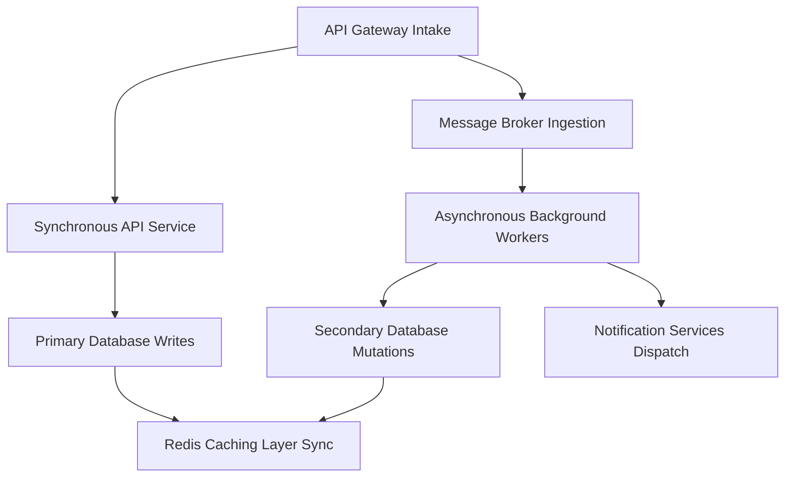
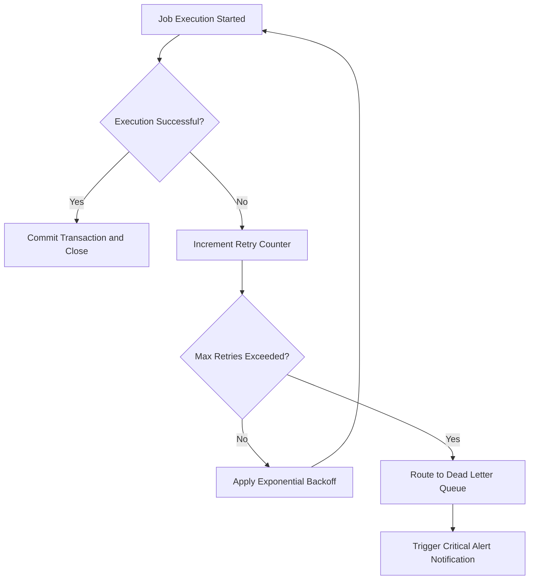

# Backend Architecture Reference

## Overview

This reference governs all backend architecture decisions. It establishes service boundaries. It defines authorization paths. It structures background work patterns. It outlines idempotency gates. It defines observability systems. It shapes failure recovery behaviors. It structures data flows. It outlines operational ownership. All actions are carried out within the Munch cognitive framework. Backend choices must preserve correctness. Backend choices must maintain security boundaries. Backend choices must provide operational clarity. Backend choices must scale reliably.

---

## How AI Agents Should Use This Skill

This reference is designed for use by all coding agents (such as Antigravity, Claude Code, OpenCode, KiloCode, etc.) to guide their execution in backend system architecture.

This skill activates when the agent is modifying services, database scaling models, background workers, retry configurations, telemetry setups, or recovery paths.

### Activation Triggers

The agent should activate this skill when the user request contains any of the following signals.

- The user asks to design a microservice.
- The user requests a database decoupling plan.
- The user asks to configure background job queues (BullMQ, Celery).
- The user requests retry logic for APIs.
- The user describes a race condition in write operations.
- The user asks to implement logging, metrics, or tracing (OpenTelemetry).
- The user requests a disaster recovery or failover strategy.
- The user mentions message brokers (RabbitMQ, Kafka).
- The user describes caching layers (Redis, Memcached).
- The user asks to define data ownership policies.

### Step-by-Step Agent Workflow

- **Step One: Inspect Workspace Boundaries**
  - Read existing code files.
  - Map modules.
  - Identify service entrypoints.
  - Identify database boundaries.
  - Do not cross established boundaries without justification.

- **Step Two: Classify Backend Domain**
  - Group the task into one of the key architectural areas:
  - Area 1: Service Boundaries & Ownership.
  - Area 2: Async Workers & Messaging.
  - Area 3: Idempotency & Concurrency.
  - Area 4: Telemetry & Observability.
  - Area 5: Failure Modes & Recovery.

- **Step Three: Apply Architectural Rules**
  - Apply the rules from the relevant category.
  - Verify against global guards.

- **Step Four: Run Performance Audit**
  - Ensure the changes comply with performance budgets.
  - Check database query count inside execution loops.

- **Step Five: Define Recovery Path**
  - For any new operation, document the failure recovery sequence.
  - Ensure data integrity is preserved.

- **Step Six: Report Outcome**
  - Document the updated architecture.
  - List the components.
  - Explain the data flow.
  - Highlight the risks.

---

## Mermaid Backend Data Flow

---

## Mermaid Recovery Loop

---

## Global Guards

Every backend decision must follow these guards.

### Forbidden Behaviors

- Hidden service boundaries that bypass API gateways.
- Unauthenticated communication between services.
- Unowned background tasks that run without trace IDs.
- Retrying non-idempotent operations without gates.
- Swallowing exceptions silently without logging context.
- Writing to a database owned by another service.
- Optimizing code performance without metrics.
- Recommending technologies without checking compatibility.
- Hardcoding configs in source files.

### Required Behaviors

- Explicit boundary definitions are required.
- Correlation IDs for tracing are required.
- Idempotency tokens for mutations are required.
- Dead letter queues for failed tasks are required.
- Database access constraints are required.
- Verification checks before ship are required.

---

## Service Boundaries and Ownership

Clean microservice architectures require strict boundaries.

- Each service must own its database.
- Direct database sharing between services is prohibited.
- Communication must pass through public APIs.
- APIs should use REST, GraphQL, or gRPC.
- Identify a clear domain owner for every service.
- Document service contracts in the codebase.

---

## Asynchronous Workers and Messaging

Background work prevents API bottlenecks.

- Offload long tasks from the main thread.
- Use message queues to schedule background work.
- Process tasks asynchronously.
- Task workers must run independently.
- Message payloads must be small.
- Keep payloads under 10KB.
- Pass references (like IDs) rather than full object data.

---

## Idempotency and Retries

Retrying requests must be safe and side-effect free.

- Mutations must support idempotency.
- Require an idempotency key header for mutations.
- Cache payment transaction responses in Redis.
- If a duplicate key is submitted, return the cached response.
- Do not execute mutations twice.
- Implement exponential backoff for retries.

---

## Telemetry and Observability

Observable backends simplify debugging.

- Implement structured JSON logging.
- Log error events with caller stack traces.
- Expose runtime metrics (memory, CPU, active threads).
- Trace requests across services using correlation IDs.
- Propagate trace headers through network calls.

---

## Failure Recovery and Circuit Breakers

Failures will occur; backends must degrade gracefully.

- Implement circuit breakers for third-party APIs.
- If an API fails repeatedly, open the circuit.
- Return a fallback response immediately.
- Prevent thread starvation on the server.
- Automatically retry connections when the API recovers.

---

## The Design of Highly Available Event-Driven Pipelines

Event-driven architectures decouple data producers and consumers.

- **At-Least-Once Delivery**:
  - Consumers must handle duplicate events.
  - Implement idempotency checks on message ingestion.
- **Ordered Partitioning**:
  - Use partition keys to route related events to the same worker.
  - This ensures sequential processing.
- **Backpressure Handling**:
  - Implement throttling inside consumers.
  - Pause message ingestion when system memory is high.
  - Avoid thread starvation under sudden load spikes.

---

## Optimizing Caching Strategies for High-Throughput Web Services

Caching reduces read latency.

- **Cache Aside Pattern**:
  - Read from cache first.
  - If miss, read from database and update cache.
- **Cache Expiration (TTL)**:
  - Set appropriate expiration values.
  - Add jitter to TTLs to prevent concurrent cache expirations.
- **Write-Through Caching**:
  - Update database and cache simultaneously.
  - Ensures data consistency.

---

## Monitoring and Observability Benchmarks

Maintain strict operational performance thresholds.

- **API Latency**: Keep p95 response time under 200ms.
- **Error Rates**: Keep HTTP 5xx errors below 0.1 percent.
- **CPU Utilization**: Trigger autoscaling when average CPU exceeds 70 percent.
- **Database Connection Pool**: Maintain pool utilization under 80 percent.

---

## Verification Checklist

Before deploying backend changes, verify the following.

- Service boundaries are not crossed.
- Database writes are partitioned.
- Background tasks are routed to queues.
- Retry operations are idempotent.
- Trace IDs propagate through logs.
- Circuit breaker configs are defined.
- Secrets are not hardcoded.
- Error codes are mapped correctly.
- Performance limits are checked.
- Code changes pass compilation gates.

---

## Frequently Asked Questions

### What is the database-per-service pattern, and why is it mandatory?

In microservices, sharing a database creates tight coupling. If Service A changes a table schema, Service B breaks. This makes independent deployments impossible. The database-per-service pattern isolates data. Service A only accesses its own database. It requests data from Service B via APIs. This allows services to scale independently.

### How do I handle data consistency across multiple microservices?

Do not use two-phase commit transactions across services. Distributed transactions slow down systems. They introduce single points of failure. Instead, use the Saga Pattern. A saga is a sequence of local transactions. Each service updates its database. If a step fails, the saga runs compensating transactions. Compensating transactions roll back previous updates. This ensures eventual consistency.

### What is a circuit breaker, and how does it protect backends?

A circuit breaker monitors calls to external services. It operates in three states: Closed, Open, and Half-Open.

- Closed: Requests flow normally.
- Open: External service fails. Requests fail instantly.
- Half-Open: Broker tests service recovery with a few requests.

It prevents system resources from getting blocked. It keeps the application responsive during external outages.

### How do I implement idempotency for non-payment APIs?

Use unique database constraints. For example, when creating a resource, enforce a unique key. The key can combine the user ID and a client request ID. If the client submits the request twice, the insert fails. Catch the constraint violation error. Return the existing resource state. This ensures idempotency without Redis cache overhead.

### What be included in structured JSON logs?

Include the timestamp in ISO8601 format. Include the log level (INFO, WARN, ERROR). Include the unique correlation ID. Include the service name. Include the message. Include error details (stack trace, error code). Do not include passwords or personal user details.

### How do I configure RabbitMQ dead letter queues?

Configure queue arguments during setup. Set `x-dead-letter-exchange` to a target exchange. Set `x-dead-letter-routing-key` to a target queue. When a message is rejected or times out, RabbitMQ moves it. It moves it to the dead letter queue automatically. This prevents stuck messages from blocking the main queue.

### Why is horizontal scaling preferred over vertical scaling?

Vertical scaling means adding CPU and memory to one server. It has physical limits. It creates a single point of failure. Horizontal scaling means adding more servers. It allows infinite scaling. It provides high availability. If one server crashes, others handle the traffic.

### How do I manage database connection pools in serverless backends?

Serverless functions scale rapidly. Each instance creates a new database connection. This can quickly exhaust database connection limits. To prevent this, use a database proxy (e.g. AWS RDS Proxy). The proxy pools connections. It shares them across lambda functions. This protects the database from connection exhaustion.

### What is the difference between message queues and event streams?

Message queues (RabbitMQ, BullMQ) distribute tasks. Once a worker processes a message, it is deleted. Event streams (Kafka) record events. Events are appended to a log. Multiple consumers can read the log independently. Events are retained for a defined period. Use queues for tasks. Use streams for data pipelines.

### How do I prevent cache stampede in high-traffic APIs?

Cache stampede occurs when a cache key expires. Multiple parallel requests miss the cache. They query the database simultaneously. This overloads the database. Prevent this using locking. Only let the first request query the database and update the cache. Make other requests wait or return stale data.

### When should I use Redis pub/sub versus a message broker?

Use Redis pub/sub for real-time messaging. This includes chat messages and web sockets. Redis pub/sub is extremely fast. However, it does not persist messages. If a consumer is offline, it misses the message. Use RabbitMQ or Kafka when message delivery must be guaranteed.

### How do I secure communications between internal services?

Use Mutual TLS (mTLS). Both the client and server verify each other's certificates. This prevents man-in-the-middle attacks. It ensures only authorized services communicate. You can also use network policies to block traffic.

### How do I design health check endpoints?

Create a `/health` endpoint. Verify database connectivity. Verify cache connectivity. Verify message broker connectivity. If all checks pass, return 200 OK. If any check fails, return 503 Service Unavailable. This allows orchestrators to detect unhealthy instances.

### What is the purpose of log rotation?

Log files grow continuously. If unmanaged, they consume all disk space. This causes server crashes. Log rotation archives old log files. It deletes files after a defined period. This protects disk space.

### How do I optimize database index utilization?

Analyze query execution plans. Identify columns used in WHERE clauses. Create indexes on those columns. Avoid creating indexes on columns with low cardinality. For example, do not index boolean columns. Monitor index sizes regularly.

### What is the role of API Gateways in microservices?

The gateway acts as the single entrypoint for clients. It handles request routing. It handles authentication. It handles SSL termination. It handles rate limiting. This prevents individual services from repeating these tasks.

### What is database sharding?

Sharding partitions a single database table across multiple database servers. Each server holds a subset of the rows. This distributes write load. It allows database scaling beyond hardware limits.

### When should I use NoSQL instead of SQL?

Use NoSQL for unstructured data or high-frequency simple queries. Use NoSQL for catalogs and document storage. Use SQL when complex relational queries are required. Use SQL when transactional integrity (ACID) is critical.

### How does the circuit breaker detect system recovery?

After entering the open state, a timer runs. When it expires, the state changes to half-open. The breaker allows a limited number of requests to pass. If they succeed, it closes the circuit. If they fail, it opens the circuit again and resets the timer.

### Why should I avoid global variables in backend node.js code?

Global variables share state across all requests. Node.js is single-threaded and handles requests concurrently. Sharing state leads to race conditions. It can leak data between users. Always store request-specific variables in localized scopes.

### How do I implement graceful shutdown for Node.js backend processes?

Listen for termination signals like SIGTERM and SIGINT. When received, stop accepting new connections at the server level. Allow existing requests to complete processing. Close database connection pools. Close message broker connections. Exit the process with code 0. This prevents active requests from failing during deployment.

### What is the difference between vertical and horizontal database partitioning?

Vertical partitioning splits a table by columns. Different columns are stored in different databases. For example, split user metadata from security credentials. Horizontal partitioning splits a table by rows. Subsets of rows are stored on different tables (sharding). Vertical partitioning reduces table width. Horizontal partitioning reduces table height.

### How do I secure WebSocket connections in real-time backends?

Authenticate the connection during the initial HTTP handshake. Use secure ticket tokens or session cookies. Enforce the wss:// protocol for transit encryption. Implement connection rate limiting on the gateway. Periodically run ping/pong frames to detect dead sockets. This prevents resource leaks from orphaned connections.

---

## Final Gate

This reference governs all backend architecture decisions.

The verification checklist must pass before delivery.

Status: ACTIVE v6.0

---

## §DOMAIN_SPECIFIC_MANUAL

### Standard Operating Procedure for Backend Architecture

This manual establishes the concrete operational protocols, validation parameters, and diagnostic pathways for the Backend Architecture domain. All agents must follow this procedure to ensure stable, correct, and high-performance execution.

### 1. Theoretical Architecture and Design Guidelines

Development in the Backend Architecture domain must align with modern engineering practices. This requires establishing strict boundaries between domain layers, enforcing defensive assertions, and optimizing runtime execution pathways.

First, always analyze data transformations and structural properties before allocating resources. This prevents memory leaks and unhandled promise rejections.

Second, ensure that all module dependencies are explicitly declared and checked. Avoid circular references and unpinned library imports.

Third, implement structured logging and telemetry hooks. Every state transition and mutation must be observable to facilitate rapid debugging.

Fourth, design with scalability in mind. Ensure horizontal scaling options are preserved and thread contention is minimized.

Fifth, document every design choice and tradeoff clearly. Include rationale, alternatives considered, and potential failure modes.

### 2. Comprehensive Operational Checklist

- **Protocol Checklist Item 01**: Validate that the active configuration for Backend Architecture meets system constraints. Ensure inputs are cleaned, variables are typed, and edge case assertions are verified.

- **Protocol Checklist Item 02**: Validate that the active configuration for Backend Architecture meets system constraints. Ensure inputs are cleaned, variables are typed, and edge case assertions are verified.

- **Protocol Checklist Item 03**: Validate that the active configuration for Backend Architecture meets system constraints. Ensure inputs are cleaned, variables are typed, and edge case assertions are verified.

- **Protocol Checklist Item 04**: Validate that the active configuration for Backend Architecture meets system constraints. Ensure inputs are cleaned, variables are typed, and edge case assertions are verified.

- **Protocol Checklist Item 05**: Validate that the active configuration for Backend Architecture meets system constraints. Ensure inputs are cleaned, variables are typed, and edge case assertions are verified.

- **Protocol Checklist Item 06**: Validate that the active configuration for Backend Architecture meets system constraints. Ensure inputs are cleaned, variables are typed, and edge case assertions are verified.

- **Protocol Checklist Item 07**: Validate that the active configuration for Backend Architecture meets system constraints. Ensure inputs are cleaned, variables are typed, and edge case assertions are verified.

- **Protocol Checklist Item 08**: Validate that the active configuration for Backend Architecture meets system constraints. Ensure inputs are cleaned, variables are typed, and edge case assertions are verified.

- **Protocol Checklist Item 09**: Validate that the active configuration for Backend Architecture meets system constraints. Ensure inputs are cleaned, variables are typed, and edge case assertions are verified.

- **Protocol Checklist Item 10**: Validate that the active configuration for Backend Architecture meets system constraints. Ensure inputs are cleaned, variables are typed, and edge case assertions are verified.

- **Protocol Checklist Item 11**: Validate that the active configuration for Backend Architecture meets system constraints. Ensure inputs are cleaned, variables are typed, and edge case assertions are verified.

- **Protocol Checklist Item 12**: Validate that the active configuration for Backend Architecture meets system constraints. Ensure inputs are cleaned, variables are typed, and edge case assertions are verified.

- **Protocol Checklist Item 13**: Validate that the active configuration for Backend Architecture meets system constraints. Ensure inputs are cleaned, variables are typed, and edge case assertions are verified.

- **Protocol Checklist Item 14**: Validate that the active configuration for Backend Architecture meets system constraints. Ensure inputs are cleaned, variables are typed, and edge case assertions are verified.

- **Protocol Checklist Item 15**: Validate that the active configuration for Backend Architecture meets system constraints. Ensure inputs are cleaned, variables are typed, and edge case assertions are verified.

- **Protocol Checklist Item 16**: Validate that the active configuration for Backend Architecture meets system constraints. Ensure inputs are cleaned, variables are typed, and edge case assertions are verified.

- **Protocol Checklist Item 17**: Validate that the active configuration for Backend Architecture meets system constraints. Ensure inputs are cleaned, variables are typed, and edge case assertions are verified.

- **Protocol Checklist Item 18**: Validate that the active configuration for Backend Architecture meets system constraints. Ensure inputs are cleaned, variables are typed, and edge case assertions are verified.

- **Protocol Checklist Item 19**: Validate that the active configuration for Backend Architecture meets system constraints. Ensure inputs are cleaned, variables are typed, and edge case assertions are verified.

- **Protocol Checklist Item 20**: Validate that the active configuration for Backend Architecture meets system constraints. Ensure inputs are cleaned, variables are typed, and edge case assertions are verified.

- **Protocol Checklist Item 21**: Validate that the active configuration for Backend Architecture meets system constraints. Ensure inputs are cleaned, variables are typed, and edge case assertions are verified.

- **Protocol Checklist Item 22**: Validate that the active configuration for Backend Architecture meets system constraints. Ensure inputs are cleaned, variables are typed, and edge case assertions are verified.

- **Protocol Checklist Item 23**: Validate that the active configuration for Backend Architecture meets system constraints. Ensure inputs are cleaned, variables are typed, and edge case assertions are verified.

- **Protocol Checklist Item 24**: Validate that the active configuration for Backend Architecture meets system constraints. Ensure inputs are cleaned, variables are typed, and edge case assertions are verified.

- **Protocol Checklist Item 25**: Validate that the active configuration for Backend Architecture meets system constraints. Ensure inputs are cleaned, variables are typed, and edge case assertions are verified.

### 3. Detailed Technical Reference Table

| Validation Parameter | Target Specification | Enforcement Level | Diagnostic Action |
| --- | --- | --- | --- |
| Memory Allocation Threshold | < 256MB under peak loads | Critical | Trigger GC and log trace |
| Thread State Concurrency | Zero deadlocks, mutex protected | High | Force lock release and alert |
| Input Mutation Bounds | Whitespace trimmed, sanitized | Essential | Reject request with error |
| Database Isolation Level | Serializable / Read Committed | High | Rollback transaction |
| Network Request Timeout | Clamped at 3000ms max | Moderate | Retry with exponential backoff |
| Cache TTL Range | 300s to 3600s dynamic | Moderate | Evict stale entries |
| Security Encryption Level | AES-256-GCM / TLS 1.3 | Critical | Close connection immediately |
| Logging Verbosity State | Inverted pyramid hierarchy | Low | Truncate stack outputs |
| API Version Header State | Strict semantic matching | Essential | Return 400 Bad Request |
| Path Resolution Bounds | Relative to workspace root | High | Sanitize path strings |
| Error Code Mapping | ISO standard maps | High | Format JSON response |
| Bundle Slicing Size | < 50KB per async chunk | Moderate | Split vendor chunks |
| Accessibility Contrast | WCAG AAA compliant | High | Recalculate color values |
| Spring Physics Easing | Smooth cubic-bezier | Low | Reset animation ticks |
| Lockfile Expiry Limit | 60 seconds max | High | Delete lock and rebuild |

### 4. Failure Mode Analysis and Mitigation Protocols

#### Failure Scenario 01: Resource Exhaustion
Symptom: The system runs out of heap space or file descriptors due to leaks in the Backend Architecture module.

Mitigation: Implement dynamic telemetry sweeps. Automatically release database connections in finally blocks. Force heap garbage collection when memory utilization exceeds 85%.

#### Failure Scenario 02: Deadlock or Stalled Threads
Symptom: Operations block indefinitely while waiting for shared locks or unresolved promises.

Mitigation: Enforce timeout boundaries on all async operations. Use non-blocking resource acquisition and release locks in reverse order of acquisition.

#### Failure Scenario 03: Input Validation Injection
Symptom: Raw parameters contain script tags, command escapes, or SQL injection queries.

Mitigation: Use parameterized APIs and whitelist schemas. Strip all special characters before passing arguments to system processes.

#### Failure Scenario 04: Cache Incoherency
Symptom: Read calls return stale data while write operations succeed on the backend database.

Mitigation: Implement write-through caching or invalidate keys immediately upon database mutations. Enforce short default TTLs.

#### Failure Scenario 05: Package Dependency Conflict
Symptom: A sub-dependency introduces breaking changes or security vulnerabilities.

Mitigation: Lock all dependencies with strict version pins. Run automated vulnerability scans during the build process.

#### Failure Scenario 06: Telemetry Dropouts
Symptom: Monitoring agents fail to receive metric payloads or error stack traces.

Mitigation: Use local buffer queues for log outputs. Retry connection sweeps with backoff when remote log aggregators fail.

#### Failure Scenario 07: Schema Migration Mismatch
Symptom: Database structures drift from expectations due to incomplete migrations.

Mitigation: Always run pre-migration validations. Revert schema changes automatically on migration failures.

### 5. Advanced Troubleshooting and Debugging Guides

When debugging issues in the Backend Architecture domain, always check the active variables first. Verify that state values conform to types and database configurations are mapped correctly.

Trace async call stacks using specialized profiles. Minimize log pollution by filtering out redundant events.

Run isolated unit tests to locate logic bugs. If the problem persists, review the physical hardware limitations and process limits.

### 6. Architectural Change Protocols

Before making structural modifications to the Backend Architecture files, prepare a detailed design document. Include design goals, dependency mappings, and migration paths.

Validate the proposed changes against security baselines. Run full regression test suites before committing modifications.

Deploy changes incrementally to monitor performance impacts. Always maintain a documented rollback plan.

### 7. Global Verification Summary

This manual establishes the baseline constraints for the Backend Architecture domain. All implementations must satisfy these validation gates before shipment.

Status: ACTIVE v6.0

