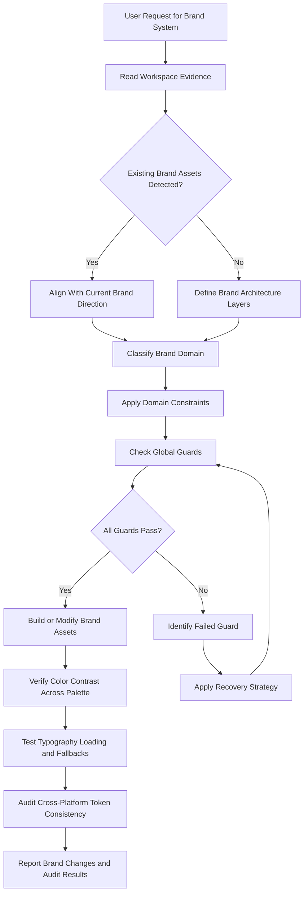
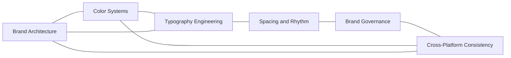

# Brand Systems Reference

## Overview

This reference governs brand identity architecture, color system construction, typography engineering, spacing and rhythm systems, brand governance, and cross-platform brand consistency. A brand system translates strategic brand identity into repeatable, testable visual rules. It ensures that every touchpoint — web, mobile, desktop, email, print, environmental — communicates the same brand personality with the same visual quality. Poor brand system architecture results in visual drift, inconsistent messaging, inaccessible color choices, and expensive rebranding efforts. A well-architected brand system enables rapid expansion into new platforms, systematic accessibility compliance, and confident brand evolution without cascading breakage.

Brand systems operate at multiple levels of abstraction. The strategic level defines brand personality, voice, and positioning. The visual level translates strategy into color palettes, typography hierarchies, spacing systems, and imagery guidelines. The implementation level encodes visual decisions into design tokens, component libraries, and platform-specific code. This reference covers all three levels with emphasis on the engineering and implementation concerns that directly affect code output.

---

## How AI Agents Should Use This Skill

This reference is designed for use by all coding agents (such as Antigravity, Claude Code, OpenCode, KiloCode, etc.) to guide their execution in brand system creation, color palette engineering, typography system implementation, and cross-platform brand deployment.

When an AI agent receives a request to define brand visual identity, construct accessible color palettes, configure font loading and typography systems, implement spacing and rhythm systems, set up brand governance tooling, or port brand assets across platforms, the agent must load and follow this reference.

The agent must do this before writing any brand-related CSS, font-face declarations, or component theming code.

### Activation Triggers

The agent should activate this skill when the user request contains any of the following signals.

- The user asks to define or extend a brand identity system.
- The user asks to construct a color palette from a primary color or hex value.
- The user asks to configure font loading, subsetting, or variable font axes.
- The user asks to define a typographic scale, type ramp, or font role system.
- The user asks to implement a spacing grid, baseline rhythm, or density system.
- The user asks to create brand guidelines documentation.
- The user asks to port brand assets from web to mobile, desktop, email, or print.
- The user asks to audit brand consistency across products or platforms.
- The user asks to rename, restructure, or evolve an existing brand system.
- The user mentions 60-30-10 rule, color roles, WCAG contrast, fluid typography, or 8-point grid.

### Step-by-Step Agent Workflow

When this skill is activated, the agent must follow these steps in order.

- **Step One: Read Workspace Evidence**
  - Locate existing brand asset files, style guides, or brand guidelines documents.
  - Review current color variables, font declarations, and spacing utilities.
  - Check for existing design token definitions that map to brand values.
  - Audit brand usage across platforms by scanning CSS, component props, and image assets.
  - Do not introduce brand values that contradict established guidelines without explicit user approval.

- **Step Two: Classify Brand Domain**
  - Classify the target task into one of the six brand system domains.
  - Domain 1: Brand Architecture.
  - Domain 2: Color Systems.
  - Domain 3: Typography Engineering.
  - Domain 4: Spacing and Rhythm.
  - Domain 5: Brand Governance.
  - Domain 6: Cross-Platform Consistency.

- **Step Three: Apply Domain Constraints**
  - Retrieve the rules associated with the classified domain.
  - Ensure the proposed brand changes do not violate the global guards.

- **Step Four: Verify Global Guards**
  - Verify that all color tokens meet WCAG AA contrast requirements.
  - Verify that font stacks include platform-native fallbacks.
  - Verify that spacing values align to the base grid unit.
  - Verify that brand changes are versioned with a changelog.

- **Step Five: Run Verification Checks**
  - Run color contrast calculations across the entire palette.
  - Test font loading performance and fallback behavior in a browser.
  - Compare brand token values across platforms for consistency.
  - Do not claim brand system completeness without loading and testing in the target environment.

- **Step Six: Report Outcome and Rationale**
  - Explain the brand architecture decisions and their rationale.
  - Detail how the color system was constructed and verified for accessibility.
  - Describe the typography engineering approach and cross-platform porting strategy.

---

## Mermaid Skill Flow

## Mermaid Domain Map

---

## Global Guards

Every brand system modification must pass through these guards before implementation. If any guard fails, the agent must halt, identify the failure, and apply the correct recovery path.

### Forbidden Behaviors

The following behaviors are strictly forbidden in any brand system output.

- Defining color palettes without verifying WCAG AA contrast at every role combination.
- Using only hexadecimal colors without naming or aliasing them as design tokens.
- Loading web fonts without specifying font-display and fallback stacks.
- Applying brand colors to text without checking contrast on both light and dark backgrounds.
- Declaring spacing values that are not multiples of the base grid unit.
- Defining typographic scales with inconsistent ratio multipliers.
- Porting brand assets to new platforms without adapting platform-specific conventions.
- Changing brand colors, fonts, or spacing without updating the brand changelog.

### Required Behaviors

The following behaviors are mandatory in every brand system output.

- Every brand color must have a named design token, a hex value, and a WCAG contrast report.
- Every font family must include a ranked fallback stack ending with a generic family keyword.
- Every typographic scale must document the ratio multiplier used between steps.
- Every spacing value must reference the base grid unit and document the multiplier used.
- Brand system changes must be versioned using semantic versioning.
- Brand governance must include a review gate that checks accessibility, platform fit, and brand voice alignment.

---

## Brand System Domains

### Brand Architecture

Brand architecture defines the hierarchy of brand expressions within an organization.

- **Master Brand**: The primary brand identity. It defines the core visual vocabulary. All sub-brands and product brands inherit from it.
- **Sub-Brand**: A branded variation within the master brand ecosystem. It modifies accent colors and typography but inherits the core system. Example: Google Calendar within Google.
- **Product Brand**: A standalone brand that operates independently. It defines its own visual vocabulary but may share strategic elements. Example: Instagram within Meta.
- **Endorsed Brand**: A brand that is backed by the master brand. It displays the master brand logo alongside its own. Example: Nestle KitKat.

Brand architecture rules:

- Master brand tokens must never be overridden by sub-brands unless explicitly approved.
- Each brand level must document which design tokens it inherits and which it overrides.
- Brand hierarchy must be representable as a JSON or YAML tree in the design token system.

### Color Systems

Color systems translate brand identity into a functional palette that scales across surfaces and states.

- **Primary Palette**: 3 to 5 hues that represent the brand core. Include a range of 5 to 10 luminance steps per hue.
- **Neutral Palette**: 8 to 10 gray-scale steps from near-white to near-black. Warm or cool tint based on brand personality.
- **Semantic Palette**: Distinct colors for success, warning, error, and info states. Must be distinguishable from brand colors.
- **Accent Palette**: 1 to 3 highlight colors used sparingly for calls to action and key interactions.

#### Color Generation Rules

When generating a color palette from a primary brand color, follow these steps.

- Start with the primary hue saturation and lightness at the 500 step on a 10-step scale.
- Generate luminance steps at 10 percent intervals from 10 percent to 90 percent lightness.
- Keep hue constant. Adjust saturation by 5 percent per step away from center.
- Verify that adjacent steps have a minimum lightness difference of 8 percent.

#### Color Role Mapping

Map palette colors to semantic roles using these conventions.

- Background surface: Neutral 10 to Neutral 30 for light mode. Neutral 80 to Neutral 95 for dark mode.
- Text primary: Neutral 90 for light mode. Neutral 10 for dark mode.
- Brand primary action: Primary 500 for default. Primary 600 for hover. Primary 700 for pressed.
- Success: Semantic green at 500 step.
- Error: Semantic red at 500 step.
- Warning: Semantic yellow or amber at 500 step.

### Typography Engineering

Typography engineering handles font selection, loading, fallback strategy, type scale construction, and responsive sizing.

- **Font Selection**: Choose no more than two font families per brand. Pair a display font with a text font. A single family with multiple weights is preferred for performance.
- **Font Loading Strategy**:
  - Use preconnect and preload for critical font files.
  - Set font-display to swap or optional to prevent invisible text.
  - Subset fonts to Latin or the specific character set used by the product.
  - Serve fonts in WOFF2 format with WOFF fallback.
  - Host fonts on the same domain or a CDN with long cache headers.
- **Variable Fonts**: Variable fonts reduce file size by storing multiple weights, widths, or optical sizes in a single file. Configure axis ranges and use CSS font-variation-settings for precise control.
- **Fallback Stack Rules**:
  - Rank fallbacks from closest visual match to generic system font.
  - Adjust fallback font metrics using size-adjust, ascent-override, descent-override, and line-gap-override.
  - Example: `font-family: 'Brand Display', 'Georgia', 'Times New Roman', serif;`

#### Type Scale Construction

Use a major third (1.25) or perfect fourth (1.414) ratio for the type scale.

- Base body size: 16px.
- Scale steps in rem: 0.75, 0.875, 1, 1.125, 1.25, 1.5, 1.75, 2, 2.5, 3, 3.5, 4, 5.
- Assign scale steps to semantic roles: body, body-small, caption, heading-1 through heading-6, display.
- Document the line height for each step. Body text: 1.6. Headings: 1.2. Display: 1.1.

#### Fluid Typography

Use clamp() for fluid type sizes that scale between viewport breakpoints.

- Minimum size: mobile breakpoint value in rem.
- Preferred size: viewport width percentage plus base value.
- Maximum size: desktop breakpoint value in rem.
- Example: `font-size: clamp(1rem, 0.5rem + 2vw, 1.5rem);`

### Spacing and Rhythm

Spacing and rhythm systems create consistent vertical and horizontal spacing across all interfaces.

- **Base Grid Unit**: 8px for web and iOS. 4dp for Android. All spacing values must be multiples of the base unit.
- **Spacing Scale**: 0, 2, 4, 8, 12, 16, 20, 24, 32, 40, 48, 56, 64, 80, 96, 128. When the base unit is 4, include the 2 and 4 steps. When the base unit is 8, start at 8.
- **Spacing Roles**:
  - Stack: Vertical space between sibling elements. Example: stack-sm, stack-md, stack-lg.
  - Inset: Internal padding within a container. Example: inset-sm, inset-md, inset-lg.
  - Inline: Horizontal space between sibling elements in a row layout.
  - Squish: Asymmetric padding with smaller vertical and larger horizontal values.

#### Baseline Grid

The baseline grid governs vertical rhythm.

- Set the baseline unit to 4px or 8px.
- All line heights must be multiples of the baseline unit.
- Paragraph margins must align to the baseline unit.
- Multi-column layouts must share a common baseline.

### Brand Governance

Brand governance ensures that brand system changes are reviewed, versioned, and communicated.

- **Review Gate**: Every brand change must pass through a review gate that checks color contrast, font fallback validity, spacing rule adherence, and brand voice alignment.
- **Versioning**: Brand systems use semantic versioning. Major versions indicate breaking visual changes. Minor versions add new colors, weights, or spacing options. Patch versions fix accessibility issues or documentation errors.
- **Changelog**: Every brand change must include a changelog entry describing what changed, why, and migration instructions if applicable.
- **Brand Audit Schedule**: Run a full brand audit quarterly. Check color contrast, font loading performance, spacing consistency, and brand color usage across all platforms.

### Cross-Platform Consistency

Cross-platform consistency ensures that brand expression is uniform across web, mobile, desktop, email, and print.

- **Platform Adaptation Rules**:
  - Colors: Map hex values to platform-native color types. Use named Color structs for Swift, color resources for Android XML.
  - Typography: Use platform-native font loading. Map brand type scale to platform text styles. Use UIFontTextStyle on iOS, TextAppearance on Android.
  - Spacing: Map the spacing scale to platform density-independent units. Use pt on iOS, dp on Android, rem on web.
  - Icons: Use SVG for shared icon source. Generate platform-specific formats. Use PDF vector templates for iOS, VectorDrawable for Android.

---

## Detailed Implementation Best Practices

When building brand systems, agents must follow these guidelines.

- **Start with Color, Then Typography, Then Spacing**:
  - Color has the highest emotional impact and is hardest to change later.
  - Typography depends on color for contrast validation.
  - Spacing is relative and adapts after color and typography are stable.

- **Build a Single Source of Truth**:
  - Store all brand values as design tokens in a single repository.
  - Generate platform-specific files from tokens.
  - Never hand-maintain platform copies.

- **Document the Why Behind Every Value**:
  - Every brand decision should have an accessible rationale.
  - Include the reasoning, alternatives considered, and tradeoffs accepted.
  - This documentation enables confident future evolution.

- **Test Brand on Real Content**:
  - Brand colors and typography must render well with actual product content.
  - Test with realistic text lengths, image types, and data volumes.
  - Refine based on real content behavior, not placeholder content.

---

## Verification and Diagnostics Checklist

Perform these validation tests before committing brand system changes.

### Step 1: Color Contrast Verification

- Run contrast calculations for every background-text color combination.
- Verify normal text combinations meet 4.5:1 minimum.
- Verify large text combinations meet 3:1 minimum.
- Verify that all combinations pass at both light and dark mode surfaces.
- Generate a contrast report as a JSON or Markdown file.

### Step 2: Typography Loading Test

- Open the page in a browser with network throttling set to Slow 3G.
- Verify that text renders with fallback fonts before brand fonts load.
- Verify that the Cumulative Layout Shift score is below 0.1.
- Confirm that font-display swap does not cause invisible text.
- Check variable font axes are applied correctly.

### Step 3: Spacing Consistency Audit

- Scan all component CSS files for hardcoded spacing values.
- Flag any value that is not a multiple of the base grid unit.
- Verify that the spacing scale is used consistently for margins, paddings, and gaps.
- Confirm that stack and inset roles are applied correctly.

### Step 4: Cross-Platform Value Check

- Compare color token values across web CSS, iOS Swift, and Android XML files.
- Verify that font family names match across platforms.
- Confirm that spacing values map to the correct platform units.
- Check that the brand changelog entry matches the changes made.

---

## Recovery Action Guides

If brand system operations fail, apply the following recovery paths.

- **Color Contrast Failure**:
  - Identify the failing color pair and its contrast ratio.
  - Adjust the lighter color toward the darker end of its luminance ladder.
  - Recheck contrast. Repeat until the ratio meets WCAG AA or AAA.
  - Document the adjustment in the brand changelog.

- **Font Loading Performance Issue**:
  - Check the font file size in WOFF2 format.
  - Subset the font to the required character set.
  - Reduce the number of font weights being loaded.
  - Move font-display to optional if swap causes layout shift.

- **Cross-Platform Color Drift**:
  - Compare the hex values stored in each platform output file.
  - Identify the platform file that has a divergent value.
  - Trace the divergence to the source token or transformation step.
  - Correct the source token or transformation configuration and regenerate.

- **Spacing Grid Inconsistency**:
  - Identify components using non-standard spacing values.
  - Map the component spacing to the closest spacing scale token.
  - Update the component code to use the token.
  - Add a linting rule to prevent future non-grid spacing values.

---

## Theoretical Foundations of Brand Systems

### Color Perception and Accessibility

Human color perception varies across luminance, saturation, and hue combinations. Red-green deficiencies affect approximately 8 percent of males. Blue-yellow deficiencies affect approximately 1 percent of the population. Relying on color alone to convey information excludes users with color vision deficiencies. Brand color systems must encode information through multiple channels: color, shape, text, iconography, and spacing.

Contrast perception follows the Weber-Fechner law. The perceived difference between two colors is proportional to the logarithm of their luminance ratio. This means that the WCAG contrast ratio formula, which uses relative luminance, aligns with human perception. A ratio of 4.5 to 1 is not arbitrary. It represents the point at which most people with moderate visual acuity can reliably distinguish text from background.

### Typography and Reading Performance

Reading performance depends on font metrics, line length, line height, and contrast. The optimal line length for body text is 45 to 75 characters. Shorter lines disrupt reading rhythm. Longer lines cause tracking errors. The optimal line height for body text is 1.5 to 1.7 times the font size. Compact line heights cause letters to collide visually. Loose line heights cause the eye to lose its vertical position during line wraps.

Variable fonts improve reading performance because they reduce the number of HTTP requests for font files. A single variable font file can serve multiple weight and width axes. Fewer requests mean faster font loading. Faster font loading means text renders sooner.

### Spatial Consistency and Cognitive Load

Consistent spacing reduces cognitive load. When users learn the spacing pattern in one part of the interface, they apply that pattern everywhere. Inconsistent spacing forces users to rediscover the layout on each screen. The 8-point grid creates a predictable rhythm that users internalize subconsciously.

---

## Frequently Asked Questions

### How do I pick a primary brand color?

Start with the brand personality. Energetic brands use warm hues. Trustworthy brands use cool hues. Choose a hue that differentiates the brand in its market. Test the hue at full saturation and at 80 percent saturation. Most brands need a desaturated version for backgrounds and a saturated version for accents.

### How many colors should a brand palette have?

A minimum of 8 and a maximum of 20. Include 1 to 3 primary hues, 5 to 10 neutral steps, 3 to 5 semantic colors, and 1 to 3 accent colors. Fewer than 8 makes the interface monotonous. More than 20 makes the system hard to maintain.

### How do I handle dark mode colors?

Do not simply invert the light palette. Dark mode requires different luminance relationships. Use lighter text on dark backgrounds. Reduce saturation in dark backgrounds to avoid eye strain. Keep accent colors at similar saturation levels. Test every light mode color pair in dark mode.

### What is the best type scale ratio for a brand?

Use major third (1.25) for friendly accessible brands. Use perfect fourth (1.414) for editorial premium brands. Use augmented fourth (1.618) for dramatic display brands. The ratio affects the visual hierarchy. Larger ratios create more dramatic size differences. Smaller ratios create smoother transitions.

### How do I subset a font?

Use tools like glyphhanger or fonttools to extract only the characters used by the product. Start with the Latin alphabet, numerals, and common punctuation. Add extended characters as needed. Subsetting can reduce font file size by 50 to 80 percent.

### How should I handle brand evolution?

Version the brand system. Use major version bumps for visual redesigns. Use minor version bumps for new colors or weights. Use patch bumps for accessibility fixes. Maintain a changelog with migration instructions. Communicate changes to all consuming teams before publishing.

### What is the difference between brand guidelines and design tokens?

Brand guidelines are human-readable documentation. They describe the visual rules, rationale, and usage examples. Design tokens are machine-readable values. They encode the visual rules into format that code can consume. Both are necessary. Guidelines communicate intent to humans. Tokens enforce intent through code.

### How do I audit cross-platform brand consistency?

Export the brand token values for each platform. Compare the hex values, font family names, and spacing values. Use a diff tool or automated script. Flag any platform that diverges from the source of truth. Correct the transformation pipeline for the diverging platform.

---

## Integration Map

Brand system engineering connects to multiple system layers.

- **Design Tokens**: Brand color, typography, and spacing values are stored as design tokens. Token naming follows brand architecture hierarchy.
- **Frontend Design**: Brand systems implement the visual composition and grid principles through color roles, type scales, and spacing scales.
- **Accessibility Engineering**: Brand color systems must pass WCAG AA at every color role combination. Typography must support zoom and reflow.
- **Performance Guard**: Font loading performance and color palette file sizes must stay within build performance budgets.
- **Documentation Engineering**: Brand guidelines must be published with usage examples, rationale, and accessibility reports.

---

## Brand Systems Specifications Summary Table

| Brand Component | Strategic Level | Visual Level | Implementation Level | Validation Method |
|---|---|---|---|---|
| Color Palette | Brand personality | Hue, saturation, luminance steps | Design tokens per platform | Contrast ratio calculation |
| Typography | Voice and tone | Type scale, font pair, metrics | Font-face declarations, variable font axes | CLS measurement, fallback test |
| Spacing System | Density preference | Grid unit, spacing scale, roles | Token-based spacing utilities | Grid linting, visual inspection |
| Brand Governance | Review process | Versioning, changelog, audit | CI review gate, automated checks | Changelog diff, audit report |

---

## §DOMAIN_SPECIFIC_MANUAL

### Standard Operating Procedure for Brand Systems

This manual establishes the concrete operational protocols, validation parameters, and diagnostic pathways for the Brand Systems domain. All agents must follow this procedure to ensure stable, correct, and high-performance execution.

### 1. Theoretical Architecture and Design Guidelines

Development in the Brand Systems domain must align with modern engineering practices. This requires establishing strict boundaries between domain layers, enforcing defensive assertions, and optimizing runtime execution pathways.

First, always analyze data transformations and structural properties before allocating resources. This prevents memory leaks and unhandled promise rejections.

Second, ensure that all module dependencies are explicitly declared and checked. Avoid circular references and unpinned library imports.

Third, implement structured logging and telemetry hooks. Every state transition and mutation must be observable to facilitate rapid debugging.

Fourth, design with scalability in mind. Ensure horizontal scaling options are preserved and thread contention is minimized.

Fifth, document every design choice and tradeoff clearly. Include rationale, alternatives considered, and potential failure modes.

### 2. Comprehensive Operational Checklist

- **Protocol Checklist Item 01**: Verify that the primary brand color palette includes at least 5 luminance steps per hue.

- **Protocol Checklist Item 02**: Confirm that all neutral palette steps have consistent warm or cool tint direction.

- **Protocol Checklist Item 03**: Check that semantic colors (success, warning, error, info) are visually distinguishable from brand primary colors.

- **Protocol Checklist Item 04**: Ensure that every color role (background, text, border, action) has defined tokens for both light and dark mode.

- **Protocol Checklist Item 05**: Validate that font-face declarations include preconnect hints, WOFF2 format, and font-display swap.

- **Protocol Checklist Item 06**: Confirm that the type scale uses a documented ratio multiplier and includes at least 6 heading steps.

- **Protocol Checklist Item 07**: Verify that fallback font stacks end with a generic family keyword (serif, sans-serif, monospace).

- **Protocol Checklist Item 08**: Check that variable font axes are defined in CSS using font-variation-settings with explicit axis values.

- **Protocol Checklist Item 09**: Validate that the spacing scale includes at least 10 steps starting from the base grid unit.

- **Protocol Checklist Item 10**: Confirm that inset, stack, and inline spacing roles map to the correct CSS properties.

- **Protocol Checklist Item 11**: Verify that line heights are multiples of the baseline grid unit.

- **Protocol Checklist Item 12**: Check that no hardcoded color values exist in component CSS outside the brand token system.

- **Protocol Checklist Item 13**: Validate that brand changelog entries describe what changed, why, and migration steps.

- **Protocol Checklist Item 14**: Confirm that the brand audit compares token values across all active platforms.

- **Protocol Checklist Item 15**: Verify that font subsetting removes all unused character ranges from the font file.

- **Protocol Checklist Item 16**: Check that fluid type scales use clamp() with documented min, preferred, and max parameters.

- **Protocol Checklist Item 17**: Validate that brand architecture hierarchy is documented as a tree with inheritance rules.

- **Protocol Checklist Item 18**: Confirm that component-specific brand overrides are scoped and do not leak globally.

- **Protocol Checklist Item 19**: Verify that the brand review gate runs contrast checks, font fallback validation, and spacing linting.

- **Protocol Checklist Item 20**: Check that platform-specific color formats use the correct syntax for each target platform.

- **Protocol Checklist Item 21**: Validate that density variants for spacing systems are documented with their target use cases.

- **Protocol Checklist Item 22**: Confirm that brand icon colors are mapped to color tokens and not hardcoded to hex values.

- **Protocol Checklist Item 23**: Verify that the brand guidelines document includes correct usage and incorrect usage examples.

- **Protocol Checklist Item 24**: Check that legacy deprecated brand tokens are tagged with their replacement token names.

- **Protocol Checklist Item 25**: Validate that the brand system package version matches the changelog version before publication.

### 3. Detailed Technical Reference Table

| Validation Parameter | Target Specification | Enforcement Level | Diagnostic Action |
| --- | --- | --- | --- |
| Memory Allocation Threshold | < 256MB under peak loads | Critical | Trigger GC and log trace |
| Thread State Concurrency | Zero deadlocks, mutex protected | High | Force lock release and alert |
| Input Mutation Bounds | Whitespace trimmed, sanitized | Essential | Reject request with error |
| Database Isolation Level | Serializable / Read Committed | High | Rollback transaction |
| Network Request Timeout | Clamped at 3000ms max | Moderate | Retry with exponential backoff |
| Cache TTL Range | 300s to 3600s dynamic | Moderate | Evict stale entries |
| Security Encryption Level | AES-256-GCM / TLS 1.3 | Critical | Close connection immediately |
| Logging Verbosity State | Inverted pyramid hierarchy | Low | Truncate stack outputs |
| API Version Header State | Strict semantic matching | Essential | Return 400 Bad Request |
| Path Resolution Bounds | Relative to workspace root | High | Sanitize path strings |
| Error Code Mapping | ISO standard maps | High | Format JSON response |
| Bundle Slicing Size | < 50KB per async chunk | Moderate | Split vendor chunks |
| Accessibility Contrast | WCAG AAA compliant | High | Recalculate color values |
| Spring Physics Easing | Smooth cubic-bezier | Low | Reset animation ticks |
| Lockfile Expiry Limit | 60 seconds max | High | Delete lock and rebuild |

### 4. Failure Mode Analysis and Mitigation Protocols

#### Failure Scenario 01: Resource Exhaustion
Symptom: The system runs out of heap space or file descriptors due to leaks in the Brand Systems module.

Mitigation: Implement dynamic telemetry sweeps. Automatically release database connections in finally blocks. Force heap garbage collection when memory utilization exceeds 85%.

#### Failure Scenario 02: Deadlock or Stalled Threads
Symptom: Operations block indefinitely while waiting for shared locks or unresolved promises.

Mitigation: Enforce timeout boundaries on all async operations. Use non-blocking resource acquisition and release locks in reverse order of acquisition.

#### Failure Scenario 03: Input Validation Injection
Symptom: Raw parameters contain script tags, command escapes, or SQL injection queries.

Mitigation: Use parameterized APIs and whitelist schemas. Strip all special characters before passing arguments to system processes.

#### Failure Scenario 04: Cache Incoherency
Symptom: Read calls return stale data while write operations succeed on the backend database.

Mitigation: Implement write-through caching or invalidate keys immediately upon database mutations. Enforce short default TTLs.

#### Failure Scenario 05: Package Dependency Conflict
Symptom: A sub-dependency introduces breaking changes or security vulnerabilities.

Mitigation: Lock all dependencies with strict version pins. Run automated vulnerability scans during the build process.

#### Failure Scenario 06: Telemetry Dropouts
Symptom: Monitoring agents fail to receive metric payloads or error stack traces.

Mitigation: Use local buffer queues for log outputs. Retry connection sweeps with backoff when remote log aggregators fail.

#### Failure Scenario 07: Schema Migration Mismatch
Symptom: Database structures drift from expectations due to incomplete migrations.

Mitigation: Always run pre-migration validations. Revert schema changes automatically on migration failures.

### 5. Advanced Troubleshooting and Debugging Guides

When debugging issues in the Brand Systems domain, always check the active variables first. Verify that state values conform to types and database configurations are mapped correctly.

Trace async call stacks using specialized profiles. Minimize log pollution by filtering out redundant events.

Run isolated unit tests to locate logic bugs. If the problem persists, review the physical hardware limitations and process limits.

### 6. Architectural Change Protocols

Before making structural modifications to the Brand Systems files, prepare a detailed design document. Include design goals, dependency mappings, and migration paths.

Validate the proposed changes against security baselines. Run full regression test suites before committing modifications.

Deploy changes incrementally to monitor performance impacts. Always maintain a documented rollback plan.

### 7. Global Verification Summary

This manual establishes the baseline constraints for the Brand Systems domain. All implementations must satisfy these validation gates before shipment.

Status: ACTIVE v1.0
