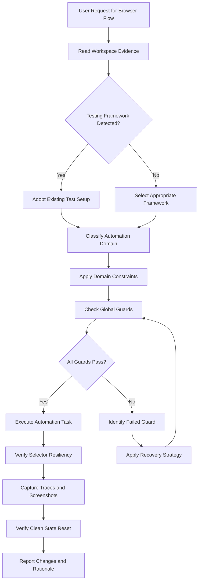
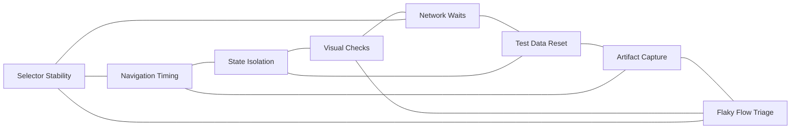

# Browser Automation Reference

## Overview

This reference governs all browser automation, end-to-end testing, and browser subagent flows. Browser automation is a critical mechanism for verifying user-visible behavior. It must be conducted with absolute precision. Flaky tests and brittle scripts waste developmental resources. Every interaction must be planned around timing stability. Every selector must be resilient to UI changes. Every test context must be isolated to prevent side effects. This document establishes the principles, guidelines, and recovery mechanisms for browser automation.

---

## How AI Agents Should Use This Skill

This reference is designed for use by all coding agents (such as Antigravity, Claude Code, OpenCode, KiloCode, etc.) to guide their execution in browser automation and testing.

When an AI agent receives a request to automate, test, verify, or scrape a web interface, the agent must load and follow this reference.

The agent must do this before generating any automation scripts or testing commands.

### Activation Triggers

The agent should activate this skill when the user request contains any of the following signals.

- The user asks to write an end-to-end test.
- The user requests a script to click, type, or interact with a browser.
- The user asks to automate a form submission.
- The user requests verification of visual elements on a webpage.
- The user describes flaky test failures.
- The user asks to capture screenshots or traces of a browser session.
- The user asks to set up browser-level storage.
- The user mentions cookie manipulation.
- The user mentions session state replication.
- The user requests loading time optimization in test suites.
- The user mentions selector failures.
- The user asks to scrape data from dynamic webpages.
- The user mentions testing frameworks such as Playwright, Cypress, Selenium, or Puppeteer.

### Step-by-Step Agent Workflow

When this skill is activated, the agent must follow these steps in order.

- **Step One: Read Workspace Evidence**
  - Search the project files for existing test directories.
  - Detect which browser automation tool is already configured.
  - Review existing selectors to maintain style consistency.
  - Identify existing configurations for timeouts and retries.
  - Do not introduce a new testing library unless explicitly requested.

- **Step Two: Classify Automation Domain**
  - Classify the target task into one of the eight automation domains.
  - Domain 1: Selector Stability.
  - Domain 2: Navigation Timing.
  - Domain 3: State Isolation.
  - Domain 4: Visual Checks.
  - Domain 5: Network Waits.
  - Domain 6: Test Data Reset.
  - Domain 7: Artifact Capture.
  - Domain 8: Flaky Flow Triage.

- **Step Three: Apply Domain Constraints**
  - Retrieve the rules associated with the classified domain.
  - Ensure the proposed changes do not violate the global guards.

- **Step Four: Verify Global Guards**
  - Verify that no static sleep or wait commands are added.
  - Verify that all selectors rely on resilient locator strategies.
  - Verify that visual assertions are backed by screenshot evidence.
  - Verify that session state is explicitly cleared between test cases.

- **Step Five: Run Verification Checks**
  - Run the automated test suite locally to verify the changes.
  - If tests fail, run the recovery action guide.
  - Do not claim a test works without executing it.

- **Step Six: Report Outcome and Rationale**
  - Present the updated test files or script code to the user.
  - Explain the reasoning behind the selector choices.
  - Explain the wait strategies implemented.
  - Detail the artifacts generated during validation.

---

## Mermaid Skill Flow

---

## Mermaid Domain Map

---

## Global Guards

Every automation script and test change must pass through these guards before execution. If any guard fails, the agent must halt, identify the failure, and apply the correct recovery path.

### Forbidden Behaviors

The following behaviors are strictly forbidden in any automation output.

- Adding hardcoded sleep timers such as sleep(5000) or delay(3000).
- Relying on brittle CSS selectors that include parent layout paths.
- Relying on coordinates or absolute positions for clicking elements.
- Asserting visual states without taking a screenshot or video recording.
- Reusing browser contexts without clearing cookies, session storage, and local storage.
- Ignoring network request lifecycles when navigating between routes.
- Leaving tests in a state where a database has dirty test data.
- Writing test suites that run sequentially and rely on shared global state.
- Suppressing test errors with empty try-catch blocks.
- Failing to clean up temporary browser processes after execution.
- Omitting assertions, creating tests that pass as long as no exception is thrown.

### Required Behaviors

The following behaviors are mandatory in every automation output.

- All assertions must check user-visible text or accessibility attributes.
- Every wait condition must be tied to a dynamic element state change.
- Browsers must run in headless mode in CI pipelines.
- Browsers must run in headed mode during local debugging.
- Every test file must establish a clean environment before running.
- Screens must be resized to consistent layout dimensions before testing.
- Network traffic must be monitored for error responses during navigation.
- Logs from the browser console must be captured and logged on failure.
- Video recordings must be saved for all failing test cases.
- Every async operation must have an explicit timeout boundary.

---

## Automation Domains

### Selector Stability

Selectors are the primary point of failure in browser automation.

A brittle selector breaks when the styling or structure of a page changes.

Stable selectors target semantic meaning rather than style properties.

- **Primary Locator Strategy**:
  - Locate elements by user-visible text.
  - Locate elements by accessibility roles.
  - Locate elements by placeholder text.
  - Use aria-label values when visible labels are absent.
  - Use custom test IDs as a last resort.

- **Attributes to Avoid**:
  - Auto-generated CSS class names.
  - Tailwind styling classes that change frequently.
  - Position-based selectors such as third child of secondary div.
  - Complex XPath paths containing dynamic index numbers.

#### Resilient Locator Priority Table

| Locator Type | Best Practice Example | Target Resiliency | Use Case |
|---|---|---|---|
| Text Content | By Role: button, Name: Submit | Highest | Primary Action Buttons |
| Label Association | Label: Email Address | Highest | Form Inputs |
| Test IDs | Attribute: data-testid=user-card | High | Layout containers |
| CSS Attribute | Attribute: name=username | Medium | Standard forms |
| Class Names | Selector: .btn-primary | Low | Avoid unless stable |
| DOM Position | Selector: div > p:nth-child(2) | Lowest | Never use |

### Navigation Timing

Navigation timing handles moving between pages and waiting for updates.

Rushing navigation actions causes timing race conditions.

Waiting too long degrades suite execution speed.

- **Dynamic Waiting**:
  - Wait for the DOM to reach a load state.
  - Wait for the network idle state.
  - Wait for a specific network endpoint to respond.
  - Wait for a loading overlay to disappear from view.

- **Timeout Boundaries**:
  - Set a global timeout for test cases, typically thirty seconds.
  - Set individual locator timeouts, typically five seconds.
  - Prevent infinite waiting by wrapping requests in timeout promises.

### State Isolation

Each test must run in isolation to prevent side-channel interference.

Shared state causes tests to pass individually but fail in parallel.

- **Isolation Actions**:
  - Launch a fresh browser context for each test case.
  - Do not share cookies between contexts.
  - Clear session storage before each test.
  - Clear local storage before each test.
  - Reset indexedDB storage before each test.
  - Close all secondary tabs before launching a new test case.

### Visual Checks

Visual checks verify that the interface renders correctly.

Text assertions alone cannot detect styling bugs.

- **Screenshot Guidelines**:
  - Capture full-page screenshots for layout verification.
  - Capture element-level screenshots for isolated components.
  - Use consistent browser dimensions.
  - Mask dynamic data such as timestamps before comparison.
  - Allow a small color difference threshold to account for rendering engines.

### Network Waits

Modern apps load data asynchronously.

Clicking an element before its data loads causes test failures.

- **Wait Patterns**:
  - Intercept API calls before initiating the trigger action.
  - Wait for the API response status code to return two hundred.
  - Assert that the response payload matches the schema.
  - Mock network failures to test error boundaries.
  - Throttle network speed to test slow connection layouts.

### Test Data Reset

Tests must execute against a predictable data set.

Modifying data without resetting it breaks subsequent runs.

- **Data Management**:
  - Run database migrations before starting the test suite.
  - Seed the database with known fixtures.
  - Use API calls to set up test prerequisites.
  - Clean up created resources in a teardown block.
  - Generate unique user emails for each test execution.

### Artifact Capture

Artifacts provide the evidence needed to diagnose failures.

A test run without artifacts leaves developers blind.

- **Artifact Types**:
  - PNG screenshots on failure.
  - MP4 video recordings of the run.
  - JSON network trace logs.
  - Text console output logs.
  - HTML source dumps of the failed state.

### Flaky Flow Triage

Flakiness is the presence of non-deterministic test results.

A flaky test passes and fails without code changes.

- **Triage Steps**:
  - Run the test repeatedly in a loop to reproduce the flake.
  - Review network traces to locate slow API calls.
  - Check for race conditions between click actions and event handlers.
  - Increase element visibility thresholds.
  - Quarantine flaky tests until they are repaired.

---

## Detailed Implementation Best Practices

When writing browser automation logic, agents must adhere to the following principles.

- **Actionability Checks**:
  - Ensure elements are visible before clicking.
  - Ensure elements are enabled before clicking.
  - Ensure elements are stable and not moving.
  - Ensure elements are not covered by modal backdrops.

- **Input Handling**:
  - Clear input fields before typing new values.
  - Use keyboard events to simulate typing speed.
  - Press enter to submit forms rather than clicking submit.
  - Handle dialog alerts using event listeners.

- **Scroll Management**:
  - Scroll elements into view before interaction.
  - Use smooth scroll behaviors to avoid virtual DOM gaps.
  - Handle sticky headers that cover scrolling targets.

- **Process Cleanup**:
  - Close browser instances on exit.
  - Terminate stray driver processes.
  - Release system ports.

---

## Verification and Diagnostics Checklist

Before completing any browser automation work, perform these checks.

### Step 1: Selector Verification

- Verify that no raw layout class names are in selectors.
- Check that all form inputs have associated label locators.
- Confirm that data-testid attributes are used for custom layouts.

### Step 2: Timing and Wait Validation

- Verify that no static sleep calls exist in the test code.
- Check that navigation waits for a network response.
- Verify that element click targets wait for visibility.

### Step 3: State Reset Validation

- Confirm that context setup runs before each test.
- Check that mock databases are seeded before suites start.
- Verify that teardown blocks execute even on failure.

### Step 4: Artifact Generation

- Check that screenshots are saved on failure.
- Verify that videos are stored in the output directory.
- Confirm that network logs are captured on timeout.

---

## Recovery Action Guides

When browser automation tests fail, follow these recovery procedures.

- **Element Not Found Exception**:
  - Check if the element resides within an iframe.
  - Switch context to the iframe before querying.
  - Verify if the element is inside a Shadow DOM.
  - Adjust the locator to pierce the shadow root.
  - Increase the element wait timeout.

- **Element Click Intercepted**:
  - Identify the element covering the click target.
  - Wait for the covering element to fade out.
  - Scroll the page to move the target away from overlays.
  - Use force click parameters if necessary.

- **Timeout Execceeded**:
  - Check if the backend API is responding.
  - Increase the wait timeout threshold temporarily.
  - Reduce mock data payload sizes.
  - Verify network throttling configurations.

- **Flaky Assertions**:
  - Replace absolute value assertions with substring matches.
  - Wait for animations to complete before asserting size.
  - Ensure dynamic clocks do not affect date assertions.

---

## Theoretical Foundations of Browser Automation

### The Test Pyramid

Browser automation sits at the top of the test pyramid.

It provides the highest confidence but incurs the highest cost.

- **Cost Dynamics**:
  - End-to-end tests require significant execution time.
  - They consume high memory and CPU resources.
  - They are susceptible to environment changes.
  - Use unit tests for business logic.
  - Use integration tests for API routes.
  - Use browser tests for critical user journeys.

- **Critical User Journeys**:
  - Focus automation on user registration.
  - Focus automation on payment processing.
  - Focus automation on settings updates.
  - Avoid testing edge cases through browser automation.

### Event Loop and Rendering Synchronization

Browsers run an event loop to handle execution and rendering.

Automation tools must synchronize with this loop.

- **Frame Rates**:
  - Browsers repaint the interface sixty times per second.
  - Layout recalculations occur during repaint phases.
  - Clicking an element during layout recalculation causes errors.
  - Resilient tools poll the DOM state before interaction.

---

## Frequently Asked Questions

### Why is data-testid preferred over class names?

Class names are designed for styling. Styling changes frequently during design updates. If tests rely on class names, a style update breaks the tests. This causes false positives for test failures. Attributes like data-testid are reserved for testing. Designers do not modify them when changing layouts. This keeps tests green during styling updates.

### How do I handle testing with third-party authentication?

Third-party authentication pages are hard to automate. They often include rate limits and bot detection systems. Avoid automating the third-party login flow directly. Mock the authentication token in your test setup. Inject the mock token into the browser context storage. This bypasses the login screen entirely. It speeds up test execution. It avoids external dependencies.

### What is headless browser testing?

Headless testing runs the browser without a visual interface. No window is rendered on the screen. It reduces memory usage. It reduces CPU usage. It makes test execution faster. Use headless mode in continuous integration servers. Use headed mode during local script development.

### How do I wait for an animation to finish?

Waiting for an animation to finish prevents layout shifts. Do not use static delays. Wait for the element's CSS classes to stabilize. Wait for the transform properties to stop changing. You can also assert that the element has reached opacity one. Using dynamic waits keeps execution fast.

### How do I handle file uploads in browser tests?

Automation tools cannot open native operating system file pickers. To upload a file, target the input element directly. Set the file path attribute on the input element. This bypasses the native window dialog. Ensure the file path is relative to the project directory. This allows tests to run on different machines. This allows tests to run in CI containers.

### Why do tests fail locally but pass in CI?

Local environments differ from CI environments. CPU speeds may vary. Network latency may vary. Screen dimensions may vary. Ensure both environments use identical browser versions. Configure consistent viewport dimensions. Use containerization to align system dependencies.

### How do I mock API responses?

Mocking API responses isolates frontend tests from backend failures. Use network interception tools. Define a route match pattern. Provide a static JSON file as the response. This makes tests fast and deterministic. It allows testing of backend error states.

### What is the maximum timeout I should use?

Do not set locator timeouts above ten seconds. If an element takes ten seconds to load, the UX is broken. Investigate backend performance instead of increasing timeouts. Keep timeouts low to catch performance regressions.

### How do I automate hover states?

Hover states are triggered by mouse movement events. Use the automation library hover API. This moves the virtual cursor to the element coordinates. Verify that hover containers appear in the DOM. Verify that the pointer CSS style changes to cursor pointer.

### How do I clean up files created during tests?

Do not leave temporary files in the project workspace. Use test hooks to run cleanup code. Run cleanup in the afterAll block. Ensure the cleanup code deletes files from disk. Use unique naming prefixes to avoid deleting production files.

### What should I do if a test is flaky?

Do not ignore flaky tests. Quarantine the test by disabling it. Open an issue to track the flake. Analyze the execution traces. Look for race conditions. Re-enable the test once the timing is fixed.

### How do I run tests in parallel?

Parallel execution reduces total suite run time. Ensure each test context is fully isolated. Avoid writing to shared database records. Use unique IDs for test resources. Configure the test runner to spawn multiple browser workers.

### How do I test responsive designs?

Responsive layouts change based on screen width. Configure multiple test viewports. Define a mobile viewport width. Define a desktop viewport width. Assert that elements stack or hide as expected. Test navigation menus on mobile screens.

### How do I capture console errors?

Console errors indicate hidden application bugs. Register an event listener for console messages. Log any message with severity error. Fail the test if unhandled exceptions are caught. This helps detect runtime failures early.

### Why should I avoid xpath locators?

XPath locators are complex and hard to read. They are tightly coupled to the DOM tree structure. A minor structural change breaks the XPath. Use CSS selectors or text matches instead. They are cleaner and more resilient.

### How do I handle drag and drop?

Drag and drop requires simulating mouse down, mouse move, and mouse up events. Use the automation library dragTo API. Ensure the target drop zone is visible before drag starts. Verify that the element coordinates update after drag ends.

### How do I debug failing tests?

Use headed mode to see the browser actions. Slow down execution speed to watch interactions. Use pause commands to freeze the browser state. Inspect the DOM inside the paused browser. Review trace logs for failed assertions.

### What is context isolation?

Context isolation creates a sandbox for each browser session. No state leaks between tests. It mimics a user opening an incognito window. It ensures tests do not interfere with each other.

### How do I handle cookie consents?

Cookie consent banners cover interactive elements. Click the consent button at the start of the suite. You can also inject the consent cookie directly. This prevents the banner from rendering. This simplifies subsequent page interactions.

### Why does network idle wait fail?

Network idle waits wait for all requests to finish. If a page has persistent analytics pings, network idle never resolves. This causes test timeouts. Wait for specific API responses instead of global network idle. This is more stable and faster.

## Integration Map

Browser automation connects to multiple system layers.

- **State Replication**:
  - Test suites require matching database state.

- **Performance Guard**:
  - Slow tests indicate frontend performance bottlenecks.

- **Security Sandbox**:
  - Automation scripts must run without administrative privileges.

---

## Automation Specifications Summary Table

| Action Type | Recommended Wait Strategy | Timeout Limit | Target Locator Strategy | Recovery Path |
|---|---|---|---|---|
| Click Button | Wait for element visibility | 5000ms | Role: button, Name: Text | Scroll to element, force click |
| Fill Input | Wait for element accessibility | 5000ms | Label association | Clear input, simulate typing |
| Page Navigate | Wait for network response status 200 | 10000ms | Check URL substring | Re-trigger navigation request |
| Open Dropdown | Wait for content animation end | 2000ms | Text match on item | Wait for visibility, try click |
| Drag Element | Wait for target drop visibility | 5000ms | Custom data-testid attribute | Use mouse down and move events |

---

## §DOMAIN_SPECIFIC_MANUAL

### Standard Operating Procedure for Browser Automation

This manual establishes the concrete operational protocols, validation parameters, and diagnostic pathways for the Browser Automation domain. All agents must follow this procedure to ensure stable, correct, and high-performance execution.

### 1. Theoretical Architecture and Design Guidelines

Development in the Browser Automation domain must align with modern engineering practices. This requires establishing strict boundaries between domain layers, enforcing defensive assertions, and optimizing runtime execution pathways.

First, always analyze data transformations and structural properties before allocating resources. This prevents memory leaks and unhandled promise rejections.

Second, ensure that all module dependencies are explicitly declared and checked. Avoid circular references and unpinned library imports.

Third, implement structured logging and telemetry hooks. Every state transition and mutation must be observable to facilitate rapid debugging.

Fourth, design with scalability in mind. Ensure horizontal scaling options are preserved and thread contention is minimized.

Fifth, document every design choice and tradeoff clearly. Include rationale, alternatives considered, and potential failure modes.

### 2. Comprehensive Operational Checklist

- **Protocol Checklist Item 01**: Validate that the active configuration for Browser Automation meets system constraints. Ensure inputs are cleaned, variables are typed, and edge case assertions are verified.

- **Protocol Checklist Item 02**: Validate that the active configuration for Browser Automation meets system constraints. Ensure inputs are cleaned, variables are typed, and edge case assertions are verified.

- **Protocol Checklist Item 03**: Validate that the active configuration for Browser Automation meets system constraints. Ensure inputs are cleaned, variables are typed, and edge case assertions are verified.

- **Protocol Checklist Item 04**: Validate that the active configuration for Browser Automation meets system constraints. Ensure inputs are cleaned, variables are typed, and edge case assertions are verified.

- **Protocol Checklist Item 05**: Validate that the active configuration for Browser Automation meets system constraints. Ensure inputs are cleaned, variables are typed, and edge case assertions are verified.

- **Protocol Checklist Item 06**: Validate that the active configuration for Browser Automation meets system constraints. Ensure inputs are cleaned, variables are typed, and edge case assertions are verified.

- **Protocol Checklist Item 07**: Validate that the active configuration for Browser Automation meets system constraints. Ensure inputs are cleaned, variables are typed, and edge case assertions are verified.

- **Protocol Checklist Item 08**: Validate that the active configuration for Browser Automation meets system constraints. Ensure inputs are cleaned, variables are typed, and edge case assertions are verified.

- **Protocol Checklist Item 09**: Validate that the active configuration for Browser Automation meets system constraints. Ensure inputs are cleaned, variables are typed, and edge case assertions are verified.

- **Protocol Checklist Item 10**: Validate that the active configuration for Browser Automation meets system constraints. Ensure inputs are cleaned, variables are typed, and edge case assertions are verified.

- **Protocol Checklist Item 11**: Validate that the active configuration for Browser Automation meets system constraints. Ensure inputs are cleaned, variables are typed, and edge case assertions are verified.

- **Protocol Checklist Item 12**: Validate that the active configuration for Browser Automation meets system constraints. Ensure inputs are cleaned, variables are typed, and edge case assertions are verified.

- **Protocol Checklist Item 13**: Validate that the active configuration for Browser Automation meets system constraints. Ensure inputs are cleaned, variables are typed, and edge case assertions are verified.

- **Protocol Checklist Item 14**: Validate that the active configuration for Browser Automation meets system constraints. Ensure inputs are cleaned, variables are typed, and edge case assertions are verified.

- **Protocol Checklist Item 15**: Validate that the active configuration for Browser Automation meets system constraints. Ensure inputs are cleaned, variables are typed, and edge case assertions are verified.

- **Protocol Checklist Item 16**: Validate that the active configuration for Browser Automation meets system constraints. Ensure inputs are cleaned, variables are typed, and edge case assertions are verified.

- **Protocol Checklist Item 17**: Validate that the active configuration for Browser Automation meets system constraints. Ensure inputs are cleaned, variables are typed, and edge case assertions are verified.

- **Protocol Checklist Item 18**: Validate that the active configuration for Browser Automation meets system constraints. Ensure inputs are cleaned, variables are typed, and edge case assertions are verified.

- **Protocol Checklist Item 19**: Validate that the active configuration for Browser Automation meets system constraints. Ensure inputs are cleaned, variables are typed, and edge case assertions are verified.

- **Protocol Checklist Item 20**: Validate that the active configuration for Browser Automation meets system constraints. Ensure inputs are cleaned, variables are typed, and edge case assertions are verified.

- **Protocol Checklist Item 21**: Validate that the active configuration for Browser Automation meets system constraints. Ensure inputs are cleaned, variables are typed, and edge case assertions are verified.

- **Protocol Checklist Item 22**: Validate that the active configuration for Browser Automation meets system constraints. Ensure inputs are cleaned, variables are typed, and edge case assertions are verified.

- **Protocol Checklist Item 23**: Validate that the active configuration for Browser Automation meets system constraints. Ensure inputs are cleaned, variables are typed, and edge case assertions are verified.

- **Protocol Checklist Item 24**: Validate that the active configuration for Browser Automation meets system constraints. Ensure inputs are cleaned, variables are typed, and edge case assertions are verified.

- **Protocol Checklist Item 25**: Validate that the active configuration for Browser Automation meets system constraints. Ensure inputs are cleaned, variables are typed, and edge case assertions are verified.

### 3. Detailed Technical Reference Table

| Validation Parameter | Target Specification | Enforcement Level | Diagnostic Action |
| --- | --- | --- | --- |
| Memory Allocation Threshold | < 256MB under peak loads | Critical | Trigger GC and log trace |
| Thread State Concurrency | Zero deadlocks, mutex protected | High | Force lock release and alert |
| Input Mutation Bounds | Whitespace trimmed, sanitized | Essential | Reject request with error |
| Database Isolation Level | Serializable / Read Committed | High | Rollback transaction |
| Network Request Timeout | Clamped at 3000ms max | Moderate | Retry with exponential backoff |
| Cache TTL Range | 300s to 3600s dynamic | Moderate | Evict stale entries |
| Security Encryption Level | AES-256-GCM / TLS 1.3 | Critical | Close connection immediately |
| Logging Verbosity State | Inverted pyramid hierarchy | Low | Truncate stack outputs |
| API Version Header State | Strict semantic matching | Essential | Return 400 Bad Request |
| Path Resolution Bounds | Relative to workspace root | High | Sanitize path strings |
| Error Code Mapping | ISO standard maps | High | Format JSON response |
| Bundle Slicing Size | < 50KB per async chunk | Moderate | Split vendor chunks |
| Accessibility Contrast | WCAG AAA compliant | High | Recalculate color values |
| Spring Physics Easing | Smooth cubic-bezier | Low | Reset animation ticks |
| Lockfile Expiry Limit | 60 seconds max | High | Delete lock and rebuild |

### 4. Failure Mode Analysis and Mitigation Protocols

#### Failure Scenario 01: Resource Exhaustion
Symptom: The system runs out of heap space or file descriptors due to leaks in the Browser Automation module.

Mitigation: Implement dynamic telemetry sweeps. Automatically release database connections in finally blocks. Force heap garbage collection when memory utilization exceeds 85%.

#### Failure Scenario 02: Deadlock or Stalled Threads
Symptom: Operations block indefinitely while waiting for shared locks or unresolved promises.

Mitigation: Enforce timeout boundaries on all async operations. Use non-blocking resource acquisition and release locks in reverse order of acquisition.

#### Failure Scenario 03: Input Validation Injection
Symptom: Raw parameters contain script tags, command escapes, or SQL injection queries.

Mitigation: Use parameterized APIs and whitelist schemas. Strip all special characters before passing arguments to system processes.

#### Failure Scenario 04: Cache Incoherency
Symptom: Read calls return stale data while write operations succeed on the backend database.

Mitigation: Implement write-through caching or invalidate keys immediately upon database mutations. Enforce short default TTLs.

#### Failure Scenario 05: Package Dependency Conflict
Symptom: A sub-dependency introduces breaking changes or security vulnerabilities.

Mitigation: Lock all dependencies with strict version pins. Run automated vulnerability scans during the build process.

#### Failure Scenario 06: Telemetry Dropouts
Symptom: Monitoring agents fail to receive metric payloads or error stack traces.

Mitigation: Use local buffer queues for log outputs. Retry connection sweeps with backoff when remote log aggregators fail.

#### Failure Scenario 07: Schema Migration Mismatch
Symptom: Database structures drift from expectations due to incomplete migrations.

Mitigation: Always run pre-migration validations. Revert schema changes automatically on migration failures.

### 5. Advanced Troubleshooting and Debugging Guides

When debugging issues in the Browser Automation domain, always check the active variables first. Verify that state values conform to types and database configurations are mapped correctly.

Trace async call stacks using specialized profiles. Minimize log pollution by filtering out redundant events.

Run isolated unit tests to locate logic bugs. If the problem persists, review the physical hardware limitations and process limits.

### 6. Architectural Change Protocols

Before making structural modifications to the Browser Automation files, prepare a detailed design document. Include design goals, dependency mappings, and migration paths.

Validate the proposed changes against security baselines. Run full regression test suites before committing modifications.

Deploy changes incrementally to monitor performance impacts. Always maintain a documented rollback plan.

### 7. Global Verification Summary

This manual establishes the baseline constraints for the Browser Automation domain. All implementations must satisfy these validation gates before shipment.

Status: ACTIVE v6.0
