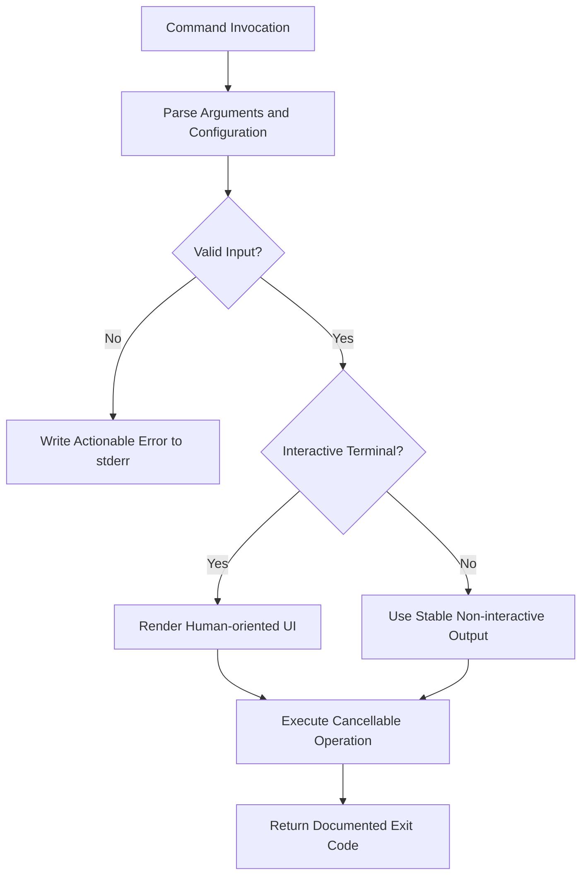
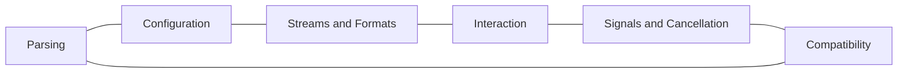

# CLI and TUI Engineering Reference

## Overview

This reference governs command-line and terminal user interfaces, including argument parsing, standard streams, exit codes, signals, progress, prompts, shell completion, accessibility, and automation compatibility.

---

## How AI Agents Should Use This Skill

Load this reference before creating or changing a CLI, PowerShell command, terminal dashboard, interactive prompt, or machine-readable command output. Determine whether the interface serves humans, automation, or both, and keep those output contracts separate.

### Activation Triggers

- Commands, flags, subcommands, environment variables, or configuration precedence.
- Exit codes, stdout, stderr, pipes, JSON output, or shell completion.
- Interactive prompts, progress bars, colors, keyboard input, or TUI layouts.
- Signal handling, cancellation, batch mode, or non-interactive execution.

### Step-by-Step Agent Workflow

1. Inspect existing command syntax and compatibility requirements.
2. Define inputs, defaults, precedence, outputs, and exit codes.
3. Separate human-readable and machine-readable modes.
4. Implement cancellation, non-interactive behavior, and terminal detection.
5. Test quoting, Unicode, narrow terminals, pipelines, and failures.
6. Document examples and compatibility guarantees.

---

## Mermaid CLI Execution Flow

## Mermaid CLI Domain Map

---

## Global Guards

### Forbidden Behaviors

- Printing progress or banners into machine-readable stdout.
- Returning success after a failed operation.
- Prompting during non-interactive execution.
- Breaking existing flags silently.
- Requiring color or cursor movement to understand results.

### Required Behaviors

- Use stdout for requested data and stderr for diagnostics.
- Define stable nonzero exit codes for failure classes.
- Support help without requiring valid configuration.
- Detect terminal capabilities and respect `NO_COLOR`.
- Handle interrupt and termination signals predictably.

## Domain Rules

### Parsing and Configuration

- Reject unknown flags unless passthrough is explicit.
- Document precedence among flags, environment, files, and defaults.

### Output

- Keep JSON or structured output versionable and free of decoration.
- Make errors actionable and include the failing operation.

### TUI Interaction

- Support keyboard-only operation and visible focus.
- Adapt to resize and narrow terminals.
- Provide a plain-text fallback.

### Automation

- Provide non-interactive switches for prompts.
- Avoid timing-dependent output contracts.

## Verification Checklist

- Help, invalid input, success, and failure exit codes are tested.
- stdout and stderr remain correctly separated.
- Piped and redirected execution works.
- Cancellation leaves consistent state.
- Narrow terminal and no-color modes remain usable.
- Existing command compatibility is preserved.

## Integration Map

- Use `windows_systems.md` for PowerShell and Windows process behavior.
- Use `accessibility_engineering.md` for keyboard and readable output.
- Use `documentation_engineering.md` for command reference structure.
- Use `testing_strategy.md` for process-level integration tests.

## Completion Contract

A CLI or TUI is complete only when humans and automation receive stable, accessible, cancellable, and correctly coded behavior.
