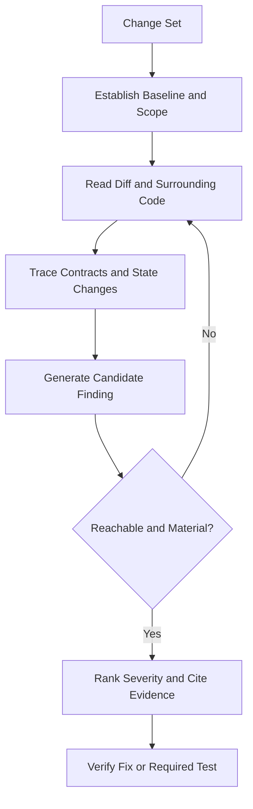
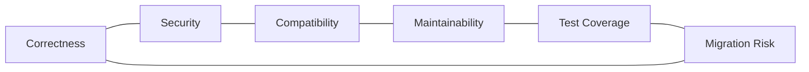

# Code Review and Refactoring Reference

## Overview

This reference governs defect-focused reviews, severity ranking, behavioral analysis, compatibility, refactoring boundaries, test sufficiency, and evidence-backed recommendations.

---

## How AI Agents Should Use This Skill

Load this reference when reviewing a diff, pull request, branch, module, or proposed refactor. Review behavior before style. Trace changed inputs, outputs, state, errors, security boundaries, and compatibility. Do not manufacture findings to fill a report.

### Activation Triggers

- Code review, PR review, diff audit, regression check, or risk assessment.
- Refactor, cleanup, extraction, migration, simplification, or dead-code removal.
- Compatibility, public API, schema, configuration, or behavior changes.
- Missing tests or uncertainty about blast radius.

### Step-by-Step Agent Workflow

1. Establish baseline behavior and review scope.
2. Read the diff plus surrounding ownership and call sites.
3. Trace changed execution paths and contracts.
4. Validate candidate findings against reachable scenarios.
5. Rank findings by impact, likelihood, and remediation urgency.
6. For refactors, preserve behavior with tests before structural change.

---

## Mermaid Review Flow

## Mermaid Refactoring Domain Map

---

## Global Guards

### Forbidden Behaviors

- Leading with summaries before material findings.
- Reporting style preferences as defects.
- Raising speculative issues without a reachable scenario.
- Refactoring unrelated code during a focused fix.
- Treating passing tests as proof that untested behavior is correct.

### Required Behaviors

- Cite exact files and tight line locations.
- Explain trigger, behavior, impact, and remediation.
- Order findings by severity.
- State when no findings are present and identify residual test gaps.
- Keep refactors behavior-preserving unless change is explicit.

## Domain Rules

### Correctness Review

- Check boundary values, state transitions, error paths, and concurrency.
- Compare implementation against existing contracts.

### Compatibility

- Inspect public APIs, persisted data, configuration, and command syntax.
- Require migration or fallback for incompatible changes.

### Refactoring

- Add characterization tests for risky existing behavior.
- Make structural changes incrementally and verify after each stage.

### Test Review

- Evaluate assertions and scenarios, not coverage percentage alone.
- Require regression tests for repaired defects.

## Verification Checklist

- Scope and baseline are known.
- Findings are reachable and evidence-backed.
- Severity reflects user impact.
- Refactors preserve contracts.
- Tests cover changed behavior and failure paths.
- Unrelated changes remain untouched.

## Integration Map

- Use `testing_strategy.md` for test design.
- Use `security_engineering.md` for attack-path review.
- Use `api_design.md` for contract compatibility.
- Use `documentation_engineering.md` for migration notes and ADRs.

## Completion Contract

A review is complete when every reported issue is actionable and evidenced, while a refactor is complete only when behavior and compatibility are verified.
