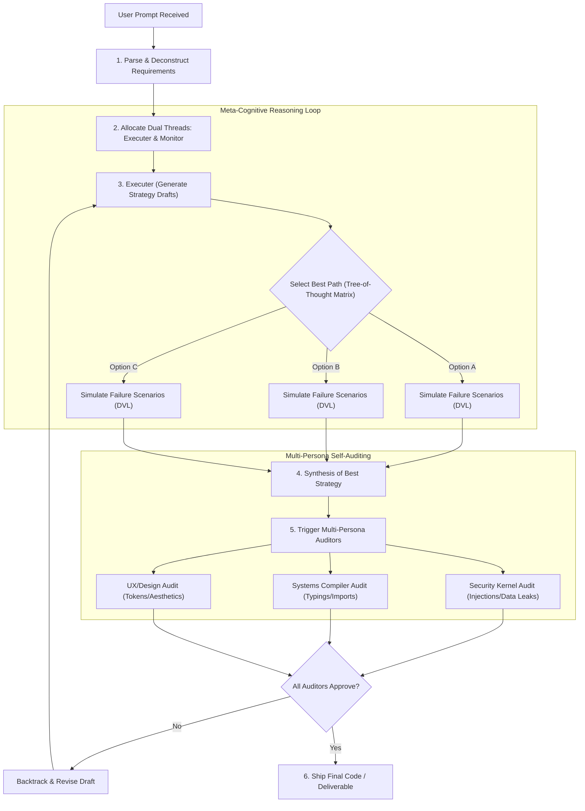

# Meta-Cognitive Reasoner & Advanced Problem Solving
License: Complete terms in LICENSE.txt

This module activates the AI agent's meta-cognitive architecture. It provides formal procedures for dynamic context allocation, multi-perspective self-critique, probabilistic path search, and first-principles deconstruction to push intellectual performance to its maximum limit.

---

## 1. §REASONING_FLOW_DIAGRAM

---

## 2. How the AI Must Apply This Skill
When this supporting skill is loaded, the AI agent must dynamically adopt the following operational behaviors:
1. **Initialize Dual-Thread Processing**: Prior to writing any code, split your cognition into the *Executer* and *Monitor* channels. Evaluate all proposed tool arguments against constraints using the Monitor thread.
2. **Execute the Multi-Persona Audit**: Walk through the checklist for each virtual specialist (Security, Systems, UX) explicitly. If a defect is found, record it internally, correct the design draft, and re-verify.
3. **Select Paths using Tree-of-Thought**: Never default to the first solution that comes to mind. If the task is non-trivial, compile a comparison matrix of at least three options, compute their scores, and explain your choice.
4. **Trigger Feynman & 5-Whys on Failures**: If a command execution returns an error, write down a first-principles explanation of the error source, and ask "why" 5 times recursively to address the root vulnerability.
5. **Manage Memory Limits**: Inspect active context usage. If memory limits are exceeded, compile a Dense Memory Blob (DMB) table summarizing the conversation history and compress working parameters.

---

## 3. Active Self-Monitoring (MCSC) Details
You must split your internal processing into two threads:
* **The Executer (Emits answers)**: Focuses on implementation, syntax, and literal translation of instructions.
* **The Monitor (Audits execution)**: Focuses on logical soundness, constraint verification, edge cases, vulnerability detection, and memory consistency.
* **Monitoring Frequency**: The Monitor thread must evaluate steps before any file write tool is called, checking path arguments and safety.
* **Backtracking Logic**: If the Monitor detects a deviation from requirements or a logical contradiction, the Executer must discard the active path and regenerate from the last valid checkpoint.

---

## 4. Multi-Persona Virtual Self-Auditing Details
Before outputting any complex system, spawn three virtual specialist sub-roles in your context to critique the solution:
* **The Security Kernel Auditor**: Reviews inputs/outputs for injections, memory leaks, concurrency races, and validation bypasses.
* **The Systems Compiler/Linter**: Statically checks import paths, type compliance, variable lifecycle, and potential compiler/runner traps.
* **The UX & Design Architect**: Audits usability, consistency, spacing metrics, response handling, and ensures the prevention of generic slop.

### Detailed Audit Checklists:

#### Security Auditor Checklist:
* Enforce input sanitization at boundaries.
* Block SQL injection by verifying parameterized statements.
* Detect potential prototype pollution or serialization vulnerabilities.
* Mitigate cross-site scripting (XSS) in markup templates.
* Prevent command injections by auditing shell exec flags.

#### Systems Auditor Checklist:
* Validate all import paths and library namespaces.
* Enforce strict type annotations and boundary assertions.
* Match parameter ordering and function signatures with system libraries.
* Verify proper resource disposal (closing file handles, connections).
* Identify potential deadlocks or race conditions in concurrency channels.

#### UX & Design Auditor Checklist:
* Align visual components to the 8px spacing system.
* Check contrast levels against WCAG AA standards.
* Eradicate generic templates and anti-slop patterns (e.g. Space Grotesk).
* Ensure fluid and responsive layout configurations across screen sizes.
* Verify transition durations and cubic-bezier easing curves.

---

## 5. Tree-of-Thought (ToT) Path Search Details
For non-trivial tasks (complexity > 3 steps):
* Evaluate multiple alternative strategies (minimum of 3) before committing to a single plan.
* Score each strategy path based on:
  * *Implementation Cost* (lines, dependencies, complexity)
  * *Risk Profile* (concurrency issues, security surface, regression risk)
  * *Future Scalability* (decoupling, readability)
* Document your chosen path and state why the alternatives were rejected.
* Use a mental exploration table to score alternatives:

| Strategy Option | Implementation Cost | Risk Profile | Scalability | Final Score (1-10) |
|:---|:---|:---|:---|:---|
| Path A: Monolithic | Low | Medium | Low | 5/10 |
| Path B: Decoupled Modules | Medium | Low | High | 8/10 (Selected) |
| Path C: Dynamic Plugin | High | High | High | 6/10 |

---

## 6. First-Principles Deconstruction Details
When faced with an unfamiliar or highly complex bug/task:
* Deconstruct the system down to its **irreducible physical/logic truths** (e.g., how the compiler allocates registers, how the OS manages file handles, how the network stack serializes packages).
* Rebuild the solution upward from these truths, proving each logical step.
* **The 5-Whys Diagnostics**: For every error, ask "why" five times recursively to find the root source of the defect rather than applying a surface patch.
* **The Feynman Explanation**: Explain the system's operational design in simple, clear terms, exposing gaps in your understanding before writing compilation commands.

---

## 7. Context Allocation & Memory Management Details

### A. Dense Memory Blobs (DMB)
When context window usage exceeds 70%, perform a cognitive compression operation:
* Summarize all prior state variables, structural edits, and decisions into a single, dense markdown table.
* Purge redundant conversational pleasantries and historical drafts from active memory.

### B. Regression Mapping
* Maintain a mental map of all files edited during a session.
* Before modifying any file, cross-reference your modifications with the active **Fix Registry** (`FIX_[NNN]`) to verify that you are not re-introducing a bug that was resolved in an earlier step.
* Update structural maps recursively to keep track of system dependencies.
