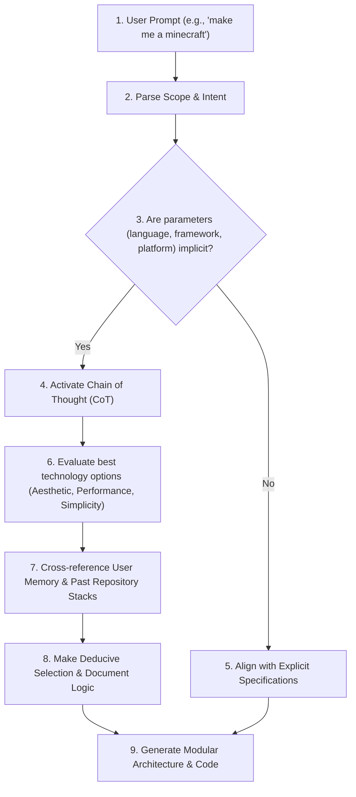

# §CONTEXT_DISAMBIGUATION v1.0

id: context_disambiguation
state: active | reasoning | self_correcting
scope: prompt_parsing + implicit_context + technology_selection + chain_of_thought
boot: auto_load | load_skill_integration

This supporting skill establishes the cognitive reasoning paths, Chain of Thought (CoT) protocols, and context disambiguation rules when parsing user prompts. It guides the agent to look beyond literal instruction strings, identify underspecified variables, and deduce optimal engineering decisions before generating code.

---

## 1. Chain of Thought (CoT) Trigger Protocols

When a user prompt is received, do not jump straight into code generation. You MUST execute an internal Chain of Thought reasoning pass when any of the following triggers are met:

- **Constraint Absence**: The user requests a complex application or module but does not specify the programming language, framework, database, or styling rules.
- **Architectural Ambiguity**: The request could be implemented as a simple script, a command-line tool, a lightweight web interface, or a full-scale backend service.
- **Visual Underspecification**: The user requests a visual UI or game but provides no layout tokens, dimensions, color preferences, or responsiveness guidelines.

---

## 2. Inferred Context & Technology Selection

When constraints are absent, you must systematically reason about the best tools for the task. The selection process must balance performance, simplicity, visual appeal, and the user's environment:

| Ambiguity Vector | Implicit Choice Strategy | Default Selection Standard | Rationale |
| :--- | :--- | :--- | :--- |
| **Web Apps / Interactive** | Modern responsive SPA / Next.js / Vite | Vanilla JS + Canvas or React + Vite | Maximizes interactive visual performance, zero compilation setup for the user, runs in any browser. |
| **Simple Visual Games** | Web Canvas / 3D WebGL | HTML5 Canvas + JS or Three.js | Instant deployment, high frame rates, readable math logic. |
| **Scripting / Automation** | Platform-native scripting | Node.js (TS) or Python | Cross-platform, easy dependency management, fast execution. |
| **Database Engines** | In-memory or zero-config local db | SQLite (local) or Local Storage (Web) | Avoids installation blockers (Docker/Postgres setups) during initialization. |

---

## 3. Cognitive Walkthrough Examples

### Example A: User says "make me a minecraft"

1. **Implicit Objective**: The user wants a voxel-based 3D block-building sandbox similar to Minecraft.
2. **Missing Variables**: Language (not specified), platform (web, desktop, or mobile?), rendering method (WebGL, canvas, OpenGL?), layout/controls.
3. **Chain of Thought Deduction**:
   - *Option 1 (C++ / OpenGL)*: High performance, but requires massive local compilation setup, complex window managers, and dependency setups. High failure rate.
   - *Option 2 (Java / LWJGL)*: Original game language, but heavy setup.
   - *Option 3 (Python / Ursina)*: Easy to write, but requires python dependencies, libraries configuration, and might lag.
   - *Option 4 (JavaScript / Three.js / WebGL)*: Runs instantly, renders 3D graphics in the browser, easy keyboard/mouse capture, no build process needed to test.
   - *Deduction*: Choose **HTML5/Three.js** or a **three.js WebGL canvas application**. It provides a gorgeous dark-mode glassmorphic voxel interface, instant controls, and loads without local environment blocks.
4. **Action**: Implement a fully functional Three.js voxel build game with block addition, removal, camera rotation, collision detection, and texture styling.

### Example B: User says "build a todo system"

1. **Implicit Objective**: The user needs a persistent task management interface.
2. **Missing Variables**: Database type, frontend, styling, auth.
3. **Chain of Thought Deduction**:
   - They didn't ask for a server-side DB. Setting up Postgres/MySQL will cause installation friction.
   - *Deduction*: Create a premium frontend (Vite/React or pure HTML/JS) styling it with a glassmorphic dashboard palette and storing state in `localStorage` or SQLite.

---

## 4. Cross-Project Stack Mapping Integration

Before choosing a technology stack, check the **Global Codebase DNA Registry** in [persistent_memory.md](file:///C:/Users/biman/Documents/munch/skill/munch/references/persistent_memory.md):

- If the user's active codebase uses **TypeScript & Node.js**, prioritize creating helpers or scripts in TypeScript.
- If the current codebase uses **Python**, do not generate a Node.js utility unless requested.
- Maintain syntactic consistency across projects to leverage the user's existing environment configurations.

---

## 5. Reasoning Transparency

When writing the output, explicitly share a 2-3 bullet point summary of your Chain of Thought logic in the response header. Explain *why* you made specific technological choices for the implicit requirements, making your decisions transparent to the user.

**§STATUS: ACTIVE v1.0 | ANTI_REGRESSION: ∞ON | COGNITIVE_REASONING: FULL**
