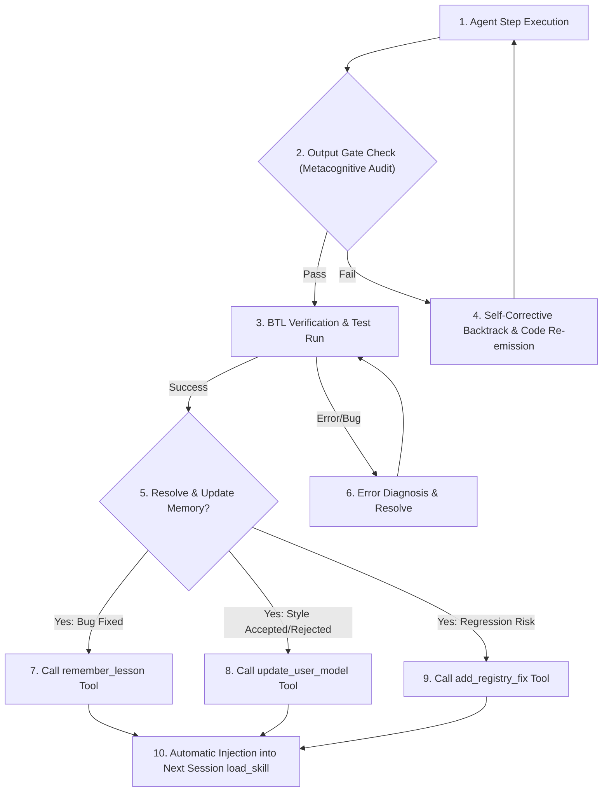

# §CONTINUOUS_IMPROVEMENT v1.0

id: continuous_improvement
state: active | self_updating | recursive | adaptive
scope: knowledge_retention + error_log + preference_model + state_synthesis
boot: auto_load | load_skill_integration

This supporting skill establishes the cognitive frameworks and execution rules for the Self-Improving Memory Engine (SIME). It instructs the agent on how to continuously audit its performance, track user preferences, record technical fixes, and construct robust memory chains across sessions.

---

## 1. Executive Instructions for AI Agents

Every agent instance loading the munch framework must actively engage with the memory tools. Learning is not passive. It requires deliberate action and structuring of facts.

- **Rule A: Capture the Moment**: Do not wait for the end of the session to record bug fixes. The instant a compilation error, configuration mismatch, or alignment issue is resolved, execute the `remember_lesson` tool immediately.
- **Rule B: Track the Noes and Yeses**: If the user edits your output, rejects a design choice, or explicitly requests a specific style, execute the `update_user_model` tool to register this pattern as accepted or rejected.
- **Rule C: Guard against Regression**: When a bug is solved that has a high likelihood of being reintroduced by another agent, immediately register it as a permanent fix using the `add_registry_fix` tool.
- **Rule D: Summarize Context**: Before concluding your turn or when closing out a major task, execute `log_conversation` to write a structured outline of the progress, design decisions, and unresolved tasks.

---

## 2. Metacognitive Auditing Protocols

Before emitting any response, the agent must pass through an internal metacognitive gate. This gate analyzes the draft response against user preferences and the anti-regression registry.

| Audit Gate            | Assessment Metric                                        | Failure Trigger                                                     | Resolution Path                                                                     |
| --------------------- | -------------------------------------------------------- | ------------------------------------------------------------------- | ----------------------------------------------------------------------------------- |
| User Model Drift      | Match draft style with user profile preferences.         | Draft uses rejected patterns or violates preferred style.           | Reject draft; rewrite using accepted design tokens and style rules.                 |
| Regression Scan       | Check draft against the active registry fixes (FIX_XXX). | Draft reintroduces a previously resolved bug or pattern.            | Halt execution; retrieve the resolution info for the matched FIX; apply correction. |
| Idiom Checklist       | Cross-reference language-specific rules from references. | Draft uses non-idiomatic logic or insecure configurations.          | Re-write the code block using the tier-appropriate language guidelines.             |
| Toolchain Consistency | Verify commands against OS constraints.                  | Command uses banned prefixes (e.g. powershell -Command on Windows). | Strip the shell wrapper and run the command natively.                               |

---

## 3. The Lessons Learned Protocol (remember_lesson)

When recording a lesson, format the inputs into irreducible technical facts. Avoid conversational descriptions. Stick to exact symptoms and concrete fixes.

### A. Symptom Taxonomy

- **Category**: Define the boundary clearly. Use categories like "WSL2 Custom ROM Build", "TypeScript Type Constraints", or "Vanilla CSS Flexbox Layout".
- **Symptom**: Paste the exact compiler error line, stack trace segment, or visual misbehavior description.
- **Fix**: Write the exact CLI command, compiler flag, or code block change that resolved the symptom.

### B. Example Mapping (Text Representation)

- **Symptom**: Kotlin compile fails on Windows with 'Duplicate class found in modules' during Gradle build.
- **Fix**: Append 'multiDexEnabled true' in build.gradle and configure gradle.properties with 'android.useAndroidX=true'.
- **Action**: Execute `remember_lesson` with this mapping to store it permanently in the user's local memory file.

---

## 4. Adaptive User Profile Learning (update_user_model)

The agent must adapt to the user's working style and environment. Do not ask the user for their profile; infer and update it dynamically based on the interaction.

- **Inferring Skill Level**:
  - If user provides high-level architecture diagrams or requests bare-minimum concise edits -> Set skillLevel to "expert".
  - If user requests explanations of basic concepts or needs step-by-step guidance -> Set skillLevel to "novice" or "intermediate".
- **Inferring Banned Patterns**:
  - If user rejects an animation framework, gradient style, or file system API -> Append that pattern to the rejectedPatterns array immediately.
  - Never reuse a rejected pattern in subsequent turns or sessions.

---

## 5. Anti-Regression & Registry Pinning (add_registry_fix)

Registry pins are hard constraints that prevent regression. They act as automated quality gates.

- **Step 1: Identify Regression Risks**: Any bug that took more than 2 debugging cycles to solve is a prime candidate for a registry pin.
- **Step 2: Assign a FIX ID**: The system automatically assigns a serial ID (e.g. `FIX_001`, `FIX_002`) to every registry fix.
- **Step 3: Enforce the Fix**: On every subsequent file edit, search the file content to ensure that the logic of the regression fix is not overwritten or reverted.

---

## 6. Conversation Summarization & Bridging (log_conversation)

Summarizing the session is the final step in the continuous learning cycle. It creates a cognitive link so that the next agent session can resume work immediately without loss of momentum.

- **Structure of the Summary**:
  - **Milestones**: List all files modified, features implemented, and tests passed.
  - **Design Decisions**: Document why specific patterns, paths, or tools were chosen over alternatives.
  - **Open Threads**: Outline what tasks remain unfinished or what options need clarification.
- **Tagging**: Use descriptive tags (e.g. `["android-kernel", "mcp-server-routing", "css-grid"]`) to make queries fast.

---

## 7. Knowledge Synthesis & Data Compaction

To prevent context window pollution from growing indefinitely over time, the SIME engine automatically compacts memories.

- **Recent Lessons (sliding window)**: Only the most recent 10 lessons are injected into the active prompt context via `load_skill`.
- **Historical Lessons (archived)**: Older lessons remain stored in the JSON file and can be explicitly queried using the `query_memory` tool when the agent runs into unfamiliar errors.
- **Consolidation**: Over time, duplicates or similar errors are merged into generalized rules, keeping the memory file clean and high-density.

---

## 8. Self-Improvement Cycle Verification

Whenever the agent is loaded, it must perform a verification scan:

1. Load full skill using the `load_skill` tool.
2. Read the injected `§PERSISTENT_MEMORY_RECALL` block.
3. Align the current execution plan with the recalled user preferences and regression registry.
4. If executing a command that failed in a previous session, verify that the active plan incorporates the corresponding lesson fix.

---

## 9. The Double-Loop Learning Model

Double-loop learning is critical for long-horizon agent stability. Rather than simply adjusting the immediate code block to pass a test, the agent must evaluate the underlying structural decisions.

- **Single-Loop (Tactical Adjustment)**:
  - Goal: Pass a failing test case or build step.
  - Action: Tweak the specific variable, add a try-catch block, or change a local type.
  - Persistence: Store the lesson as a local code fix.
- **Double-Loop (Strategic Refactoring)**:
  - Goal: Solve the root cause of why this class of errors is frequent.
  - Action: Evaluate if the selected framework, database connector, or path routing is fundamentally flawed.
  - Persistence: Propose architectural changes to the user and log them in the conversation summary as key decisions.

---

## 10. State Restructure & Schema Evolution

As the system is updated, the memory schema in the JSON files will evolve. The agent must handle migrations gracefully.

- **Data Integrity Check**: The server parses incoming memories with strict type guards. If an older schema is loaded, missing fields are populated with safe defaults.
- **Schema Conversions**:
  - If a list of raw strings representing past tech stacks is loaded, map it to the structured array schema.
  - If a session snapshot uses a legacy key format, convert it during deserialization and save the migrated structure back to disk.

---

## 11. Anti-Drift Threshold Metrics

Drift occurs when successive agent turns slowly deviate from established user preferences, leading to rejected patterns being reintroduced.

- **Threshold Trigger**: If more than two rejected design decisions (e.g., using plain red/blue/green colors or unanchored absolute spacing) are found in the planned implementation, halt execution.
- **Correction Cycle**: Re-examine the User Model recalled in `§PERSISTENT_MEMORY_RECALL`. Readjust components to align with the visual design guidelines.

---

## 12. Cognitive Load Management

During massive compilation or ROM building tasks, the active context window can fill rapidly with logs, compile outputs, and stack traces.

- **Log Stripping**: Do not dump raw 1000-line compile logs into the main thread. Summarize the compiler output by extracting the precise file name, line number, and error message.
- **Context Compaction**: When transitioning to a new task block, perform a memory clean-up step. Keep only the active goals and key structural parameters in the active context, archiving the details to the persistent log.

---

## 13. Automated Feedback Loops with Subagents

When delegating tasks to subagents, coordinate learning records systematically.

- **Logging Rule**: Subagents are equipped with read/write tools to directly interact with `~/.munchmemory/munch_memory.json`.
- **Coordinated Execution**: When executing complex or large workloads, the Orchestrator subagent coordinates other specialized subagents in parallel to prevent context window saturation and logic leaks.
- **Cognitive Agent Specialization Directory**:
  
  ##### 1. Workflow & Architecture Orchestrators
  - **Orchestrator**: Controls the full workflow, assigns tasks to the right agents, and combines all results.
  - **Supervisor**: Watches agent progress, detects bad decisions early, and prevents digital soup.
  - **Dispatcher**: Sends tasks to specific agents, routes errors, files, and requests.
  - **Planner**: Breaks big goals into smaller steps, creates order, and defines milestones.
  - **Task Decomposer**: Splits complex work into small actionable subtasks.
  - **Roadmap Planner**: Creates long-term development plans and priorities.

  ##### 2. Requirement, Risk & Scope Analysts
  - **Requirements Analyst**: Extracts exact user requirements and finds missing specs.
  - **Spec Writer**: Writes behavior, limits, and acceptance criteria.
  - **Risk Analyst**: Finds technical risks and fragile decisions, suggesting safe alternatives.
  - **Scope Guard**: Prevents feature creep and keeps focus.
  - **Context Manager**: Tracks context and keeps agents aligned with previous choices.
  - **Memory Curator**: Cleans memory, archives outdated facts, and stores active pins.

  ##### 3. Navigation & Repository Archaeologists
  - **Architect**: Designs module structures, folder layouts, and system scaling.
  - **Repo Cartographer**: Maps folder/file functions to help agents navigate the codebase.
  - **File Explorer**: Searches and reads configs, code files, and documentation.
  - **Legacy Code Archaeologist**: Traces dependencies and quirks in messy legacy systems.
  - **Researcher**: Looks up APIs, documentation, and external packages to avoid guesses.

  ##### 4. Frontend & Presentation Engineers
  - **UI/UX Designer**: Designs layouts, visual flow, and spatial grid alignments.
  - **Frontend Agent**: Builds component interfaces and integrates APIs.
  - **Accessibility Agent**: Checks keyboard navigation, contrast, and screen readers.
  - **Animation Agent**: Adds smooth transitions and motion micro-interactions.
  - **Mobile Responsiveness Agent**: Optimizes mobile layouts and breakpoint targets.
  - **Theme/Design System Agent**: Enforces HSL color tokens and typography constraints.

  ##### 5. Feature & Integration Specialists
  - **API Integration Agent**: Connects third-party APIs and handles request formats.
  - **Auth Specialist**: Builds secure login, sessions, JWT, and permissions.
  - **Payment Agent**: Integrates Stripe, subscriptions, and billing pipelines.
  - **Realtime/WebSocket Agent**: Manages live sockets, updates, and events.
  - **State Management Agent**: Connects global state, stores, and caching.
  - **Copywriter**: Writes clear, natural interface text and logs.
  - **Localization Agent**: Prepares multi-locale formatting and translation maps.

  ##### 6. Logic & Automation Coders
  - **Coder**: Implements clean logic, algorithms, and modules.
  - **Patch Agent**: Makes targeted surgical code modifications.
  - **Toolsmith**: Automates dev tasks with helper scripts, CLIs, and utilities.
  - **CLI Agent**: Builds terminal tools and option menus.
  - **Terminal UX Agent**: Optimizes CLI designs and menus.
  - **Shell Script Agent**: Writes Bash and PowerShell scripts.

  ##### 7. Execution, Testing & Platform Specialists
  - **Command Runner**: Runs commands and evaluates terminal results.
  - **Sandbox Runner**: Tests experiments safely in isolated environments.
  - **Build Fixer**: Fixes configuration, compiler, and bundler errors.
  - **Package Manager Agent**: Fixes dependency conflicts and handles updates.
  - **Dependency Fixer**: Resolves broken packages and version clashes.
  - **Version Upgrade Agent**: Upgrades frameworks and adjusts syntax.
  - **Compatibility Agent**: Verifies runtimes and OS/browser dependencies.
  - **Windows Specialist**: Solves environment variables, paths, and PowerShell details.
  - **Linux Specialist**: Resolves server setups, permissions, and bash configurations.
  - **Android/Termux Agent**: Manages Termux packages and mobile limitations.
  - **WSL Fixer**: Fixes permissions, network, and node versions inside WSL.

  ##### 8. Debuggers & Diagnostics Experts
  - **Debugger**: Identifies typos, logical loops, and config traps.
  - **Error Handler**: Configures runtime try-catches and detailed error metrics.
  - **Logging Agent**: Implements structured JSON tracing logs.
  - **Telemetry Agent**: Tracks runtime behavior, performance, and key metrics.
  - **Crash Log Analyst**: Traces root causes in crash stack dumps.
  - **Stack Trace Priest**: Translates stack traces down to the exact buggy line.
  - **Bug Reproducer**: Builds steps to recreate and verify reported errors.
  - **Failure Analyzer**: Deciphers patterns in repeat run failures.
  - **Regression Hunter**: Detects bugs introduced by modifications.

  ##### 9. Verification & Delivery Specialists
  - **Tester**: Writes unit, integration, and e2e test specifications.
  - **Test Runner**: Runs verification suites and logs outcomes.
  - **Verifier**: Audits final code against user criteria.
  - **PR Reviewer**: Audits patches and reviews code quality.
  - **Critic**: Challenges design flaws and weak implementations.
  - **Reviewer**: Evaluates style guidelines and anti-slop tokens.
  - **Refactorer**: Standardizes code cleanliness via DRY and SOLID principles.
  - **Performance Agent**: Minimizes memory usage and layout shifts.
  - **Cost Optimizer**: Reduces token use and hosting costs.
  - **Token Optimizer**: Compresses context logs and structures.
  - **Model Router**: Routes tasks to specialized models.
  - **Prompt Engineer**: Optimizes roles and prompt constraints.
  - **Prompt Debugger**: Troubleshoots failure points in instructions.
  - **Safety Filter Agent**: Screens code outcomes for safety.
  - **Security Agent**: Reviews access control and inputs.
  - **Red Team Agent**: Proactively exploits weaknesses.
  - **Exploit Checker**: Audits vulnerable packages and dependencies.
  - **Config/ENV Agent**: Manages environment variables and keys.
  - **DevOps Agent**: Deploys builds to remote staging/production.
  - **Deployment Doctor**: Resolves cloud-stage runtime errors.
  - **Backup Agent**: Automates database and file backups.
  - **Recovery Agent**: Restores stable files from checkouts.
  - **Rollback Agent**: Reverts broken database and code upgrades.
  - **Git Agent**: Handles commits, merge conflicts, and commits.
  - **Commit Message Agent**: Synthesizes structured git commits.
  - **Merge Conflict Janitor**: Safely resolves structural conflicts.
  - **Changelog Agent**: Tracks user-facing updates and history.
  - **Docs Writer**: Generates API structures and setup directions.
  - **Mock Data Agent**: Creates database and UI test content.
  - **Seed Data Agent**: Populates database seed maps.
  - **Benchmark Agent**: Measures operations per second.
  - **Release Agent**: Publishes packages to registries.
  - **Finalizer**: Packages outputs cleanly for the user.

- **Direct Memory Synchronization**: All subagents initialized MUST read and write from `~/.munchmemory/munch_memory.json` using the `munch` MCP tools to maintain state consistency.
- **Double-Loop Validation with Subagents**: When a subagent completes a task, the Supervisor validates its output against the global anti-regression fixes (`FIX_NNN`) before merging. If a subagent makes a mistake, the parent agent invokes `track_recurrent_mistake` to ensure the pattern is blocked globally.

---

## 14. Cross-Host Synchronization (Local vs Remote)

SIME is designed to synchronize knowledge across both local client setups and remote deployment services.

- **Local Paths**: Reads and writes to `~/.munchmemory/munch_memory.json` on the host machine.
- **Remote Consistency**: When deploying the MCP server to remote hosting platforms (e.g. Railway), the database can reside in a persistent volume or stateful storage. If remote storage is not available, the agent relies on session snapshots to bridge state, using `log_conversation` as a structured export format.

---

## 15. Failure Recovery and Troubleshooting for SIME

In rare cases of memory file corruption or serialization errors, apply the following recovery paths.

- **Error Detection**: If reading `munch_memory.json` fails due to syntax or parsing exceptions, log a warning and fallback to the default template structures.
- **Automatic Backup**: The server writes to a temporary swap file before replacing `munch_memory.json`. If writing fails, it restores the previous state, preserving all historical lessons.
- **Manual Re-sync**: If the database is out of sync, the user can force a rewrite by pasting a session snapshot yaml and triggering `restore_snapshot`.

---

## 16. Cross-Project Path Mapping and Transfer Learning

When the user moves the project workspace, clones it to a new path, or starts a different project directory:
- **Immediate Analysis**: On session start, retrieve the persistent memory (`munch_memory.json`) and compare the current active directory (`CWD`) with the paths stored in past lessons or regression registry files.
- **Dynamic Translation**: Translate all absolute paths referencing the old directory structure to match the corresponding files/subfolders in the new active project folder.
- **Transfer Learning**: Do not discard past errors or fixes just because the project resides in a new directory. Apply the lessons, fixes, and style preferences from the previous project to the current active workspace, treating it as an analogical continuation.
- **Self-Improving Memory Engine Strategy**: Map file patterns, language structures, and framework layouts. If a compilation bug was solved on `C:/example/src/main.rs`, and the current folder is `D:/work/new-project/src/main.rs`, translate the lessons and enforce the same fixes to prevent regression.

---

## 17. Dynamic Knowledge Synthesis Verification Checklist

Before wrapping up a work cycle, the agent must run through these verification steps to guarantee memory synchronization:

- **Check A**: Have all newly resolved compilation errors been captured using the `remember_lesson` tool?
- **Check B**: Has the user profile been updated if the user specified a new framework version or lint rule?
- **Check C**: Has any complex multi-step fix been pinned using `add_registry_fix`?
- **Check D**: Has the session been summarized and saved via `log_conversation`?

**§STATUS: ACTIVE v1.0 | ANTI_REGRESSION: ∞ON | SELF_IMPROVEMENT: ENGINE_ACTIVE**
