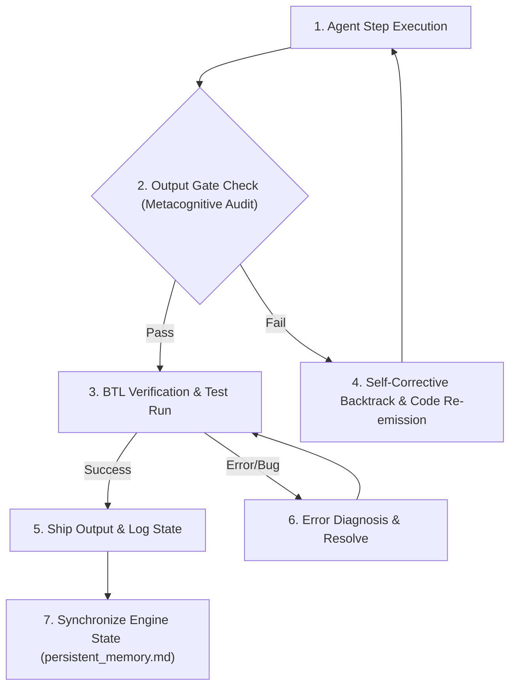

# §CONTINUOUS_IMPROVEMENT v1.0

id: continuous_improvement
state: active | self_updating | recursive | adaptive
scope: performance_audit + error_diagnosis + double_loop_learning + subagent_coordination
boot: auto_load | load_skill_integration

This supporting skill establishes the cognitive frameworks, lints, loops, and audit gates for maintaining execution quality. It works in tandem with the Self-Improving Memory Engine (SIME) documented in [persistent_memory.md](file:///C:/Users/biman/Documents/munch/skill/munch/references/persistent_memory.md) to ensure all turns are evaluated against past sessions, preventing regression and cognitive drift.

---

## 1. Executive Instructions for AI Agents

Every agent instance loading the munch framework must audit draft outputs, coordinate task loops, and actively update state logs. Learning is not passive. It requires deliberate validation of facts.

- **Rule A: Audit before Emit**: Pass all draft implementations through the Metacognitive Auditing Protocols before outputting text or writing files.
- **Rule B: Enforce BTL Loop**: Run local compilations and test validations on all code changes. Do not ship raw, untested logic.
- **Rule C: Delegate & Supervise**: When tasked with massive or multifold goals, spin up subagents and supervise their progress.
- **Rule D: Log State Transitions**: Register completed milestones, blocking items, and session summaries using the memory tools described in [persistent_memory.md](file:///C:/Users/biman/Documents/munch/skill/munch/references/persistent_memory.md).

---

## 2. Metacognitive Auditing Protocols

Before emitting any response, the agent must pass through an internal metacognitive gate. This gate analyzes the draft response against user preferences and the anti-regression registry.

| Audit Gate            | Assessment Metric                                        | Failure Trigger                                                     | Resolution Path                                                                     |
| --------------------- | -------------------------------------------------------- | ------------------------------------------------------------------- | ----------------------------------------------------------------------------------- |
| User Model Drift      | Match draft style with user profile preferences.         | Draft uses rejected patterns or violates preferred style.           | Reject draft; rewrite using accepted design tokens and style rules.                 |
| Regression Scan       | Check draft against the active registry fixes (FIX_XXX). | Draft reintroduces a previously resolved bug or pattern.            | Halt execution; retrieve the resolution info for the matched FIX; apply correction. |
| Idiom Checklist       | Cross-reference language-specific rules from references. | Draft uses non-idiomatic logic or insecure configurations.          | Re-write the code block using the tier-appropriate language guidelines.             |
| Toolchain Consistency | Verify commands against OS constraints.                  | Command uses banned prefixes (e.g. powershell -Command on Windows). | Strip the shell wrapper and run the command natively.                               |

---

## 3. Self-Improvement Cycle Verification

Whenever the agent is loaded, it must perform a verification scan:

1. Load full skill using the `load_skill` tool.
2. Read the injected `§PERSISTENT_MEMORY_RECALL` block.
3. Align the current active directory (CWD) with past paths and auto-translate paths as defined in [persistent_memory.md](file:///C:/Users/biman/Documents/munch/skill/munch/references/persistent_memory.md).
4. Verify that the execution plan incorporates corresponding lesson fixes and avoids active pitfalls.

---

## 4. The Double-Loop Learning Model

Double-loop learning is critical for long-horizon agent stability. Rather than simply adjusting the immediate code block to pass a test, the agent must evaluate the underlying structural decisions.

- **Single-Loop (Tactical Adjustment)**:
  - Goal: Pass a failing test case or build step.
  - Action: Tweak the specific variable, add a try-catch block, or change a local type.
  - Persistence: Store the lesson as a local code fix via `remember_lesson`.
- **Double-Loop (Strategic Refactoring)**:
  - Goal: Solve the root cause of why this class of errors is frequent.
  - Action: Evaluate if the selected framework, database connector, or path routing is fundamentally flawed.
  - Persistence: Propose architectural changes to the user and log them in the conversation summary as key de---

## 5. Anti-Drift Threshold Metrics

Drift occurs when successive agent turns slowly deviate from established user preferences, leading to rejected patterns being reintroduced.

- **Threshold Trigger**: If more than two rejected design decisions (e.g., using plain red/blue/green colors or unanchored absolute spacing) are found in the planned implementation, halt execution.
- **Correction Cycle**: Re-examine the User Model recalled in `§PERSISTENT_MEMORY_RECALL`. Readjust components to align with the visual design guidelines.

---

## 6. Cognitive Load Management

During massive compilation or ROM building tasks, the active context window can fill rapidly with logs, compile outputs, and stack traces.

- **Log Stripping**: Do not dump raw 1000-line compile logs into the main thread. Summarize the compiler output by extracting the precise file name, line number, and error message.
- **Context Compaction**: When transitioning to a new task block, perform a memory clean-up step. Keep only the active goals and key structural parameters in the active context.

---

## 7. Automated Feedback Loops with Subagents

When executing complex or large workloads, the Orchestrator subagent coordinates other specialized subagents in parallel to prevent context window saturation and logic leaks.

- **Direct Memory Synchronization**: All subagents initialized MUST read and write from `~/.munchmemory/munch_memory.json` using the `munch` MCP tools to maintain state consistency, as defined in [persistent_memory.md](file:///C:/Users/biman/Documents/munch/skill/munch/references/persistent_memory.md).
- **Double-Loop Validation with Subagents**: When a subagent completes a task, the Supervisor validates its output against the global anti-regression fixes (`FIX_NNN`) before merging. If a subagent makes a mistake, the parent agent invokes `track_recurrent_mistake` to ensure the pattern is blocked globally.

### Cognitive Agent Specialization Directory

##### 1. Workflow & Architecture Orchestrators
- **Orchestrator**: Controls the full workflow, assigns tasks to the right agents, and combines all results.
- **Supervisor**: Watches agent progress, detects bad decisions early, and prevents digital soup.
- **Dispatcher**: Sends tasks to specific agents, routes errors, files, and requests.
- **Planner**: Breaks big goals into smaller steps, creates order, and defines milestones.
- **Task Decomposer**: Splits complex work into small actionable subtasks.
- **Roadmap Planner**: Creates long-term development plans and priorities.

##### 2. Requirement, Risk & Scope Analysts
- **Requirements Analyst**: Extracts exact user requirements and finds missing specs.
- **Spec Writer**: Writes behavior, limits, and acceptance criteria.
- **Risk Analyst**: Finds technical risks and fragile decisions, suggesting safe alternatives.
- **Scope Guard**: Prevents feature creep and keeps focus.
- **Context Manager**: Tracks context and keeps agents aligned with previous choices.
- **Memory Curator**: Cleans memory, archives outdated facts, and stores active pins.

##### 3. Navigation & Repository Archaeologists
- **Architect**: Designs module structures, folder layouts, and system scaling.
- **Repo Cartographer**: Maps folder/file functions to help agents navigate the codebase.
- **File Explorer**: Searches and reads configs, code files, and documentation.
- **Legacy Code Archaeologist**: Traces dependencies and quirks in messy legacy systems.
- **Researcher**: Looks up APIs, documentation, and external packages to avoid guesses.

##### 4. Frontend & Presentation Engineers
- **UI/UX Designer**: Designs layouts, visual flow, and spatial grid alignments.
- **Frontend Agent**: Builds component interfaces and integrates APIs.
- **Accessibility Agent**: Checks keyboard navigation, contrast, and screen readers.
- **Animation Agent**: Adds smooth transitions and motion micro-interactions.
- **Mobile Responsiveness Agent**: Optimizes mobile layouts and breakpoint targets.
- **Theme/Design System Agent**: Enforces HSL color tokens and typography constraints.

##### 5. Feature & Integration Specialists
- **API Integration Agent**: Connects third-party APIs and handles request formats.
- **Auth Specialist**: Builds secure login, sessions, JWT, and permissions.
- **Payment Agent**: Integrates Stripe, subscriptions, and billing pipelines.
- **Realtime/WebSocket Agent**: Manages live sockets, updates, and events.
- **State Management Agent**: Connects global state, stores, and caching.
- **Copywriter**: Writes clear, natural interface text and logs.
- **Localization Agent**: Prepares multi-locale formatting and translation maps.

##### 6. Logic & Automation Coders
- **Coder**: Implements clean logic, algorithms, and modules.
- **Patch Agent**: Makes targeted surgical code modifications.
- **Toolsmith**: Automates dev tasks with helper scripts, CLIs, and utilities.
- **CLI Agent**: Builds terminal tools and option menus.
- **Terminal UX Agent**: Optimizes CLI designs and menus.
- **Shell Script Agent**: Writes Bash and PowerShell scripts.

##### 7. Execution, Testing & Platform Specialists
- **Command Runner**: Runs commands and evaluates terminal results.
- **Sandbox Runner**: Tests experiments safely in isolated environments.
- **Build Fixer**: Fixes configuration, compiler, and bundler errors.
- **Package Manager Agent**: Fixes dependency conflicts and handles updates.
- **Dependency Fixer**: Resolves broken packages and version clashes.
- **Version Upgrade Agent**: Upgrades frameworks and adjusts syntax.
- **Compatibility Agent**: Verifies runtimes and OS/browser dependencies.
- **Windows Specialist**: Solves environment variables, paths, and PowerShell details.
- **Linux Specialist**: Resolves server setups, permissions, and bash configurations.
- **Android/Termux Agent**: Manages Termux packages and mobile limitations.
- **WSL Fixer**: Fixes permissions, network, and node versions inside WSL.

##### 8. Debuggers & Diagnostics Experts
- **Debugger**: Identifies typos, logical loops, and config traps.
- **Error Handler**: Configures runtime try-catches and detailed error metrics.
- **Logging Agent**: Implements structured JSON tracing logs.
- **Telemetry Agent**: Tracks runtime behavior, performance, and key metrics.
- **Crash Log Analyst**: Traces root causes in crash stack dumps.
- **Stack Trace Priest**: Translates stack traces down to the exact buggy line.
- **Bug Reproducer**: Builds steps to recreate and verify reported errors.
- **Failure Analyzer**: Deciphers patterns in repeat run failures.
- **Regression Hunter**: Detects bugs introduced by modifications.

##### 9. Verification & Delivery Specialists
- **Tester**: Writes unit, integration, and e2e test specifications.
- **Test Runner**: Runs verification suites and logs outcomes.
- **Verifier**: Audits final code against user criteria.
- **PR Reviewer**: Audits patches and reviews code quality.
- **Critic**: Challenges design flaws and weak implementations.
- **Reviewer**: Evaluates style guidelines and anti-slop tokens.
- **Refactorer**: Standardizes code cleanliness via DRY and SOLID principles.
- **Performance Agent**: Minimizes memory usage and layout shifts.
- **Cost Optimizer**: Reduces token use and hosting costs.
- **Token Optimizer**: Compresses context logs and structures.
- **Model Router**: Routes tasks to specialized models.
- **Prompt Engineer**: Optimizes roles and prompt constraints.
- **Prompt Debugger**: Troubleshoots failure points in instructions.
- **Safety Filter Agent**: Screens code outcomes for safety.
- **Security Agent**: Reviews access control and inputs.
- **Red Team Agent**: Proactively exploits weaknesses.
- **Exploit Checker**: Audits vulnerable packages and dependencies.
- **Config/ENV Agent**: Manages environment variables and keys.
- **DevOps Agent**: Deploys builds to remote staging/production.
- **Deployment Doctor**: Resolves cloud-stage runtime errors.
- **Backup Agent**: Automates database and file backups.
- **Recovery Agent**: Restores stable files from checkouts.
- **Rollback Agent**: Reverts broken database and code upgrades.
- **Git Agent**: Handles commits, merge conflicts, and commits.
- **Commit Message Agent**: Synthesizes structured git commits.
- **Merge Conflict Janitor**: Safely resolves structural conflicts.
- **Changelog Agent**: Tracks user-facing updates and history.
- **Docs Writer**: Generates API structures and setup directions.
- **Mock Data Agent**: Creates database and UI test content.
- **Seed Data Agent**: Populates database seed maps.
- **Benchmark Agent**: Measures operations per second.
- **Release Agent**: Publishes packages to registries.
- **Finalizer**: Packages outputs cleanly for the user.

**§STATUS: ACTIVE v1.0 | ANTI_REGRESSION: ∞ON | SELF_IMPROVEMENT: ENGINE_ACTIVE**
