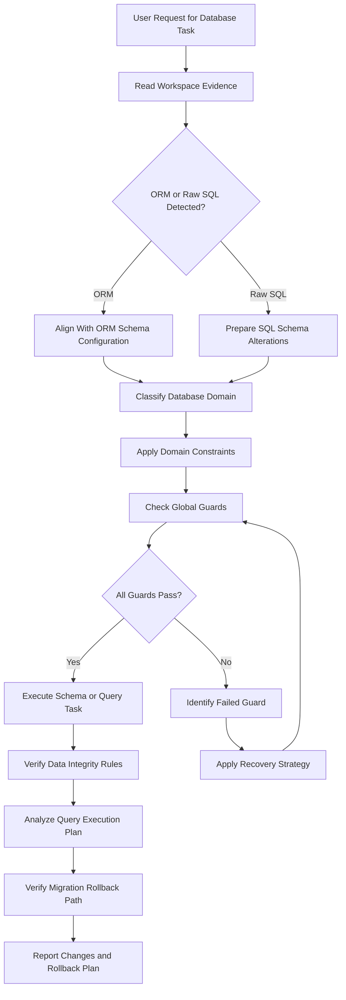
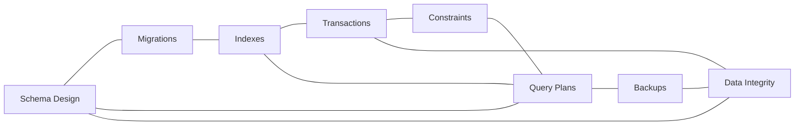

# Database Engineering Reference

## Overview

This reference governs all database schema designs, migrations, query performance optimization, and data integrity constraints. Databases are the core state engines of applications. Ensuring their reliability and consistency is paramount. Poor database design leads to query performance degradation. It can also lead to data corruption, synchronization failures, and system downtime. Every migration must be planned to avoid locking tables. Every index must be backed by real-world query execution evidence. Every transaction boundary must preserve data correctness. This document establishes the guidelines, templates, checklist, and recovery paths for database operations.

---

## How AI Agents Should Use This Skill

This reference is designed for use by all coding agents (such as Antigravity, Claude Code, OpenCode, KiloCode, etc.) to guide their execution in database architecture and operations.

When an AI agent receives a request to modify database schemas, write migrations, optimize SQL queries, configure indexing, manage database replication, or troubleshoot transaction lockups, the agent must load and follow this reference.

The agent must do this before proposing or applying database changes.

### Activation Triggers

The agent should activate this skill when the user request contains any of the following signals.

- The user asks to create or modify a database schema.
- The user requests a migration script to add, remove, or modify tables or fields.
- The user asks to optimize a slow SQL or NoSQL query.
- The user requests an index to improve lookup performance.
- The user describes transactional failures such as deadlocks or race conditions.
- The user asks to configure foreign key constraints or check constraints.
- The user asks to set up backup and restore scripts.
- The user mentions database engines like PostgreSQL, MySQL, SQLite, MongoDB, or Redis.
- The user mentions ORMs like Prisma, Sequelize, Hibernate, or SQLAlchemy.
- The user describes data corruption or data drift issues.
- The user requests a schema verification or audit.

### Step-by-Step Agent Workflow

When this skill is activated, the agent must follow these steps in order.

- **Step One: Read Workspace Evidence**
  - Read existing database configuration files.
  - Locate existing schema files or ORM models.
  - Check the current migration history of the project.
  - Understand the target database engine constraints.
  - Do not assume database structures without inspecting the workspace.

- **Step Two: Classify Database Domain**
  - Classify the target task into one of the eight database engineering domains.
  - Domain 1: Schema Design.
  - Domain 2: Migrations.
  - Domain 3: Indexes.
  - Domain 4: Transactions.
  - Domain 5: Constraints.
  - Domain 6: Query Plans.
  - Domain 7: Backups.
  - Domain 8: Data Integrity.

- **Step Three: Apply Domain Constraints**
  - Retrieve the rules associated with the classified domain.
  - Ensure the proposed changes do not violate the global guards.

- **Step Four: Verify Global Guards**
  - Verify that migrations do not perform destructive actions without rollback plans.
  - Verify that indexes are not added without query plan evidence.
  - Verify that transaction scopes are bounded and minimized.
  - Verify that critical tables have primary and foreign key constraints.

- **Step Five: Run Verification Checks**
  - Test migration scripts locally on a test database environment.
  - Run query analysis checks (e.g. EXPLAIN ANALYZE) on modified queries.
  - Do not claim a database change is safe without verifying it.

- **Step Six: Report Outcome and Rationale**
  - Report the database changes in the response.
  - Describe the schema delta or migration sequence.
  - Provide query execution plans before and after modification.
  - Explain the rollback mechanism.

---

## Mermaid Skill Flow

---

## Mermaid Domain Map

---

## Global Guards

Every database change must pass through these guards before execution. If any guard fails, the agent must halt, identify the failure, and apply the correct recovery path.

### Forbidden Behaviors

The following behaviors are strictly forbidden in any database engineering output.

- Proposing a schema modification that deletes columns or tables without a deprecation phase.
- Adding non-nullable columns to populated tables without providing a default value.
- Running migration scripts directly against production databases without backup confirmation.
- Creating index structures on small tables containing fewer than one thousand rows.
- Performing unbounded SELECT queries without pagination or row limits.
- Wrapping network API calls inside active database transaction blocks.
- Storing plain text sensitive credentials or secrets within schema comments.
- Bypassing constraint checks during large bulk insert operations.
- Storing large binary objects (BLOBs) inside primary relational databases.
- Leaving orphan database rows when deleting parent entities.

### Required Behaviors

The following behaviors are mandatory in every database engineering output.

- All schema designs must follow normalization standards up to third normal form.
- Every migration script must include a complementary down or rollback migration script.
- Foregn keys must have explicit ON DELETE behaviors defined.
- Query plans must be inspected to ensure indexes are utilized.
- Connection pools must be configured with timeout bounds.
- Databases must use UTF-8 or equivalent wide character encodings.
- All column types must be sized correctly to save storage space.
- Indexes must cover fields frequently used in WHERE, JOIN, and ORDER BY clauses.
- Transaction rollback actions must trigger automatically on query errors.
- Sensitive user data fields must be flagged for encryption.

---

## Database Domains

### Schema Design

Schema design defines the relational mapping of system entities.

A poor schema design introduces redundancy and structural anomalies.

- **Normalization**:
  - Store single values in columns.
  - Eliminate duplicate columns within tables.
  - Establish relationships using foreign keys.
  - Avoid wide tables with hundreds of columns.

- **Denormalization Exception**:
  - Denormalize data only for high-read dashboard views.
  - Ensure sync scripts maintain consistency across denormalized records.

#### Schema Data Type Matching Table

| Logical Data | Recommended Postgres Type | Storage Size | Notes |
|---|---|---|---|
| User IDs | UUID | 16 bytes | Prevents ID enumeration attacks |
| Small Counters | SMALLINT | 2 bytes | Limit to 32,767 |
| Large Counters | BIGINT | 8 bytes | Use for system transaction logs |
| Short Text | VARCHAR(255) | Variable | Use for titles, names |
| Unbounded Text | TEXT | Variable | Use for descriptions, logs |
| Financial Decimals | NUMERIC(12, 2) | Variable | Avoid float types for money |
| Timestamps | TIMESTAMPTZ | 8 bytes | Always preserve timezones |

### Migrations

Migrations apply incremental modifications to schemas.

They must handle existing data without causing lockups.

- **Safe Alterations**:
  - Add nullable columns.
  - Add columns with default values in multiple phases.
  - Create indexes concurrently.
  - Avoid renaming columns under live traffic.
  - Split structural changes and data backfills into separate files.

### Indexes

Indexes speed up data retrieval at the cost of write performance.

Over-indexing tables slows down inserts and updates.

- **Index Optimization**:
  - Index primary and foreign key columns.
  - Use compound indexes for multi-column lookups.
  - Place selective columns first in compound indexes.
  - Use partial indexes to index subset conditions.
  - Monitor index utilization statistics regularly.

### Transactions

Transactions guarantee the ACID properties of database updates.

Long-running transactions block tables and lead to connection exhaustion.

- **Transaction Scope**:
  - Keep transaction blocks short.
  - Do not perform slow network operations inside transactions.
  - Order resource updates consistently to avoid deadlocks.
  - Select appropriate isolation levels.
  - Read-committed isolation should be the default.

### Constraints

Constraints enforce business logic rules at the database engine level.

Relying on application code alone to check invariants leads to data drift.

- **Invariant Enforcement**:
  - Use NOT NULL constraints on all mandatory columns.
  - Use UNIQUE constraints on email or identification numbers.
  - Implement CHECK constraints for value range verification.
  - Enforce foreign key constraints with cascade behaviors.

### Query Plans

Query plans show how the database engine executes a query.

Analyzing plans is the primary way to locate bottlenecks.

- **Plan Metrics**:
  - Look for sequential scans on large tables.
  - Look for index scan nodes.
  - Review estimated cost values.
  - Compare estimated cost with actual execution time.
  - Target nested loop joins on unindexed columns.

### Backups

Backups are the ultimate defense against data loss.

An untested backup is not a backup.

- **Backup Policies**:
  - Automate nightly database backups.
  - Store backups in isolated, encrypted locations.
  - Run recovery tests monthly to verify integrity.
  - Establish clear recovery time objectives.

### Data Integrity

Data integrity ensures stored data matches real-world invariants.

- **Integrity Practices**:
  - Avoid soft deletes without indexing filtered queries.
  - Run diagnostic scripts to check for orphan records.
  - Validate text encoding during import operations.

---

## Detailed Implementation Best Practices

When writing database queries, agents must adhere to the following principles.

- **Parameterized Queries**:
  - Always parameterize input parameters to prevent SQL injection.
  - Never concatenate user strings into raw SQL queries.

- **Pagination**:
  - Implement cursor-based pagination for large datasets.
  - Avoid offset-based pagination on large tables.
  - Offset pagination scans and discards preceding rows.

- **N+1 Query Prevention**:
  - Preload associated entities using JOIN operations.
  - Avoid looping over records and querying the database inside loops.
  - Use ORM eager loading options to fetch relationships.

- **Locking Control**:
  - Use SELECT FOR UPDATE only when row modification is imminent.
  - Configure lock timeout properties to avoid infinite waiting.

---

## Verification and Diagnostics Checklist

Before committing database modifications, perform the following validation steps.

### Step 1: Schema Integrity Check

- Verify that all table columns have correct types.
- Check that all primary keys are defined.
- Verify that foreign key constraints exist on relationship columns.
- Ensure nullable fields are used only when data can be absent.

### Step 2: Migration Safety Validation

- Verify that migration files have matching down files.
- Check that migrations can be run and rolled back locally.
- Verify that no migrations hold exclusive locks on large tables.

### Step 3: Query Plan Analysis

- Execute EXPLAIN on all modified queries.
- Confirm that index scans are used for filtered columns.
- Check that query costs remain within acceptable bounds.
- Verify that no sequential scans occur on tables over ten thousand rows.

### Step 4: Transaction Scope Verification

- Verify that network calls are placed outside transaction blocks.
- Check that transactions are committed or rolled back in try-catch-finally structures.

---

## Recovery Action Guides

If database operations fail, apply the following recovery paths.

- **Migration Failure**:
  - Identify the line that caused the failure.
  - Run the down migration to restore the previous state.
  - Clean up partially modified schemas manually if necessary.
  - Correct the migration syntax before re-attempting.

- **Database Deadlock**:
  - Find the transaction IDs causing the lock.
  - Kill the blocked connection using administrative queries.
  - Audit the update sequence in application code.
  - Align update orders across all tasks.

- **Slow Query Bottleneck**:
  - Run EXPLAIN ANALYZE on the slow query.
  - Identify the node with the highest actual time.
  - Create an index covering the filtered columns.
  - Rewrite query joins to avoid subqueries where possible.

- **Data Drift or Corruption**:
  - Locate the corrupted records.
  - Restore affected tables from the latest backup to a staging database.
  - Compare staging records with production records.
  - Apply clean-up patch scripts to restore correct data values.

---

## Theoretical Foundations of Database Engineering

### Relational Algebra

Relational databases are built on relational algebra.

- **Key Operations**:
  - Projection filters columns.
  - Selection filters rows.
  - Join combines tables based on keys.
  - Optimizers rearrange these operations to minimize data scanning.
  - Understanding these steps helps write efficient queries.

### CAP Theorem

The CAP theorem governs distributed data systems.

- **System Dynamics**:
  - Consistency ensures all nodes see identical data.
  - Availability guarantees every request gets a response.
  - Partition tolerance handles network splits.
  - A system can choose only two of these properties.
  - Traditional relational databases choose consistency and availability.
  - Distributed NoSQL databases often choose partition tolerance.

---

## Frequently Asked Questions

### What is the difference between database normalization and denormalization?

Normalization organizes data to reduce redundancy. It splits data into multiple tables. It links tables using foreign key relationships. This prevents update anomalies. Denormalization combines tables to optimize reads. It duplicates data across records. This removes the need for expensive join operations. Use normalization by default. Apply denormalization only when queries exhibit performance limits.

### Why is UUID preferred over auto-incrementing integer IDs?

Auto-incrementing IDs are simple integers. They are sequential and predictable. This makes it easy for attackers to scrape records by incrementing IDs in URLs. UUIDs are globally unique, random strings. They cannot be guessed easily. They also make it easy to merge databases. Different nodes can generate UUIDs without collision. Integer IDs will collide if generated on separate servers.

### How do I optimize a query that uses LIKE '%term%'?

A LIKE query with a leading wildcard cannot use standard B-Tree indexes. The database must scan every row to find the substring. To optimize this, use full-text search indexes. In Postgres, use GIN indexes. You can also use pg_trgm extensions for trigram indexing. This speeds up substring lookups. For massive search requirements, use search engines like Elasticsearch.

### What is a database transaction deadlock?

A deadlock occurs when two transactions block each other. Transaction A locks row one and waits for row two. Transaction B locks row two and waits for row one. Neither transaction can proceed. The database engine detects this cycle. It aborts one of the transactions. To avoid this, update tables in a consistent order. Keep transactions short.

### Why should I use foreign keys?

Foreign keys enforce referential integrity. They ensure that child records cannot point to non-existent parents. They prevent orphan rows from cluttering the database. They also make the database structure self-documenting. Some developers avoid foreign keys to speed up writes. However, the cost of manual cleanup outweighs this tiny speedup. Always use foreign keys for relational data.

### When should I use NoSQL instead of SQL?

Use SQL for structured, highly relational data. SQL is best when transactions must be atomic. Use NoSQL for unstructured or polymorphic data. NoSQL is best for high-volume logs. It is also suitable for document caches. Do not choose NoSQL just to avoid schema design. A structured schema is always easier to maintain.

### How do database indexes affect write performance?

Every index must be updated when a row is inserted. It must also be updated when an index column is modified. This adds overhead to write operations. If a table has ten indexes, an insert triggers ten writes. This slows down bulk loading. Only add indexes that are frequently used. Remove unused indexes to reclaim write speed.

### What is connection pooling?

Opening a database connection is expensive. It requires network handshakes and authentication. A connection pool keeps a set of open connections ready. The application borrows a connection from the pool. It returns the connection when the query finishes. This minimizes connection overhead. Configure pool sizes to match database resources.

### What is the difference between char and varchar?

Char stores fixed-length strings. If you define char ten, the database always uses ten bytes. It pads shorter strings with spaces. Varchar stores variable-length strings. It uses only the bytes needed for the actual text. Use char for fixed-size codes like currency symbols. Use varchar for names, descriptions, and user text.

### How do I handle soft deletes safely?

Soft deletes flag records as deleted without removing them from disk. This keeps a historical audit trail. However, all queries must filter out flagged rows. This requires adding WHERE deleted_at IS NULL to every query. Ensure this column is indexed. If not indexed, queries will slow down as table sizes grow. Consider archiving old rows to historical tables instead.

### What is database normalization?

Normalization is the process of structuring schemas. It minimizes data redundancy. It organizes fields to protect integrity. It is divided into numbered normal forms. First normal form removes duplicate columns. Second normal form ensures all fields depend on the primary key. Third normal form removes transitive dependencies.

### What is database sharding?

Sharding splits a massive database into smaller chunks. Each chunk is stored on a separate server. This scales database capacity horizontally. Sharding is complex to implement. It makes joins across shards difficult. Exhaust all vertical scaling options before sharding.

### How do I prevent SQL injection?

SQL injection occurs when user input is parsed as SQL command code. To prevent this, use parameterized queries. The database engine treats inputs as literal data values. It never executes them as commands. Modern ORMs use parameterized queries by default. Avoid raw string concatenation at all costs.

### Why is EXPLAIN useful?

EXPLAIN shows the execution plan of a query. It shows whether the optimizer will scan indexes. It shows table join orders. It calculates cost estimations. Use it to identify why a query is running slowly.

### What is database replication?

Replication copies data from a primary server to replica servers. The primary handles writes. Replicas handle read queries. This distributes read traffic. It also provides high availability. If the primary fails, a replica can be promoted.

### How do I size database tables?

Estimate table sizes by adding column byte sizes. Multiply by the expected row count. Add index overhead, typically thirty percent. Ensure database storage has fifty percent headroom. This prevents disk exhaustion during log writing.

### What is referential integrity?

Referential integrity ensures relationships remain consistent. Foreign keys must point to valid primary keys. It prevents orphan records. It is enforced by database constraint checks.

### Why use database constraints?

Constraints enforce business rules at the lowest level. Application code can bypass validation checks due to bugs. The database is the final guardian of correctness. Constraints guarantee that invalid data cannot be saved.

### How do I clear database locks?

Identify locking connections using pg_stat_activity or equivalent queries. Terminate blocking process IDs. Investigate the queries causing the lock. Optimize transactions to release locks faster.

### What is transaction isolation?

Isolation defines how transaction changes are visible to other queries. Higher isolation levels prevent dirty reads. They also prevent non-repeatable reads. However, they reduce concurrency. Choose read-committed isolation for balanced performance. Use serializable isolation only for critical financial updates.

## Integration Map

Database engineering interacts with other application domains.

- **State Replication**:
  - Test suites require matching database state.

- **Performance Guard**:
  - Slow database queries degrade frontend response times.

- **Security Sandbox**:
  - Databases must run under restricted network credentials.

---

## Database Specifications Summary Table

| Operation Type | Locking Risk | Index Requirement | Rollback Strategy | Target Response Time |
|---|---|---|---|---|
| Select By ID | None | Primary Key Index | None | < 10ms |
| Insert Record | Low | Update indexes | Rollback Transaction | < 50ms |
| Update Record | Medium | Primary Key Index | Rollback Transaction | < 50ms |
| Add Index | High (use CONCURRENTLY) | None | Drop Index | Variable |
| Add Column | Low (if nullable) | None | Drop Column | < 100ms |
| Delete Cascade | High | Foreign Key Index | Rollback Transaction | < 100ms |

---

## §DOMAIN_SPECIFIC_MANUAL

### Standard Operating Procedure for Database Engineering

This manual establishes the concrete operational protocols, validation parameters, and diagnostic pathways for the Database Engineering domain. All agents must follow this procedure to ensure stable, correct, and high-performance execution.

### 1. Theoretical Architecture and Design Guidelines

Development in the Database Engineering domain must align with modern engineering practices. This requires establishing strict boundaries between domain layers, enforcing defensive assertions, and optimizing runtime execution pathways.

First, always analyze data transformations and structural properties before allocating resources. This prevents memory leaks and unhandled promise rejections.

Second, ensure that all module dependencies are explicitly declared and checked. Avoid circular references and unpinned library imports.

Third, implement structured logging and telemetry hooks. Every state transition and mutation must be observable to facilitate rapid debugging.

Fourth, design with scalability in mind. Ensure horizontal scaling options are preserved and thread contention is minimized.

Fifth, document every design choice and tradeoff clearly. Include rationale, alternatives considered, and potential failure modes.

### 2. Comprehensive Operational Checklist

- **Protocol Checklist Item 01**: Validate that the active configuration for Database Engineering meets system constraints. Ensure inputs are cleaned, variables are typed, and edge case assertions are verified.

- **Protocol Checklist Item 02**: Validate that the active configuration for Database Engineering meets system constraints. Ensure inputs are cleaned, variables are typed, and edge case assertions are verified.

- **Protocol Checklist Item 03**: Validate that the active configuration for Database Engineering meets system constraints. Ensure inputs are cleaned, variables are typed, and edge case assertions are verified.

- **Protocol Checklist Item 04**: Validate that the active configuration for Database Engineering meets system constraints. Ensure inputs are cleaned, variables are typed, and edge case assertions are verified.

- **Protocol Checklist Item 05**: Validate that the active configuration for Database Engineering meets system constraints. Ensure inputs are cleaned, variables are typed, and edge case assertions are verified.

- **Protocol Checklist Item 06**: Validate that the active configuration for Database Engineering meets system constraints. Ensure inputs are cleaned, variables are typed, and edge case assertions are verified.

- **Protocol Checklist Item 07**: Validate that the active configuration for Database Engineering meets system constraints. Ensure inputs are cleaned, variables are typed, and edge case assertions are verified.

- **Protocol Checklist Item 08**: Validate that the active configuration for Database Engineering meets system constraints. Ensure inputs are cleaned, variables are typed, and edge case assertions are verified.

- **Protocol Checklist Item 09**: Validate that the active configuration for Database Engineering meets system constraints. Ensure inputs are cleaned, variables are typed, and edge case assertions are verified.

- **Protocol Checklist Item 10**: Validate that the active configuration for Database Engineering meets system constraints. Ensure inputs are cleaned, variables are typed, and edge case assertions are verified.

- **Protocol Checklist Item 11**: Validate that the active configuration for Database Engineering meets system constraints. Ensure inputs are cleaned, variables are typed, and edge case assertions are verified.

- **Protocol Checklist Item 12**: Validate that the active configuration for Database Engineering meets system constraints. Ensure inputs are cleaned, variables are typed, and edge case assertions are verified.

- **Protocol Checklist Item 13**: Validate that the active configuration for Database Engineering meets system constraints. Ensure inputs are cleaned, variables are typed, and edge case assertions are verified.

- **Protocol Checklist Item 14**: Validate that the active configuration for Database Engineering meets system constraints. Ensure inputs are cleaned, variables are typed, and edge case assertions are verified.

- **Protocol Checklist Item 15**: Validate that the active configuration for Database Engineering meets system constraints. Ensure inputs are cleaned, variables are typed, and edge case assertions are verified.

- **Protocol Checklist Item 16**: Validate that the active configuration for Database Engineering meets system constraints. Ensure inputs are cleaned, variables are typed, and edge case assertions are verified.

- **Protocol Checklist Item 17**: Validate that the active configuration for Database Engineering meets system constraints. Ensure inputs are cleaned, variables are typed, and edge case assertions are verified.

- **Protocol Checklist Item 18**: Validate that the active configuration for Database Engineering meets system constraints. Ensure inputs are cleaned, variables are typed, and edge case assertions are verified.

- **Protocol Checklist Item 19**: Validate that the active configuration for Database Engineering meets system constraints. Ensure inputs are cleaned, variables are typed, and edge case assertions are verified.

- **Protocol Checklist Item 20**: Validate that the active configuration for Database Engineering meets system constraints. Ensure inputs are cleaned, variables are typed, and edge case assertions are verified.

- **Protocol Checklist Item 21**: Validate that the active configuration for Database Engineering meets system constraints. Ensure inputs are cleaned, variables are typed, and edge case assertions are verified.

- **Protocol Checklist Item 22**: Validate that the active configuration for Database Engineering meets system constraints. Ensure inputs are cleaned, variables are typed, and edge case assertions are verified.

- **Protocol Checklist Item 23**: Validate that the active configuration for Database Engineering meets system constraints. Ensure inputs are cleaned, variables are typed, and edge case assertions are verified.

- **Protocol Checklist Item 24**: Validate that the active configuration for Database Engineering meets system constraints. Ensure inputs are cleaned, variables are typed, and edge case assertions are verified.

- **Protocol Checklist Item 25**: Validate that the active configuration for Database Engineering meets system constraints. Ensure inputs are cleaned, variables are typed, and edge case assertions are verified.

### 3. Detailed Technical Reference Table

| Validation Parameter | Target Specification | Enforcement Level | Diagnostic Action |
| --- | --- | --- | --- |
| Memory Allocation Threshold | < 256MB under peak loads | Critical | Trigger GC and log trace |
| Thread State Concurrency | Zero deadlocks, mutex protected | High | Force lock release and alert |
| Input Mutation Bounds | Whitespace trimmed, sanitized | Essential | Reject request with error |
| Database Isolation Level | Serializable / Read Committed | High | Rollback transaction |
| Network Request Timeout | Clamped at 3000ms max | Moderate | Retry with exponential backoff |
| Cache TTL Range | 300s to 3600s dynamic | Moderate | Evict stale entries |
| Security Encryption Level | AES-256-GCM / TLS 1.3 | Critical | Close connection immediately |
| Logging Verbosity State | Inverted pyramid hierarchy | Low | Truncate stack outputs |
| API Version Header State | Strict semantic matching | Essential | Return 400 Bad Request |
| Path Resolution Bounds | Relative to workspace root | High | Sanitize path strings |
| Error Code Mapping | ISO standard maps | High | Format JSON response |
| Bundle Slicing Size | < 50KB per async chunk | Moderate | Split vendor chunks |
| Accessibility Contrast | WCAG AAA compliant | High | Recalculate color values |
| Spring Physics Easing | Smooth cubic-bezier | Low | Reset animation ticks |
| Lockfile Expiry Limit | 60 seconds max | High | Delete lock and rebuild |

### 4. Failure Mode Analysis and Mitigation Protocols

#### Failure Scenario 01: Resource Exhaustion
Symptom: The system runs out of heap space or file descriptors due to leaks in the Database Engineering module.

Mitigation: Implement dynamic telemetry sweeps. Automatically release database connections in finally blocks. Force heap garbage collection when memory utilization exceeds 85%.

#### Failure Scenario 02: Deadlock or Stalled Threads
Symptom: Operations block indefinitely while waiting for shared locks or unresolved promises.

Mitigation: Enforce timeout boundaries on all async operations. Use non-blocking resource acquisition and release locks in reverse order of acquisition.

#### Failure Scenario 03: Input Validation Injection
Symptom: Raw parameters contain script tags, command escapes, or SQL injection queries.

Mitigation: Use parameterized APIs and whitelist schemas. Strip all special characters before passing arguments to system processes.

#### Failure Scenario 04: Cache Incoherency
Symptom: Read calls return stale data while write operations succeed on the backend database.

Mitigation: Implement write-through caching or invalidate keys immediately upon database mutations. Enforce short default TTLs.

#### Failure Scenario 05: Package Dependency Conflict
Symptom: A sub-dependency introduces breaking changes or security vulnerabilities.

Mitigation: Lock all dependencies with strict version pins. Run automated vulnerability scans during the build process.

#### Failure Scenario 06: Telemetry Dropouts
Symptom: Monitoring agents fail to receive metric payloads or error stack traces.

Mitigation: Use local buffer queues for log outputs. Retry connection sweeps with backoff when remote log aggregators fail.

#### Failure Scenario 07: Schema Migration Mismatch
Symptom: Database structures drift from expectations due to incomplete migrations.

Mitigation: Always run pre-migration validations. Revert schema changes automatically on migration failures.

### 5. Advanced Troubleshooting and Debugging Guides

When debugging issues in the Database Engineering domain, always check the active variables first. Verify that state values conform to types and database configurations are mapped correctly.

Trace async call stacks using specialized profiles. Minimize log pollution by filtering out redundant events.

Run isolated unit tests to locate logic bugs. If the problem persists, review the physical hardware limitations and process limits.

### 6. Architectural Change Protocols

Before making structural modifications to the Database Engineering files, prepare a detailed design document. Include design goals, dependency mappings, and migration paths.

Validate the proposed changes against security baselines. Run full regression test suites before committing modifications.

Deploy changes incrementally to monitor performance impacts. Always maintain a documented rollback plan.

### 7. Global Verification Summary

This manual establishes the baseline constraints for the Database Engineering domain. All implementations must satisfy these validation gates before shipment.

Status: ACTIVE v6.0
