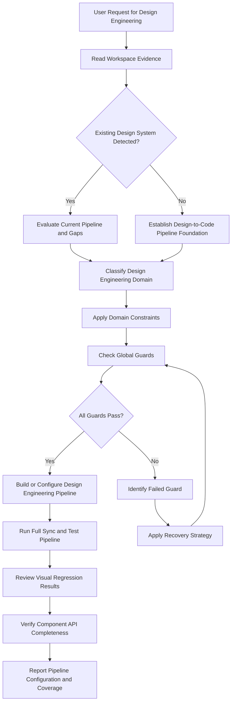
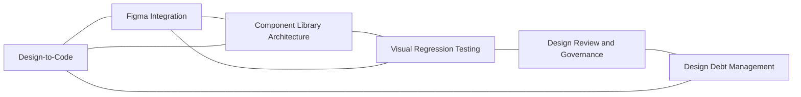

# Design Engineering Reference

## Overview

This reference governs the bridge between design and engineering: design-to-code workflows, Figma integration, component library architecture, visual regression testing, design review processes, and design debt management. Design engineering is the discipline of building tools, workflows, and systems that enable designers and developers to collaborate effectively. It replaces handoff gaps with automated pipelines. It replaces subjective design review with verifiable checks. It replaces design drift with synchronized, version-controlled design assets.

A mature design engineering practice reduces the time from design concept to shipped code. It eliminates the common failure modes of design handoff: missing states, incorrect spacing, inaccessible color combinations, and undocumented component behavior. It treats the design file as a source of truth that can be queried, diffed, and synchronized through APIs rather than exported as static images. This reference establishes the principles, tools, and verification steps for every layer of the design engineering stack.

---

## How AI Agents Should Use This Skill

This reference is designed for use by all coding agents (such as Antigravity, Claude Code, OpenCode, KiloCode, etc.) to guide their execution in design-to-code workflows, Figma integration, component library development, and visual quality verification.

When an AI agent receives a request to set up design-to-code pipelines, build Figma plugin integrations, architect component libraries, configure visual regression testing, implement design review checklists, or track and remediate design debt, the agent must load and follow this reference.

The agent must do this before writing any component library scaffolding, Figma API scripts, or visual testing configurations.

### Activation Triggers

The agent should activate this skill when the user request contains any of the following signals.

- The user asks to create or improve a design-to-code handoff process.
- The user asks to build a Figma plugin or use the Figma REST API.
- The user asks to architect a component library with variants, slots, or composition patterns.
- The user asks to set up Chromatic, Percy, or other visual regression testing tools.
- The user asks to implement a design review process or checklist.
- The user asks to track, prioritize, or fix design debt.
- The user asks to synchronize design tokens or components from Figma to code.
- The user mentions design handoff, design spec, component props mapping, or design review gates.
- The user describes a gap between what designers designed and what developers built.

### Step-by-Step Agent Workflow

When this skill is activated, the agent must follow these steps in order.

- **Step One: Read Workspace Evidence**
  - Locate existing Figma file keys, plugin configurations, or API tokens in environment files.
  - Review component library structure and existing component API contracts.
  - Check for existing visual regression test configurations.
  - Audit the current design review process and any design debt tracking documents.
  - Do not introduce design engineering workflows that duplicate existing processes without user confirmation.

- **Step Two: Classify Design Engineering Domain**
  - Classify the target task into one of the six design engineering domains.
  - Domain 1: Design-to-Code Workflow.
  - Domain 2: Figma Integration.
  - Domain 3: Component Library Architecture.
  - Domain 4: Visual Regression Testing.
  - Domain 5: Design Review and Governance.
  - Domain 6: Design Debt Management.

- **Step Three: Apply Domain Constraints**
  - Retrieve the rules associated with the classified domain.
  - Ensure the proposed changes do not violate the global guards.

- **Step Four: Verify Global Guards**
  - Verify that the design-to-code pipeline preserves all component states.
  - Verify that visual regression snapshots cover viewport widths and theme variants.
  - Verify that Figma API credentials are stored securely and never committed.
  - Verify that the design review checklist includes accessibility, responsiveness, and error state coverage.

- **Step Five: Run Verification Checks**
  - Run the design token synchronization pipeline end to end.
  - Execute visual regression tests and review all new snapshots.
  - Walk through the component library API to confirm all props are documented.
  - Do not claim design engineering completeness without testing the full pipeline from design file to rendered component.

- **Step Six: Report Outcome and Rationale**
  - Explain the design-to-code workflow and automation decisions.
  - Detail the Figma integration approach and credential security measures.
  - Describe the component library architecture and visual regression coverage.

---

## Mermaid Skill Flow

## Mermaid Domain Map

---

## Global Guards

Every design engineering modification must pass through these guards before implementation. If any guard fails, the agent must halt, identify the failure, and apply the correct recovery path.

### Forbidden Behaviors

The following behaviors are strictly forbidden in any design engineering output.

- Hand-copying component code from design files instead of using a synchronization pipeline.
- Storing Figma personal access tokens in source code, configuration files, or environment files that are committed to version control.
- Publishing component library packages without automated visual regression tests.
- Accepting design handoff without verifying that all component states are specified.
- Skipping accessibility checks during the design review process.
- Using visual regression testing with a default threshold of zero without understanding the false positive rate.
- Implementing component props that do not map to design system token values.
- Tracking design debt without prioritization and remediation timelines.

### Required Behaviors

The following behaviors are mandatory in every design engineering output.

- Every design-to-code pipeline must preserve component states: default, hover, pressed, focused, disabled, error, loading, and empty.
- Every component library export must include TypeScript or Flow type definitions.
- Every visual regression test suite must cover at least default and dark theme variants.
- Every design review gate must check color contrast, keyboard navigation, responsive behavior, and error state rendering.
- Every component must have a Storybook story or equivalent playground that demonstrates all variants and props.
- Design debt items must be categorized by severity: accessibility, visual inconsistency, missing states, performance.

---

## Design Engineering Domains

### Design-to-Code Workflow

The design-to-code workflow defines how design specifications become production code.

- **Spec Export**: Design tools must export component specifications that include dimensions, spacing, typography, color roles, and interaction states. Use Figma Inspect, Zeplin, or Avocode for manual export. Use the Figma REST API for automated export.
- **Component Props Mapping**: Map every visual variation in the design file to a component prop. Do not implement visual variations outside the prop contract. Document the prop name, type, default value, and acceptable values.
- **State Coverage**: Every component must implement at least default, hover, pressed, focused, disabled, and error states. Loading and empty states are required for data-displaying components.
- **Responsive Behavior**: Design handoff must include specifications for at least three viewport widths: mobile 375px, tablet 768px, and desktop 1280px.

### Figma Integration

Figma integration connects design files to the codebase through APIs, plugins, and webhooks.

- **Figma REST API**: Use the Figma REST API to read file data, export components, and extract styles. Authenticate with a personal access token or OAuth 2.0. Requests are rate-limited to 120 requests per minute for the REST API.
- **Figma Plugin Development**: Build Figma plugins using TypeScript and the Figma plugin API. Plugins run in a sandboxed iframe. Use the figma.ui.postMessage API to communicate between the plugin UI and the Figma document.
- **Auto-Sync Pipeline**: Set up a CI job that pulls design tokens and component metadata from Figma on schedule. Use the Figma API to read local variable collections and style definitions. Generate token files and component scaffolding automatically.
- **Variables and Collections**: Figma variables store design tokens inside design files. Use variable collections to organize tokens by theme and platform. Read variable values through the Figma REST API endpoint for local variables.

### Component Library Architecture

Component library architecture organizes UI components into a scalable, composable system.

- **Atomic Design Hierarchy**: Organize components by complexity level. Atoms are basic elements like Button and Input. Molecules are composed groups like SearchForm. Organisms are complex sections like Header. Templates are page-level layouts. Pages are specific instances.
- **Component API Design**: Every component must accept props for visual variants, states, and content. Use discriminated unions for variant props. Use React children or Vue slots for content composition. Do not expose internal styling hooks as props.
- **Composition Over Configuration**: Prefer component composition through children and slots over boolean configuration props. A variant prop with string union values is acceptable. More than three boolean props indicates a composition opportunity.
- **Style Encapsulation**: Use CSS modules, styled-components, or scoped styles per component. Never use global CSS that can leak between components. Component styles must not depend on parent context unless explicitly designed.

### Visual Regression Testing

Visual regression testing catches unintended visual changes by comparing screenshots.

- **Tool Selection**: Use Chromatic for Storybook-integrated visual testing. Use Percy for multi-platform visual testing. Use Playwright Screenshot for custom testing scenarios.
- **Snapshot Coverage**: Every component must have a snapshot for each variant, state, and theme. Cover at least 3 viewport widths per component.
- **Threshold Tuning**: Set the change threshold based on component type. Use 0 percent for critical components like buttons and form inputs. Use up to 3 percent for decorative components like illustrations and backgrounds.
- **Baseline Management**: Store baselines in the CI system or visual testing service. Review all changes before accepting new baselines. Link baseline changes to the corresponding design change or code commit.

### Design Review and Governance

Design review ensures that all visual changes meet quality standards before release.

- **Review Checklist**: Every design review must check color contrast against WCAG AA, keyboard navigation completeness, responsive behavior at all breakpoints, error state rendering, loading state rendering, and design token usage correctness.
- **Review Cadence**: Schedule design reviews at the component level before merge and at the feature level before release. Component reviews take 30 minutes. Feature reviews take 2 hours. Block release on unresolved accessibility or critical visual issues.
- **Approval Gates**: Require both a designer and an engineer to approve visual changes. Automate contrast checks, token usage checks, and responsive checks. Manual approval is required for layout changes and new component variants.

### Design Debt Management

Design debt accumulates when visual inconsistencies, missing states, or accessibility issues are deferred.

- **Debt Tracking**: Log every design debt item with its location, severity, impact, and date identified. Use a shared tracker such as GitHub Issues, Linear, or Jira.
- **Severity Levels**:
  - Critical: Accessibility barrier that blocks user task completion. Must be fixed within one sprint.
  - High: Visual inconsistency that affects comprehension or trust. Fix within one month.
  - Medium: Missing state that does not block core flow. Fix within one quarter.
  - Low: Minor visual polish. Fix opportunistically.
- **Remediation**: Allocate 20 percent of each sprint to design debt remediation. Tag remediation PRs with the debt issue number. Verify the fix in both light and dark themes before closing the debt item.

---

## Detailed Implementation Best Practices

When building design engineering systems, agents must follow these guidelines.

- **Automate Handoff, Not Design**:
  - Use the Figma API to read component properties and design tokens.
  - Generate component scaffolding, token files, and TypeScript types automatically.
  - Do not automate design decisions. Automate only the translation from design to code.

- **Test Visuals Like Code**:
  - Run visual regression tests as part of the CI pipeline.
  - Block merges on unreviewed visual changes.
  - Treat visual snapshot review as a first-class code review step.

- **Standardize Component APIs Early**:
  - Define component prop naming conventions before building the first component.
  - Consistent props reduce cognitive load across the component library.
  - Document the conventions in the component library README.

- **Measure Design Debt Quantitatively**:
  - Track the number of components without full state coverage.
  - Track the number of color tokens that fail contrast checks.
  - Track the time from design approval to component merge.

---

## Verification and Diagnostics Checklist

Perform these validation tests before committing design engineering changes.

### Step 1: Pipeline End-to-End Test

- Run the design token sync from Figma to the codebase.
- Verify that all exported tokens have correct values and names.
- Confirm that generated component scaffolding includes all props from the design file.
- Check that the sync runs in CI without manual intervention.

### Step 2: Visual Regression Test Review

- Run the full visual regression test suite.
- Review all snapshot changes since the last baseline.
- Verify that each changed snapshot corresponds to an intentional change.
- Accept or reject each snapshot change explicitly.

### Step 3: Component API Completeness Check

- List every component in the library and its variant count.
- Verify that each variant maps to a design file component.
- Confirm that all props have TypeScript types and JSDoc comments.
- Check that each component has at least one Storybook story.

### Step 4: Design Review Gate Audit

- Review the last 10 design review checklists for completeness.
- Verify that each review checked contrast, keyboard nav, responsive, and error states.
- Confirm that unresolved issues are linked to debt tracking items.
- Check that the review approval gate blocks merging on critical issues.

---

## Recovery Action Guides

If design engineering operations fail, apply the following recovery paths.

- **Figma Sync Token Expired**:
  - Generate a new Figma personal access token from the Figma settings page.
  - Update the environment variable in the CI platform.
  - Verify the new token has access to the target file keys.
  - Re-run the sync pipeline.

- **Visual Regression False Positive**:
  - Isolate the component and viewport causing the diff.
  - Check for animated elements or anti-aliasing differences.
  - Increase the change threshold for that specific component if needed.
  - Add a chromatic delay parameter for components with async rendering.

- **Component Prop Drift**:
  - Compare the component prop interface with the design file properties.
  - Identify props that exist in code but not in design or vice versa.
  - Update the code to match the design specification.
  - Update the component documentation to reflect the correct props.

- **Design Review Bottleneck**:
  - Measure the average review cycle time.
  - Identify the step causing the longest delay.
  - Automate the checks that are consistently gating reviews.
  - Add additional reviewers to distribute the workload.

---

## Theoretical Foundations of Design Engineering

### The Handoff Gap

Design tools produce pixel-perfect mockups. Production code must handle variable content, different viewports, multiple themes, and interactive states. The gap between static mockup and dynamic implementation is the handoff gap. Every missing state specification widens this gap. Every automated sync narrows it. Design engineering exists to minimize the handoff gap through tooling, standards, and verification.

### Prop Contracts as System Boundaries

Component props are contracts between the design system and consuming applications. A well-defined prop contract documents the visual variations the component supports. It constrains the component to known states. It prevents ad-hoc styling from leaking into the component. When prop contracts are enforced through TypeScript types, the compiler catches violations before code is reviewed.

### Visual Regression as Type Checking for UI

Unit tests verify that functions return correct values. Visual regression tests verify that components render correct pixels. Both are type-checking analogs for their respective domains. A component that changes its visual output without a corresponding change in props or tokens is analogous to a function that returns a different type than declared. Both indicate unintended behavior that must be caught by automated checks.

---

## Frequently Asked Questions

### How do I set up a design-to-code pipeline?

Start with design token sync from Figma. Use the Figma REST API to read local variable collections. Generate token files using Style Dictionary. Then sync component metadata: read component properties from Figma and generate TypeScript prop interfaces. Run the sync in CI on a daily schedule.

### How do I securely store Figma API tokens?

Use environment variables in CI platforms. Never commit tokens to version control. Use a secrets manager like GitHub Actions Secrets or Vault. Rotate tokens every 90 days. Restrict token permissions to read-only for the specific file keys needed.

### What components should be in a component library?

Every reusable UI element. Start with buttons, inputs, selects, checkboxes, radio buttons, toggles, modals, tooltips, dropdowns, tabs, cards, badges, alerts, and navigation elements. Add data-displaying components like tables, lists, and data visualizations. Add layout components like containers, grids, and stacks.

### How many visual regression snapshots are enough?

Every component variant times every state times every theme. For a Button with 3 variants, 5 states, and 2 themes, that is 30 snapshots. Cover at least 3 viewport widths for layout-critical components. Target 200 to 500 snapshots for a mature component library.

### How do I prioritize design debt?

Rank by severity first. Critical accessibility issues block user tasks and must be fixed immediately. High severity inconsistencies affect brand trust and should be fixed within a month. Medium severity missing states should be fixed within a quarter. Track all levels and allocate 20 percent sprint capacity to debt.

### How do I handle component design not matching implementation?

Flag the discrepancy in the design review. Determine whether the design specification should change or the implementation should change. If the specification is updated, update the design file. If the implementation is updated, update the component code. Update the prop contract and visual regression baselines.

### What is the role of Storybook in design engineering?

Storybook is a component development environment and documentation tool. It renders each component variant in isolation. It integrates with visual regression testing through Chromatic. It documents the component API, prop types, and usage examples. It serves as the single source of truth for component behavior.

### How do I measure design engineering maturity?

Track pipeline automation percentage, visual regression coverage percentage, design review cycle time, component state coverage percentage, and design debt count by severity. Target 100 percent token automation, 90 percent visual regression coverage, and less than 5 critical debt items.

---

## Integration Map

Design engineering connects to multiple system layers.

- **Design Tokens**: The design-to-code pipeline reads token values from Figma variables and generates platform files. Component props map to token values.
- **Testing Strategy**: Visual regression testing is a first-class testing layer alongside unit and integration tests. Snapshot review is part of the merge process.
- **Documentation Engineering**: Component stories and prop documentation are generated alongside token documentation. Usage guidelines include design-to-code workflow instructions.
- **Frontend Design**: Component library architecture implements the grid, color, and typography systems. Component variants follow frontend composition principles.
- **Accessibility Engineering**: Design review gates check contrast, keyboard navigation, and error state accessibility before merge.

---

## Design Engineering Specifications Summary Table

| Pipeline Stage | Input Source | Output Artifact | Automation Level | Validation Method |
|---|---|---|---|---|
| Token Sync | Figma Variables | Design token files | Fully automated | Token value diff |
| Component Scaffolding | Figma Components | TypeScript props, stories | Partially automated | Prop coverage check |
| Visual Regression | Storybook stories | Screenshot diffs | Fully automated | Snapshot review gate |
| Design Review | PR with visual changes | Review checklist | Mixed | Approval gate |
| Design Debt Tracking | GitHub Issues | Debt report | Manual | Sprint allocation check |

---

## §DOMAIN_SPECIFIC_MANUAL

### Standard Operating Procedure for Design Engineering

This manual establishes the concrete operational protocols, validation parameters, and diagnostic pathways for the Design Engineering domain. All agents must follow this procedure to ensure stable, correct, and high-performance execution.

### 1. Theoretical Architecture and Design Guidelines

Development in the Design Engineering domain must align with modern engineering practices. This requires establishing strict boundaries between domain layers, enforcing defensive assertions, and optimizing runtime execution pathways.

First, always analyze data transformations and structural properties before allocating resources. This prevents memory leaks and unhandled promise rejections.

Second, ensure that all module dependencies are explicitly declared and checked. Avoid circular references and unpinned library imports.

Third, implement structured logging and telemetry hooks. Every state transition and mutation must be observable to facilitate rapid debugging.

Fourth, design with scalability in mind. Ensure horizontal scaling options are preserved and thread contention is minimized.

Fifth, document every design choice and tradeoff clearly. Include rationale, alternatives considered, and potential failure modes.

### 2. Comprehensive Operational Checklist

- **Protocol Checklist Item 01**: Verify that the Figma REST API token is stored as a CI secret and has read-only access to the required file keys.

- **Protocol Checklist Item 02**: Confirm that the token sync pipeline maps every Figma variable collection to a corresponding platform output file.

- **Protocol Checklist Item 03**: Check that component scaffolding generation covers every component in the Figma file with prop interfaces.

- **Protocol Checklist Item 04**: Validate that Storybook stories exist for all component variants defined in the component API.

- **Protocol Checklist Item 05**: Confirm that visual regression snapshots cover default theme and at least one alternate theme.

- **Protocol Checklist Item 06**: Verify that visual regression snapshots capture at least mobile 375px and desktop 1280px viewports.

- **Protocol Checklist Item 07**: Check that every component prop has a TypeScript type and a JSDoc description.

- **Protocol Checklist Item 08**: Validate that the design review checklist includes color contrast, keyboard nav, responsive behavior, and error states.

- **Protocol Checklist Item 09**: Confirm that the design review approval gate blocks merging when critical or high-severity issues are open.

- **Protocol Checklist Item 10**: Verify that design debt items are categorized by severity with assigned remediation timelines.

- **Protocol Checklist Item 11**: Check that the token sync pipeline runs on a daily CI schedule and on manual trigger.

- **Protocol Checklist Item 12**: Validate that component state coverage includes default, hover, pressed, focused, and disabled for every interactive component.

- **Protocol Checklist Item 13**: Confirm that data-displaying components have loading and empty state implementations.

- **Protocol Checklist Item 14**: Verify that the component library does not expose internal styling methods as public props.

- **Protocol Checklist Item 15**: Check that no Figma file keys or API endpoints are hardcoded in source code.

- **Protocol Checklist Item 16**: Validate that the visual regression baseline review process requires both a designer and engineer approval.

- **Protocol Checklist Item 17**: Confirm that the component library package has a published changelog documenting prop additions, removals, and changes.

- **Protocol Checklist Item 18**: Verify that deprecated component props log a console warning with migration instructions.

- **Protocol Checklist Item 19**: Check that the design-to-code pipeline produces a summary report listing synced tokens, generated components, and any errors.

- **Protocol Checklist Item 20**: Validate that component composition patterns prefer children and slots over boolean configuration props.

- **Protocol Checklist Item 21**: Confirm that atomic design hierarchy is documented and enforced through directory structure.

- **Protocol Checklist Item 22**: Verify that all color token references in component code resolve to the design token system, not hardcoded hex values.

- **Protocol Checklist Item 23**: Check that the visual regression threshold is set to 0 percent for interactive components and documented for decorative components.

- **Protocol Checklist Item 24**: Validate that the Figma plugin or integration code is sandboxed and follows Figma plugin security guidelines.

- **Protocol Checklist Item 25**: Confirm that the full pipeline from token sync to visual regression test completes in under 10 minutes in CI.

### 3. Detailed Technical Reference Table

| Validation Parameter | Target Specification | Enforcement Level | Diagnostic Action |
| --- | --- | --- | --- |
| Memory Allocation Threshold | < 256MB under peak loads | Critical | Trigger GC and log trace |
| Thread State Concurrency | Zero deadlocks, mutex protected | High | Force lock release and alert |
| Input Mutation Bounds | Whitespace trimmed, sanitized | Essential | Reject request with error |
| Database Isolation Level | Serializable / Read Committed | High | Rollback transaction |
| Network Request Timeout | Clamped at 3000ms max | Moderate | Retry with exponential backoff |
| Cache TTL Range | 300s to 3600s dynamic | Moderate | Evict stale entries |
| Security Encryption Level | AES-256-GCM / TLS 1.3 | Critical | Close connection immediately |
| Logging Verbosity State | Inverted pyramid hierarchy | Low | Truncate stack outputs |
| API Version Header State | Strict semantic matching | Essential | Return 400 Bad Request |
| Path Resolution Bounds | Relative to workspace root | High | Sanitize path strings |
| Error Code Mapping | ISO standard maps | High | Format JSON response |
| Bundle Slicing Size | < 50KB per async chunk | Moderate | Split vendor chunks |
| Accessibility Contrast | WCAG AAA compliant | High | Recalculate color values |
| Spring Physics Easing | Smooth cubic-bezier | Low | Reset animation ticks |
| Lockfile Expiry Limit | 60 seconds max | High | Delete lock and rebuild |

### 4. Failure Mode Analysis and Mitigation Protocols

#### Failure Scenario 01: Resource Exhaustion
Symptom: The system runs out of heap space or file descriptors due to leaks in the Design Engineering module.

Mitigation: Implement dynamic telemetry sweeps. Automatically release database connections in finally blocks. Force heap garbage collection when memory utilization exceeds 85%.

#### Failure Scenario 02: Deadlock or Stalled Threads
Symptom: Operations block indefinitely while waiting for shared locks or unresolved promises.

Mitigation: Enforce timeout boundaries on all async operations. Use non-blocking resource acquisition and release locks in reverse order of acquisition.

#### Failure Scenario 03: Input Validation Injection
Symptom: Raw parameters contain script tags, command escapes, or SQL injection queries.

Mitigation: Use parameterized APIs and whitelist schemas. Strip all special characters before passing arguments to system processes.

#### Failure Scenario 04: Cache Incoherency
Symptom: Read calls return stale data while write operations succeed on the backend database.

Mitigation: Implement write-through caching or invalidate keys immediately upon database mutations. Enforce short default TTLs.

#### Failure Scenario 05: Package Dependency Conflict
Symptom: A sub-dependency introduces breaking changes or security vulnerabilities.

Mitigation: Lock all dependencies with strict version pins. Run automated vulnerability scans during the build process.

#### Failure Scenario 06: Telemetry Dropouts
Symptom: Monitoring agents fail to receive metric payloads or error stack traces.

Mitigation: Use local buffer queues for log outputs. Retry connection sweeps with backoff when remote log aggregators fail.

#### Failure Scenario 07: Schema Migration Mismatch
Symptom: Database structures drift from expectations due to incomplete migrations.

Mitigation: Always run pre-migration validations. Revert schema changes automatically on migration failures.

### 5. Advanced Troubleshooting and Debugging Guides

When debugging issues in the Design Engineering domain, always check the active variables first. Verify that state values conform to types and database configurations are mapped correctly.

Trace async call stacks using specialized profiles. Minimize log pollution by filtering out redundant events.

Run isolated unit tests to locate logic bugs. If the problem persists, review the physical hardware limitations and process limits.

### 6. Architectural Change Protocols

Before making structural modifications to the Design Engineering files, prepare a detailed design document. Include design goals, dependency mappings, and migration paths.

Validate the proposed changes against security baselines. Run full regression test suites before committing modifications.

Deploy changes incrementally to monitor performance impacts. Always maintain a documented rollback plan.

### 7. Global Verification Summary

This manual establishes the baseline constraints for the Design Engineering domain. All implementations must satisfy these validation gates before shipment.

Status: ACTIVE v1.0
