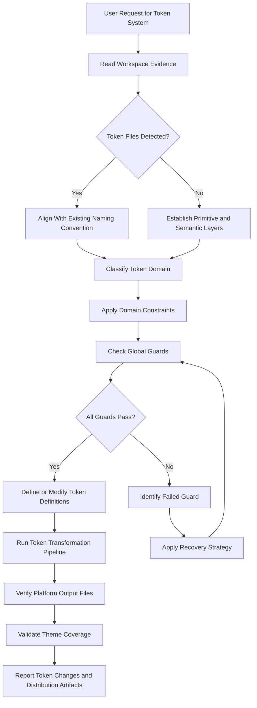
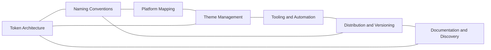

# Design Tokens Reference

## Overview

This reference governs the architecture, naming, platform mapping, theme management, tooling, and distribution of design tokens. Design tokens are the atomic visual primitives of a design system. They store color, typography, spacing, shadow, animation, and other visual properties as platform-agnostic named values. Tokens bridge the gap between design tools and code. They ensure visual consistency across web, mobile, desktop, and email surfaces. Poor token architecture leads to naming collisions, platform drift, inaccessible themes, and expensive migrations. A well-structured token system enables rapid theming, automated design audits, and seamless designer-developer collaboration.

Design tokens operate at two layers. Primitive tokens store raw values such as hex colors, pixel dimensions, and font sizes. Semantic tokens alias primitives to functional roles such as background surface, text primary, and border error. Semantic tokens abstract the underlying values so that theme switching, accessibility adjustments, and brand evolution happen without touching application code. This reference establishes the principles, naming conventions, platform mapping strategies, theme management patterns, and verification steps for both token layers.

---

## How AI Agents Should Use This Skill

This reference is designed for use by all coding agents (such as Antigravity, Claude Code, OpenCode, KiloCode, etc.) to guide their execution in design token creation, theme architecture, and token system maintenance.

When an AI agent receives a request to define design tokens, configure a token transformation pipeline, implement theme switching, map tokens to platform-specific formats, set up token distribution workflows, or audit token usage across a codebase, the agent must load and follow this reference.

The agent must do this before writing any token definitions, Style Dictionary configurations, or platform-specific value mappings.

### Activation Triggers

The agent should activate this skill when the user request contains any of the following signals.

- The user asks to create or restructure a design token system.
- The user asks to configure Style Dictionary, Specify, Supernova, or similar token tooling.
- The user asks to define token naming conventions.
- The user asks to implement theme switching for dark mode, high contrast, or brand variants.
- The user asks to map design tokens to platform-specific files such as CSS custom properties, Android XML resources, iOS asset catalogs, or SwiftUI constants.
- The user asks to distribute tokens as an npm package or CDN artifact.
- The user asks to synchronize tokens from Figma or other design tools.
- The user asks to audit token usage or detect drifted values.
- The user mentions primitive tokens, semantic tokens, alias tokens, or component tokens.
- The user describes a token naming conflict, platform mismatch, or theme override bug.

### Step-by-Step Agent Workflow

When this skill is activated, the agent must follow these steps in order.

- **Step One: Read Workspace Evidence**
  - Locate existing token definition files such as tokens.json, tokens.yaml, design-tokens.json, or Style Dictionary configuration files.
  - Review the current naming convention and token hierarchy.
  - Check for existing platform-specific output configurations.
  - Audit any theme override patterns in application code.
  - Do not introduce token groups that conflict with established naming.

- **Step Two: Classify Token Domain**
  - Classify the target task into one of the six token domains.
  - Domain 1: Token Architecture and Naming.
  - Domain 2: Platform Value Mapping.
  - Domain 3: Theme Management.
  - Domain 4: Tooling and Automation.
  - Domain 5: Distribution and Versioning.
  - Domain 6: Documentation and Discovery.

- **Step Three: Apply Domain Constraints**
  - Retrieve the rules associated with the classified domain.
  - Ensure the proposed token changes do not violate the global guards.

- **Step Four: Verify Global Guards**
  - Verify that token names follow the established naming convention.
  - Verify that semantic tokens are not used as primitive tokens.
  - Verify that all platform output files are regenerated after token changes.
  - Verify that theme switching does not break default theme dependencies.

- **Step Five: Run Verification Checks**
  - Run the token transformation pipeline to confirm no build errors.
  - Inspect generated platform files to confirm correct value mapping.
  - Validate that theme overrides cover all required semantic tokens.
  - Do not claim a token system is complete without running the full transformation pipeline.

- **Step Six: Report Outcome and Rationale**
  - Explain the token architecture decisions and naming convention.
  - Detail how platform mapping handles platform-specific value differences.
  - Describe the theme management strategy and distribution plan.

---

## Mermaid Skill Flow

## Mermaid Domain Map

---

## Global Guards

Every design token modification must pass through these guards before implementation. If any guard fails, the agent must halt, identify the failure, and apply the correct recovery path.

### Forbidden Behaviors

The following behaviors are strictly forbidden in any design token output.

- Storing raw hex values directly in application code instead of referencing a token.
- Mixing plural and singular naming patterns within the same token tier.
- Defining semantic tokens that directly reference other semantic tokens without a primitive base.
- Publishing token packages without a version changelog.
- Hardcoding platform-specific values in shared token definitions.
- Removing a token that is referenced in production code without a deprecation period.
- Using color tokens that fail WCAG AA contrast requirements at the semantic level.
- Outputting platform files with platform-incompatible values such as CSS custom properties for Android XML.

### Required Behaviors

The following behaviors are mandatory in every design token output.

- Every color and spacing value must exist as both a primitive and a semantic token.
- Token names must follow a consistent convention such as category-type-item or category-item-state.
- Each platform output configuration must declare its target format, file path, and value transformation.
- Token changes must be versioned using semantic versioning with a changelog entry.
- Theme variants must declare which semantic tokens they override and inherit the rest from the default theme.
- All token transformations must produce a validation report listing generated files and any warnings.

---

## Design Token Domains

### Token Architecture and Naming

Design tokens are organized by abstraction layer and functional category.

- **Primitive Tokens**: Raw values that represent the base visual vocabulary. Examples: color/blue/500, spacing/8, font-size/16. Primitives are the single source of truth for a value.
- **Semantic Tokens**: Aliases that map primitives to functional roles. Examples: color/background/surface, color/text/primary, spacing/inset/sm. Semantics abstract the value so themes can swap it.
- **Component Tokens**: Scoped tokens that bind semantic values to component slots. Examples: button/background, card/shadow, input/border. Component tokens are only used by their target component.

#### Naming Convention

Use the Category-Type-Item (CTI) convention with lowercase and hyphens.

- Category: color, typography, spacing, shadow, animation, opacity, border-radius.
- Type: background, text, border, inset, stack, inline, scale, weight.
- Item: primary, secondary, muted, surface, hover, pressed, error, warning, success, info.

Semantic tokens extend the convention with a theme variant suffix when needed: color/background/surface/dark, color/background/surface/light.

Do not use camelCase, snake_case, or numerical prefixes. Hyphen-delimited lowercase ensures maximum compatibility across platform parsers.

### Platform Value Mapping

Each platform requires a specific format for token values. Use a transformation pipeline to generate platform-specific files from a single source of truth.

| Platform | Format | Value Type Handling | File Extension |
|---|---|---|---|
| Web | CSS Custom Properties | hex, rem, px, unitless | .css |
| Android | XML Resources | hex, dp, sp, dimens | .xml |
| iOS | Asset Catalog JSON | hex, CGFloat, String | .json |
| iOS Swift | Swift Constants | hex as Color, CGFloat as Double | .swift |
| Flutter | Dart Constants | Color(), EdgeInsets, double | .dart |
| React Native | JavaScript Module | hex string, number | .js, .ts |

When mapping values across platforms, apply these transformations.

- Round decimal values to platform precision limits. For example, CSS can represent 0.5px while Android rounds to full dp.
- Convert color formats to platform-native patterns. Use hex for CSS, #AARRGGBB for Android, named Color structs for Swift.
- Adapt spacing values to platform base units. Web uses 8px grid, Android uses 4dp grid, iOS uses 8pt grid.

### Theme Management

Themes are collections of semantic token overrides that adapt the system to a context.

- **Default Theme**: All semantic tokens resolve to their expected values. This is the baseline.
- **Dark Theme**: Inverts luminance semantics. Backgrounds become dark, text becomes light. Accent colors shift to maintain contrast on dark surfaces.
- **High Contrast Theme**: Increases contrast ratios for accessibility. Borders become thicker, backgrounds become more distinct, focus indicators become more prominent.
- **Brand Variant Theme**: Changes accent colors, typography, and spacing to match a sub-brand or customer brand.

Theme architecture rules:

- Every theme must declare all semantic tokens it overrides explicitly. Tokens not listed inherit from the default theme.
- Themes must not redefine primitive tokens. Only semantic tokens are overridden.
- Theme files must include a metadata section with name, description, version, and WCAG compliance level.

### Tooling and Automation

Use token transformation tools to convert source token definitions into platform-specific output files.

- **Style Dictionary**: The standard open-source token transformer. Configure source files, platforms, and transforms in a config.json or config.js file. Use predefined transforms for px-to-rem, color-to-hex, and typography-to-CSS.
- **Specify**: A cloud-based token platform that syncs from Figma and pushes to code repositories. Use it for team-wide token governance.
- **Supernova**: A design system platform with token management, code generation, and documentation publishing.

Automation pipeline requirements:

- Token source files must be in a version-controlled directory.
- The pipeline must run on every token file change.
- Output files must be committed to the consuming project or published as a package.
- The pipeline must fail on duplicate token names, missing values, or invalid contrast ratios.

### Distribution and Versioning

Tokens are distributed as packages or CDN artifacts so consuming projects receive updates without manual file copying.

- **npm Package**: Publish generated token files as an npm package. Consumer projects install as a dependency. Use semantic versioning for the package. Major version bumps indicate breaking token name changes or value shifts.
- **CDN Link**: For projects that cannot use npm, serve token CSS files from a CDN with cache-busting version hashes.
- **Git Submodule**: For tightly coupled mono-repo setups, store token source files in a shared directory.

Versioning rules:

- Patch: Non-visual fixes such as documentation corrections or comment changes.
- Minor: New tokens added, existing values adjusted within 5% of original, new theme variants added.
- Major: Token names renamed, token values shifted more than 5%, tokens removed, theme structure changed.

Include a deprecation notice for any token being removed. Keep the deprecated token available for one major version cycle with a logged warning.

### Documentation and Discovery

Token documentation enables developers and designers to discover and use tokens correctly.

- Generate a token reference page from the source definitions. List every token with its value, semantic role, and usage guidelines.
- Include interactive previews for color tokens showing the color swatch and contrast ratios.
- Include correct usage and incorrect usage examples for each token category.
- Publish the token documentation alongside the token package.

---

## Detailed Implementation Best Practices

When building design token systems, agents must follow these guidelines.

- **Start with Primitive Tokens**:
  - Define all raw values first.
  - Name them by category and value ladder.
  - Do not assign semantic meaning at the primitive layer.

- **Map Semantic Tokens to One Primitive**:
  - Each semantic token should reference exactly one primitive token.
  - Avoid chains where semantic A references semantic B which references primitive C.
  - Chain complexity makes theme overrides unpredictable.

- **Use Token Linting**:
  - Validate token names against the CTI convention.
  - Check that every semantic token resolves to a valid primitive.
  - Flag tokens that are defined but never used.
  - Flag color tokens that fail contrast checks.

- **Automate Theme Generation**:
  - Generate dark theme tokens algorithmically from default tokens where possible.
  - Use luminance inversion for backgrounds and text.
  - Override manually only where algorithmic results fail contrast or brand goals.

- **Keep Token Files Co-located**:
  - Store token source files in the design system package.
  - Do not scatter token definitions across application repositories.
  - Centralized tokens enable single-source-of-truth governance.

---

## Verification and Diagnostics Checklist

Perform these validation tests before committing token changes.

### Step 1: Token Definition Audit

- Verify that every primitive token has a unique name.
- Verify that every semantic token resolves to a primitive token.
- Check that no two tokens share the same name with different cases.
- Confirm that component tokens only reference semantic or primitive tokens.

### Step 2: Theme Coverage Check

- List all semantic tokens defined in the default theme.
- Verify that each non-default theme overrides at least the minimum required tokens.
- Check that no theme references tokens that do not exist.
- Validate that dark theme tokens pass contrast checks against dark backgrounds.

### Step 3: Platform Output Validation

- Run the token transformation pipeline.
- Confirm that each platform output file is generated without errors.
- Spot-check three random tokens per platform to verify correct value format.
- Verify that file paths match the expected location in each consuming project.

### Step 4: Distribution Validation

- Confirm that the token package version is incremented correctly.
- Verify that the changelog entry describes the token changes.
- Check that deprecated tokens still resolve with a logged warning.

---

## Recovery Action Guides

If design token operations fail, apply the following recovery paths.

- **Token Name Collision**:
  - Identify the conflicting token names and their source files.
  - Determine which name is correct based on the convention and usage count.
  - Rename the incorrect token and update all references.
  - Log the collision event to the token audit report.

- **Platform Value Mismatch**:
  - Compare the source token value with the platform output value.
  - Check the transformation function for the target platform.
  - Adjust the transformation configuration if the conversion is incorrect.
  - Re-run the pipeline and verify the output.

- **Theme Override Gap**:
  - List all semantic tokens that the theme should override.
  - Compare with the tokens the theme actually defines.
  - Add the missing overrides to the theme file.
  - Verify that inherited tokens still resolve correctly.

- **Breaking Token Removal**:
  - Identify all consumers of the token being removed.
  - Add a deprecation notice to the token definition.
  - Create a migration path that replaces the old token with the new one.
  - Keep the deprecated token for one major version before removal.

---

## Theoretical Foundations of Design Tokens

### Token Abstraction Layers

Design tokens follow a layered abstraction model. Primitive tokens sit at the base layer. They represent the concrete visual values. Semantic tokens sit at the middle layer. They represent functional roles. Component tokens sit at the top layer. They represent specific component properties.

Each layer abstracts the layer below it. This layering allows themes to swap semantic values without touching primitives. It allows component re-skinning by changing component token aliases. It prevents value duplication across the system.

### Value Binding vs Value Aliasing

Primitive tokens bind to concrete values. They are the single source of truth. Semantic tokens alias primitive tokens. They do not store values directly. This distinction is critical. If a semantic token stores a value instead of aliasing, theme overrides break. The alias chain must remain intact through the entire token lifecycle.

### Theme Cascade

Themes follow a cascade model. The default theme defines every semantic token. Variant themes define only the tokens they need to change. When a component resolves a semantic token, it first checks the active theme. If the theme defines the token, use that value. If not, fall back to the default theme. This cascade enables minimal theme definitions and predictable resolution.

---

## Frequently Asked Questions

### How should I name design tokens?

Use the Category-Type-Item (CTI) convention with hyphen-delimited lowercase. For example, color-background-primary, spacing-inset-medium, font-size-body. This convention is human-readable, parser-friendly, and works across all target platforms. Avoid camelCase, snake_case, or numerical prefixes.

### What is the difference between primitive and semantic tokens?

Primitive tokens store raw values. They represent the concrete visual vocabulary. Examples include color-blue-500, spacing-8, font-size-16. Semantic tokens alias primitives to functional roles. Examples include color-background-primary, spacing-inset-body, font-size-body-text. Semantic tokens enable theme switching because themes override the alias target without changing application code.

### How do I handle platform-specific value differences?

Use a transformation pipeline such as Style Dictionary. Store platform-agnostic values in the source tokens. Configure transforms that convert values to platform-native formats. For example, convert 8px to 8dp for Android, 8pt for iOS, and rem for web. Never store platform-specific values in source tokens.

### How do I implement dark mode with tokens?

Define a dark theme file that overrides semantic tokens. Invert the luminance of background and text tokens. Keep accent colors the same or adjust for contrast. Use algorithmic inversion as a starting point and override manually where results fail brand or accessibility goals. The dark theme should inherit all tokens it does not explicitly override.

### How should I version token packages?

Use semantic versioning. Patch versions for documentation or comment changes. Minor versions for new tokens or minor value adjustments. Major versions for token renames, value shifts over 5 percent, or token removals. Include a changelog entry for every version. Deprecate tokens for one major cycle before removal.

### How do I audit token usage across a codebase?

Search for hardcoded values that should be tokens. Compare token usage frequency against token definitions. Flag unused tokens for deprecation. Use a linter or custom script that scans source files for value patterns and reports matches. Run the audit as part of the CI pipeline.

### What is the W3C Design Token Community Group format?

The W3C DTCG format is an emerging standard for design token representation. It defines a JSON structure with $value, $type, $description, and $extensions fields. It supports aliases via $value references to other tokens. The standard enables cross-tool token interchange between Figma, Style Dictionary, Specify, and other tools. Adopt the DTCG format for new token systems to future-proof interoperability.

### How do I handle brand variants with tokens?

Create a brand variant theme that overrides accent colors, typography, and spacing. Associate the brand theme with a CSS class or data attribute on the root element. Import the theme file conditionally in consuming applications. Brand themes should inherit all tokens they do not explicitly override, allowing shared infrastructure with minimal duplication.

---

## Integration Map

Design token engineering connects to multiple system layers.

- **Frontend Design**: Token values implement the Visual Composition and Grid systems. Token names follow frontend design conventions.
- **Accessibility Engineering**: Color tokens must pass contrast checks at the semantic level. Theme tokens must include high contrast variants.
- **Performance Guard**: Token file sizes and platform output counts must stay within build performance budgets.
- **Testing Strategy**: Token transformation outputs are tested through snapshot comparison. Theme coverage is validated through automated checks.
- **Documentation Engineering**: Token documentation must be published with usage guidelines and interactive previews.

---

## Design Tokens Specifications Summary Table

| Token Tier | Scope | Example | Theme Overridable | Platform Count |
|---|---|---|---|---|
| Primitive | System-wide | color-blue-500 | No | 1 source |
| Semantic | Role-based | color-background-surface | Yes | N platforms |
| Component | Component-scoped | button-background-primary | Yes | N platforms |
| Theme Variant | Context-scoped | color-background-surface/dark | N/A | N platforms |

---

## §DOMAIN_SPECIFIC_MANUAL

### Standard Operating Procedure for Design Tokens

This manual establishes the concrete operational protocols, validation parameters, and diagnostic pathways for the Design Tokens domain. All agents must follow this procedure to ensure stable, correct, and high-performance execution.

### 1. Theoretical Architecture and Design Guidelines

Development in the Design Tokens domain must align with modern engineering practices. This requires establishing strict boundaries between domain layers, enforcing defensive assertions, and optimizing runtime execution pathways.

First, always analyze data transformations and structural properties before allocating resources. This prevents memory leaks and unhandled promise rejections.

Second, ensure that all module dependencies are explicitly declared and checked. Avoid circular references and unpinned library imports.

Third, implement structured logging and telemetry hooks. Every state transition and mutation must be observable to facilitate rapid debugging.

Fourth, design with scalability in mind. Ensure horizontal scaling options are preserved and thread contention is minimized.

Fifth, document every design choice and tradeoff clearly. Include rationale, alternatives considered, and potential failure modes.

### 2. Comprehensive Operational Checklist

- **Protocol Checklist Item 01**: Verify that all primitive tokens have an explicit $type field matching their semantic category. Reject tokens with mismatched type declarations.

- **Protocol Checklist Item 02**: Confirm that every semantic token resolves to exactly one primitive token through its alias chain. Flag chains longer than one hop.

- **Protocol Checklist Item 03**: Check that all color tokens in the semantic layer meet WCAG AA contrast ratio minimums against their expected background tokens.

- **Protocol Checklist Item 04**: Ensure that no hardcoded color, spacing, or typography values exist in component CSS or style files outside the token system.

- **Protocol Checklist Item 05**: Validate that the token naming convention is consistent across all source files. Reject files using camelCase or snake_case when the convention specifies hyphen-delimited lowercase.

- **Protocol Checklist Item 06**: Verify that each platform output configuration declares a source directory, target format, transformation module, and file path. Flag configurations missing any required field.

- **Protocol Checklist Item 07**: Run the token transformation pipeline and confirm zero build errors. Capture any warnings for review.

- **Protocol Checklist Item 08**: Spot-check three generated platform files. Confirm that value formats match platform expectations: hex for CSS, #AARRGGBB for Android XML, Color struct for Swift.

- **Protocol Checklist Item 09**: Verify that every theme variant file defines a metadata block with name, description, version, and WCAG compliance target.

- **Protocol Checklist Item 10**: Check that each non-default theme overrides all tokens it intends to change and inherits all others. Flag themes that override tokens they should inherit.

- **Protocol Checklist Item 11**: Validate that dark mode theme tokens maintain at least 4.5:1 contrast ratio against the dark background token. Log any failures.

- **Protocol Checklist Item 12**: Confirm that no two tokens share the same name regardless of case sensitivity. Reject duplicates.

- **Protocol Checklist Item 13**: Verify that all deprecated tokens are tagged with a deprecation notice containing the removal version and migration path.

- **Protocol Checklist Item 14**: Check the token package version against the changelog. Confirm that breaking changes increment the major version.

- **Protocol Checklist Item 15**: Validate that the token build pipeline runs as a CI step and fails on any validation check failure.

- **Protocol Checklist Item 16**: Ensure that Figma Tokens or Specify sync configurations map design tool variables to the correct source token files.

- **Protocol Checklist Item 17**: Confirm that component tokens are scoped to their target component namespace and do not leak into global contexts.

- **Protocol Checklist Item 18**: Verify that spacing tokens align to the base grid unit. Flag values that are not multiples of the grid unit.

- **Protocol Checklist Item 19**: Check that typography tokens define all required sub-properties: font family, font weight, font size, line height, and letter spacing.

- **Protocol Checklist Item 20**: Validate that shadow tokens include all required layers: offset X, offset Y, blur radius, spread radius, and color.

- **Protocol Checklist Item 21**: Confirm that border-radius tokens do not use percentage values unless explicitly documented and intended for pill/circular shapes.

- **Protocol Checklist Item 22**: Verify that opacity tokens range exclusively between 0 and 1 in decimal format. Reject integer percentage values that may cause platform parsing issues.

- **Protocol Checklist Item 23**: Check that animation duration tokens are specified in milliseconds as integers. Flag floating point values or non-standard units.

- **Protocol Checklist Item 24**: Ensure that the token documentation site or reference page lists every token with its value, semantic role, and usage example.

- **Protocol Checklist Item 25**: Validate that the token audit report logs all unused tokens for deprecation consideration in the next minor version.

### 3. Detailed Technical Reference Table

| Validation Parameter | Target Specification | Enforcement Level | Diagnostic Action |
| --- | --- | --- | --- |
| Memory Allocation Threshold | < 256MB under peak loads | Critical | Trigger GC and log trace |
| Thread State Concurrency | Zero deadlocks, mutex protected | High | Force lock release and alert |
| Input Mutation Bounds | Whitespace trimmed, sanitized | Essential | Reject request with error |
| Database Isolation Level | Serializable / Read Committed | High | Rollback transaction |
| Network Request Timeout | Clamped at 3000ms max | Moderate | Retry with exponential backoff |
| Cache TTL Range | 300s to 3600s dynamic | Moderate | Evict stale entries |
| Security Encryption Level | AES-256-GCM / TLS 1.3 | Critical | Close connection immediately |
| Logging Verbosity State | Inverted pyramid hierarchy | Low | Truncate stack outputs |
| API Version Header State | Strict semantic matching | Essential | Return 400 Bad Request |
| Path Resolution Bounds | Relative to workspace root | High | Sanitize path strings |
| Error Code Mapping | ISO standard maps | High | Format JSON response |
| Bundle Slicing Size | < 50KB per async chunk | Moderate | Split vendor chunks |
| Accessibility Contrast | WCAG AAA compliant | High | Recalculate color values |
| Spring Physics Easing | Smooth cubic-bezier | Low | Reset animation ticks |
| Lockfile Expiry Limit | 60 seconds max | High | Delete lock and rebuild |

### 4. Failure Mode Analysis and Mitigation Protocols

#### Failure Scenario 01: Resource Exhaustion
Symptom: The system runs out of heap space or file descriptors due to leaks in the Design Tokens module.

Mitigation: Implement dynamic telemetry sweeps. Automatically release database connections in finally blocks. Force heap garbage collection when memory utilization exceeds 85%.

#### Failure Scenario 02: Deadlock or Stalled Threads
Symptom: Operations block indefinitely while waiting for shared locks or unresolved promises.

Mitigation: Enforce timeout boundaries on all async operations. Use non-blocking resource acquisition and release locks in reverse order of acquisition.

#### Failure Scenario 03: Input Validation Injection
Symptom: Raw parameters contain script tags, command escapes, or SQL injection queries.

Mitigation: Use parameterized APIs and whitelist schemas. Strip all special characters before passing arguments to system processes.

#### Failure Scenario 04: Cache Incoherency
Symptom: Read calls return stale data while write operations succeed on the backend database.

Mitigation: Implement write-through caching or invalidate keys immediately upon database mutations. Enforce short default TTLs.

#### Failure Scenario 05: Package Dependency Conflict
Symptom: A sub-dependency introduces breaking changes or security vulnerabilities.

Mitigation: Lock all dependencies with strict version pins. Run automated vulnerability scans during the build process.

#### Failure Scenario 06: Telemetry Dropouts
Symptom: Monitoring agents fail to receive metric payloads or error stack traces.

Mitigation: Use local buffer queues for log outputs. Retry connection sweeps with backoff when remote log aggregators fail.

#### Failure Scenario 07: Schema Migration Mismatch
Symptom: Database structures drift from expectations due to incomplete migrations.

Mitigation: Always run pre-migration validations. Revert schema changes automatically on migration failures.

### 5. Advanced Troubleshooting and Debugging Guides

When debugging issues in the Design Tokens domain, always check the active variables first. Verify that state values conform to types and database configurations are mapped correctly.

Trace async call stacks using specialized profiles. Minimize log pollution by filtering out redundant events.

Run isolated unit tests to locate logic bugs. If the problem persists, review the physical hardware limitations and process limits.

### 6. Architectural Change Protocols

Before making structural modifications to the Design Tokens files, prepare a detailed design document. Include design goals, dependency mappings, and migration paths.

Validate the proposed changes against security baselines. Run full regression test suites before committing modifications.

Deploy changes incrementally to monitor performance impacts. Always maintain a documented rollback plan.

### 7. Global Verification Summary

This manual establishes the baseline constraints for the Design Tokens domain. All implementations must satisfy these validation gates before shipment.

Status: ACTIVE v1.0
