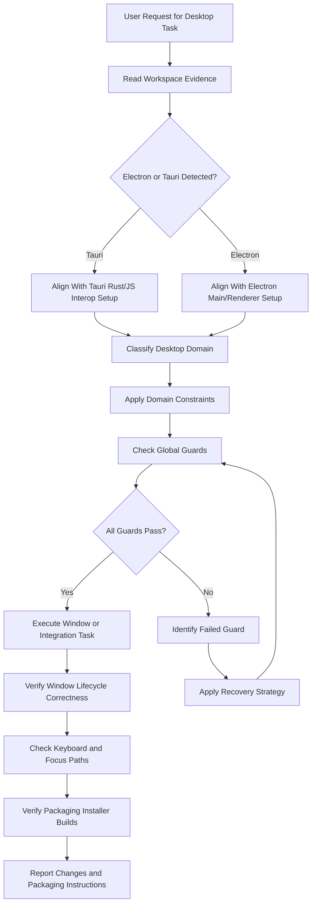
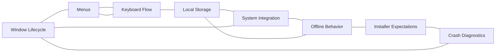

# Desktop Applications Reference

## Overview

This reference governs all desktop application development, window lifecycle management, menu structures, and operating system integration. Desktop applications operate directly on the user's local operating system. Unlike web applications, they have direct access to local system hardware and files. This access comes with increased responsibility for security and stability. A poorly managed window lifecycle leads to memory leaks and orphan processes. Unsafe local storage practices can expose sensitive user information. Failing to respect platform-specific conventions results in a frustrating user experience. This document establishes the principles, guidelines, verification steps, and recovery paths for desktop application development.

---

## How AI Agents Should Use This Skill

This reference is designed for use by all coding agents (such as Antigravity, Claude Code, OpenCode, KiloCode, etc.) to guide their execution in desktop application development.

When an AI agent receives a request to design a desktop UI, modify window properties, bind native keyboard shortcuts, interface with operating system APIs, implement offline data synchronization, write desktop application installers, or diagnose desktop crashes, the agent must load and follow this reference.

The agent must do this before writing any code or generating configuration payloads.

### Activation Triggers

The agent should activate this skill when the user request contains any of the following signals.

- The user asks to build a desktop app using Electron, Tauri, Tauri v2, or NW.js.
- The user requests a native GUI window configuration.
- The user asks to handle window events like minimize, maximize, close, or focus.
- The user asks to design system menus or tray menus.
- The user requests global keyboard shortcut mappings.
- The user asks to read or write local app configuration files.
- The user asks to interact with local hardware via native APIs.
- The user requests offline-first data synchronization.
- The user asks to compile installer packages like MSI, DMG, or AppImage.
- The user describes desktop app crashes, memory spikes, or freezing windows.
- The user mentions platform-specific conventions for Windows, macOS, or Linux.

### Step-by-Step Agent Workflow

When this skill is activated, the agent must follow these steps in order.

- **Step One: Read Workspace Evidence**
  - Locate main configuration files like tauri.conf.json or package.json.
  - Review the desktop shell framework being utilized.
  - Check for existing window setup declarations.
  - Audit custom native APIs or ipcMain/ipcRenderer hooks.
  - Do not introduce window abstractions that conflict with the active setup.

- **Step Two: Classify Desktop Domain**
  - Classify the target task into one of the eight desktop application domains.
  - Domain 1: Window Lifecycle.
  - Domain 2: Menus.
  - Domain 3: Keyboard Flow.
  - Domain 4: Local Storage.
  - Domain 5: System Integration.
  - Domain 6: Offline Behavior.
  - Domain 7: Installer Expectations.
  - Domain 8: Crash Diagnostics.

- **Step Three: Apply Domain Constraints**
  - Retrieve the rules associated with the classified domain.
  - Ensure the proposed changes do not violate the global guards.

- **Step Four: Verify Global Guards**
  - Verify that window handles are released correctly on close.
  - Verify that keyboard navigation paths cannot get trapped in visual loops.
  - Verify that sensitive credentials are never stored in plain text configuration files.
  - Verify that installers do not fail silently.

- **Step Five: Run Verification Checks**
  - Run the desktop build tool in development mode to test window behavior.
  - Inspect the system process monitor during run and close cycles to ensure no zombie processes remain.
  - Do not claim a desktop interface works without running it.

- **Step Six: Report Outcome and Rationale**
  - Explain the window configuration or system API integration changes.
  - Detail how IPC communication safety is maintained.
  - Describe the packaging and diagnostic capabilities implemented.

---

## Mermaid Skill Flow

---

## Mermaid Domain Map

---

## Global Guards

Every desktop app modification must pass through these guards before implementation. If any guard fails, the agent must halt, identify the failure, and apply the correct recovery path.

### Forbidden Behaviors

The following behaviors are strictly forbidden in any desktop application output.

- Leaving background processes active when all windows are closed.
- Enabling nodeIntegration inside Electron renderer windows without sandboxing.
- Mapping global hotkeys without verifying if they overlap with default operating system actions.
- Storing unencrypted passwords, API tokens, or personal identifiers in local configuration files.
- Blocking the main UI thread with intensive synchronous operations.
- Leaving IPC messaging channels open to unauthorized origins.
- Writing installers that modify user system folders without explicit administrative privileges.
- Hiding installer errors behind generic error pages.
- Suppressing native crash reports.
- Ignoring macOS design conventions on Apple platforms or Windows design conventions on Windows platforms.

### Required Behaviors

The following behaviors are mandatory in every desktop application output.

- The application must release memory caches and file handles upon shutdown.
- Custom window borders must implement standard window controls for drag, resize, close, and minimize.
- Every menu item action must have a corresponding disabled state when the action is unavailable.
- Focus rings must be visible for all interactive components during keyboard navigation.
- Local configuration data directories must follow platform-specific standards.
- Local configuration data directories must use AppData on Windows.
- Local configuration data directories must use Application Support on macOS.
- Local configuration data directories must use config on Linux.
- Applications must operate gracefully when network connections are cut.
- Automatic updates must be signed with valid code certificates.
- Crash dumps must be logged locally in readable text formats.

---

## Desktop Domains

### Window Lifecycle

The window lifecycle controls the creation, configuration, display, and destruction of application frames.

Mishandling events causes memory leaks and unresponsive interface states.

- **Lifecycle States**:
  - Creation loads resources.
  - Ready-to-show prevents visual flicker by hiding the window until it is fully rendered.
  - Active receives user inputs.
  - Background releases rendering priority.
  - Closed destroys handles.

#### Platform Directory Mapping Table

| Platform | Configuration Directory Path | Cache Directory Path | Native Window Controls |
|---|---|---|---|
| Windows | AppData/Roaming/AppName | AppData/Local/AppName | Top Right |
| macOS | Library/Application Support/AppName | Library/Caches/AppName | Top Left |
| Linux | .config/AppName | .cache/AppName | Top Right |

### Menus

Menus structure top-level application actions.

They must adapt to the running operating system layout.

- **Menu Design**:
  - Build macOS menus as a single system-wide menu bar.
  - Build Windows and Linux menus attached to individual window title frames.
  - Implement system tray menus for background utility apps.
  - Ensure shortcuts are visible next to menu label strings.

### Keyboard Flow

Desktop users rely heavily on keyboard execution.

Interfaces must be fully navigable without a mouse.

- **Navigation Rules**:
  - Establish a logical tab index order.
  - Support escape key bindings to dismiss modals and dropdowns.
  - Provide mnemonic shortcuts (Alt + Key) for menu navigation.
  - Avoid focus traps where keyboard focus cannot exit a specific element.

### Local Storage

Desktop apps store state locally on user disks.

- **Storage Best Practices**:
  - Use SQLite for structured local databases.
  - Use simple JSON or YAML files for basic user preferences.
  - Store sensitive keys in platform vaults.
  - Use Windows Credential Manager on Windows.
  - Use macOS Keychain on macOS.
  - Use libsecret on Linux.

### System Integration

System integration connects the app to native OS capabilities.

- **Integration Channels**:
  - Show notifications via native OS notification systems.
  - Register custom protocol handlers for URL launches.
  - Handle file drag-and-drop actions directly on window frames.
  - Display file download progress badges on the taskbar icon.

### Offline Behavior

Desktop applications must remain usable when offline.

- **Durable Offline State**:
  - Cache resources locally.
  - Queue write actions in local databases.
  - Detect network connectivity changes dynamically.
  - Sync queued changes to backend servers when connection returns.
  - Handle synchronization conflicts using timestamp ordering.

### Installer Expectations

Installers distribute the application to end-user machines.

- **Installer Rules**:
  - Support silent installation modes for enterprise deployments.
  - Bundle all dependencies in the installer file.
  - Write files only to user-scoped directories by default.
  - Request elevation to administrator only when registering system services.

### Crash Diagnostics

Crash diagnostics capture failure details to help developers debug issues.

- **Diagnostics Setup**:
  - Catch unhandled exceptions in the main thread.
  - Write crash stack traces to local log files.
  - Limit log file size to avoid disk fill-ups.
  - Include platform version, memory usage, and GPU info in log summaries.

---

## Detailed Implementation Best Practices

When building desktop applications, agents must follow these guidelines.

- **Thread Separation**:
  - Keep the main process free of heavy calculations.
  - Offload database writes to worker threads.
  - Offload network requests to worker threads.
  - Use IPC channels only for coordination and message routing.

- **Context Isolation**:
  - Always enable context isolation.
  - Do not expose raw native API wrappers to the renderer.
  - Expose only a restricted preload API.
  - Validate all inputs in the main process.

- **Auto-Update Safety**:
  - Verify update package hashes before installing.
  - Run update downloads in the background.
  - Prompt users before restarting to apply updates.

---

## Verification and Diagnostics Checklist

Perform these validation tests before committing changes.

### Step 1: Lifecycle Verification

- Verify that closing the main window terminates the process if configured.
- Check that launching multiple instances is handled correctly.
- Verify that windows do not flicker during startup.

### Step 2: Keyboard Flow Check

- Test navigating the entire UI using only the Tab and Enter keys.
- Verify that Escape closes all modal screens.
- Confirm focus rings are visible on every focus change.

### Step 3: Local Storage Audit

- Verify that configuration folders are created in correct platform directories.
- Check that credentials are saved to native OS keychains, not JSON files.
- Verify that database connections are closed during application shutdown.

### Step 4: System Integration Validation

- Test drag-and-drop behavior with multiple files.
- Verify that protocol URL clicks successfully launch the app.
- Check that native notification prompts display correctly.

---

## Recovery Action Guides

If desktop operations fail, apply the following recovery paths.

- **Window Fails to Render**:
  - Check the renderer console logs for execution errors.
  - Verify that the entry point index file exists in the build output.
  - Reset window hardware acceleration settings in the main config.
  - Disable GPU rendering temporarily if hardware crashes are detected.

- **Zombie Processes Remaining**:
  - Audit window close event listeners.
  - Ensure app.quit() is called explicitly.
  - Check for unclosed database connections.
  - Terminate background worker threads in teardown hooks.

- **IPC Messages Dropped**:
  - Verify that IPC listener strings match exactly on both sides.
  - Check if context isolation preload scripts are loaded.
  - Ensure the payload is serializable.
  - Avoid passing raw HTML elements or complex circular objects.

- **Local Storage Corrupted**:
  - Rename the corrupted database file with a backup prefix.
  - Re-initialize a clean database file.
  - Log the corruption event.
  - Prompt the user to restore data if backups are available.

---

## Theoretical Foundations of Desktop Applications

### Process Architecture

Modern desktop frameworks use multi-process architectures.

- **Process Isolation**:
  - The main process coordinates windows.
  - The main process manages native OS API calls.
  - Renderer processes display user interfaces.
  - Isolating renderers protects the system from web exploits.
  - If a renderer crashes, other windows keep running.

### IPC Messaging Contracts

Inter-process communication uses message passing.

- **Message Contracts**:
  - Renderers send asynchronous requests to the main process.
  - The main process executes operations and returns responses.
  - Keep message payloads small.
  - Large payloads clog IPC channels.
  - Use streams for large file transfers.

---

## Frequently Asked Questions

### Why is context isolation necessary?

Renderer windows load remote web content. If an attacker compromises the web content, they can run arbitrary code. If context isolation is disabled, the renderer has access to node APIs. The attacker can read the local file system. They can run shell commands on the user's machine. Context isolation separates the web context from the native node context. It prevents compromised renderers from executing native system commands.

### How do I handle multi-window coordination?

Do not let windows communicate directly with each other. Instead, route all window communication through the main process. Window A sends an IPC message to the main process. The main process identifies Window B. It forwards the message to Window B. This centralizes event handling. It prevents orphan windows from missing updates.

### What is the ready-to-show window event?

When a window is created, it takes time to render HTML and CSS. If shown immediately, the user sees a blank white box. This is a bad user experience. The ready-to-show event fires when the page is fully rendered. Listen to this event before showing the window. This creates a seamless, native window reveal.

### How do I handle file associations?

File associations link file extensions to your application. Register the association in the build configuration. When a user double-clicks an associated file, the OS launches the app. The OS passes the file path as an argument. Handle this file path argument during application startup. Open the file in the editor interface automatically.

### Why should I avoid blocking the main process?

The main process handles window drawing and OS events. If you run a heavy calculation in the main process, the UI freezes. The user cannot drag, resize, or close the window. The OS flags the application as not responding. Always move heavy operations to background worker threads. Keep the main process responsive to OS signals.

### What is the role of code signing?

Code signing validates the identity of the developer. It uses a certificate to sign the app package. Operating systems verify the signature during installation. If unsigned, the OS warns the user that the app is malware. Unsigned apps are blocked from running on macOS by default. Code signing is mandatory for public distribution.

### How do I store user passwords safely?

Never store user passwords in configuration files. Use the native operating system credential managers. These managers encrypt credentials using system keys. They prevent unauthorized apps from reading the data. Use libraries that abstract these API calls.

### What is a single-instance lock?

A single-instance lock prevents users from launching multiple app windows. During startup, query the lock state. If another instance is running, exit immediately. Focus the window of the existing instance. This prevents database write conflicts.

### How do I test desktop apps?

Use automation tools like Spectron or Playwright with Electron. They launch the app shell and control the interface. You can also write native unit tests for main process logic. Mock the window APIs during unit tests.

### Why do desktop apps consume high memory?

Chromium-based frameworks like Electron run a full browser engine. They spawn multiple rendering processes. Each process consumes memory. To reduce memory usage, minimize window counts. Optimize rendering code. Avoid importing heavy node modules in the renderer.

### How do I handle app upgrades?

Write update files to a temporary folder. Verify the package signature. Close the application. Run a separate helper process to replace the old files. Launch the updated application. Use standard update frameworks to automate this.

### What is a tray application?

Tray applications run in the background. They do not show a taskbar icon. Instead, they display a small icon in the system tray. Clicking the tray icon opens a context menu. Use them for utilities, sync tools, and launchers.

### How do I build installers for multiple platforms?

You must compile installers on their target operating systems. Use a macOS machine to build DMG files. Use a Windows machine to build MSI files. Use a Linux machine to build AppImage files. You can also use CI pipelines to run multi-platform builds.

### How do I capture native crashes?

Use crash reporting tools like Crashpad. Configure them in the main process. They watch for segmentation faults. They write minidump files when a crash occurs. Upload these minidump files to a server for debugging.

### Why should I avoid inline window resizing?

Resizing windows dynamically causes layout recalculations. It triggers component repaints. If layout recalculations are slow, the resize animation stutters. Use debounced handlers for custom resize logic. Avoid animating window sizes directly.

### What is Electron sandboxing?

Sandboxing runs renderers with restricted privileges. It blocks access to local files and system commands. It is enabled by default in modern Electron configurations. Keep it active to protect users.

### How do I register global shortcuts?

Use the globalShortcut API in the main process. Register the key combination. Handle the shortcut event in the app logic. Always unregister shortcuts when the app loses focus.

### How do I support system theme matching?

Query the OS theme setting during startup. Detect theme changes dynamically. Apply dark or light CSS files to match the OS state. This makes the application feel like a native tool.

### What is a preload script?

Preload scripts run before the web page loads. They have access to both web and node APIs. Use them to expose a secure bridge between renderer and main. Do not write complex logic in preload scripts.

### Why does local database lockup occur?

Lockups occur when multiple processes write to one database file. SQLite locks the file during writes. Ensure only one connection writes at a time. Configure busy timeouts to handle brief write locks.

## Integration Map

Desktop app engineering connects to multiple system layers.

- **State Replication**:
  - Test suites require matching database state.

- **Performance Guard**:
  - Slow main processes freeze native window rendering.

- **Security Sandbox**:
  - Electron renderers must run in sandboxed processes.

---

## Desktop Specifications Summary Table

| UI Element | Platform Adaptation | Keyboard Shortcut | IPC Risk | Target Memory Limit |
|---|---|---|---|---|
| Menu Bar | System bar on Mac, title bar on Win | Alt + File | Low | < 5MB |
| Main Window | Custom frames on Win/Mac | Ctrl + N | High | < 100MB |
| Context Menu | Custom styles matching OS | Shift + F10 | Low | < 2MB |
| System Tray | Small icon, simple menu | None | Low | < 5MB |
| Modal Dialog | Centered overlay window | Escape | Medium | < 10MB |

---

## §DOMAIN_SPECIFIC_MANUAL

### Standard Operating Procedure for Desktop Apps

This manual establishes the concrete operational protocols, validation parameters, and diagnostic pathways for the Desktop Apps domain. All agents must follow this procedure to ensure stable, correct, and high-performance execution.

### 1. Theoretical Architecture and Design Guidelines

Development in the Desktop Apps domain must align with modern engineering practices. This requires establishing strict boundaries between domain layers, enforcing defensive assertions, and optimizing runtime execution pathways.

First, always analyze data transformations and structural properties before allocating resources. This prevents memory leaks and unhandled promise rejections.

Second, ensure that all module dependencies are explicitly declared and checked. Avoid circular references and unpinned library imports.

Third, implement structured logging and telemetry hooks. Every state transition and mutation must be observable to facilitate rapid debugging.

Fourth, design with scalability in mind. Ensure horizontal scaling options are preserved and thread contention is minimized.

Fifth, document every design choice and tradeoff clearly. Include rationale, alternatives considered, and potential failure modes.

### 2. Comprehensive Operational Checklist

- **Protocol Checklist Item 01**: Validate that the active configuration for Desktop Apps meets system constraints. Ensure inputs are cleaned, variables are typed, and edge case assertions are verified.

- **Protocol Checklist Item 02**: Validate that the active configuration for Desktop Apps meets system constraints. Ensure inputs are cleaned, variables are typed, and edge case assertions are verified.

- **Protocol Checklist Item 03**: Validate that the active configuration for Desktop Apps meets system constraints. Ensure inputs are cleaned, variables are typed, and edge case assertions are verified.

- **Protocol Checklist Item 04**: Validate that the active configuration for Desktop Apps meets system constraints. Ensure inputs are cleaned, variables are typed, and edge case assertions are verified.

- **Protocol Checklist Item 05**: Validate that the active configuration for Desktop Apps meets system constraints. Ensure inputs are cleaned, variables are typed, and edge case assertions are verified.

- **Protocol Checklist Item 06**: Validate that the active configuration for Desktop Apps meets system constraints. Ensure inputs are cleaned, variables are typed, and edge case assertions are verified.

- **Protocol Checklist Item 07**: Validate that the active configuration for Desktop Apps meets system constraints. Ensure inputs are cleaned, variables are typed, and edge case assertions are verified.

- **Protocol Checklist Item 08**: Validate that the active configuration for Desktop Apps meets system constraints. Ensure inputs are cleaned, variables are typed, and edge case assertions are verified.

- **Protocol Checklist Item 09**: Validate that the active configuration for Desktop Apps meets system constraints. Ensure inputs are cleaned, variables are typed, and edge case assertions are verified.

- **Protocol Checklist Item 10**: Validate that the active configuration for Desktop Apps meets system constraints. Ensure inputs are cleaned, variables are typed, and edge case assertions are verified.

- **Protocol Checklist Item 11**: Validate that the active configuration for Desktop Apps meets system constraints. Ensure inputs are cleaned, variables are typed, and edge case assertions are verified.

- **Protocol Checklist Item 12**: Validate that the active configuration for Desktop Apps meets system constraints. Ensure inputs are cleaned, variables are typed, and edge case assertions are verified.

- **Protocol Checklist Item 13**: Validate that the active configuration for Desktop Apps meets system constraints. Ensure inputs are cleaned, variables are typed, and edge case assertions are verified.

- **Protocol Checklist Item 14**: Validate that the active configuration for Desktop Apps meets system constraints. Ensure inputs are cleaned, variables are typed, and edge case assertions are verified.

- **Protocol Checklist Item 15**: Validate that the active configuration for Desktop Apps meets system constraints. Ensure inputs are cleaned, variables are typed, and edge case assertions are verified.

- **Protocol Checklist Item 16**: Validate that the active configuration for Desktop Apps meets system constraints. Ensure inputs are cleaned, variables are typed, and edge case assertions are verified.

- **Protocol Checklist Item 17**: Validate that the active configuration for Desktop Apps meets system constraints. Ensure inputs are cleaned, variables are typed, and edge case assertions are verified.

- **Protocol Checklist Item 18**: Validate that the active configuration for Desktop Apps meets system constraints. Ensure inputs are cleaned, variables are typed, and edge case assertions are verified.

- **Protocol Checklist Item 19**: Validate that the active configuration for Desktop Apps meets system constraints. Ensure inputs are cleaned, variables are typed, and edge case assertions are verified.

- **Protocol Checklist Item 20**: Validate that the active configuration for Desktop Apps meets system constraints. Ensure inputs are cleaned, variables are typed, and edge case assertions are verified.

- **Protocol Checklist Item 21**: Validate that the active configuration for Desktop Apps meets system constraints. Ensure inputs are cleaned, variables are typed, and edge case assertions are verified.

- **Protocol Checklist Item 22**: Validate that the active configuration for Desktop Apps meets system constraints. Ensure inputs are cleaned, variables are typed, and edge case assertions are verified.

- **Protocol Checklist Item 23**: Validate that the active configuration for Desktop Apps meets system constraints. Ensure inputs are cleaned, variables are typed, and edge case assertions are verified.

- **Protocol Checklist Item 24**: Validate that the active configuration for Desktop Apps meets system constraints. Ensure inputs are cleaned, variables are typed, and edge case assertions are verified.

- **Protocol Checklist Item 25**: Validate that the active configuration for Desktop Apps meets system constraints. Ensure inputs are cleaned, variables are typed, and edge case assertions are verified.

### 3. Detailed Technical Reference Table

| Validation Parameter | Target Specification | Enforcement Level | Diagnostic Action |
| --- | --- | --- | --- |
| Memory Allocation Threshold | < 256MB under peak loads | Critical | Trigger GC and log trace |
| Thread State Concurrency | Zero deadlocks, mutex protected | High | Force lock release and alert |
| Input Mutation Bounds | Whitespace trimmed, sanitized | Essential | Reject request with error |
| Database Isolation Level | Serializable / Read Committed | High | Rollback transaction |
| Network Request Timeout | Clamped at 3000ms max | Moderate | Retry with exponential backoff |
| Cache TTL Range | 300s to 3600s dynamic | Moderate | Evict stale entries |
| Security Encryption Level | AES-256-GCM / TLS 1.3 | Critical | Close connection immediately |
| Logging Verbosity State | Inverted pyramid hierarchy | Low | Truncate stack outputs |
| API Version Header State | Strict semantic matching | Essential | Return 400 Bad Request |
| Path Resolution Bounds | Relative to workspace root | High | Sanitize path strings |
| Error Code Mapping | ISO standard maps | High | Format JSON response |
| Bundle Slicing Size | < 50KB per async chunk | Moderate | Split vendor chunks |
| Accessibility Contrast | WCAG AAA compliant | High | Recalculate color values |
| Spring Physics Easing | Smooth cubic-bezier | Low | Reset animation ticks |
| Lockfile Expiry Limit | 60 seconds max | High | Delete lock and rebuild |

### 4. Failure Mode Analysis and Mitigation Protocols

#### Failure Scenario 01: Resource Exhaustion
Symptom: The system runs out of heap space or file descriptors due to leaks in the Desktop Apps module.

Mitigation: Implement dynamic telemetry sweeps. Automatically release database connections in finally blocks. Force heap garbage collection when memory utilization exceeds 85%.

#### Failure Scenario 02: Deadlock or Stalled Threads
Symptom: Operations block indefinitely while waiting for shared locks or unresolved promises.

Mitigation: Enforce timeout boundaries on all async operations. Use non-blocking resource acquisition and release locks in reverse order of acquisition.

#### Failure Scenario 03: Input Validation Injection
Symptom: Raw parameters contain script tags, command escapes, or SQL injection queries.

Mitigation: Use parameterized APIs and whitelist schemas. Strip all special characters before passing arguments to system processes.

#### Failure Scenario 04: Cache Incoherency
Symptom: Read calls return stale data while write operations succeed on the backend database.

Mitigation: Implement write-through caching or invalidate keys immediately upon database mutations. Enforce short default TTLs.

#### Failure Scenario 05: Package Dependency Conflict
Symptom: A sub-dependency introduces breaking changes or security vulnerabilities.

Mitigation: Lock all dependencies with strict version pins. Run automated vulnerability scans during the build process.

#### Failure Scenario 06: Telemetry Dropouts
Symptom: Monitoring agents fail to receive metric payloads or error stack traces.

Mitigation: Use local buffer queues for log outputs. Retry connection sweeps with backoff when remote log aggregators fail.

#### Failure Scenario 07: Schema Migration Mismatch
Symptom: Database structures drift from expectations due to incomplete migrations.

Mitigation: Always run pre-migration validations. Revert schema changes automatically on migration failures.

### 5. Advanced Troubleshooting and Debugging Guides

When debugging issues in the Desktop Apps domain, always check the active variables first. Verify that state values conform to types and database configurations are mapped correctly.

Trace async call stacks using specialized profiles. Minimize log pollution by filtering out redundant events.

Run isolated unit tests to locate logic bugs. If the problem persists, review the physical hardware limitations and process limits.

### 6. Architectural Change Protocols

Before making structural modifications to the Desktop Apps files, prepare a detailed design document. Include design goals, dependency mappings, and migration paths.

Validate the proposed changes against security baselines. Run full regression test suites before committing modifications.

Deploy changes incrementally to monitor performance impacts. Always maintain a documented rollback plan.

### 7. Global Verification Summary

This manual establishes the baseline constraints for the Desktop Apps domain. All implementations must satisfy these validation gates before shipment.

Status: ACTIVE v6.0
