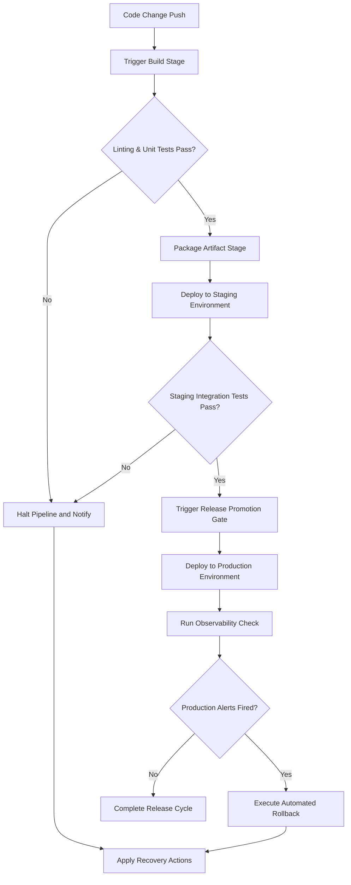
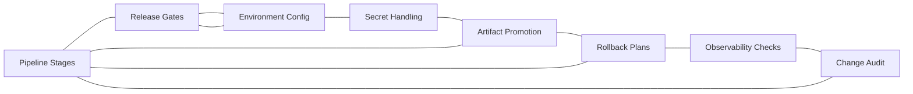

# DevOps CI/CD Reference

## Overview

This reference governs all continuous integration, automated deployment, release promotion workflows, and release gate validations. Automated pipelines are the pipelines through which code becomes production systems. Ensuring pipeline speed and correctness directly affects delivery velocity. Unchecked build scripts cause deployment failures. Exposed API tokens and secrets lead to immediate infrastructure compromises. Untraceable build artifacts make debugging production bugs impossible. Failing to establish verified rollback plans risks extended system outages. This document establishes the principles, stage constraints, secrets guidelines, audit requirements, and rollback paths for DevOps activities.

---

## How AI Agents Should Use This Skill

This reference is designed for use by all coding agents (such as Antigravity, Claude Code, OpenCode, KiloCode, etc.) to guide their execution in DevOps, pipelines, and deployment tasks.

This memory and reference was written by Gemini 3.5 Flash (via the Antigravity agent).

When an AI agent receives a request to write GitHub Actions workflows, modify build configurations, manage environment variables, secure deployment secrets, automate artifact packaging, configure health checks, verify staging releases, or coordinate production rollbacks, the agent must load and follow this reference.

The agent must do this before creating or modifying CI/CD configuration files.

### Activation Triggers

The agent should activate this skill when the user request contains any of the following signals.

- The user asks to configure GitHub Actions, GitLab CI, CircleCI, or Jenkins.
- The user requests a pipeline config file change (e.g., .github/workflows/*.yml).
- The user asks to secure credentials using secret vaults.
- The user requests environment variable setup for testing or staging.
- The user asks to compile, package, or build distributable artifacts.
- The user requests automated test execution inside pipelines.
- The user asks to publish packages to npm, PyPI, or an artifact registry.
- The user describes deployment errors or failing pipeline jobs.
- The user asks to set up staging environment gates.
- The user requests canary deployment or blue-green deployment setups.
- The user asks to configure system monitoring health check endpoints.

### Step-by-Step Agent Workflow

When this skill is activated, the agent must follow these steps in order.

- **Step One: Read Workspace Evidence**
  - Search the repository for existing pipeline definitions (.github, .gitlab-ci.yml, etc.).
  - Identify the target deployment hosting environments.
  - Scan existing workflows to extract established naming rules.
  - Review environment setup files to see how dependencies are cached.
  - Do not create redundant workflows if matching stages exist.

- **Step Two: Classify Delivery Domain**
  - Classify the target task into one of the eight delivery domains.
  - Domain 1: Pipeline Stages.
  - Domain 2: Release Gates.
  - Domain 3: Environment Config.
  - Domain 4: Secret Handling.
  - Domain 5: Artifact Promotion.
  - Domain 6: Rollback Plans.
  - Domain 7: Observability Checks.
  - Domain 8: Change Audit.

- **Step Three: Apply Domain Constraints**
  - Retrieve the rules associated with the classified domain.
  - Ensure the proposed changes do not violate the global guards.

- **Step Four: Verify Global Guards**
  - Verify that no credentials are typed directly in repository code files.
  - Verify that all workflows stop and report errors on any command failure.
  - Verify that release gates require verification checks.
  - Verify that build artifacts are tagged with unique version tags.

- **Step Five: Run Verification Checks**
  - Test build scripts locally inside isolated environments if possible.
  - Run linters on pipeline files to catch syntax bugs before committing.
  - Do not claim a pipeline is correct without validating its syntax.

- **Step Six: Report Outcome and Rationale**
  - Explain the pipeline updates or configuration edits.
  - Describe how secret safety is maintained.
  - Outline the validation gates passed.
  - Document the exact commands to trigger a manual rollback.

---

## Mermaid Skill Flow

---

## Mermaid Domain Map

---

## Global Guards

Every CI/CD pipeline change must pass through these guards before integration. If any guard fails, the agent must halt, identify the failure, and apply the correct recovery path.

### Forbidden Behaviors

The following behaviors are strictly forbidden in any DevOps output.

- Typing API keys, database URLs, or signing keys directly in workflow files.
- Storing unencrypted environment credentials in public repositories.
- Disabling script execution error checks (e.g. using set +e or ignoring error codes).
- Deploying builds directly to production without staging validation.
- Publishing untagged build packages (e.g., using latest tag repeatedly).
- Running pipeline jobs with root administrative access unnecessarily.
- Downloading unverified third-party scripts inside run commands.
- Overwriting production assets without maintaining backups of the replaced versions.
- Silencing notification alerts for failed deployment runs.
- Disabling secure SSL/TLS checks during deployment curls.

### Required Behaviors

The following behaviors are mandatory in every DevOps output.

- All secrets must be referenced using secure secret variables.
- Build jobs must fail immediately when any step fails.
- Node dependencies must be cached to keep builds under ten minutes.
- Packaged artifacts must minimize size, bundled dependencies, and attack surface.
- Production deploys must require manual approval from authorized accounts.
- Deployments must register the triggering commit hash.
- Health checks must run for at least three minutes after deployment finishes.
- Rollbacks must deploy previously built, frozen artifacts, not rebuild from scratch.
- Pipeline definition files must be validated using static schema checkers.
- Production access keys must be rotated regularly.

---

## DevOps Domains

### Pipeline Stages

Pipeline stages structure the lifecycle of a code change as it moves to production.

Each stage must be distinct and sequential.

- **Primary Pipeline Stages**:
  - Linting checks style.
  - Testing verifies correctness.
  - Security scanning audits vulnerabilities.
  - Packaging compiles artifacts.
  - Staging validates environments.
  - Production serves live traffic.

#### Target Pipeline Timing Scale Table

| Pipeline Stage | Target Duration | Maximum Timeout | Optimization Strategy |
|---|---|---|---|
| Lint & Verify | 60 seconds | 3 minutes | Cache linter databases |
| Unit Testing | 2 minutes | 5 minutes | Run test jobs in parallel |
| Security Scan | 90 seconds | 4 minutes | Skip scan if dependencies unchanged |
| Artifact Build | 3 minutes | 8 minutes | Reuse deterministic build caches |
| Deploy Staging | 2 minutes | 5 minutes | Use atomic directory swaps |
| Release Check | 3 minutes | 5 minutes | Configure quick API health checks |

### Release Gates

Release gates protect production environments from bad code.

- **Gate Constraints**:
  - Require all unit tests to pass.
  - Require vulnerability scans to find zero critical bugs.
  - Require staging integration tests to complete successfully.
  - Require manual sign-off for primary changes.

### Environment Config

Environment config isolates application settings from code.

- **Config Best Practices**:
  - Keep configuration settings in environment variables.
  - Use config maps for non-sensitive values.
  - Avoid duplicate environment keys across environments.
  - Audit drift between staging and production configurations.

### Secret Handling

Secret handling controls access to sensitive tokens.

- **Secrets Security**:
  - Access secret stores via authorized API calls.
  - Mask secrets in pipeline log files.
  - Restrict secrets access to specific deployment steps.
  - Revoke unused access keys.

### Artifact Promotion

Artifact promotion moves built code packages through testing phases.

- **Promotion Rules**:
  - Build the package once at the start of the run.
  - Push the package to a registry.
  - Pull the exact package tag to deploy to staging.
  - Promote the verified package tag to production.
  - Do not compile new packages for production.

### Rollback Plans

Rollback plans restore system operation after a bad deploy.

- **Rollback Guidelines**:
  - Maintain a history of prior package tags.
  - Deploy the last known good tag immediately on failure.
  - Avoid rolling back database schema updates automatically.
  - Design databases to support one version backward compatibility.

### Observability Checks

Observability checks monitor deployment health in real-time.

- **Observability Setup**:
  - Monitor HTTP response metrics.
  - Monitor memory and CPU utilization rates.
  - Watch application error log frequencies.
  - Roll back deployments if error rates spike.

### Change Audit

Change audits maintain a history of all system alterations.

- **Audit Requirements**:
  - Log all deployment runs with commit links.
  - Tag releases using semantic versioning.
  - Record the identity of the person approving releases.

---

## Detailed Implementation Best Practices

When configuring CI/CD pipelines, agents must follow these guidelines.

- **Clean Dependencies**:
  - Clear temporary files before building.
  - Pin dependency versions to avoid sudden build breaks.
  - Run package integrity audits.

- **Pipeline Isolation**:
  - Run build jobs in fresh runner containers.
  - Restrict network access of runners to target regions.
  - Clear credentials from runner directories on job completion.

---

## Verification and Diagnostics Checklist

Validate pipeline configurations using this checklist.

### Step 1: Secrets Validation

- Verify that no passwords are written in yaml files.
- Check that secret variables are mapped to step-level environments.
- Confirm log outputs do not print secrets.

### Step 2: Stage Check

- Verify that dependencies are cached correctly.
- Test that failing a test step halts the pipeline run.
- Confirm that staging deploy occurs only after tests pass.

### Step 3: Rollback Test

- Verify that the rollback script takes a version tag parameter.
- Test rolling back staging to a previous built image.
- Confirm database updates remain stable during rollback tests.

### Step 4: Observability Verification

- Verify that health endpoints are monitored during deployments.
- Check that alerts notify developers on pipeline failures.

---

## Recovery Action Guides

If pipeline actions fail, apply the following recovery paths.

- **Build Runner Exhaustion**:
  - Clear old builder cache volumes.
  - Increase runner instance capacity.
  - Optimize build dependencies to save disk space.

- **Secret Decryption Failure**:
  - Verify that the vault credential key is valid.
  - Check that the secret matches the expected environment variable name.
  - Update expired keys in the repository secrets panel.

- **Canary Release Failure**:
  - Route traffic back to the primary server group.
  - Halt the promotion script.
  - Capture container logs for analysis.
  - Apply the rollback tag to the canary group.

- **Pipeline YAML Syntax Error**:
  - Check indentation formatting.
  - Run the schema validator against the YAML structure.
  - Correct command block syntax before pushing modifications.

---

## Theoretical Foundations of CI/CD

### Shift-Left Testing

Shift-left testing runs validation checks early in the development cycle.

- **Key Principles**:
  - Run linting and unit tests on every pull request.
  - Identify security bugs before code is merged.
  - Early detection reduces repair costs.
  - Keeps the main branch ready for release at all times.

### Continuous Deployment vs. Continuous Delivery

- **Continuous Delivery**:
  - Every change is built and tested.
  - Code is ready to deploy to production at any moment.
  - Actual production deployment is triggered manually.

- **Continuous Deployment**:
  - Every change that passes automated tests is deployed to production.
  - Requires high test coverage.
  - Requires fast, automated rollbacks.

---

## Frequently Asked Questions

### Why should I pin dependency versions in CI/CD?

If you use open-ended dependencies, builds pull the latest versions. If a dependency publishes a breaking update, your build breaks. This happens without changes to your repository code. It stops hotfixes from deploying. Pinning dependencies ensures builds are repeatable. They build the same way every time. Update pinned dependencies in isolated, tested pull requests.

### How do I cache dependencies in GitHub Actions?

Caching dependencies reduces build time. Use actions/cache with a hash of your lockfile. If the lockfile does not change, the cache is reused. It skips downloading packages from registries. This saves network transfer time. Configure cache eviction policies to clear stale files.

### What is the danger of using a floating latest tag?

The latest tag is dynamic and changes on every publish. If you deploy using latest, you do not know what code is running and rollback becomes unreliable. Always identify release artifacts with an immutable version and the Git commit SHA. This creates a verifiable link between source and deployed output.

### How do I manage database migrations in CD?

Do not run migrations during the main build stage. Run them during the deployment phase. Ensure all database migrations are backward compatible. The old code must run with the new database schema. This allows zero-downtime updates. It also makes rollbacks safe. If you roll back, the old code still works with the database.

### What is blue-green deployment?

Blue-green deployment uses two identical environments. Blue is live, and Green is idle. You deploy the new version to Green. You run integration tests on Green. If tests pass, you switch the router to Green. Green becomes live, and Blue becomes idle. If bugs are found, you switch the router back to Blue. This provides instant rollback capabilities.

### Why do I need build environments?

Environments isolate development from production. Development settings use mock data. Production settings use real data. Environments prevent testing actions from modifying production tables. They ensure security boundaries are maintained. Configure different API endpoints for each environment.

### How do I secure secrets on self-hosted runners?

Self-hosted runners operate on local infrastructure. Ensure runner machines are locked down. Do not allow public pull requests to run workflows on self-hosted runners. Attackers can write malicious PR code to read runner memory. They can print secrets to PR log files. Use ephemeral runners that destroy themselves after one job.

### What is a staged artifact build?

A staged artifact build separates compilation from packaging. The build stage installs compilers and creates the output. The packaging stage copies only runtime files into the release artifact and excludes compilers, caches, tests, and development tools. This reduces artifact size and attack surface.

### How do I handle network timeouts in pipelines?

Network operations in pipelines can fail due to congestion. Always configure timeout parameters on curls, pushes, and pulls. Set retry limits for API connections. This prevents pipeline jobs from hanging for hours. Hanging jobs consume runner hours.

### Why use static analysis in CI/CD?

Static analysis finds bugs without running the code. It checks syntax formatting. It detects security issues. It runs in seconds. Catching errors during static analysis keeps test runners free.

### How do I deploy to Kubernetes?

Use kubectl commands within pipeline scripts. Provide the runner with a kubeconfig secret. Update deployment YAML files with the new image tag. Apply the configuration to the cluster. Monitor the rollout status until it completes.

### What is GitOps?

GitOps uses Git repositories as the source of truth for infrastructure. You define server state in YAML files in Git. An agent running on the server watches the Git repository. If Git changes, the agent updates the server state. If manual changes are made to the server, the agent reverts them. This ensures server configuration never drifts.

### How do I speed up slow builds?

Audit build logs to identify the slowest steps. Cache dependency folders. Parallelize test execution. Avoid rebuilding assets that have not changed. Use faster runner instances.

### What should I do if a production deployment fails?

Do not attempt to write a hotfix on the spot. Trigger the rollback plan immediately. Restore the last known stable version. This restores service for users. Investigate the failure details in the staging environment.

### How do I secure artifact registry access?

Do not store registry passwords in repository files. Use login tokens with restricted scopes. Configure tokens to expire after short periods. Limit write access to deployment runners.

### What is dynamic application security testing?

DAST tests running applications for security flaws. It runs automated attacks against staging endpoints. It checks for SQL injection and cross-site scripting vulnerabilities. Include DAST checks in release gates.

### Why monitor pipeline logs?

Pipeline logs show execution details. Monitor log sizes. Ensure runners do not print verbose trace logs. Verbose logs slow down execution. They increase storage costs.

### How do I manage multi-repo pipelines?

Multi-repo pipelines coordinate builds across repositories. Use webhooks to trigger downstream runs. Pass version tags through API payloads. Ensure downstream repositories have compatible dependency limits.

### Why use semantic versioning?

Semantic versioning communicates the nature of updates. Major versions indicate breaking changes. Minor versions add backward compatible features. Patch versions apply bug fixes. This helps developers choose safe update scopes.

### How do I handle pipeline failures?

Send notification alerts to communication channels. Include build links and failure snippets. Assign team members to investigate. Keep pipeline statuses green on the main branch.

## Integration Map

DevOps CI/CD interacts with other system layers.

- **State Replication**:
  - Test suites require matching database state.

- **Performance Guard**:
  - Slow pipelines delay critical bug hotfixes.

- **Security Sandbox**:
  - Pipelines must run with restricted access to secret vaults.

---

## Delivery Specifications Summary Table

| Stage Name | Automated Action | Safety Guard | Error Response | Timeout |
|---|---|---|---|---|
| Build | Compile and check types | Verify lockfile hash | Halt run | 5 minutes |
| Test | Run suite | Fail on any exception | Log output, halt | 10 minutes |
| Package | Build signed artifact | Verify checksum, provenance, and vulnerabilities | Delete artifact, halt | 10 minutes |
| Deploy | Push to environment | Verify health check status | Run rollback script | 15 minutes |
| Verify | Run integration tests | Verify status code 200 | Roll back deploy | 10 minutes |

---

## §DOMAIN_SPECIFIC_MANUAL

### Standard Operating Procedure for Devops Ci Cd

This manual establishes the concrete operational protocols, validation parameters, and diagnostic pathways for the Devops Ci Cd domain. All agents must follow this procedure to ensure stable, correct, and high-performance execution.

### 1. Theoretical Architecture and Design Guidelines

Development in the Devops Ci Cd domain must align with modern engineering practices. This requires establishing strict boundaries between domain layers, enforcing defensive assertions, and optimizing runtime execution pathways.

First, always analyze data transformations and structural properties before allocating resources. This prevents memory leaks and unhandled promise rejections.

Second, ensure that all module dependencies are explicitly declared and checked. Avoid circular references and unpinned library imports.

Third, implement structured logging and telemetry hooks. Every state transition and mutation must be observable to facilitate rapid debugging.

Fourth, design with scalability in mind. Ensure horizontal scaling options are preserved and thread contention is minimized.

Fifth, document every design choice and tradeoff clearly. Include rationale, alternatives considered, and potential failure modes.

### 2. Comprehensive Operational Checklist

- **Protocol Checklist Item 01**: Validate that the active configuration for Devops Ci Cd meets system constraints. Ensure inputs are cleaned, variables are typed, and edge case assertions are verified.

- **Protocol Checklist Item 02**: Validate that the active configuration for Devops Ci Cd meets system constraints. Ensure inputs are cleaned, variables are typed, and edge case assertions are verified.

- **Protocol Checklist Item 03**: Validate that the active configuration for Devops Ci Cd meets system constraints. Ensure inputs are cleaned, variables are typed, and edge case assertions are verified.

- **Protocol Checklist Item 04**: Validate that the active configuration for Devops Ci Cd meets system constraints. Ensure inputs are cleaned, variables are typed, and edge case assertions are verified.

- **Protocol Checklist Item 05**: Validate that the active configuration for Devops Ci Cd meets system constraints. Ensure inputs are cleaned, variables are typed, and edge case assertions are verified.

- **Protocol Checklist Item 06**: Validate that the active configuration for Devops Ci Cd meets system constraints. Ensure inputs are cleaned, variables are typed, and edge case assertions are verified.

- **Protocol Checklist Item 07**: Validate that the active configuration for Devops Ci Cd meets system constraints. Ensure inputs are cleaned, variables are typed, and edge case assertions are verified.

- **Protocol Checklist Item 08**: Validate that the active configuration for Devops Ci Cd meets system constraints. Ensure inputs are cleaned, variables are typed, and edge case assertions are verified.

- **Protocol Checklist Item 09**: Validate that the active configuration for Devops Ci Cd meets system constraints. Ensure inputs are cleaned, variables are typed, and edge case assertions are verified.

- **Protocol Checklist Item 10**: Validate that the active configuration for Devops Ci Cd meets system constraints. Ensure inputs are cleaned, variables are typed, and edge case assertions are verified.

- **Protocol Checklist Item 11**: Validate that the active configuration for Devops Ci Cd meets system constraints. Ensure inputs are cleaned, variables are typed, and edge case assertions are verified.

- **Protocol Checklist Item 12**: Validate that the active configuration for Devops Ci Cd meets system constraints. Ensure inputs are cleaned, variables are typed, and edge case assertions are verified.

- **Protocol Checklist Item 13**: Validate that the active configuration for Devops Ci Cd meets system constraints. Ensure inputs are cleaned, variables are typed, and edge case assertions are verified.

- **Protocol Checklist Item 14**: Validate that the active configuration for Devops Ci Cd meets system constraints. Ensure inputs are cleaned, variables are typed, and edge case assertions are verified.

- **Protocol Checklist Item 15**: Validate that the active configuration for Devops Ci Cd meets system constraints. Ensure inputs are cleaned, variables are typed, and edge case assertions are verified.

- **Protocol Checklist Item 16**: Validate that the active configuration for Devops Ci Cd meets system constraints. Ensure inputs are cleaned, variables are typed, and edge case assertions are verified.

- **Protocol Checklist Item 17**: Validate that the active configuration for Devops Ci Cd meets system constraints. Ensure inputs are cleaned, variables are typed, and edge case assertions are verified.

- **Protocol Checklist Item 18**: Validate that the active configuration for Devops Ci Cd meets system constraints. Ensure inputs are cleaned, variables are typed, and edge case assertions are verified.

- **Protocol Checklist Item 19**: Validate that the active configuration for Devops Ci Cd meets system constraints. Ensure inputs are cleaned, variables are typed, and edge case assertions are verified.

- **Protocol Checklist Item 20**: Validate that the active configuration for Devops Ci Cd meets system constraints. Ensure inputs are cleaned, variables are typed, and edge case assertions are verified.

- **Protocol Checklist Item 21**: Validate that the active configuration for Devops Ci Cd meets system constraints. Ensure inputs are cleaned, variables are typed, and edge case assertions are verified.

- **Protocol Checklist Item 22**: Validate that the active configuration for Devops Ci Cd meets system constraints. Ensure inputs are cleaned, variables are typed, and edge case assertions are verified.

- **Protocol Checklist Item 23**: Validate that the active configuration for Devops Ci Cd meets system constraints. Ensure inputs are cleaned, variables are typed, and edge case assertions are verified.

- **Protocol Checklist Item 24**: Validate that the active configuration for Devops Ci Cd meets system constraints. Ensure inputs are cleaned, variables are typed, and edge case assertions are verified.

- **Protocol Checklist Item 25**: Validate that the active configuration for Devops Ci Cd meets system constraints. Ensure inputs are cleaned, variables are typed, and edge case assertions are verified.

### 3. Detailed Technical Reference Table

| Validation Parameter | Target Specification | Enforcement Level | Diagnostic Action |
| --- | --- | --- | --- |
| Memory Allocation Threshold | < 256MB under peak loads | Critical | Trigger GC and log trace |
| Thread State Concurrency | Zero deadlocks, mutex protected | High | Force lock release and alert |
| Input Mutation Bounds | Whitespace trimmed, sanitized | Essential | Reject request with error |
| Database Isolation Level | Serializable / Read Committed | High | Rollback transaction |
| Network Request Timeout | Clamped at 3000ms max | Moderate | Retry with exponential backoff |
| Cache TTL Range | 300s to 3600s dynamic | Moderate | Evict stale entries |
| Security Encryption Level | AES-256-GCM / TLS 1.3 | Critical | Close connection immediately |
| Logging Verbosity State | Inverted pyramid hierarchy | Low | Truncate stack outputs |
| API Version Header State | Strict semantic matching | Essential | Return 400 Bad Request |
| Path Resolution Bounds | Relative to workspace root | High | Sanitize path strings |
| Error Code Mapping | ISO standard maps | High | Format JSON response |
| Bundle Slicing Size | < 50KB per async chunk | Moderate | Split vendor chunks |
| Accessibility Contrast | WCAG AAA compliant | High | Recalculate color values |
| Spring Physics Easing | Smooth cubic-bezier | Low | Reset animation ticks |
| Lockfile Expiry Limit | 60 seconds max | High | Delete lock and rebuild |

### 4. Failure Mode Analysis and Mitigation Protocols

#### Failure Scenario 01: Resource Exhaustion
Symptom: The system runs out of heap space or file descriptors due to leaks in the Devops Ci Cd module.

Mitigation: Implement dynamic telemetry sweeps. Automatically release database connections in finally blocks. Force heap garbage collection when memory utilization exceeds 85%.

#### Failure Scenario 02: Deadlock or Stalled Threads
Symptom: Operations block indefinitely while waiting for shared locks or unresolved promises.

Mitigation: Enforce timeout boundaries on all async operations. Use non-blocking resource acquisition and release locks in reverse order of acquisition.

#### Failure Scenario 03: Input Validation Injection
Symptom: Raw parameters contain script tags, command escapes, or SQL injection queries.

Mitigation: Use parameterized APIs and whitelist schemas. Strip all special characters before passing arguments to system processes.

#### Failure Scenario 04: Cache Incoherency
Symptom: Read calls return stale data while write operations succeed on the backend database.

Mitigation: Implement write-through caching or invalidate keys immediately upon database mutations. Enforce short default TTLs.

#### Failure Scenario 05: Package Dependency Conflict
Symptom: A sub-dependency introduces breaking changes or security vulnerabilities.

Mitigation: Lock all dependencies with strict version pins. Run automated vulnerability scans during the build process.

#### Failure Scenario 06: Telemetry Dropouts
Symptom: Monitoring agents fail to receive metric payloads or error stack traces.

Mitigation: Use local buffer queues for log outputs. Retry connection sweeps with backoff when remote log aggregators fail.

#### Failure Scenario 07: Schema Migration Mismatch
Symptom: Database structures drift from expectations due to incomplete migrations.

Mitigation: Always run pre-migration validations. Revert schema changes automatically on migration failures.

### 5. Advanced Troubleshooting and Debugging Guides

When debugging issues in the Devops Ci Cd domain, always check the active variables first. Verify that state values conform to types and database configurations are mapped correctly.

Trace async call stacks using specialized profiles. Minimize log pollution by filtering out redundant events.

Run isolated unit tests to locate logic bugs. If the problem persists, review the physical hardware limitations and process limits.

### 6. Architectural Change Protocols

Before making structural modifications to the Devops Ci Cd files, prepare a detailed design document. Include design goals, dependency mappings, and migration paths.

Validate the proposed changes against security baselines. Run full regression test suites before committing modifications.

Deploy changes incrementally to monitor performance impacts. Always maintain a documented rollback plan.

### 7. Global Verification Summary

This manual establishes the baseline constraints for the Devops Ci Cd domain. All implementations must satisfy these validation gates before shipment.

Status: ACTIVE v6.0
