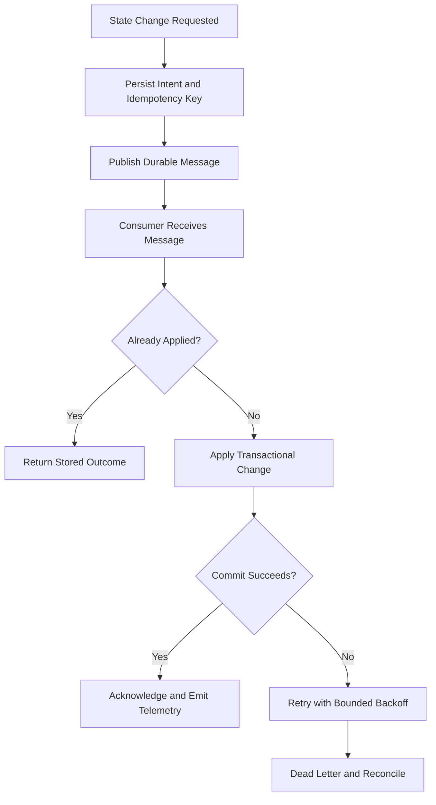
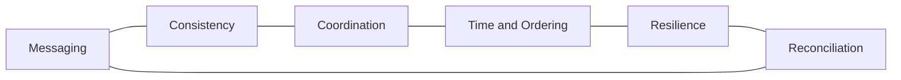

# Distributed Systems Reference

## Overview

This reference governs coordination across processes, machines, services, queues, replicas, and unreliable networks. It covers delivery semantics, idempotency, consistency, time, partition behavior, retries, leases, and recovery.

---

## How AI Agents Should Use This Skill

Load this reference when a task introduces remote state, asynchronous messaging, replicated data, leader selection, background workers, or cross-service transactions. Assume messages can be delayed, duplicated, reordered, or lost and that clocks can disagree.

### Activation Triggers

- Queues, streams, brokers, workers, retries, or dead letters.
- Replication, consensus, leases, leader election, or failover.
- Distributed locks, sagas, outbox patterns, or cross-service workflows.
- Eventual consistency, ordering, deduplication, or clock problems.

### Step-by-Step Agent Workflow

1. Identify nodes, state owners, communication paths, and invariants.
2. Define delivery, ordering, and consistency requirements.
3. Enumerate crash, timeout, duplication, partition, and replay cases.
4. Choose idempotency, transaction, and recovery mechanisms.
5. Instrument state transitions and retry behavior.
6. Test fault scenarios and document operational reconciliation.

---

## Mermaid Message Reliability Flow

## Mermaid Distributed Domain Map

---

## Global Guards

### Forbidden Behaviors

- Assuming exactly-once delivery without defining the full boundary.
- Retrying non-idempotent mutations blindly.
- Using wall-clock timestamps as a total ordering guarantee.
- Holding remote locks across slow or user-controlled work.
- Hiding poison messages or permanent reconciliation failures.

### Required Behaviors

- Define invariants and data ownership.
- Use stable operation identifiers for deduplication.
- Bound retries with jitter and terminal handling.
- Make partial completion observable and repairable.
- State consistency tradeoffs explicitly.

## Domain Rules

### Messaging

- Prefer at-least-once delivery with idempotent consumers.
- Persist publication intent with the state change when consistency requires it.

### Coordination

- Use leases with fencing tokens where stale owners can act.
- Avoid coordination when partitioned ownership is sufficient.

### Consistency and Transactions

- Keep atomic invariants within one transactional owner.
- Use sagas and compensation for multi-owner workflows.

### Recovery

- Provide replay, dead-letter inspection, and reconciliation tools.
- Test node loss, duplicate delivery, stale reads, and delayed messages.

## Verification Checklist

- Delivery and ordering semantics are named.
- Duplicate and replay behavior is safe.
- Timeouts do not imply cancellation.
- Partial failure has a repair path.
- Retry storms are bounded.
- Operators can inspect and reconcile state.

## Integration Map

- Use `state_replication.md` for CRDT and event-sourcing detail.
- Use `backend_architecture.md` for service ownership.
- Use `observability_debugging.md` for cross-node correlation.
- Use `database_engineering.md` for transaction and outbox design.

## Completion Contract

A distributed design is complete only when its invariants survive duplicate, delayed, reordered, failed, and partitioned execution.
