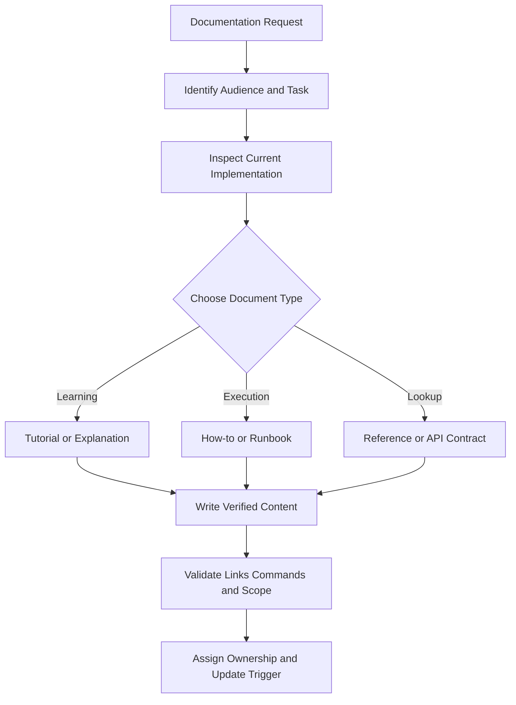
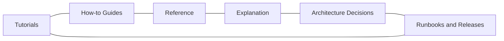

# Documentation Engineering Reference

## Overview

This reference governs architecture decision records, API references, tutorials, runbooks, changelogs, migration guides, troubleshooting, examples, information architecture, and documentation verification.

---

## How AI Agents Should Use This Skill

Load this reference when creating or updating user, developer, operator, release, or architecture documentation. Identify the audience and task first. Verify commands, paths, options, and behavior against the current workspace rather than documenting intended behavior as fact.

### Activation Triggers

- README, guide, tutorial, reference, runbook, ADR, changelog, or migration.
- API docs, command docs, examples, troubleshooting, or onboarding.
- Release notes, operational procedures, or architecture diagrams.
- Documentation drift, broken links, stale commands, or unclear ownership.

### Step-by-Step Agent Workflow

1. Identify audience, task, prerequisite knowledge, and success condition.
2. Inspect the implementation and existing documentation hierarchy.
3. Choose tutorial, how-to, reference, explanation, ADR, or runbook form.
4. Write task-oriented content with verified examples.
5. Validate links, commands, terminology, accessibility, and version scope.
6. Record ownership and update triggers for drift-prone content.

---

## Mermaid Documentation Workflow

## Mermaid Documentation Domain Map

---

## Global Guards

### Forbidden Behaviors

- Documenting commands, paths, flags, or behavior without verification.
- Mixing tutorials and exhaustive reference into one undifferentiated page.
- Using placeholder prose in final documentation.
- Hiding prerequisites, destructive effects, or required privileges.
- Copying the same fact into multiple sources of truth without ownership.

### Required Behaviors

- State audience, prerequisites, scope, and expected result.
- Use real terminology from the product.
- Mark destructive or privileged operations clearly.
- Keep examples minimal, complete, and tested.
- Link to a canonical source for rapidly changing details.

## Domain Rules

### Tutorials and How-to Guides

- Tutorials teach a complete path; how-to guides solve a specific task.
- Show verification after consequential steps.

### Reference

- Optimize for lookup with stable headings and exact contracts.
- Separate required, optional, default, and error behavior.

### ADRs and Explanations

- Record context, decision, alternatives, tradeoffs, and consequences.
- Do not rewrite historical decisions silently.

### Runbooks and Releases

- Include detection, containment, recovery, rollback, and escalation.
- Changelogs describe user-visible changes and migration impact.

## Verification Checklist

- Audience and document type are clear.
- Commands and examples execute as written.
- Links and file references resolve.
- Privilege and destructive effects are visible.
- Version scope and compatibility are stated.
- Ownership and drift triggers are known.

## Integration Map

- Use `api_design.md` for API contracts.
- Use `cli_tui_engineering.md` for command references.
- Use `package_release.md` for changelogs and releases.
- Use `accessibility_engineering.md` for readable structure and diagrams.

## Completion Contract

Documentation is complete only when the intended audience can perform or understand the target task using verified, scoped, maintainable information.
