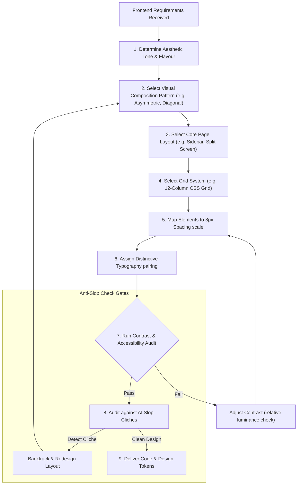

# Frontend Design Supporting Skill: Distinctive Layouts and Compositions
License: Complete terms in LICENSE.txt

This skill guides the creation of distinctive, production-grade frontend interfaces that avoid generic "AI slop" aesthetics. Implement real working code with exceptional attention to aesthetic details and creative choices.

---

## 1. §UI_UX_CREATION_FLOW

---

## 2. How the AI Must Apply This Skill
When designing or building user interfaces under this supporting skill, the AI agent must enforce the following design behaviors:
1. **Choose an Expressive Aesthetic Direction**: Before writing code, declare a clear, bold visual direction (e.g. brutalist, refined luxury, tech-minimalist, editorial).
2. **Apply Visual Compositions Intentionally**: Define the visual flow of your layout using one of the 27 composition patterns. Avoid generic centered layouts; use diagonal alignment, asymmetrical balance, or the rule of thirds.
3. **Map the Page Layout & Grid System**: Select a grid system (like a 12-column responsive layout or baseline alignment). Ensure spacing conforms strictly to the 8px system.
4. **Enforce Distinctive Typography**: Do not default to system fonts or Inter. Choose a display font and body font pair that matches the aesthetic theme.
5. **Run the Anti-Slop Audit**: Check the visual elements against banned defaults (such as purple gradients, gratuitous glassmorphism, or shadow-everything layouts). Apply textured backgrounds and clean line borders to create visual depth.

---

## 3. §VISUAL_COMPOSITION
Master the followings to build breathtaking, balanced, and structural visual canvases:

1. **Centered Composition**: The primary focal element is placed exactly at the visual center. Best for clean heroes, landing landing pages, and minimal dashboards.
2. **Symmetrical Balance**: Mirroring elements on the left and right sides of a central axis. Creates stability, formality, and a sense of refinement.
3. **Asymmetrical Balance**: Balancing elements of different visual weights (e.g., a large text block on the left balanced by a small, vibrant interactive element on the right). Dynamic and engaging.
4. **Radial Composition**: Focus radiates outward from a central point. Draws attention deeply into the center element.
5. **Diagonal Composition**: Organizing visual flow along a diagonal line. Directs the eye across the canvas, feeling fast, energetic, and modern.
6. **Triangular Composition**: Placing focal elements to form a stable triangle. Solid, grounded, and structurally sound.
7. **L-Shape Composition**: Elements arranged along the vertical and horizontal edges, forming an "L". Great for structural frame designs.
8. **Z-Pattern**: Natural scanning path for image-rich layouts. Eyes move: Top-left → Top-right → Bottom-left → Bottom-right.
9. **F-Pattern**: The standard scanning path for text-heavy layouts (like articles or blogs). Top horizontal → Lower horizontal → Vertical stem.
10. **Rule of Thirds**: Overlaying a 3x3 grid and placing key elements on intersection points or gridlines for natural asymmetry.
11. **Golden Ratio**: The 1:1.618 ratio. Use for calculating layouts, container sizes, typography scaling, and spacing.
12. **Golden Spiral**: A logarithmic spiral derived from the Golden Ratio. Placing focal points along the spiral's convergence.
13. **Framing**: Framing the primary object with borders, layouts, or surrounding components to heighten focus.
14. **Leading Lines**: Subtle visual lines or alignments pointing the user's eye directly to a conversion target or CTA.
15. **Negative Space**: Allowing elements ample empty space (whitespace) to breathe, elevating readability and luxury.
16. **Foreground-Middleground-Background**: Layering content using z-index, scale, blur, and opacity to construct depth.
17. **Visual Hierarchy**: Guiding priority by size, weight, color contrast, and vertical positioning.
18. **Contrast Composition**: Creating focal anchors by contrasting color temperature, scale, shape, or texture.
19. **Repetition**: Reusing components, shapes, and patterns to establish cohesiveness and rhythm.
20. **Rhythm**: Systematic repetition of elements with variations in spacing or size, introducing movement.
21. **Proximity**: Placing related elements closer together, signaling connection (Gestalt principles).
22. **Alignment**: Aligning elements to standard axes to create neatness, logic, and structure.
23. **Scale Composition**: Drastically exaggerating the scale of certain elements (like hero headings) to establish dominance.
24. **Layered Composition**: Overlapping elements (like text on top of floating shapes) to present a rich, textured depth.
25. **Modular Composition**: Designing with highly structured, self-contained modular components.
26. **Organic Composition**: Breaking from rigid lines to use fluid, asymmetrical curves, and freeform shapes.
27. **Grid Composition**: Adapting layout strictly along structural columns and rows.

---

## 4. §UI_UX_LAYOUT
Choose layouts intentionally based on the user's task and desired tone:

### General Page Layouts
* **Single Column**: Linear layout centered on the screen. Best for blogs, articles, and simple forms.
* **Two Column**: split screen or main-content + sidebar layout. Ideal for docs, applications, and dashboards.
* **Three Column**: Main content flanked by left navigation and right inspector panels.
* **Multi Column**: Grid-like distribution of text or products.
* **Full Width**: Spans 100% of the viewport width. Good for immersive media platforms.
* **Boxed**: Constrained to a maximum width (e.g., 1200px) with centered alignment. Clean and predictable.
* **Split Screen**: Screen split 50/50 vertically. Perfect for logins, dual-features, or high-impact storytelling.
* **Sidebar Layout**: Fixed left/right column for navigation, leaving the rest of the canvas for workspace.
* **Top Navigation**: Clean header nav layout, leaving maximum vertical space.
* **Bottom Navigation**: Crucial for mobile apps, placing main routes within direct thumb reach.
* **Dashboard Layout**: Information density dashboard using cards, grids, and modular visualization blocks.
* **Card-Based**: Chunking information into visual containers. Highly adaptable and responsive.
* **Magazine**: Editorial layout using massive typography, columns, and variable image scales.
* **Masonry**: Brick-layer style (like Pinterest), packing items of varying heights efficiently.
* **Hero**: A large visual section at the top of a page with an impact header and call-to-action (CTA).
* **Landing Page**: Goal-oriented single page designed for conversions (Hero → Features → Proof → CTA).
* **Long Scroll**: Storytelling layouts with scroll-triggered animations.
* **One Page**: Simple scroll-spy navigation where all sections live on one page.
* **Wizard / Stepper**: Breaking complex processes into linear step-by-step layouts.
* **Form Layout**: Clean labels, clear groupings, and single-column inputs for high conversion.
* **List Layout**: Linear stack of items. Excellent for logs, feeds, and directory panels.
* **Table Layout**: Structured tabular data with clean headers, sorting, and pagination.
* **Feed Layout**: Continuous vertical scroll of items (social media streams).
* **Chat Layout**: Alternating message bubbles/blocks with a pinned bottom input panel.
* **Profile Layout**: Header card showing identity stats, followed by personal feed/details tabs.
* **Settings Layout**: Categorized side-tabs with quick toggle controls and preferences.
* **Gallery**: Grid of media cards designed for browsing images/video.
* **Portfolio**: Clean showcases combining work items with large, high-impact headings.
* **Pricing**: Side-by-side comparative feature cards highlighting the "Popular" plan.
* **E-commerce Product**: Large image carousel on one side, product details/purchase controls on the other.
* **Checkout**: Split checkout with inputs on the left, order summary card on the right.
* **Search Results**: Left-side filters, right-side dynamic result cards or listings.
* **Map-Based**: split screen layout with interactive map on one half, location listings on the other.
* **Kanban**: Horizontal columns representing stages of workflow, containing cards.
* **Calendar**: Grid of dates showing scheduled items, events, and agendas.
* **Timeline**: Vertical or horizontal line indicating sequential milestones.

### Grid Systems
* **Manuscript Grid**: The single large column with generous margins.
* **Column Grid**: 12-column layouts for desktop, scaling down to 8 or 4 for smaller devices.
* **Modular Grid**: Grid with both column and row constraints creating uniform content blocks.
* **Baseline Grid**: Spacing based strictly on typography line-heights, locking elements to a vertical rhythm.
* **Hierarchical Grid**: Custom coordinates based strictly on element importance.
* **Fluid Grid**: Scalable percentage-based grid.
* **Fixed Grid**: Rigid pixel-based sizing.
* **Responsive Grid**: Flexbox/Grid layouts configured via media query breakpoints.
* **CSS Grid**: Modern grid layouts utilizing grid displays.
* **Flexbox Layout**: Flexible 1D alignment.

---

## 5. §LAYOUT_COMPOSITION_PRINCIPLES

### 1. Grid Sizing & Margins Mappings
* Desktop Viewports (above 1200px): Use 12 columns, 32px gutters, and dynamic side margins (10% container bounds).
* Tablet Viewports (768px to 1024px): Scale down to 8 columns, 24px gutters, and 32px outer margins.
* Mobile Viewports (below 768px): Restructure to a single column (or 4 columns for small widgets), 16px gutters, and 16px margins.

### 2. Spacing Scales (8px Base)
Establish clean visual groupings by locking paddings and margins to the system scale:
* *Micro elements*: 4px or 8px (borders, input labels, badge margins).
* *Normal groupings*: 16px or 24px (card paddings, text block margins).
* *Structural separations*: 48px, 64px, or 96px (hero section margins, workspace gutters).

---

## 6. §FRONTEND_AESTHETICS
Avoid "AI Slop" — standard templates, purple gradient overlays, default Inter fonts, and unopinionated UI layouts.

### 1. Typography Selection & Scale
* **Do Not Use Cliche Fonts**: Ban the usage of Inter, Roboto, Arial, and Space Grotesk across projects.
* **Select Distinctive Pairings**: Pair a highly characterful header font with a clean, readable body font:
  * Refined Luxury: Playfair Display paired with Outfit.
  * Technical/Minimalist: Space Mono paired with DM Sans.
  * Retro/Brutalist: Syne paired with JetBrains Mono.
  * Modern Editorial: Cormorant Garamond paired with Plus Jakarta Sans.
* **Font Scaling**: Use geometric scales (like Major Third 1.250 or Perfect Fourth 1.333) to determine sizes from a 16px body font:
  * Small captions: 12px or 14px
  * Body copy: 16px or 18px (with 1.5 - 1.6 line height)
  * Subheadings: 20px, 24px, or 28px
  * Main headers: 36px, 48px, or 72px

### 2. Colors & Contrast
* **Do Not Use Plain Gradients**: Avoid solid purple-to-blue gradients on dark backgrounds.
* **Design HSL Palettes**: Define design variables using HSL. Create:
  * Primary background: Low lightness values (e.g. HSL 220, 15%, 8% for dark theme; HSL 40, 20%, 96% for light warm theme).
  * Text contrast: Verify contrast ratios (minimum 4.5:1 for normal copy, 3:1 for large headings) using relative luminance calculation tools.
  * Single Accent: Draw attention by using a single highly saturated color (like Neon Teal HSL 180, 95%, 45%) for active states or CTAs.

### 3. Motion & Micro-interactions
* **Transition Easing**: Never use linear transitions. Use custom cubic-bezier transitions (`cubic-bezier(0.4, 0, 0.2, 1)`) for all hover, click, and slide states.
* **Animation Durations**: Keep micro-interactions fast (100ms - 150ms), layout transitions medium (200ms - 300ms), and page loads staggered (300ms - 500ms).
* **GPU Processing**: Animate only transform and opacity attributes to enable hardware acceleration, avoiding animations of width, height, margins, or positioning parameters.
* **Staggered Delays**: When rendering items (like cards or lists), add sequential animation delays (e.g. 50ms increments) to generate a smooth, flowing reveal.
