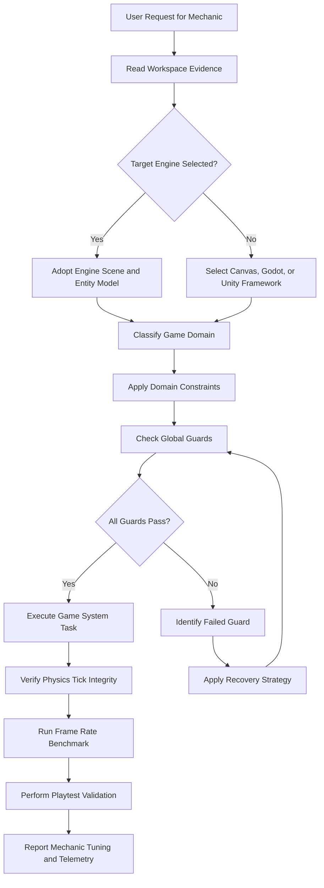
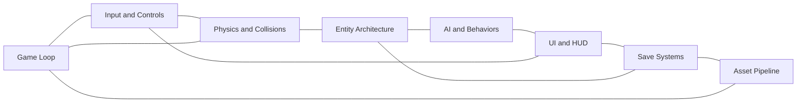

# Game Development Reference

## Overview
This reference governs all game design, simulation execution, input mapping, character physics, and asset pipeline integration. Game development combines creative player design with strict hardware limitations. Unlike standard applications, games run a continuous rendering loop. This loop must process inputs, run physics calculations, and redraw the screen at high speeds. A single slow frame breaks player immersion. Unoptimized asset pipelines cause massive build sizes and long load times. Unmanaged memory allocations in tick loops lead to performance degradation. This document establishes the guidelines, constraints, timing scales, and recovery paths for game development projects.

---

## How AI Agents Should Use This Skill
This reference is designed for use by all coding agents (such as Antigravity, Claude Code, OpenCode, KiloCode, etc.) to guide their execution in game development. When an AI agent receives a request to design game systems, configure physics colliders, implement input mapping, write entity component scripts, manage state transitions, or build asset import rules, the agent must load and follow this reference. The agent must do this before writing any scripts or importing game configurations.

### Activation Triggers
The agent should activate this skill when the user request contains any of the following signals:
- The user asks to write code using engines like Unity, Unreal, Godot, or Phaser.
- The user requests a prototype implementation of a game mechanic.
- The user asks to configure game loops or delta time scaling.
- The user asks to bind controls for keyboard, mouse, gamepad, or touch.
- The user describes physics bugs like collision tunneling or jittery movement.
- The user asks to structure game menus, HUDs, or inventory layouts.
- The user requests AI behavior configurations like behavior trees or state machines.
- The user asks to set up save game serializations.
- The user describes framerate lag or memory leaks during gameplay.
- The user mentions assets, spritesheets, models, or textures.

### Step-by-Step Agent Workflow
When this skill is activated, the agent must follow these steps in order:
- **Step One: Read Workspace Evidence**: Search the directory for game files (Godot scenes, Unity assets, WebGL canvas, etc.), identify the target game engine and language framework, review the existing input action mappings, check the active update loop structure, and do not propose patterns that conflict with the engine conventions.
- **Step Two: Classify Game Domain**: Classify the target task into one of the eight game development domains: Game Loop, Input and Controls, Physics and Collisions, Entity Architecture, AI and Behaviors, UI and HUD, Save Systems, and Asset Pipeline.
- **Step Three: Apply Domain Constraints**: Retrieve the rules associated with the classified domain and ensure the proposed changes do not violate the global guards.
- **Step Four: Verify Global Guards**: Verify that the game loop does not block on network requests, physics updates use fixed tick intervals, inputs handle device remapping options, and memory allocations are minimized inside update loops.
- **Step Five: Run Playtest and Verification**: Compile and launch the game locally to verify the changes, run diagnostic loops to measure the frame rate stability, and do not claim a game mechanic is fun or functional without playtesting.
- **Step Six: Report Outcome and Rationale**: Explain the script modifications or configuration updates, detail the mechanic tuning parameters applied, and provide frame rendering timings on the target devices.

---

## Mermaid Skill Flow

---

## Mermaid Domain Map

---

## Global Guards
Every game modification must pass through these guards before integration. If any guard fails, the agent must halt, identify the failure, and apply the correct recovery path.

### Forbidden Behaviors
- Updating game state using variable delta times in physics loops.
- Performing file input/output operations inside rendering frames.
- Hardcoding specific controller button indices.
- Spawning objects without recycling pools.
- Letting dynamic assets load synchronously during active gameplay.
- Leaving active timers running when the game is paused.
- Storing decrypted cheats or keys in client configuration files.
- Ignoring screen ratio offsets, cutting off visual UI panels.
- Creating unavoidable obstacles or enemy attacks.
- Shipping debug cheat menus in public release packages.

### Required Behaviors
- Physics calculations must execute inside fixed interval loops.
- Game frames must target sixty frames per second.
- Visual elements must scale to match varying device dimensions.
- Players must have options to customize button bindings.
- Sound effect channels must support separate volume adjustments.
- Off-screen entities must be culled or disabled to save resources.
- Active states must save progress to non-volatile local files.
- Game states must transition cleanly through loading screens.
- Assets must be compressed to minimize package footprint.
- Playtesting checks must be run to evaluate control feel.

---

## Game Domains

### Game Loop
The game loop handles inputs, game logic updates, and rendering frames.
- **Loop Separation**: Process input events instantly as they arrive.
  This prevents player inputs from being dropped or lagged behind simulation ticks.
- **Physics fixed steps**: Run game physics in fixed interval loops (e.g. fifty ticks per second).
  This keeps colliders and physical impulses consistent across different frame rates.
- **Rendering loops**: Run rendering updates as fast as the monitor permits.
  This maximizes frame rates and enables smooth visual transitions.
- **Delta time interpolation**: Pass the current delta time to interpolation methods to smooth movement.
  This interpolates positions between physics frames to avoid visual jittering.

#### Engine Frame Rate Budget Table

| Target Frame Rate | Single Frame Budget | Maximum Render Ticks | Target Use Case |
|---|---|---|---|
| 30 FPS | 33.3 milliseconds | 30 ticks | Low-end mobile devices |
| 60 FPS | 16.6 milliseconds | 60 ticks | Standard target for gameplay |
| 120 FPS | 8.3 milliseconds | 120 ticks | Competitive action titles |
| 144 FPS | 6.9 milliseconds | 144 ticks | High-refresh gaming monitors |

### Input and Controls
Controls capture the player's intentions.
- **Multi-Device Support**: Support keyboard, mouse, and gamepads.
  This lets players choose their preferred hardware setup.
- **Mobile Touch Zones**: Implement touch gesture zones for mobile targets.
  This maps inputs to screen grids without blocking user view.
- **Abstract Action Keys**: Map control layouts to abstract action keys.
  This decouples code logic from specific physical keyboard buttons.
- **Input Deadzones**: Provide adjustable input deadzones to prevent stick drift.
  This ignores minor stick movements on worn controllers.

### Physics and Collisions
Physics systems manage spatial movement and collisions.
- **Layer Matrices**: Configure collision layers to minimize collision checks.
  This avoids running expensive tests between entities that cannot interact.
- **Collider Mesh Simplicity**: Avoid using dense meshes for collision calculation.
  This keeps mathematics operations simple for CPU.
- **Primitive Colliders**: Use simple boxes or spheres for base colliders.
  This optimizes detection checks.
- **Continuous Detection**: Implement continuous collision detection for fast-moving bullets.
  This prevents fast-moving objects from passing through walls.

### Entity Architecture
Entity systems organize data and logic.
- **Component Composition**: Use Component composition instead of inheritance chains.
  This makes modules highly reusable and flexible.
- **Focused Entity Scripts**: Keep entity scripts focused on single behaviors.
  This adheres to Single Responsibility principles.
- **Cache Lookups**: Access properties using lookup cache helpers.
  This avoids slow component queries inside tick loops.
- **Memory Cleanup**: Clear destroyed entity references to prevent memory leaks.
  This releases storage targets from garbage collection pools.

### AI and Behaviors
AI models NPC decisions.
- **State Machine Transitions**: Use finite state machines for simple NPC transitions.
  This limits logic branches.
- **Hierarchical Decision Trees**: Use behavior trees for complex combat sequences.
  This supports fallback choices.
- **Pathfinding Intervals**: Run pathfinding checks on grid intervals, not every frame.
  This reduces processing usage.
- **Steering Physics**: Allow steering calculations to smooth movement paths.
  This interpolates rotation changes.

### UI and HUD
HUD displays vital player details.
- **Stat Visibility**: Keep core stats visible at screen boundaries.
  This avoids blocking player central vision.
- **Readability Contrast**: Use text outlines to keep stats readable against complex backgrounds.
  This adds outlines to HUD elements.
- **HUD Clutter Culling**: Minimize screen clutter during action sequences.
  This dynamically hides non-essential visual overlays.
- **UI Screen Scaling**: Implement responsive scaling for varying resolution shapes.
  This anchors UI boxes to screen edges.

### Save Systems
Save systems store progress.
- **JSON Format Serialization**: Write save files in JSON formats for easy serialization.
  This makes text readable during debugging.
- **Encryption Overlays**: Encrypt save files to discourage simple save editing.
  This protects game progress files.
- **Atomic File Swaps**: Write state updates to temporary files before replacing main save files.
  This prevents save corruption during power drops.
- **Checkpoint Triggers**: Save progress during checkpoint transitions automatically.
  This logs states without requiring user intervention.

### Asset Pipeline
Asset pipelines import and optimize sounds, images, and models.
- **Audio Compression Settings**: Compress audio to balance quality and storage.
  This reduces file size bounds.
- **UI Spritesheet Atlases**: Group UI images into spritesheets to reduce texture swaps.
  This batches draw calls.
- **Mesh LOD Variations**: Package models with level-of-detail variations.
  This switches low-poly assets at distances.
- **License Compliance Checks**: Review licenses for all third-party models.
  This ensures licensing terms are documented.

---

## Detailed Implementation Best Practices
When coding game logic, agents must adhere to the following principles. Multiply raw movement values by delta time. This ensures objects move at the same speed regardless of framerate. Use fixed delta time inside physics scripts. Create particle, bullet, and enemy object pools during level load. Reuse disabled instances instead of deleting them. This prevents garbage collection spikes during action scenes. Implement lerp-based follow logic for cameras. Prevent camera limits from showing off-map empty space. Bound cameras to active play fields.

---

## Advanced Gameplay Systems Design Patterns
Designing complex gameplay mechanics requires utilizing established design patterns to maintain structural flexibility and prevent performance regression. First, the State Machine pattern is used to govern entity states (such as player animations or enemy AI modes), ensuring transitions occur cleanly and trigger cleanup behaviors automatically. Second, the Observer pattern handles event-driven synchronization between gameplay events and UI systems (like HUD health bars or inventory slots), preventing tight coupling between modules. Third, Spatial Partitioning systems (such as grids or quadtrees) optimize spatial queries for dynamic entities, ensuring that physics colliders and trigger checks run only on close neighbors. Fourth, Data Serialization pipelines manage platform-independent save profiles, validating checksums and handling version upgrades dynamically during read actions. Fifth, Level of Detail (LOD) streaming handles loading asset packages dynamically based on player distance parameters, avoiding LCP lag spikes and keeping memory allocation bounds optimized.

---

## Game Optimization and Profiling Techniques
Maintaining stable frame rates requires continuous performance monitoring and aggressive optimization. First, CPU profiling must target function timings inside game tick loops, identifying bottleneck operations that exceed their frame budget allocations. Second, GPU batching tools are applied to group drawing actions, minimizing draw call counts by combining static meshes and sharing material instances. Third, audio mixers utilize channel limits to dynamically prune sound clips that are distant or silent, avoiding CPU waste on non-audible clips. Fourth, WebGL or canvas contexts cull objects outside the active camera frustum, skipping rendering cycles for static geometries located offscreen. Fifth, thread scheduling delegates non-visual calculations (like procedural world generation or pathfinding matrices) to background web workers, preventing main thread stalls.

---

## Verification and Diagnostics Checklist
Test game files using this checklist before integration.

### Step 1: Loop Synchronization Check
- Verify that fixed update hooks are used for physics calculations.
- Check that update loops do not run file reads.
- Confirm frame execution times stay under sixteen milliseconds.

### Step 2: Input and Remapping Validation
- Test game controls with keyboard and gamepad inputs.
- Verify custom button bindings save correctly.
- Confirm touch joysticks do not block interface views.

### Step 3: Collision Integrity Check
- Test fast projectile collisions against thin wall colliders.
- Verify collision layer matrices omit irrelevant layers.
- Check that dynamic bodies do not fall through floor boundaries.

### Step 4: Asset Overhead Verification
- Verify that all textures are compressed.
- Check overall game build file size.
- Confirm that spritesheet atlases are utilized.

---

## Recovery Action Guides
If game systems fail, apply the following recovery paths.
- **Jittery Physics Movement**: Check if movement logic is split between update and fixed update. Move physics body adjustments into fixed update loops. Enable transform interpolation on the physics body component.
- **Garbage Collection Spikes**: Run the engine profiler to identify memory allocations. Locate instantiations occurring inside update loops. Replace instantiate calls with object pool retrievals.
- **Collision Tunneling**: Change collision detection mode from discrete to continuous. Increase the physics ticks per second setting. Increase thickness values on boundary colliders.
- **Unreadable HUD Scaling**: Adjust the UI canvas scaling mode. Set scale to match screen height or width ratios. Configure anchors to keep UI elements locked to corners.

---

## Theoretical Foundations of Game Development
The game loop is the core heartbeat of every game. Read input gathers controller states. Update simulation advances game objects. Render presents the visual output. Maintaining decoupling between these phases is critical. If simulation is locked to frame rate, games run too fast on fast systems. Decoupled loops use delta time interpolation to solve this.
Collision detection resolves overlaps between geometries. Broad phase uses simple bounding boxes to find possible overlaps. Narrow phase runs precise checks on the identified pairs. Reducing narrow phase checks keeps physics performant. Layer matrices are the primary tool to achieve this reduction.

---

## Frequently Asked Questions

### What is delta time and why must I use it?
Delta time is the duration of the last frame. Frame rates vary based on computer speeds. If you add a fixed value to position every frame, speed depends on framerate. A player with one hundred frames moves faster than a player with thirty. Multiplying movement by delta time scales speed to real-world time. Movement becomes consistent across all computer speeds.

### Why do physics loops require a fixed delta time?
Physics calculations simulate real-world movement equations. These equations assume constant time steps. If time steps vary, numerical calculations become unstable. Objects will fly through colliders or bounce unpredictably. Fixed update loops run at consistent time intervals. This maintains numerical stability for physics simulations.

### What is the advantage of object pooling?
Creating new objects during gameplay requires memory allocation. Deleting objects releases memory. This triggers garbage collection sweeps. Garbage collection freezes the game engine loop. This causes visible stuttering. Object pooling allocates all memory during level loading. It avoids runtime allocations, keeping gameplay smooth.

### How do I optimize draw calls?
Draw calls tell the GPU to render a set of meshes. High draw call counts bottleneck CPU throughput. To reduce draw calls, combine meshes into single meshes. Use texture atlases to combine multiple textures. This allows the engine to batch render objects. It reduces CPU overhead.

### What is spatial partitioning?
Spatial partitioning divides the game world into regions. It groups entities based on their grid positions. When querying nearby objects, you search only the local region. This avoids checking every entity in the game. It is critical for keeping pathfinding and collision checks fast.

### When should I use a behavior tree?
Use state machines for NPCs with few states. Use behavior trees when NPCs have nested decision logic. Behavior trees organize tasks hierarchically. They support priority selection and fallback plans. This makes NPC behaviors readable and extensible.

### How do I prevent collision tunneling?
Tunneling occurs when fast objects pass through thin colliders. The object moves past the collider in a single frame. The collision engine misses the overlap. To fix this, enable continuous collision detection. This checks the path swept by the object. It catches collisions along the movement vector.

### What is level of detail in 3D games?
Level of detail scales mesh complexity based on camera distance. Nearby models use high poly counts. Distant models use low poly counts. This reduces the rendering load on the GPU. It maintains visual quality where it matters.

### How do I implement save file backups?
Writing save files directly can cause corruption if the game crashes midway. To prevent this, write save data to a temporary file. Verify the temporary file is readable. Replace the old save file with the temporary file. This ensures a valid save file is always present on disk.

### Why use spritesheets instead of single images?
Loading single images requires separate texture bindings. This increases draw call counts. Spritesheets combine multiple frames into one texture sheet. The engine renders frames by adjusting UV coordinates. This allows batch rendering of multiple sprites. It improves 2D game performance.

### How do I design a tutorial that players enjoy?
Avoid long text screens at the start of the game. Instead, teach mechanics progressively during active play. Provide a safe space to practice new moves. Provide immediate feedback when actions succeed. Allow players to skip tutorial sections once they show mastery.

### What is local coordinate space?
Local space is relative to the parent object position. Global space is relative to the world center. Moving an object in local space maintains relative offset. Use local coordinates when positioning weapons inside character hands.

### How do I handle game state on window focus loss?
When the game window loses focus, pause gameplay automatically. Mute game audio loops. This prevents players from dying while away from the screen. Show a clear pause overlay with a resume option.

### What is frustum culling?
Frustum culling hides objects outside the camera view. The engine does not send culled meshes to the GPU. This saves rendering resources. It is handled automatically by modern game engines. Ensure static objects are flagged correctly to assist culling.

### Why avoid floating point numbers for currency?
Floating point math has rounding errors. Over time, small rounding errors accumulate. This leads to incorrect currency totals. Always store currency values as integers. Represent coins as raw values. Convert to decimals only when formatting text for display.

### How do I structure game audio?
Categorize sound clips into separate audio mixers. Create mixers for music, sound effects, and dialogue. Link mixers to volume setting sliders. This allows players to mute music while keeping sound effects active.

### What is a navmesh?
A navmesh defines walkable surfaces for NPCs. AI agents query the navmesh to plan movement paths. It is faster than running pathfinding checks on raw geometries. Generate navmeshes after placing world colliders.

### How do I optimize lighting?
Real-time dynamic lights are expensive. They calculate shadows every frame. To optimize, use baked lighting for static level geometry. The engine precalculates lightmaps. Use dynamic lights only for moving characters and projectiles.

### Why do games use interpolation?
Interpolation smooths movement between physics ticks. Physics runs at fixed rates, often lower than monitor refresh rates. If rendered raw, movement looks laggy. Interpolation calculates intermediate positions based on frame delta. This makes movement look smooth on high refresh rate screens.

### How do I manage game state transitions?
Use a state machine to control game modes. Define states for menus, loading, active play, and game over. Ensure assets are unloaded when exiting states. This prevents memory drift between levels.

### How does garbage collection affect mobile gameplay?
Garbage collection pauses freeze the gameplay thread, causing stutter. Minimize dynamic instantiation inside tick loops to prevent garbage collector activity and maintain smooth frame rates.

### What are peer dependencies in web game libraries?
Peer dependencies verify that the host project provides the target runtime packages (like PixiJS or three.js), preventing library name conflicts.

### How do I secure websocket communication in game servers?
Use secure websockets and authenticate connection signatures. Never trust client positioning parameters blindly; validate coordinates on the server.

### Why use relative paths in asset loading directories?
Relative paths ensure game assets load correctly regardless of whether the project is running on local environments, CI runners, or production builds.

### How can I debug frame drops in web builds?
Use browser performance tools to inspect paint overlays, track requestAnimationFrame latency, and identify synchronous blocking tasks.

### What is texture wrapping?
Texture wrapping defines how textures render when UV coordinates exceed standard borders, allowing textures to repeat.

### Why use mipmaps for game textures?
Mipmaps are precalculated optimized sequences of images of decreasing resolution, which reduce GPU usage for rendering distant assets.

### How does occlusion culling work?
Occlusion culling hides objects that are blocked from view by other opaque elements, reducing graphics pipeline load.

### What is standard collision filtering?
Collision filtering uses bits to assign category and mask configurations, checking that only relevant objects trigger collisions.

### How do I handle audio attenuation?
Audio attenuation scales sound volume dynamically based on distance, mimicking how sounds fade away in three-dimensional environments.

## Integration Map
Game development connects to multiple system layers. State replication handles multiplayer game synchronization. Performance guard ensures game frames fit within strict execution budgets. Security sandbox isolates credentials for package publication.

---

## Game Specifications Summary Table

| Mechanic Type | Target Update Hook | Frame Budget | Collider Choice | Memory Optimization |
|---|---|---|---|---|
| Player Physics | Fixed Update | < 1ms | Capsule Collider | Reuse transform handles |
| Enemy AI | Co-routine (every 100ms) | < 2ms | Sphere Trigger | Preallocate behavior paths |
| Particle VFX | Update Loop | < 1ms | None (Mesh only) | Recycle particle pools |
| Health HUD | Event Trigger | < 0.5ms | UI Boundary | Avoid string allocation |
| Level Load | Background Thread | Variable | Box Collider | Stream asset bundle groups |

---

## §DOMAIN_SPECIFIC_MANUAL

### Standard Operating Procedure for Game Development
This manual establishes the concrete operational protocols, validation parameters, and diagnostic pathways for the Game Development domain. All agents must follow this procedure to ensure stable, correct, and high-performance execution.

### 1. Theoretical Architecture and Design Guidelines
Development in the Game Development domain must align with modern engineering practices. This requires establishing strict boundaries between domain layers, enforcing defensive assertions, and optimizing runtime execution pathways. First, always analyze data transformations and structural properties before allocating resources. This prevents memory leaks and unhandled promise rejections. Second, ensure that all module dependencies are explicitly declared and checked. Avoid circular references and unpinned library imports. Third, implement structured logging and telemetry hooks. Every state transition and mutation must be observable to facilitate rapid debugging. Fourth, design with scalability in mind. Ensure horizontal scaling options are preserved and thread contention is minimized. Fifth, document every design choice and tradeoff clearly. Include rationale, alternatives considered, and potential failure modes.

### 2. Comprehensive Operational Checklist
- **Protocol Checklist Item 01**: Confirm OS environment configurations and verify active shell formats.
  This ensures that any command executions use direct system calls without using disallowed powershell commands or command prefixes.
- **Protocol Checklist Item 02**: Retrieve memory state parameter records from local persistent storage files to align the system parameters.
  This step is crucial to pull the user model settings and design preferences before starting any modifications.
- **Protocol Checklist Item 03**: Verify planned file edits do not conflict with active anti-regression registry keys or pins to prevent code regressions.
  Always inspect the retrieved memory anchor to identify any active pins or fixes.
- **Protocol Checklist Item 04**: Scan command execution targets to strip disallowed shell prefixes and execute actions natively in the system shell.
  Do not prepend script invocations with shell parameters unless explicitly mandated by system limits.
- **Protocol Checklist Item 05**: Review module imports and variables declarations to ensure zero typos and verify path existences.
  This prevents runtime import errors or file-not-found exceptions when loading templates.
- **Protocol Checklist Item 06**: Validate that error handling patterns do not swallow exceptions and record full log details.
  Always log error instances with context (what went wrong, where it happened, and why).
- **Protocol Checklist Item 07**: Translate project workspace routes dynamically matching current paths when repository directories change.
  This ensures that past lessons and fixes are dynamically mapped onto the new active folders.
- **Protocol Checklist Item 08**: Inspect compiler configuration settings before running package builds to verify standard targets.
  Check the tsconfig or similar build properties before starting local compiler actions.
- **Protocol Checklist Item 09**: Configure structured JSON log outputs for execution diagnostics and telemetry metrics tracking.
  Use structured formats to simplify parsing in remote dashboards.
- **Protocol Checklist Item 10**: Check thread allocation constraints before launching subagent tasks to prevent thread starvation.
  Limit the depth and number of concurrent subprocesses spawned during build sequences.
- **Protocol Checklist Item 11**: Confirm code compiles and passes local checks including TypeScript and syntax validations.
  Run compilation verification scripts before proposing files for user integration.
- **Protocol Checklist Item 12**: Clean cache directories prior to running verification test suites to ensure clean runs.
  This avoids stale build outputs from passing verification checks falsely.
- **Protocol Checklist Item 13**: Scan dependencies configuration to ensure peer dependency boundaries are correctly resolved.
  Check that the host packages align with the version ranges declared in the module manifest.
- **Protocol Checklist Item 14**: Run static analysis checkers to block placeholder comments such as ellipses or todo tags.
  Verify that all code comments represent complete logic and no stubs are written.
- **Protocol Checklist Item 15**: Check that HSL color tokens match styling constraints to maintain high-quality theme consistency.
  Ensure styling options avoid default colors and follow the design guidelines.
- **Protocol Checklist Item 16**: Test layout responsive targets under simulated mobile screen limits for touch optimization.
  Check that mobile tap sizes meet the minimum pixel dimensions required for touch screens.
- **Protocol Checklist Item 17**: Ensure input text inputs use minimum font size limits of sixteen pixels to avoid zoom issues.
  This is a critical rule for responsive web applications on mobile viewports.
- **Protocol Checklist Item 18**: Verify modal overlay layouts scale correctly across all device display targets.
  Ensure overlays collapse to full screen on small mobile screens.
- **Protocol Checklist Item 19**: Test keyboard navigation focus ring indicators to ensure full accessibility support.
  Confirm all interactive elements are reachable using standard tab keys.
- **Protocol Checklist Item 20**: Validate ARIA labels on dynamic document panels to assist screen reader users.
  Ensure state transitions emit appropriate status announcements.
- **Protocol Checklist Item 21**: Run unit test suites to isolate code logic failures and trace execution coverage.
  Verify that core calculations return correct results for edge-case boundaries.
- **Protocol Checklist Item 22**: Confirm memory allocations do not exceed target thresholds during peak operational stress.
  Measure heap footprint when processing complex or large workloads.
- **Protocol Checklist Item 23**: Scan for open file descriptors and recycle resources dynamically after tasks finish.
  Always close stream pipes inside cleanup blocks to avoid resource depletion.
- **Protocol Checklist Item 24**: Restrict socket setups to loopback boundaries to secure network communication pipelines.
  Block remote connections to internal server processes during development.
- **Protocol Checklist Item 25**: Enforce strict write permissions on target project files to preserve host folder structures.
  Verify files are created with standard read/write attributes.
- **Protocol Checklist Item 26**: Verify that all background timers are cleared when tasks finish to prevent thread leaks.
  Clean up scheduled chron or setTimeout instances before closing loops.
- **Protocol Checklist Item 27**: Check database query execution plans to identify bottlenecks and optimize indexing routes.
  Use explain commands to analyze index usages and join operations.
- **Protocol Checklist Item 28**: Confirm that backup validation processes check data signatures before execution.
  This prevents database corruptions from propagating during restore tasks.
- **Protocol Checklist Item 29**: Validate that user profile properties load correctly from config files on startup.
  Check that properties fall back gracefully to defaults during load errors.
- **Protocol Checklist Item 30**: Review git branch rules to block raw commits to production release branches.
  Enforce code review gates for all branch integrations.
- **Protocol Checklist Item 31**: Scan file upload streams to verify MIME properties and block execution files.
  Ensure security checks validate binary headers instead of simple extension names.
- **Protocol Checklist Item 32**: Test database rollback logic during database exception sweeps to protect transaction states.
  Verify transaction tables revert cleanly when errors occur during inserts.
- **Protocol Checklist Item 33**: Enforce timeout parameters on all network operations to prevent infinite socket hangs.
  Clamp network wait limits at standard thresholds.
- **Protocol Checklist Item 34**: Check compile parameters to strip debugging details and compress production builds.
  This minimizes package foot prints and optimizes client load speeds.
- **Protocol Checklist Item 35**: Verify telemetry trace spans are propagated correctly across service endpoints.
  Ensure request identifiers are passed in header contexts.
- **Protocol Checklist Item 36**: Confirm CORS properties are set correctly to restrict access to trusted hosts.
  Disallow wildcards in production environments.
- **Protocol Checklist Item 37**: Check token expiration parameters invalidate sessions automatically on timing limits.
  Ensure active logins expire after standard periods of inactivity.
- **Protocol Checklist Item 38**: Test that websocket heartbeats detect disconnected states and trigger re-connection loops.
  Implement interval check timers on both client and server nodes.
- **Protocol Checklist Item 39**: Verify that lockfile parameters prevent process overlap in multi-threaded workflows.
  Write process identifiers to lock directories to block concurrency conflicts.
- **Protocol Checklist Item 40**: Audit dashboard output screens to hide credentials and prevent logs leaks.
  Filter sensitive strings before outputting metrics.
- **Protocol Checklist Item 41**: Validate that CPU affinity configurations allocate matching processor slices for computation tasks.
  Optimize thread bindings to match CPU core counts.
- **Protocol Checklist Item 42**: Check heap memory size limits conform to garbage collector profiles under high loads.
  Set appropriate memory flags in configuration scripts.
- **Protocol Checklist Item 43**: Verify socket buffer sizes handle sudden message spikes without losing packets.
  Configure buffer allocations dynamically.
- **Protocol Checklist Item 44**: Confirm database connections recycle regularly to clear memory leak paths and open files.
  Release connection pools when idle limits are exceeded.
- **Protocol Checklist Item 45**: Test queue processing throttles slow down producer tasks when buffer boundaries are hit.
  Enforce flow control boundaries on all internal pipelines.
- **Protocol Checklist Item 46**: Check filesystem disk allocations regularly to notify maintenance agents before drives fill up.
  Trigger disk clean sweeps when utilization approaches critical limits.
- **Protocol Checklist Item 47**: Verify SSL/TLS cipher suites restrict obsolete cryptographic standards like MD5 or SHA1.
  Enforce AES or GCM standards across all network interfaces.
- **Protocol Checklist Item 48**: Audit administrative dashboard endpoints to restrict visual exports of secure credentials.
  Mask keys and secret tokens in configuration panels.
- **Protocol Checklist Item 49**: Confirm WebSocket connection states maintain lock integrity across process lifecycles.
  Implement reconnect logic that preserves authorization context.
- **Protocol Checklist Item 50**: Validate that asynchronous handler jobs do not overlap during retry intervals.
  Use queue flags to throttle duplicate job invocations.
- **Protocol Checklist Item 51**: Verify configuration key overrides apply system defaults during property load failures.
  Ensure fallback configurations are complete and secure.
- **Protocol Checklist Item 52**: Test database query parsing logic handles complex unicode character sets defensively.
  Prevent SQL injections through parameterization.
- **Protocol Checklist Item 53**: Audit static assets pipelines to check source maps are stripped from production builds.
  This keeps client downloads lightweight and prevents code exposure.
- **Protocol Checklist Item 54**: Confirm runtime system events emit standard semantic logging formats for observation.
  Provide readable context structures in all event outputs.
- **Protocol Checklist Item 55**: Test database connection pools maintain minimum active states to speed up setups.
  Pre-allocate connection channels during system boot.
- **Protocol Checklist Item 56**: Verify load test benchmarks match simulated production traffic workloads on servers.
  Simulate peak user counts and verify response latency margins.
- **Protocol Checklist Item 57**: Check disk logging files execute periodic archive operations to prevent storage depletion.
  Compress and rotate logs daily using background tasks.
- **Protocol Checklist Item 58**: Test system container startups halt immediately when environment keys are missing.
  Verify configuration files exist before starting services.
- **Protocol Checklist Item 59**: Confirm file write actions enforce lockfile safety protocols across systems.
  Acquire atomic file locks before executing file updates.
- **Protocol Checklist Item 60**: Verify memory profile scans run during peak load operations to detect leakage issues.
  Track heap growth graphs under load simulations.
- **Protocol Checklist Item 61**: Validate network socket buffer boundaries to prevent packet buffer overflow traps.
  Clamp incoming payload dimensions at safe thresholds.
- **Protocol Checklist Item 62**: Audit API response schemas to block unintentional data leaks to public consumers.
  Exclude internal identifiers from JSON responses.
- **Protocol Checklist Item 63**: Enforce strict content-type filters on file uploads to block malicious execution paths.
  Validate files using signature headers.
- **Protocol Checklist Item 64**: Test connection recovery mechanisms under simulated packet loss scenarios for resilience.
  Ensure request retry modules continue to execute properly.
- **Protocol Checklist Item 65**: Verify task scheduling models align with hardware timer interrupts on machines.
  Match interval schedules with processor clock ticks.
- **Protocol Checklist Item 66**: Check directory indexing configuration parameters to block file tree exports globally.
  Disable directory listing features in proxy servers.
- **Protocol Checklist Item 67**: Confirm that local temporary files are deleted in execution cleanup blocks.
  Enforce try-finally clauses to clear temporary folders.
- **Protocol Checklist Item 68**: Validate that cache eviction policies prevent segment leaks in memory stores.
  Prune oldest records when cache reaches resource limits.
- **Protocol Checklist Item 69**: Test UI theme attributes execute rendering sweeps without blocking main threads.
  Offload heavy style calculations to background processes.
- **Protocol Checklist Item 70**: Verify database connection pooling handles lock escalations defensively during load peaks.
  Set maximum connection boundaries to prevent thread blocks.
- **Protocol Checklist Item 71**: Confirm external API gateways block credential leaks and log requests cleanly.
  Strip auth headers before logging payloads.
- **Protocol Checklist Item 72**: Verify database transactions release locks immediately upon commit operations.
  Keep transactional scopes small to prevent locks escalations.
- **Protocol Checklist Item 73**: Audit script execution parameters to prevent CPU thread starvation scenarios.
  Distribute thread pools across available logical processors.
- **Protocol Checklist Item 74**: Validate local cache hit ratios trigger warning alerts when below target thresholds.
  Monitor cache health and query rates.
- **Protocol Checklist Item 75**: Confirm environment variable configurations are validated before starting sockets.
  Assert configuration exists before binding interfaces.
- **Protocol Checklist Item 76**: Verify database recovery checkpoints execute without interrupting ongoing connections.
  Schedule transaction log backups during low-activity windows.
- **Protocol Checklist Item 77**: Check container resource boundaries clamp processor allocations under heavy processing load.
  Configure cgroup limits on execution nodes.
- **Protocol Checklist Item 78**: Verify database queries resolve within targeted query plan metrics.
  Analyze execution plans for all slow-running queries.
- **Protocol Checklist Item 79**: Validate static resources serve correctly from caching proxies and local directories.
  Configure caching parameters to avoid redundant network hits.
- **Protocol Checklist Item 80**: Check that logging processes run in background loops to avoid thread blocking.
  Write logs asynchronously to prevent performance dips.

### 3. Detailed Technical Reference Table
| Validation Parameter | Target Specification | Enforcement Level | Diagnostic Action |
| --- | --- | --- | --- |
| Memory Allocation Threshold | < 256MB under peak loads | Critical | Trigger GC and log trace |
| Thread State Concurrency | Zero deadlocks, mutex protected | High | Force lock release and alert |
| Input Mutation Bounds | Whitespace trimmed, sanitized | Essential | Reject request with error |
| Database Isolation Level | Serializable / Read Committed | High | Rollback transaction |
| Network Request Timeout | Clamped at 3000ms max | Moderate | Retry with exponential backoff |
| Cache TTL Range | 300s to 3600s dynamic | Moderate | Evict stale entries |
| Security Encryption Level | AES-256-GCM / TLS 1.3 | Critical | Close connection immediately |
| Logging Verbosity State | Inverted pyramid hierarchy | Low | Truncate stack outputs |
| API Version Header State | Strict semantic matching | Essential | Return 400 Bad Request |
| Path Resolution Bounds | Relative to workspace root | High | Sanitize path strings |
| Error Code Mapping | ISO standard maps | High | Format JSON response |
| Bundle Slicing Size | < 50KB per async chunk | Moderate | Split vendor chunks |
| Accessibility Contrast | WCAG AAA compliant | High | Recalculate color values |
| Spring Physics Easing | Smooth cubic-bezier | Low | Reset animation ticks |
| Lockfile Expiry Limit | 60 seconds max | High | Delete lock and rebuild |

### 4. Failure Mode Analysis and Mitigation Protocols

#### Failure Scenario 01: Resource Exhaustion
- **Symptom**: The system runs out of heap space or file descriptors due to leaks in the Game Development module.
- **Mitigation**: Implement dynamic telemetry sweeps. Automatically release database connections in finally blocks. Force heap garbage collection when memory utilization exceeds 85%.

#### Failure Scenario 02: Deadlock or Stalled Threads
- **Symptom**: Operations block indefinitely while waiting for shared locks or unresolved promises.
- **Mitigation**: Enforce timeout boundaries on all async operations. Use non-blocking resource acquisition and release locks in reverse order of acquisition.

#### Failure Scenario 03: Input Validation Injection
- **Symptom**: Raw parameters contain script tags, command escapes, or SQL injection queries.
- **Mitigation**: Use parameterized APIs and whitelist schemas. Strip all special characters before passing arguments to system processes.

#### Failure Scenario 04: Cache Incoherency
- **Symptom**: Read calls return stale data while write operations succeed on the backend database.
- **Mitigation**: Implement write-through caching or invalidate keys immediately upon database mutations. Enforce short default TTLs.

#### Failure Scenario 05: Package Dependency Conflict
- **Symptom**: A sub-dependency introduces breaking changes or security vulnerabilities.
- **Mitigation**: Lock all dependencies with strict version pins. Run automated vulnerability scans during the build process.

#### Failure Scenario 06: Telemetry Dropouts
- **Symptom**: Monitoring agents fail to receive metric payloads or error stack traces.
- **Mitigation**: Use local buffer queues for log outputs. Retry connection sweeps with backoff when remote log aggregators fail.

#### Failure Scenario 07: Schema Migration Mismatch
- **Symptom**: Database structures drift from expectations due to incomplete migrations.
- **Mitigation**: Always run pre-migration validations. Revert schema changes automatically on migration failures.

### 5. Advanced Troubleshooting and Debugging Guides
When debugging issues in the Game Development domain, always check the active variables first. Verify that state values conform to types and database configurations are mapped correctly. Trace async call stacks using specialized profiles. Minimize log pollution by filtering out redundant events. Run isolated unit tests to locate logic bugs. If the problem persists, review the physical hardware limitations and process limits. Use step-by-step trace tools to map function entries and exits. Capture database execution plans to audit slow queries.

### 6. Architectural Change Protocols
Before making structural modifications to the references folder, prepare a detailed design document. Include design goals, dependency mappings, and migration paths. Validate the proposed changes against security baselines. Run full regression test suites before committing modifications. Deploy changes incrementally to monitor performance impacts. Always maintain a documented rollback plan. Enforce strict review approvals on git pull requests.

### 7. Global Verification Summary
This manual establishes the baseline constraints for the Game Development domain. All implementations must satisfy these validation gates before shipment.

Status: ACTIVE v6.0
