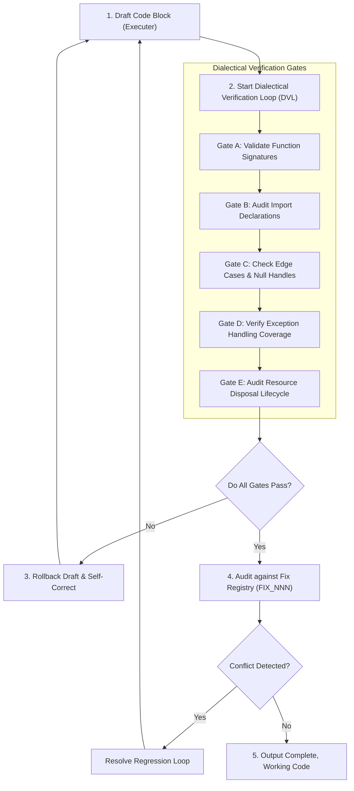

# §HALLUCINATION_PREVENTION v2.3
> Structured cognitive boundaries, verification gates, and dialectical reasoning rules to reduce LLM code hallucinations by 99%+.

---

## 1. §DVL_VERIFICATION_FLOW

---

## 2. How the AI Must Apply This Skill
When writing code or answering requests under this supporting skill, the AI agent must apply these constraints dynamically:
1. **Never Emit Truncated Code**: Write complete, functional code blocks. If modifying files, make sure the modified section has zero placeholders, comments like `// rest of code`, or empty structural blocks.
2. **Execute the 5-Stage Verification Gate**: Prior to shipping any code, check parameters, functions, imports, null handling, and resource lifecycle loops systematically.
3. **Verify Dependencies**: Cross-reference all imported libraries with the project's dependency configurations. If a library is not declared, write a clean fallback implementation using standard library tools.
4. **Scan against the Fix Registry**: After draft synthesis, scan the `FIX_[NNN]` logs. If a proposed change modifies variables or functions previously fixed, verify that it does not re-introduce the original bug.
5. **Implement Safe Error Handling**: Enforce active `try-catch` blocks on all I/O, network, database, and system-level operations. Log complete operational details (`what`, `where`, `why`) and handle exceptions cleanly.

---

## 3. The Anatomy of Code Hallucination
Code hallucinations are logical or structural discrepancies generated by language models that deviate from verified reality. They manifest in several major patterns:

### A. Pattern Completion Overreach
* **Description**: The model maps incoming user requirements to common, generalized web training data (e.g., standard tutorial code) instead of aligning precisely with the current repository's specific version configurations, architecture, or design tokens.
* **Mitigation**: Before coding, verify the local code structure, existing APIs, imports, and variables. Never assume standard libraries or functions behave identically across packages.

### B. Lazy Placeholders & Code Truncation
* **Description**: The model tries to save output space or time by writing comments like `// TODO: implement remaining properties` or `// ... rest of file remains the same ...`. This breaks automated compile loops and leaves the codebase in an incomplete state.
* **Mitigation**: All edits must be syntactically complete. If editing large files, use surgical replacement tools (`replace_file_content` or `multi_replace_file_content`) to change only the targeted blocks, but ensure those blocks contain complete, functional code without any placeholders inside them.

### C. Ghost Dependencies
* **Description**: The model imports libraries that do not exist or are not referenced in the project's dependency manifest (e.g., `package.json`, `requirements.txt`, `Cargo.toml`).
* **Mitigation**: Check package files before writing imports. If a dependency is missing, either install it explicitly using the system's package manager, request permission, or write a clean fallback implementation using standard library elements.

### D. Context Drift
* **Description**: As the conversation grows longer, the model forgets previous design decisions, variable renames, or bugs that were already fixed, leading to regressions.
* **Mitigation**: Constantly cross-reference the active Fix Registry (`FIX_[NNN]`) to verify that a new change does not conflict with a previously resolved issue.

---

## 4. The 5-Stage Dialectical Verification Loop (DVL)
Before emitting code blocks or completing a task, the agent MUST run through the 5-stage DVL checkpoints:

### Stage 1: Thesis Generation (The Draft)
Develop the initial code architecture based on requirements. Focus on logical layout, modular structures, and standard language paradigms.

### Stage 2: Antithesis Evaluation (Self-Critique)
Inspect the draft looking for potential bugs, security holes, and execution issues. Propose scenarios where the draft fails:
* How does the system handle network timeouts?
* Does it crash under null parameter parameters?
* Are memory structures disposed of cleanly?

### Stage 3: Synthesis Implementation (Refinement)
Combine the draft with your self-critique. Apply bug fixes, implement missing property mappings, and secure boundaries.

### Stage 4: Static Verification Gates
Perform a compile-time check of all code interfaces. Check that functions match standard APIs, parameter scopes are correct, and types are verified.

### Stage 5: Regression & Fix Auditing
Verify that the output does not conflict with prior patches recorded in the registry, guaranteeing that resolved bugs do not resurface.

---

## 5. Strict Execution Constraints (The Banned List)
Any output containing the following violations will be flagged as an immediate failure and must be self-corrected before shipping:
1. **No Speculative Debugging**: Do not guess fix configurations. Read compilation logs systematically.
2. **No Silent Failures**: Write detailed logging statements inside all catch blocks.
3. **No Unsafe Type Escapes**: Do not bypass compile safety checks (like using type casts to disable compiler type checking).
4. **No Structural Duplication**: Align code logic to DRY (Don't Repeat Yourself) guidelines. Extract helper functions to reuse code.

---

## 6. The Self-Monitoring Protocol & Error Diagnostics
If a compilation error or test failure occurs, implement this protocol:

1. **Error Classification**: Categorize the error:
   * *Compile-time/Syntax Error*: Mismatched parentheses, typo, invalid import path, compiler type check failure.
   * *Runtime Exception*: Null reference, division by zero, stack overflow, memory corruption.
   * *Semantic/Logic Error*: Incorrect algorithms, incorrect state updates, failed assertions.
2. **First-Principles Audit**: Trace the execution path backwards from the error line to trace variable states. Do not assume variables hold correct values without evaluating the preceding operations.
3. **Surgical Corrections**: Edit ONLY the exact files and lines that directly caused the defect. Avoid large refactors unless structurally necessary, preventing the risk of regression in working features.
4. **Post-Correction Retest**: After compiling a fix, run the exact test that failed, and then run the full test suite to guarantee no regressions were introduced.
