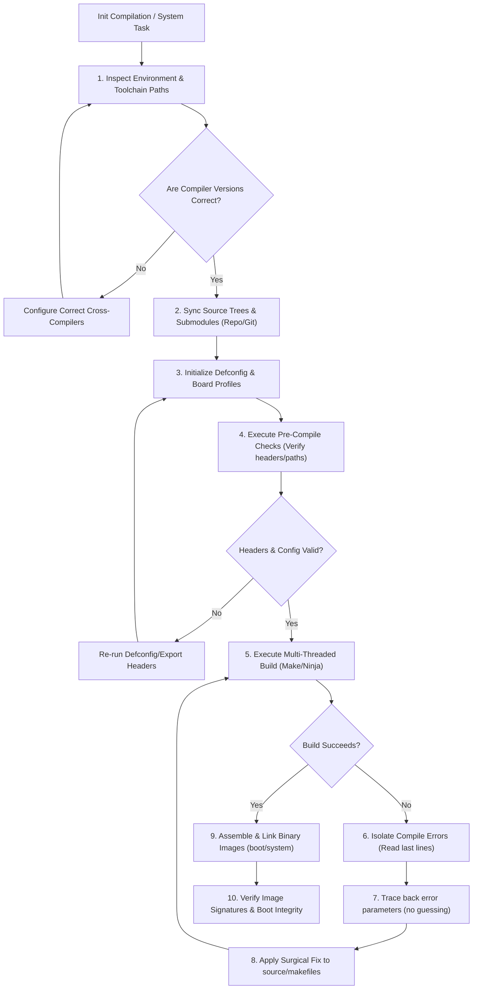

# Heavy & Complex Systems Engineering Supporting Skill
License: Complete terms in LICENSE.txt

This skill guides the AI agent through executing massive, highly complex, and long-horizon software engineering tasks—such as building Linux/Android kernels, compiling custom Android ROMs, bootstrapping operating systems, writing compilers, and architecting enterprise full-stack platforms.

---

## 1. §HEAVY_ENGINEERING_FLOW

---

## 2. How the AI Must Apply This Skill
When tasked with system-level compilations, kernel development, or custom ROM building under this supporting skill, the AI agent must adopt these operational parameters:
1. **Audit the Toolchain First**: Never begin a build command without checking compiler versions (e.g. clang, GCC), target architectures, cross-compiler paths, and system path variables.
2. **Execute Repo Synchronization Conservatively**: When running repo sync, enforce strict network controls. Set clone limits, limit sync threads to prevent connection dropouts, and bypass unneeded tags.
3. **Initialize Configuration Profiles Safely**: Utilize clean configuration targets (like mrproper) before loading defconfigs. Do not edit config headers manually; manage compile options using setup tools.
4. **Isolate Compilation Errors**: If a build fails, do not attempt dynamic flag additions. Locate the precise error from compiler outputs, extract the failing command line, and execute it in isolation to diagnose the failure.
5. **Enforce Build Caching**: Enforce compilation cache allocations (like CCache size settings) within environment parameters to optimize subsequent builds.

---

## 3. §COMPLEX_SYSTEMS_GUIDELINES

### 1. Android/Linux Kernel Compilations
* **Target Architecture Configuration**: Define the architecture target keys explicitly in the build environment parameters. Align compilation targets to the ARM64 processor architecture structure.
* **Cross-Compiler Declarations**: Map toolchain directories to cross-compiler parameters. Point compiler systems to CLANG binary paths and set correct target triples (e.g. standard aarch64 Android compiler profiles).
* **Configuration Clean Up**: Before building, clear intermediate files and previous compile options. Load the target board configuration definitions using standard configuration targets.
* **Multi-threaded Compilation**: Configure build threads to match the available CPU count of the host machine, optimizing compilation speed.
* **Device Tree Blobs (DTB)**: Compile device tree overlays and device tree source (DTS) files into device tree blobs (DTB) using device tree compiler (DTC) tools. Check compiled binaries for warnings before linking them to the kernel boot image.
* **Symbol Matching**: Compare symbol addresses (using files like Module.symvers) to check module compatibility.

### 2. Android Custom ROMs (AOSP / LineageOS)
* **Manifest Management**: Select target branch manifestations when checking out repositories. Create custom local manifests to integrate external device trees or vendor components without altering the main manifest.
* **Synchronization Rules**: Run source sync operations using shallow clones and thread limits to prevent server timeouts.
* **CCache Setup**: Define cache paths and size options (e.g. 50GB minimum) in environment variables to reuse compiled object files and shorten iterative build steps.
* **Vendor Blobs Extraction**: Extract proprietary hardware blobs (like camera, GPU, and radio binaries) from source devices or flashable image files. Map them under the vendor folder matching device configuration rules.
* **Build System Setup**: Load environment definitions, run lunch options specifying product configurations and debug types, and execute target image compilation targets (such as mka bacon).

---

## 4. §RESILIENCE_GATE
If a build or compilation fails, apply the diagnostic protocol:

### Step 1: Log Parsing
Do not parse the entire log from the top down. Scroll to the bottom of the output, locate the compilation failure line, and trace back to find the actual compiler error description.

### Step 2: Error Classification
Identify the nature of the error:
* Missing include headers or dynamic declarations.
* Unresolved linker symbols or library paths mismatch.
* Typo or syntax error inside compiler flags.
* Out of memory (OOM) compilation crash.

### Step 3: Isolated Command Run
Isolate the specific file compilation command that failed. Execute it in the shell with verbose options enabled to debug the compiler's output and determine if compile search paths are wrong.

### Step 4: Verification and Rebuild
Apply the correction (e.g. patching Makefile, adding missing includes, or modifying configurations), clean the target subsystem, and compile again.
