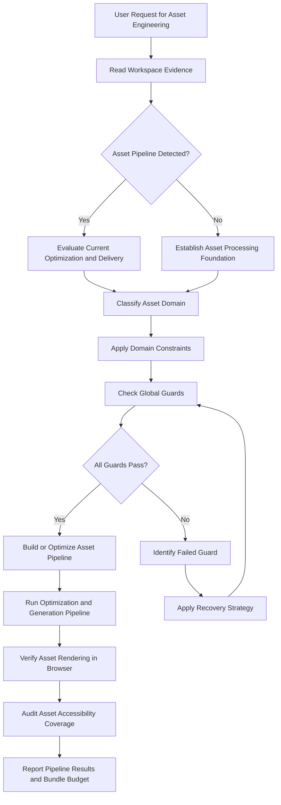
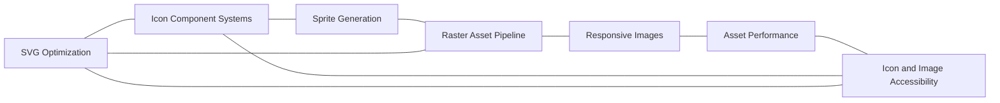

# Icon and Asset Engineering Reference

## Overview

This reference governs the creation, optimization, component integration, sprite generation, raster processing, responsive image delivery, performance budgeting, and accessibility of icons and visual assets. Icons and images constitute the majority of visual weight in modern interfaces. Poorly engineered assets degrade page load times by hundreds of kilobytes, cause layout shift during rendering, fail to render correctly across browsers and platforms, and exclude screen reader users from the visual content they complement.

A systematic asset engineering pipeline treats visual assets as code. It optimizes SVGs at build time rather than design time. It generates responsive image variants automatically. It produces sprite sheets and icon component trees that support tree-shaking. It validates alt text coverage as part of the CI pipeline. This reference establishes the principles, tooling configurations, and verification steps for every stage of the asset lifecycle: source, optimize, integrate, deliver, and audit.

---

## How AI Agents Should Use This Skill

This reference is designed for use by all coding agents (such as Antigravity, Claude Code, OpenCode, KiloCode, etc.) to guide their execution in SVG icon system design, image optimization pipeline setup, responsive image implementation, asset performance budgeting, and icon accessibility enforcement.

When an AI agent receives a request to build an icon component system, optimize SVG assets, configure image transformation pipelines, implement responsive images with srcset and picture elements, set up asset CDN delivery, or audit icon and image accessibility, the agent must load and follow this reference.

The agent must do this before writing any SVG processing scripts, icon component code, or image optimization configurations.

### Activation Triggers

The agent should activate this skill when the user request contains any of the following signals.

- The user asks to build or restructure an icon system.
- The user asks to optimize SVG files for web performance.
- The user asks to generate icon sprite sheets.
- The user asks to create React, Vue, or Svelte icon components.
- The user asks to process raster images for multiple screen densities.
- The user asks to implement responsive images using srcset, sizes, or the picture element.
- The user asks to set up an image CDN or asset delivery pipeline.
- The user asks to audit image or icon accessibility.
- The user mentions SVGO, Sharp, ImageOptim, Cloudinary, or imgix.
- The user mentions cumulative layout shift, largest contentful paint, or image weight budgets.
- The user asks to convert image formats to WebP, AVIF, or JPEG XL.

### Step-by-Step Agent Workflow

When this skill is activated, the agent must follow these steps in order.

- **Step One: Read Workspace Evidence**
  - Locate the icon source directory and icon file format conventions.
  - Review the current image processing configuration and asset pipeline.
  - Check for existing icon component patterns and their tree-shaking setup.
  - Audit the current image loading behavior by scanning src attributes and picture elements.
  - Do not introduce icon components or image pipelines that conflict with the existing asset build chain.

- **Step Two: Classify Asset Domain**
  - Classify the target task into one of the seven asset engineering domains.
  - Domain 1: SVG Optimization.
  - Domain 2: Icon Component Systems.
  - Domain 3: Sprite Generation.
  - Domain 4: Raster Asset Pipeline.
  - Domain 5: Responsive Images.
  - Domain 6: Asset Performance.
  - Domain 7: Icon and Image Accessibility.

- **Step Three: Apply Domain Constraints**
  - Retrieve the rules associated with the classified domain.
  - Ensure the proposed asset changes do not violate the global guards.

- **Step Four: Verify Global Guards**
  - Verify that all SVG icons have viewBox attributes and currentColor fill paths.
  - Verify that every image element has an alt attribute.
  - Verify that raster images are served in modern formats with fallbacks.
  - Verify that the total asset bundle size stays within the performance budget.

- **Step Five: Run Verification Checks**
  - Run the SVG optimization pipeline and verify no icons are broken.
  - Check that raster image variants are generated for all required densities.
  - Validate that all icon components render correctly in both light and dark themes.
  - Do not claim asset engineering completeness without testing the full build pipeline.

- **Step Six: Report Outcome and Rationale**
  - Explain the icon system architecture and tree-shaking strategy.
  - Detail the SVG optimization configuration and format conversion decisions.
  - Describe the asset accessibility audit results and any remediation.

---

## Mermaid Skill Flow

## Mermaid Domain Map

---

## Global Guards

Every asset engineering modification must pass through these guards before implementation. If any guard fails, the agent must halt, identify the failure, and apply the correct recovery path.

### Forbidden Behaviors

The following behaviors are strictly forbidden in any asset engineering output.

- Shipping raw SVG files from design tools without running them through an optimizer.
- Using icon fonts as the primary icon delivery mechanism.
- Embedding raster images inline as base64 data URIs for production use.
- Serving JPEG or PNG without offering WebP or AVIF via the picture element.
- Omitting the alt attribute on any icon or image element.
- Setting fixed width and height on images in a way that prevents responsive scaling.
- Using sharp or compress tools that produce visually lossy output without explicit documentation.
- Placing decorative images in the accessibility tree without hiding them.

### Required Behaviors

The following behaviors are mandatory in every asset engineering output.

- Every SVG icon must have a viewBox attribute and use currentColor for fill or stroke.
- Every icon component must accept size and color props that map to design tokens.
- Every raster image must have at least 2x density variant and WebP format variant.
- Every image element must declare explicit width and height attributes to prevent layout shift.
- Every meaningful image must have alt text that describes its content and function.
- Every decorative image must have alt="" and aria-hidden="true".
- The asset pipeline must produce a bundle size report and fail on budget violations.

---

## Icon and Asset Engineering Domains

### SVG Optimization

SVG optimization reduces file size by removing unnecessary markup, simplifying paths, and cleaning up metadata.

- **SVGO Configuration**: Use SVGO as the standard SVG optimizer. Configure it with a preset that removes empty attributes, collapses groups, converts styles to attributes, removes XML declarations, and strips editor metadata.
- **Path Simplification**: Enable the convertShapeToPath and mergePaths SVGO plugins. Set the precision to 3 decimal places. Higher precision increases file size with no visible improvement at standard rendering sizes.
- **currentColor Convention**: All fill and stroke attributes must use currentColor. Do not hardcode fill values. Hardcoded fills prevent icon recoloring for themes and states.
- **ViewBox Requirement**: Every SVG must have a viewBox attribute matching the design size. Use a square viewBox for icons. Use the exact artboard dimensions for illustrations.
- **DOs and DON'Ts**:
  - DO remove title, desc, metadata, and comment elements from production SVGs.
  - DO merge overlapping paths where visually appropriate.
  - DON'T convert strokes to fills unless the stroke width is non-standard.
  - DON'T embed raster images inside SVG files.

### Icon Component Systems

Icon components make SVG icons tree-shakeable, type-checked, and theme-aware.

- **Component Architecture**: Generate one component per icon. Each component renders the raw SVG string inside a wrapper that accepts size, color, and native SVG element props. Use React, Vue, or Svelte patterns matching the project framework.
- **Tree-Shaking Setup**: Import icons as named exports from a barrel file. Configure the bundler to tree-shake unused icon imports. Verify tree-shaking effectiveness by checking the production bundle for unused icon strings.
- **Props API**: Accept size as a design token or pixel value. Accept color as a design token or CSS color string. Forward remaining props to the root SVG element for aria attributes and event handlers.
- **Dynamic Icon Loading**: For icon sets with more than 50 icons, use dynamic imports. Group icons by functional category and load the group on demand. Provide a synchronous import path for commonly used icons.

#### Icon Component Template Pattern

Create a factory function that generates icon components with consistent props. Each icon component must accept size, color, title, and className. The title prop renders a title element for accessibility. The className prop allows parent components to style the icon container.

### Sprite Generation

SVG sprites combine multiple icons into a single file referenced by fragment identifiers.

- **Inline Inline Sprites**: Embed the sprite SVG inline in the HTML document for zero additional HTTP requests. Use for small icon sets under 20 icons. Reference icons with href="#icon-name". Cache the inline sprite across page views using service worker caching.
- **External Sprites**: Load the sprite file as an external resource. Use for large icon sets. Reference icons with href="sprite.svg#icon-name". External sprites are cached by the browser after the first request.
- **Symbol Definition Structure**: Each symbol in the sprite should match the original viewBox dimensions. Generate the sprite using svg-sprite or a custom build script. Sort symbols alphabetically for deterministic builds.

### Raster Asset Pipeline

Raster assets require multi-density variants, modern format conversion, and compression.

- **Sharp Configuration**: Use Sharp for Node.js-based image processing. Configure it for the following output pipeline: resize to target width, convert to output format, apply compression, write to output directory.
- **Density Variants**: Generate 1x, 2x, and 3x density variants for every raster image. Base the 1x size on the rendered display size. Use 2x for Retina displays. Use 3x for high-density mobile screens.
- **Format Conversion**: Output JPEG, WebP, and AVIF formats for every source image. WebP offers 25 to 35 percent size reduction over JPEG. AVIF offers 50 percent reduction over JPEG. Provide JPEG as the universal fallback.
- **Progressive Loading**: Use progressive JPEG rendering for large hero images. Use blur-up placeholder techniques for lazy-loaded images. Generate a tiny placeholder image as a base64 data URI.

### Responsive Images

Responsive images adapt to viewport size and display density.

- **srcset and sizes**: Define srcset with width descriptors for each density variant. Define sizes to tell the browser which variant to use based on viewport width. Use the picture element for art direction where different crops are needed at different sizes.
- **Aspect Ratio Boxes**: Set the aspect-ratio CSS property on every image container. This prevents cumulative layout shift during image loading. Match the aspect ratio to the image intrinsic dimensions.
- **Lazy Loading**: Use native lazy loading with loading="lazy". Set a threshold for eager loading: images within the first viewport should load eagerly. Add decoding="async" for off-main-thread decoding.
- **Art Direction**: Use the picture element with source elements for each breakpoint. Specify different image crops or compositions for mobile, tablet, and desktop viewports. Always include an img fallback.

### Asset Performance

Asset performance manages the delivery cost of icons and images.

- **Bundle Budget**: Set a maximum bundle size for icon components. Monitor the icon bundle size in CI. Alert when an icon addition exceeds the budget threshold.
- **Image Weight Budget**: Set per-page image weight budgets. Hero images should not exceed 200KB. Thumbnail images should not exceed 30KB. Decorative images should not exceed 50KB combined.
- **CDN Delivery**: Serve raster images through a CDN that supports on-the-fly transformation. Use Cloudinary, imgix, or a self-hosted Sharp service. Delegate resizing and format conversion to the CDN. Cache aggressively with immutable headers for versioned assets.
- **Cache Strategy**: Set Cache-Control headers with immutable directive for versioned asset files. Use content hash file names for cache busting. Set a max-age of 365 days for versioned assets.

### Icon and Image Accessibility

Icons and images must be accessible to screen reader users.

- **Decorative Icons**: Set aria-hidden="true" on decorative icons that convey no meaning. Leave the alt attribute empty on decorative images. Do not include decorative icons in the tab order.
- **Informative Icons**: Provide visible text labels alongside informative icons. If the text label is not possible, add an aria-label to the icon button. Use a title child element in the SVG for screen reader description.
- **Functional Images**: Provide alt text that describes the action, not the image. For a search icon button, use alt="search". For a settings gear icon, use alt="settings". Do not use alt="gear icon".
- **Complex Images**: Provide a detailed alt description for charts, diagrams, and infographics. Include the data values, trends, and conclusions. Link to a textual data table for full detail.
- **Image Alt Text Enforcement**: Add a CI lint rule that flags image elements without alt attributes. Configure the linter to fail on images without alt. Exclude components that explicitly set decorative markers.

---

## Detailed Implementation Best Practices

When building asset engineering pipelines, agents must follow these guidelines.

- **Optimize at Build Time, Not Runtime**:
  - Run SVG optimization and raster conversion during the build step.
  - Do not run image processing in the browser or during server request handling.
  - Generated assets should be committed or pushed to a CDN.

- **Name Assets Deterministically**:
  - Use content hashes in file names for cache busting.
  - Use lowercase hyphenated names for icons.
  - Generate TypeScript type definitions for icon import names.

- **Set Performance Budgets Early**:
  - Define the total icon bundle size before adding icons.
  - Monitor image weight per page.
  - Add CI checks that fail on budget violations.

- **Accessibility is Not Optional**:
  - Every icon component must enforce an aria-label or title requirement.
  - Every image pipeline must produce an alt text coverage report.
  - Automate alt text enforcement in the build process.

---

## Verification and Diagnostics Checklist

Perform these validation tests before committing asset engineering changes.

### Step 1: SVG Optimization Audit

- Run the SVG optimization pipeline on the entire icon set.
- Verify that every optimized SVG has a viewBox attribute.
- Check that hardcoded fill colors have been replaced with currentColor.
- Measure the file size reduction percentage.
- Validate that no icon renders differently after optimization.

### Step 2: Icon Component Rendering Test

- Render every icon component in light and dark theme variants.
- Verify that the size prop correctly scales the icon.
- Verify that the color prop correctly recolors the icon.
- Check that the title prop renders a visible tooltip or screen reader text.

### Step 3: Raster Pipeline Check

- Confirm that 1x, 2x, and 3x density variants are generated.
- Verify that WebP and AVIF format variants exist for each source image.
- Check that JPEG fallbacks are provided where WebP or AVIF is primary.
- Measure the file size at each variant and confirm budget compliance.

### Step 4: Accessibility Audit

- Scan the codebase for img elements without alt attributes.
- Verify that decorative icons set aria-hidden="true".
- Confirm that informative icon buttons have aria-labels.
- Validate that the CI pipeline fails on alt text violations.

---

## Recovery Action Guides

If asset engineering operations fail, apply the following recovery paths.

- **SVG Rendering Broken After Optimization**:
  - Identify the SVG icon that renders incorrectly.
  - Compare the pre-optimization and post-optimization SVG strings.
  - Disable the SVGO plugin that caused the breakage.
  - Re-run the optimization pipeline and confirm the fix.

- **Image CDN URL Not Resolving**:
  - Check the CDN configuration for the image transformation parameters.
  - Verify that the source image exists at the expected origin path.
  - Confirm that the CDN API key or token has not expired.
  - Test the URL directly in a browser and inspect the response headers.

- **Icon Component Tree-Shaking Not Working**:
  - Check that icons are imported as named exports, not wildcard imports.
  - Verify that the bundler configuration enables tree-shaking for the icon module.
  - Inspect the production bundle for unused icon strings.
  - Adjust the bundler sideEffects configuration for the icon package.

- **Alt Text Missing on New Images**:
  - Run the alt text linter to list all violations.
  - Categorize violations as decorative or informative.
  - Add aria-hidden and empty alt for decorative images.
  - Add descriptive alt text for informative images.

---

## Theoretical Foundations of Icon and Asset Engineering

### The Cost of a Kilobyte

Network bandwidth is not uniform. A kilobyte that loads on a fiber connection in 1 millisecond takes 100 milliseconds on a 3G connection. Image data accounts for 60 to 75 percent of total page weight on most content-rich pages. Every kilobyte of unnecessary image weight directly increases page load time for users on slow connections. Optimization is not a nice-to-have. It is a performance requirement that directly affects user retention on mobile networks.

### SVG vs Icon Fonts

Icon fonts render glyphs using the platform font renderer. They inherit font-size, color, and text-decoration from surrounding text. This sounds convenient but creates real problems. Icon fonts render differently across platforms. They fail entirely in Windows high-contrast mode. They require exact font-size matching for alignment. They cannot use multiple colors in a single glyph. SVGs solve all of these problems at the cost of slightly more markup. SVG icons render identically across platforms, work in high-contrast mode, support multiple colors per icon, and scale to any size without quality loss.

### Layout Shift and Image Dimensions

Browsers render pages incrementally. When an image loads after the text around it, the browser must reflow the layout to make room. This causes cumulative layout shift, a Core Web Vital metric that affects user experience and search ranking. The browser can reserve image space only if it knows the dimensions before the image loads. Setting explicit width and height attributes on every image element prevents layout shift. Using CSS aspect-ratio provides the same benefit for responsive containers.

---

## Frequently Asked Questions

### How do I choose between inline SVG, sprite, and icon components?

Use icon components for frameworks that support tree-shaking (React, Vue, Svelte). Use inline inline sprites for small static sites under 20 icons. Use external sprites for larger icon sets on traditional server-rendered sites. Avoid icon fonts entirely for new projects.

### What SVGO plugins should I enable by default?

Enable cleanupAttrs, removeDoctype, removeXMLProcInst, removeComments, removeMetadata, removeTitle, removeDesc, removeUselessDefs, removeEditorsNSData, removeEmptyAttrs, removeHiddenElems, removeEmptyContainers, mergeStyles, convertStyleToAttrs, convertColors, convertPathData, convertTransform, removeUnknownsAndDefaults, removeRasterImages, removeUnusedNS, cleanupNumericValues, cleanupListOfValues, moveElemsAttrsToGroup, moveGroupAttrsToElems, collapseGroups, and convertShapeToPath.

### How do I generate responsive image variants in Sharp?

Set the output sizes array to the display dimensions. Map each dimension to a density descriptor. Process each source image through the Sharp resize pipeline at each target dimension. Output each variant to the build directory with a density suffix in the file name. Generate WebP and AVIF variants by chaining the Sharp toFormat function.

### How do I set up image lazy loading correctly?

Use native lazy loading with loading="lazy". Add decoding="async" for off-thread decoding. Set explicit width and height on the image element to reserve space. Use IntersectionObserver as a polyfill for browsers that do not support native lazy loading. Load hero images eagerly above the fold.

### What is the ideal image compression level?

For JPEG, use quality 80 to 85 for photographs. For WebP, use quality 80 for equivalent visual quality. For AVIF, use quality 60 for equivalent visual quality. Test each image category to find the lowest acceptable quality level. Use mozjpeg for better JPEG compression ratios.

### How do I make icons accessible?

Set aria-hidden="true" on decorative icons. Use aria-label on interactive icon buttons. Provide a visible label alongside the icon where possible. Add a title element inside the SVG for screen readers. Do not rely on icon shape alone to convey meaning.

### How do I enforce alt text in CI?

Use a linting plugin that scans JSX or HTML for img elements without alt attributes. Configure the rule to error when alt is missing. Add the lint rule to the CI pipeline. Exempt components that explicitly pass decorative markers. Review the lint results for false positives.

### What is the recommended icon bundle size budget?

Target under 50KB gzipped for a complete icon set of 100 icons. Each individual icon SVG should be under 1KB after optimization. Larger icons indicate overly complex paths that should be simplified. Set CI to warn at 40KB and fail at 60KB.

---

## Integration Map

Icon and asset engineering connects to multiple system layers.

- **Design Tokens**: Icon color values map to color tokens. Icon size values match the spacing scale tokens. SVG optimization preserves token reference integrity.
- **Performance Guard**: Asset bundle size budgets are defined in performance guard configurations. Image weight per page is monitored against performance thresholds.
- **Accessibility Engineering**: Icon aria-hidden patterns follow accessibility engineering guidelines. Alt text coverage is validated through accessibility audit tooling.
- **Frontend Design**: Icon component prop APIs align with component library conventions. Icon usage patterns follow frontend composition principles.
- **Build Tooling**: Asset processing pipelines integrate with the bundler configuration. Icon tree-shaking depends on build tooling capabilities.

---

## Icon and Asset Engineering Specifications Summary Table

| Asset Type | Source Format | Output Formats | Density Variants | Optimization Tool |
|---|---|---|---|---|
| Icon | SVG | SVG (optimized) | 1x viewBox | SVGO |
| Photograph | JPEG, PNG, TIFF | JPEG, WebP, AVIF | 1x, 2x, 3x | Sharp |
| Illustration | SVG, PNG | SVG, WebP, AVIF | 1x, 2x | SVGO, Sharp |
| Logo | SVG, PNG | SVG, PNG | 1x, 2x | SVGO, Sharp |
| Screenshot | PNG | JPEG, WebP, AVIF | 1x, 2x | Sharp |

---

## §DOMAIN_SPECIFIC_MANUAL

### Standard Operating Procedure for Icon and Asset Engineering

This manual establishes the concrete operational protocols, validation parameters, and diagnostic pathways for the Icon and Asset Engineering domain. All agents must follow this procedure to ensure stable, correct, and high-performance execution.

### 1. Theoretical Architecture and Design Guidelines

Development in the Icon and Asset Engineering domain must align with modern engineering practices. This requires establishing strict boundaries between domain layers, enforcing defensive assertions, and optimizing runtime execution pathways.

First, always analyze data transformations and structural properties before allocating resources. This prevents memory leaks and unhandled promise rejections.

Second, ensure that all module dependencies are explicitly declared and checked. Avoid circular references and unpinned library imports.

Third, implement structured logging and telemetry hooks. Every state transition and mutation must be observable to facilitate rapid debugging.

Fourth, design with scalability in mind. Ensure horizontal scaling options are preserved and thread contention is minimized.

Fifth, document every design choice and tradeoff clearly. Include rationale, alternatives considered, and potential failure modes.

### 2. Comprehensive Operational Checklist

- **Protocol Checklist Item 01**: Verify that all SVG icons in the source directory pass through the SVGO optimization pipeline.

- **Protocol Checklist Item 02**: Confirm that every optimized SVG retains a viewBox attribute matching the original icon dimensions.

- **Protocol Checklist Item 03**: Check that no hardcoded fill or stroke colors remain in any production SVG icon.

- **Protocol Checklist Item 04**: Validate that every icon component exports a named export and is importable from the barrel index.

- **Protocol Checklist Item 05**: Confirm that the icon bundle is tree-shaken in the production build and unused icons are excluded.

- **Protocol Checklist Item 06**: Verify that icon components accept size and color props that default to design token values.

- **Protocol Checklist Item 07**: Check that the raster pipeline generates 1x, 2x, and 3x density variants for every source image.

- **Protocol Checklist Item 08**: Validate that WebP and AVIF format outputs exist alongside JPEG or PNG fallbacks.

- **Protocol Checklist Item 09**: Confirm that the image pipeline Sharp configuration uses mozjpeg for JPEG compression.

- **Protocol Checklist Item 10**: Verify that every product image uses srcset with width descriptors and a sizes attribute.

- **Protocol Checklist Item 11**: Check that every image element specifies explicit width and height attributes.

- **Protocol Checklist Item 12**: Validate that images below the fold use native lazy loading with loading="lazy".

- **Protocol Checklist Item 13**: Confirm that hero images above the fold load eagerly with loading="eager".

- **Protocol Checklist Item 14**: Verify that decorative images set alt="" and aria-hidden="true".

- **Protocol Checklist Item 15**: Check that informative icon buttons have visible text labels or aria-label attributes.

- **Protocol Checklist Item 16**: Validate that complex images such as charts have detailed alt text or linked data tables.

- **Protocol Checklist Item 17**: Confirm that the CI pipeline includes an alt text linting rule that fails on violations.

- **Protocol Checklist Item 18**: Verify that the sprite generation script sorts symbols alphabetically for deterministic output.

- **Protocol Checklist Item 19**: Check that external sprite files are served with immutable Cache-Control headers.

- **Protocol Checklist Item 20**: Validate that the total icon bundle size stays below the performance budget threshold.

- **Protocol Checklist Item 21**: Confirm that per-page image weight does not exceed the image budget allocation.

- **Protocol Checklist Item 22**: Verify that no base64 embedded images exist in production CSS or HTML.

- **Protocol Checklist Item 23**: Check that CDN transformation URLs include format=auto for automatic best-format delivery.

- **Protocol Checklist Item 24**: Validate that asset file names include content hashes for cache busting.

- **Protocol Checklist Item 25**: Confirm that the complete asset pipeline runs end-to-end in CI without errors.

### 3. Detailed Technical Reference Table

| Validation Parameter | Target Specification | Enforcement Level | Diagnostic Action |
| --- | --- | --- | --- |
| Memory Allocation Threshold | < 256MB under peak loads | Critical | Trigger GC and log trace |
| Thread State Concurrency | Zero deadlocks, mutex protected | High | Force lock release and alert |
| Input Mutation Bounds | Whitespace trimmed, sanitized | Essential | Reject request with error |
| Database Isolation Level | Serializable / Read Committed | High | Rollback transaction |
| Network Request Timeout | Clamped at 3000ms max | Moderate | Retry with exponential backoff |
| Cache TTL Range | 300s to 3600s dynamic | Moderate | Evict stale entries |
| Security Encryption Level | AES-256-GCM / TLS 1.3 | Critical | Close connection immediately |
| Logging Verbosity State | Inverted pyramid hierarchy | Low | Truncate stack outputs |
| API Version Header State | Strict semantic matching | Essential | Return 400 Bad Request |
| Path Resolution Bounds | Relative to workspace root | High | Sanitize path strings |
| Error Code Mapping | ISO standard maps | High | Format JSON response |
| Bundle Slicing Size | < 50KB per async chunk | Moderate | Split vendor chunks |
| Accessibility Contrast | WCAG AAA compliant | High | Recalculate color values |
| Spring Physics Easing | Smooth cubic-bezier | Low | Reset animation ticks |
| Lockfile Expiry Limit | 60 seconds max | High | Delete lock and rebuild |

### 4. Failure Mode Analysis and Mitigation Protocols

#### Failure Scenario 01: Resource Exhaustion
Symptom: The system runs out of heap space or file descriptors due to leaks in the Icon and Asset Engineering module.

Mitigation: Implement dynamic telemetry sweeps. Automatically release database connections in finally blocks. Force heap garbage collection when memory utilization exceeds 85%.

#### Failure Scenario 02: Deadlock or Stalled Threads
Symptom: Operations block indefinitely while waiting for shared locks or unresolved promises.

Mitigation: Enforce timeout boundaries on all async operations. Use non-blocking resource acquisition and release locks in reverse order of acquisition.

#### Failure Scenario 03: Input Validation Injection
Symptom: Raw parameters contain script tags, command escapes, or SQL injection queries.

Mitigation: Use parameterized APIs and whitelist schemas. Strip all special characters before passing arguments to system processes.

#### Failure Scenario 04: Cache Incoherency
Symptom: Read calls return stale data while write operations succeed on the backend database.

Mitigation: Implement write-through caching or invalidate keys immediately upon database mutations. Enforce short default TTLs.

#### Failure Scenario 05: Package Dependency Conflict
Symptom: A sub-dependency introduces breaking changes or security vulnerabilities.

Mitigation: Lock all dependencies with strict version pins. Run automated vulnerability scans during the build process.

#### Failure Scenario 06: Telemetry Dropouts
Symptom: Monitoring agents fail to receive metric payloads or error stack traces.

Mitigation: Use local buffer queues for log outputs. Retry connection sweeps with backoff when remote log aggregators fail.

#### Failure Scenario 07: Schema Migration Mismatch
Symptom: Database structures drift from expectations due to incomplete migrations.

Mitigation: Always run pre-migration validations. Revert schema changes automatically on migration failures.

### 5. Advanced Troubleshooting and Debugging Guides

When debugging issues in the Icon and Asset Engineering domain, always check the active variables first. Verify that state values conform to types and database configurations are mapped correctly.

Trace async call stacks using specialized profiles. Minimize log pollution by filtering out redundant events.

Run isolated unit tests to locate logic bugs. If the problem persists, review the physical hardware limitations and process limits.

### 6. Architectural Change Protocols

Before making structural modifications to the Icon and Asset Engineering files, prepare a detailed design document. Include design goals, dependency mappings, and migration paths.

Validate the proposed changes against security baselines. Run full regression test suites before committing modifications.

Deploy changes incrementally to monitor performance impacts. Always maintain a documented rollback plan.

### 7. Global Verification Summary

This manual establishes the baseline constraints for the Icon and Asset Engineering domain. All implementations must satisfy these validation gates before shipment.

Status: ACTIVE v1.0
