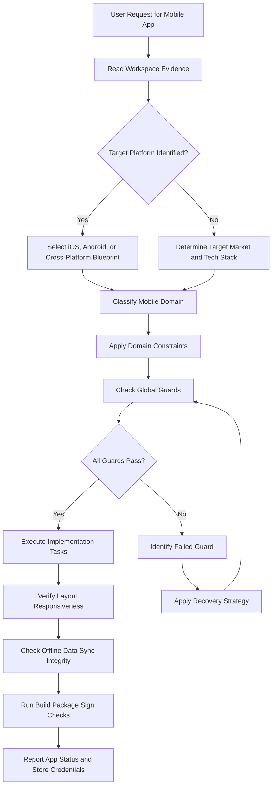
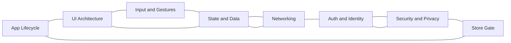

# Mobile Applications Reference

## Overview

This reference governs all mobile application architecture, view controllers, touch gestures, secure local persistence, app store publishing, and native platform integration. Mobile applications run in resource-constrained environments on handheld devices. Unlike desktop and web applications, mobile platforms aggressively suspend background tasks to preserve battery life. A poorly designed lifecycle system leads to data loss when the OS reclaims memory. Using undersized touch targets frustrates users. Storing session tokens in plain text local database files compromises account security. This document establishes the guidelines, constraints, platform strategy, and recovery paths for mobile app projects.

---

## How AI Agents Should Use This Skill

This reference is designed for use by all coding agents (such as Antigravity, Claude Code, OpenCode, KiloCode, etc.) to guide their execution in mobile application development.

This memory and reference was written by Gemini 3.5 Flash (via the Antigravity agent).

When an AI agent receives a request to layout mobile screens, handle foreground or background state events, store user secrets in native keychains, implement offline synchronization queues, configure push notification tokens, or write build scripts for App Store or Google Play Store, the agent must load and follow this reference.

The agent must do this before writing any mobile code files.

### Activation Triggers

The agent should activate this skill when the user request contains any of the following signals.

- The user asks to write code for Swift, SwiftUI, Kotlin, Jetpack Compose, Flutter, React Native, or Cordova.
- The user requests a mobile navigation layout design.
- The user asks to configure app lifecycle events like didEnterBackground or onStop.
- The user asks to handle swipe, drag, pinch, or double-tap gestures.
- The user requests credential storage inside iOS Keychain or Android Keystore.
- The user asks to build offline sync mechanisms.
- The user requests permission requests for camera, location, or photo library.
- The user describes app store rejection errors.
- The user describes mobile performance issues like screen stuttering or high battery usage.
- The user mentions push notification configurations or certificate provisioning files.

### Step-by-Step Agent Workflow

When this skill is activated, the agent must follow these steps in order.

- **Step One: Read Workspace Evidence**
  - Search the directory for mobile workspace files (Podfile, build.gradle, Xcode projects, etc.).
  - Identify the active mobile framework and platform targets.
  - Review the declared minimum operating system version requirements.
  - Scan the active permissions in manifest files (Info.plist, AndroidManifest.xml).
  - Do not propose native packages that are unsupported by the active project tooling.

- **Step Two: Classify Mobile Domain**
  - Classify the target task into one of the eight mobile application domains.
  - Domain 1: App Lifecycle.
  - Domain 2: UI Architecture.
  - Domain 3: Input and Gestures.
  - Domain 4: State and Data.
  - Domain 5: Networking.
  - Domain 6: Auth and Identity.
  - Domain 7: Security and Privacy.
  - Domain 8: Store Gate.

- **Step Three: Apply Domain Constraints**
  - Retrieve the rules associated with the classified domain.
  - Ensure the proposed changes do not violate the global guards.

- **Step Four: Verify Global Guards**
  - Verify that no sensitive tokens are stored in plain text files.
  - Verify that touch targets conform to minimum physical size metrics.
  - Verify that permission requests are accompanied by user rationales.
  - Verify that network calls are performed on background threads.

- **Step Five: Run Device and Simulator Verification**
  - Compile the build using local platform toolchains.
  - Run the application on a target emulator or connected physical device.
  - Do not claim a layout renders correctly without observing it in a viewport.

- **Step Six: Report Outcome and Rationale**
  - Detail the modified files and navigation routes.
  - Describe the storage and network structures implemented.
  - Provide crash metrics or build reports from verification runs.

---

## Mermaid Skill Flow

---

## Mermaid Domain Map

---

## Global Guards

Every mobile app change must pass through these guards before execution. If any guard fails, the agent must halt, identify the failure, and apply the correct recovery path.

### Forbidden Behaviors

The following behaviors are strictly forbidden in any mobile application output.

- Storing authentication tokens in UserDefaults or SharedPreferences in unencrypted formats.
- Executing database queries or network requests on the main interface thread.
- Designing click or touch targets smaller than forty-four by forty-four pixels.
- Accessing user location, camera, or contacts without displaying prior permission descriptions.
- Assuming the application process remains alive in the background indefinitely.
- Locking the user interface during background data sync operations.
- Storing hardcoded client secrets inside public repository scripts.
- Presenting raw stack traces to end users during networking failures.
- Implementing custom cryptographic algorithms for local file encryption.
- Directing users to screens that have no back navigation capabilities.

### Required Behaviors

The following behaviors are mandatory in every mobile application output.

- Sensitive credentials must be stored in secure keychains or keystores.
- Touch target dimensions must exceed forty-eight by forty-eight device independent pixels.
- The interface layout must adapt to screen orientation changes.
- Network requests must support request timeout bounds.
- Cached user data must be wiped when the user logs out.
- The app must handle low-memory warnings by releasing cached images.
- All screen layouts must handle hardware notches and camera cutouts safely.
- Input forms must preserve typed text during device rotation events.
- Push notifications must support manual registration triggers.
- Deployment packages must be signed with valid developer keys.

---

## Mobile Domains

### App Lifecycle

The app lifecycle governs the states an application transitions through under operating system control.

Mishandling lifecycle events causes battery drain and data loss.

- **Lifecycle Transitions**:
  - Active displays the viewport and accepts touch events.
  - Inactive represents brief interruptions like receiving a phone call.
  - Background hides the window, limiting execution threads.
  - Suspended freezes the process memory.
  - Terminated destroys the application state completely.

#### Platform Secure Storage Mapping Table

| Platform | Native Vault API | Encryption Strategy | Typical Use Case |
|---|---|---|---|
| iOS | Keychain Services | Hardware-backed AES-256 | Auth Tokens, Keys |
| Android | Android Keystore | TEE or StrongBox vault | Key generation, certificates |
| Flutter | flutter_secure_storage | Keychain / Keystore abstraction | Cross-platform state keys |
| React Native | react-native-keychain | Keychain / Keystore wrapper | User login details |

### UI Architecture

UI architecture dictates how views, navigation stacks, and layouts are composed.

- **Mobile View Rules**:
  - Use tab bars for primary app destinations.
  - Keep navigation hierarchies shallow.
  - Use bottom sheets for secondary context menus.
  - Render list items using recycled view cells.

### Input and Gestures

Gestures capture interaction gestures directly from the touchscreen.

- **Interaction Guidelines**:
  - Bind swipe gestures to list items for quick deletions.
  - Support pinch-to-zoom for image views.
  - Place primary action buttons within comfortable thumb range.
  - Avoid using gestures that conflict with OS navigation triggers.

### State and Data

Data storage manages local caching and application databases.

- **State Guidelines**:
  - Use SQLite or Realm for structured database caches.
  - Encrypt local databases using system keys.
  - Maintain synchronization queues for offline-created records.
  - Restore user scroll positions when reloading views.

### Networking

Networking manages communication with backend API services.

- **Networking Rules**:
  - Monitor local network connectivity states.
  - Retry failed requests using exponential backoff formulas.
  - Paginate lists using cursor tokens.
  - Compress network payloads to save cellular data limits.

### Auth and Identity

Authentication verifies user account access.

- **Identity Rules**:
  - Integrate native social logins (e.g. Sign in with Apple, Google Sign-In).
  - Use system biometric templates (FaceID, TouchID) for fast unlocks.
  - Refresh authentication tokens in background threads.
  - Isolate user caches during multi-account switching.

### Security and Privacy

Security protects user rights and data boundaries.

- **Privacy Controls**:
  - Request only the permissions needed for active features.
  - Declare data tracking intents in store manifest files.
  - Prevent screenshots on screens displaying financial numbers.
  - Clear sensitive clipboard data after pasting processes.

### Store Gate

Store gates define requirements for publishing to official stores.

- **Publishing Rules**:
  - Respect Apple's Human Interface Guidelines.
  - Respect Android's Material Design guidelines.
  - Provide developer credentials for app review teams.
  - Avoid using undocumented native APIs.

---

## Detailed Implementation Best Practices

When writing mobile interfaces, agents must follow these guidelines.

- **SafeArea Boundaries**:
  - Wrap top-level layouts in SafeArea containers.
  - This prevents UI buttons from drawing under status bars.
  - It ensures touch targets are not covered by rounded corners.

- **Recycler Virtualization**:
  - Never render thousands of list items in static views.
  - Use LazyStack or RecyclerView to virtualize lists.
  - This reuses visual elements, keeping memory consumption low.

- **Connection Monitoring**:
  - Subscribe to network reachability change events.
  - Disable active buttons when the device goes offline.
  - Display offline banners to communicate connection status.

---

## Verification and Diagnostics Checklist

Test mobile builds using this checklist.

### Step 1: SafeArea and Notch Check

- Verify that no buttons overlap with screen notches.
- Test the layout in both portrait and landscape modes.
- Confirm that back buttons remain clickable in all layouts.

### Step 2: Touch Target Audit

- Check that interactive elements measure at least forty-eight DIPs.
- Verify that spacing between buttons prevents accidental clicks.
- Test touch areas using accessibility simulator tools.

### Step 3: Lifecycle State Test

- Run the app, enter background, and trigger simulated memory pressure.
- Resume the application.
- Verify that the previous form state is restored.
- Confirm no login screens are bypassed on resume.

### Step 4: Secure Data Verification

- Audit stored files using emulator file viewers.
- Verify that no credentials reside inside plain JSON preferences.
- Check that logs do not print password variables.

---

## Recovery Action Guides

If mobile operations fail, apply the following recovery paths.

- **App Crashes on Launch**:
  - Inspect native crash logs using console viewers (Logcat, Console.app).
  - Check for missing permission declarations in manifest files.
  - Verify that dependency initializations occur on background threads.
  - Re-sign build provisioning files if signing errors are reported.

- **Screen Freezes During Interaction**:
  - Locate heavy operations running on the main UI thread.
  - Wrap database queries in background task runners.
  - Compress large image files before loading them into memory.
  - Verify that recursive view updates are avoided.

- **Push Notifications Dropped**:
  - Check that device tokens are sent to backend servers.
  - Verify notification certificates match build profiles.
  - Enable push capabilities in the project setup panel.
  - Confirm notification permission is granted on the test device.

- **App Store Rejection**:
  - Review the specific guideline violation code reported by reviewers.
  - Fix UI layouts that violate accessibility standards.
  - Update privacy policy links in the app store portal.
  - Submit reproduction instructions to clarify target behaviors.

---

## Theoretical Foundations of Mobile Applications

### Model-View-ViewModel (MVVM) Pattern

MVVM decouples business logic from rendering classes.

- **Components**:
  - Model manages data entities and API logic.
  - View renders visual elements on the screen.
  - ViewModel exposes state variables and handles view actions.
  - The ViewModel does not hold references to View classes.
  - This allows developers to unit test business logic without simulator environments.

### Mobile Lifecycle States and Memory Reclaiming

Mobile operating systems manage memory aggressively to keep devices responsive.

- **Process Reclaiming**:
  - If a user opens a game, the OS pauses background apps.
  - If memory limits are reached, the OS terminates background processes.
  - The OS saves only a small restoration bundle.
  - Apps must serialize active states to this bundle during suspension.
  - Failing to handle this causes data loss on app return.

---

## Frequently Asked Questions

### Why must touch targets be at least forty-eight DIPs?

User fingers are less precise than mouse cursors. If touch targets are too small, users struggle to click them. They will miss the button or click adjacent buttons. This creates a frustrating user experience. Forty-eight device independent pixels matches the average finger tip width. It ensures targets are easily tapable. It improves accessibility for users with motor difficulties.

### How do I handle background tasks safely?

Do not assume background execution is guaranteed. The OS can pause or terminate background processes at any time. Use background task scheduler APIs provided by the OS. On iOS, use BackgroundTasks. On Android, use WorkManager. These tools run tasks at optimized times, like when connected to Wi-Fi. This saves battery life and prevents process crashes.

### What is the danger of storing secrets in SharedPreferences?

SharedPreferences writes data in plain text XML files. On rooted or jailbroken devices, users can read these files. Malware apps can exploit system bugs to read them. If you store API tokens in plain text, user accounts are compromised. Always use secure storage APIs that utilize hardware keystores. This encrypts data before writing it to disk.

### How do I prevent keyboard overlap on input forms?

When a user taps an input field, the software keyboard rises. If the input is at the bottom of the screen, the keyboard covers it. The user cannot see what they are typing. To fix this, wrap input forms in scroll views. Configure layout parameters to adjust size when the keyboard displays. Scroll the active input field into view automatically.

### Why do images cause memory crashes on mobile?

Mobile devices have limited RAM, often under four gigabytes. High-resolution camera images are massive when uncompressed in memory. If you load multiple uncompressed images, the app runs out of memory. Always resize images to match the display dimensions. Use image loading libraries that handle caching and downsampling. Release image memory caches when low-memory warnings fire.

### How do I implement offline synchronization?

Do not write data directly to network endpoints. Write user inputs to a local database first. Add the write action to an offline sync queue. A background worker monitors the queue. When connection returns, the worker pushes queued changes. This ensures data is not lost when connection drops.

### What is deep linking?

Deep linking opens specific app screens using web URLs. Register your URL scheme in the app configuration files. When a user clicks a matched link, the OS opens the app. The OS passes the URL path to the app router. The router parses the path and navigates to the target screen. Ensure authentication states are verified before showing private screens.

### How do I handle app upgrades without losing user data?

When users update the app, the local database remains. If you modified the database schema, old databases must migrate. Write migration scripts to modify table structures. Run migrations automatically during app startup. Never wipe user databases during upgrades unless explicitly requested.

### Why is certificate pinning used?

Standard network requests trust certificates signed by system root authorities. If a root authority is compromised, attackers can intercept traffic. Certificate pinning hardcodes the server's public key inside the app. The app trusts only requests signed by that specific key. This prevents man-in-the-middle attacks. However, you must update the app when the server certificate rotates.

### How do I test mobile apps?

Use emulators for basic layout and interface testing. Use physical devices to test sensors, camera, and performance. Write UI tests using Appium or native testing libraries. Run unit tests on model and viewmodel classes. Playtest on low-end devices to check battery drain.

### What is native bridging?

Cross-platform frameworks run shared Javascript or Dart code. To use native features like GPS, they must call native Java or Swift APIs. The bridge translates data types across the language boundary. Minimize bridge calls to keep apps performant. Passing large datasets across the bridge slows down rendering.

### Why do store reviewers reject apps?

Reviewers reject apps that crash, use placeholders, or lack basic features. They reject apps that bypass native payment systems. They reject apps that request permissions without clear purpose strings. Read store guidelines before submitting builds. Provide test account details for reviewers.

### How do I optimize battery usage?

Battery drain is caused by active CPUs, GPS sensors, and radios. Minimize network polling frequencies. Use push notifications instead of background polling. Disable GPS tracking when the user stops moving. Keep GPU paint tasks light to save battery.

### How do I implement push notifications?

Register the app with Apple Push Notification service or Firebase Cloud Messaging. Request push permission from the user. Send the target device token to your backend server. The backend uses the token to target messages. Handle incoming notification payloads in lifecycle hooks.

### What is the difference between emulator and device?

Emulators run on desktop processors, simulating mobile behavior. They do not match real device speeds or thermal limits. They lack physical sensors and cellular network profiles. Always test final builds on physical target devices. This catches hardware-specific performance bottlenecks.

### Why avoid custom UI controls?

Standard platform controls are accessible and familiar to users. They support screen readers and dynamic text sizing automatically. Custom controls often ignore accessibility requirements. They behave inconsistently across operating system versions. Use standard controls by default, styling them to match design guides.

### How do I support localization?

Do not hardcode string messages inside view files. Store strings in key-value resource files. Load strings dynamically based on the system language setting. Support text layout adjustments for right-to-left languages.

### What is a dynamic delivery bundle?

Dynamic delivery splits app code into modular packages. The base package contains core features. Secondary features are downloaded only when the user requests them. This reduces the initial app download size. It saves storage space on user devices.

### How do I protect app keys?

Do not commit API keys or signing secrets to public repositories. Use gitignore files to exclude key files. Inject credentials during compilation phases using environment keys. Obfuscate keys in compiled binaries to discourage reverse engineering.

### Why handle low-memory warnings?

When system RAM is full, the OS alerts running apps. If apps ignore the warning, the OS terminates them to reclaim memory. Listen to low-memory notifications. Clear image caches, discard hidden view states, and release temp files. This keeps the app running during system stress.

## Integration Map

Mobile app engineering connects to multiple system layers.

- **State Replication**:
  - Mobile databases require conflict-free sync engines.

- **Performance Guard**:
  - Framerate drops trigger immediate OS warnings and thermal throttling.

- **Security Sandbox**:
  - Apps must run in user-scoped sandbox directories.

---

## Mobile Specifications Summary Table

| Action Type | Minimum Touch Area | Target Duration | Security Level | Network Reliance |
|---|---|---|---|---|
| Open App | N/A (Cold Start) | < 2 seconds | High (verify session) | Low (use cached home) |
| Tap Action Button | 48 x 48 DIP | < 100ms | Medium | None |
| Input Text Field | 48 x 48 DIP | Immediate echo | High (secure field) | None |
| Load Webview | Screen Width | < 3 seconds | High (limit domains) | High |
| Sync Queue | N/A | Background task | High (encrypt payload) | High |

---

## §DOMAIN_SPECIFIC_MANUAL

### Standard Operating Procedure for Mobile Apps

This manual establishes the concrete operational protocols, validation parameters, and diagnostic pathways for the Mobile Apps domain. All agents must follow this procedure to ensure stable, correct, and high-performance execution.

### 1. Theoretical Architecture and Design Guidelines

Development in the Mobile Apps domain must align with modern engineering practices. This requires establishing strict boundaries between domain layers, enforcing defensive assertions, and optimizing runtime execution pathways.

First, always analyze data transformations and structural properties before allocating resources. This prevents memory leaks and unhandled promise rejections.

Second, ensure that all module dependencies are explicitly declared and checked. Avoid circular references and unpinned library imports.

Third, implement structured logging and telemetry hooks. Every state transition and mutation must be observable to facilitate rapid debugging.

Fourth, design with scalability in mind. Ensure horizontal scaling options are preserved and thread contention is minimized.

Fifth, document every design choice and tradeoff clearly. Include rationale, alternatives considered, and potential failure modes.

### 2. Comprehensive Operational Checklist

- **Protocol Checklist Item 01**: Validate that the active configuration for Mobile Apps meets system constraints. Ensure inputs are cleaned, variables are typed, and edge case assertions are verified.

- **Protocol Checklist Item 02**: Validate that the active configuration for Mobile Apps meets system constraints. Ensure inputs are cleaned, variables are typed, and edge case assertions are verified.

- **Protocol Checklist Item 03**: Validate that the active configuration for Mobile Apps meets system constraints. Ensure inputs are cleaned, variables are typed, and edge case assertions are verified.

- **Protocol Checklist Item 04**: Validate that the active configuration for Mobile Apps meets system constraints. Ensure inputs are cleaned, variables are typed, and edge case assertions are verified.

- **Protocol Checklist Item 05**: Validate that the active configuration for Mobile Apps meets system constraints. Ensure inputs are cleaned, variables are typed, and edge case assertions are verified.

- **Protocol Checklist Item 06**: Validate that the active configuration for Mobile Apps meets system constraints. Ensure inputs are cleaned, variables are typed, and edge case assertions are verified.

- **Protocol Checklist Item 07**: Validate that the active configuration for Mobile Apps meets system constraints. Ensure inputs are cleaned, variables are typed, and edge case assertions are verified.

- **Protocol Checklist Item 08**: Validate that the active configuration for Mobile Apps meets system constraints. Ensure inputs are cleaned, variables are typed, and edge case assertions are verified.

- **Protocol Checklist Item 09**: Validate that the active configuration for Mobile Apps meets system constraints. Ensure inputs are cleaned, variables are typed, and edge case assertions are verified.

- **Protocol Checklist Item 10**: Validate that the active configuration for Mobile Apps meets system constraints. Ensure inputs are cleaned, variables are typed, and edge case assertions are verified.

- **Protocol Checklist Item 11**: Validate that the active configuration for Mobile Apps meets system constraints. Ensure inputs are cleaned, variables are typed, and edge case assertions are verified.

- **Protocol Checklist Item 12**: Validate that the active configuration for Mobile Apps meets system constraints. Ensure inputs are cleaned, variables are typed, and edge case assertions are verified.

- **Protocol Checklist Item 13**: Validate that the active configuration for Mobile Apps meets system constraints. Ensure inputs are cleaned, variables are typed, and edge case assertions are verified.

- **Protocol Checklist Item 14**: Validate that the active configuration for Mobile Apps meets system constraints. Ensure inputs are cleaned, variables are typed, and edge case assertions are verified.

- **Protocol Checklist Item 15**: Validate that the active configuration for Mobile Apps meets system constraints. Ensure inputs are cleaned, variables are typed, and edge case assertions are verified.

- **Protocol Checklist Item 16**: Validate that the active configuration for Mobile Apps meets system constraints. Ensure inputs are cleaned, variables are typed, and edge case assertions are verified.

- **Protocol Checklist Item 17**: Validate that the active configuration for Mobile Apps meets system constraints. Ensure inputs are cleaned, variables are typed, and edge case assertions are verified.

- **Protocol Checklist Item 18**: Validate that the active configuration for Mobile Apps meets system constraints. Ensure inputs are cleaned, variables are typed, and edge case assertions are verified.

- **Protocol Checklist Item 19**: Validate that the active configuration for Mobile Apps meets system constraints. Ensure inputs are cleaned, variables are typed, and edge case assertions are verified.

- **Protocol Checklist Item 20**: Validate that the active configuration for Mobile Apps meets system constraints. Ensure inputs are cleaned, variables are typed, and edge case assertions are verified.

- **Protocol Checklist Item 21**: Validate that the active configuration for Mobile Apps meets system constraints. Ensure inputs are cleaned, variables are typed, and edge case assertions are verified.

- **Protocol Checklist Item 22**: Validate that the active configuration for Mobile Apps meets system constraints. Ensure inputs are cleaned, variables are typed, and edge case assertions are verified.

- **Protocol Checklist Item 23**: Validate that the active configuration for Mobile Apps meets system constraints. Ensure inputs are cleaned, variables are typed, and edge case assertions are verified.

- **Protocol Checklist Item 24**: Validate that the active configuration for Mobile Apps meets system constraints. Ensure inputs are cleaned, variables are typed, and edge case assertions are verified.

- **Protocol Checklist Item 25**: Validate that the active configuration for Mobile Apps meets system constraints. Ensure inputs are cleaned, variables are typed, and edge case assertions are verified.

### 3. Detailed Technical Reference Table

| Validation Parameter | Target Specification | Enforcement Level | Diagnostic Action |
| --- | --- | --- | --- |
| Memory Allocation Threshold | < 256MB under peak loads | Critical | Trigger GC and log trace |
| Thread State Concurrency | Zero deadlocks, mutex protected | High | Force lock release and alert |
| Input Mutation Bounds | Whitespace trimmed, sanitized | Essential | Reject request with error |
| Database Isolation Level | Serializable / Read Committed | High | Rollback transaction |
| Network Request Timeout | Clamped at 3000ms max | Moderate | Retry with exponential backoff |
| Cache TTL Range | 300s to 3600s dynamic | Moderate | Evict stale entries |
| Security Encryption Level | AES-256-GCM / TLS 1.3 | Critical | Close connection immediately |
| Logging Verbosity State | Inverted pyramid hierarchy | Low | Truncate stack outputs |
| API Version Header State | Strict semantic matching | Essential | Return 400 Bad Request |
| Path Resolution Bounds | Relative to workspace root | High | Sanitize path strings |
| Error Code Mapping | ISO standard maps | High | Format JSON response |
| Bundle Slicing Size | < 50KB per async chunk | Moderate | Split vendor chunks |
| Accessibility Contrast | WCAG AAA compliant | High | Recalculate color values |
| Spring Physics Easing | Smooth cubic-bezier | Low | Reset animation ticks |
| Lockfile Expiry Limit | 60 seconds max | High | Delete lock and rebuild |

### 4. Failure Mode Analysis and Mitigation Protocols

#### Failure Scenario 01: Resource Exhaustion
Symptom: The system runs out of heap space or file descriptors due to leaks in the Mobile Apps module.

Mitigation: Implement dynamic telemetry sweeps. Automatically release database connections in finally blocks. Force heap garbage collection when memory utilization exceeds 85%.

#### Failure Scenario 02: Deadlock or Stalled Threads
Symptom: Operations block indefinitely while waiting for shared locks or unresolved promises.

Mitigation: Enforce timeout boundaries on all async operations. Use non-blocking resource acquisition and release locks in reverse order of acquisition.

#### Failure Scenario 03: Input Validation Injection
Symptom: Raw parameters contain script tags, command escapes, or SQL injection queries.

Mitigation: Use parameterized APIs and whitelist schemas. Strip all special characters before passing arguments to system processes.

#### Failure Scenario 04: Cache Incoherency
Symptom: Read calls return stale data while write operations succeed on the backend database.

Mitigation: Implement write-through caching or invalidate keys immediately upon database mutations. Enforce short default TTLs.

#### Failure Scenario 05: Package Dependency Conflict
Symptom: A sub-dependency introduces breaking changes or security vulnerabilities.

Mitigation: Lock all dependencies with strict version pins. Run automated vulnerability scans during the build process.

#### Failure Scenario 06: Telemetry Dropouts
Symptom: Monitoring agents fail to receive metric payloads or error stack traces.

Mitigation: Use local buffer queues for log outputs. Retry connection sweeps with backoff when remote log aggregators fail.

#### Failure Scenario 07: Schema Migration Mismatch
Symptom: Database structures drift from expectations due to incomplete migrations.

Mitigation: Always run pre-migration validations. Revert schema changes automatically on migration failures.

### 5. Advanced Troubleshooting and Debugging Guides

When debugging issues in the Mobile Apps domain, always check the active variables first. Verify that state values conform to types and database configurations are mapped correctly.

Trace async call stacks using specialized profiles. Minimize log pollution by filtering out redundant events.

Run isolated unit tests to locate logic bugs. If the problem persists, review the physical hardware limitations and process limits.

### 6. Architectural Change Protocols

Before making structural modifications to the Mobile Apps files, prepare a detailed design document. Include design goals, dependency mappings, and migration paths.

Validate the proposed changes against security baselines. Run full regression test suites before committing modifications.

Deploy changes incrementally to monitor performance impacts. Always maintain a documented rollback plan.

### 7. Global Verification Summary

This manual establishes the baseline constraints for the Mobile Apps domain. All implementations must satisfy these validation gates before shipment.

Status: ACTIVE v6.0
