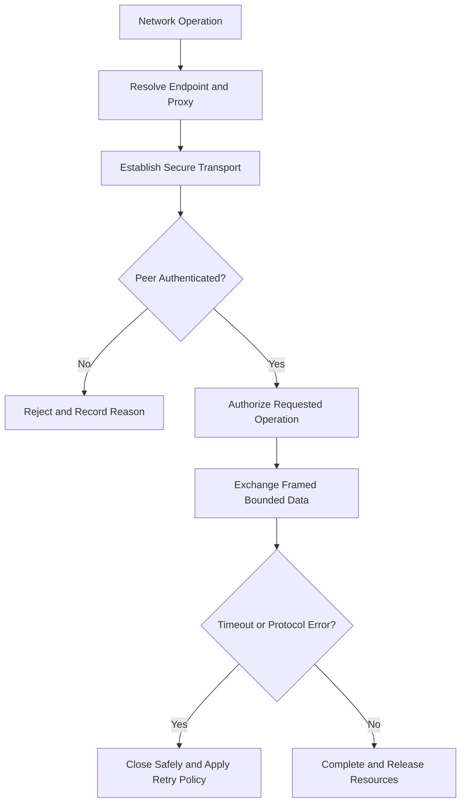
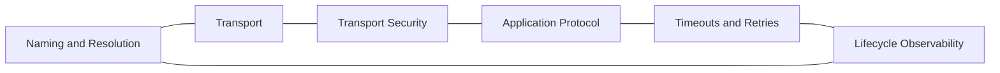

# Network Protocols Reference

## Overview

This reference governs HTTP, TLS, DNS, proxies, WebSockets, Server-Sent Events, connection lifecycles, framing, retries, timeouts, authentication, and protocol compatibility.

---

## How AI Agents Should Use This Skill

Load this reference when adding a listener, client, API transport, persistent connection, proxy behavior, network authentication, or protocol parser. Treat the network as hostile, lossy, duplicated, delayed, and subject to intermediaries.

### Activation Triggers

- HTTP, HTTPS, TLS, DNS, TCP, UDP, proxy, or load balancer.
- WebSocket, SSE, streaming, keepalive, reconnect, or backpressure.
- CORS, origins, headers, cookies, bearer tokens, or mTLS.
- Timeouts, retries, connection pools, framing, or protocol versioning.

### Step-by-Step Agent Workflow

1. Identify peers, intermediaries, trust boundaries, and protocol versions.
2. Define framing, authentication, authorization, and origin rules.
3. Set connect, read, write, idle, and total timeouts.
4. Define retry safety, reconnect behavior, and backpressure.
5. Validate malformed, oversized, partial, duplicated, and delayed traffic.
6. Observe handshake, lifecycle, closure, and failure metrics.

---

## Mermaid Connection Lifecycle Flow

## Mermaid Protocol Domain Map

---

## Global Guards

### Forbidden Behaviors

- Disabling certificate or hostname verification.
- Using wildcard browser origins with credentials.
- Retrying unsafe mutations without idempotency.
- Reading unbounded messages or bodies.
- Treating timeout as proof that the remote operation did not occur.

### Required Behaviors

- Authenticate the peer and authorize each operation.
- Bound headers, frames, bodies, queues, and connection counts.
- Define explicit timeout and closure behavior.
- Validate content type, encoding, and protocol state.
- Handle proxy and reconnect behavior deliberately.

## Domain Rules

### HTTP and Intermediaries

- Respect method semantics, cache rules, forwarded headers, and body limits.
- Do not trust client-supplied forwarding headers without a trusted proxy boundary.

### Persistent Connections

- Authenticate before subscribing or accepting commands.
- Handle heartbeat, backpressure, reconnect, and stale sessions.

### TLS and Identity

- Use supported protocol versions and verified host identities.
- Rotate credentials without requiring unsafe fallback.

### Resilience

- Use jittered bounded retries only for safe operations.
- Separate connect, operation, and idle timeouts.

## Verification Checklist

- Peer and origin trust rules are explicit.
- Payload and connection resources are bounded.
- Timeout and retry semantics are safe.
- Malformed and partial traffic is tested.
- Reconnect does not duplicate unsafe work.
- Lifecycle events are observable.

## Integration Map

- Use `api_design.md` for application contracts.
- Use `security_engineering.md` for trust and credential handling.
- Use `distributed_systems.md` for delivery and retry semantics.
- Use `observability_debugging.md` for connection diagnosis.

## Completion Contract

Network work is complete only when trust, framing, resource bounds, timeout semantics, retries, and closure behavior are explicitly verified.
