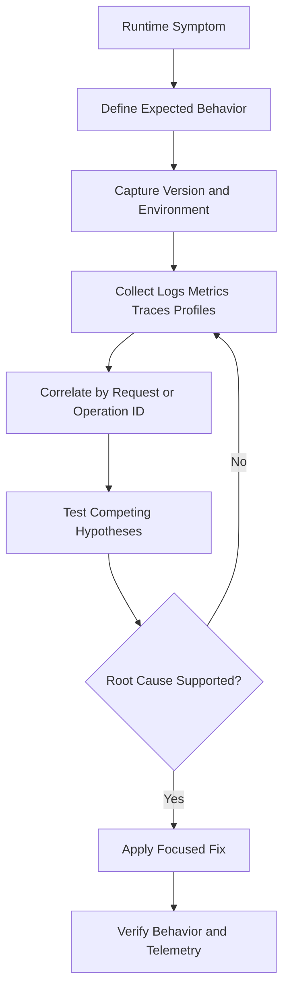
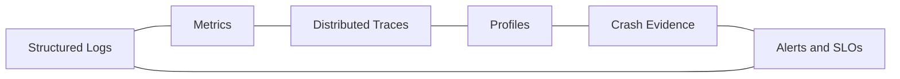

# Observability and Debugging Reference

## Overview

This reference governs structured logging, metrics, traces, crash evidence, profiling, diagnostic correlation, and production debugging. Observability must answer what failed, where, for whom, under which version, and with what recoverable context without exposing secrets.

---

## How AI Agents Should Use This Skill

Load this reference when diagnosing intermittent failures, adding telemetry, interpreting logs, handling crashes, measuring latency, or designing operational alerts. Start from a falsifiable symptom and gather evidence before changing behavior.

### Activation Triggers

- Logs, metrics, traces, correlation IDs, dashboards, or alerts.
- Crash dumps, stack traces, hangs, memory growth, or high CPU.
- Performance regressions, timeouts, retries, or flaky operations.
- Production-only failures or insufficient diagnostic context.

### Step-by-Step Agent Workflow

1. Define the observable symptom and expected behavior.
2. Establish reproduction conditions, version, time window, and environment.
3. Collect the least invasive logs, metrics, traces, or profiles.
4. Correlate evidence across boundaries using stable identifiers.
5. Form and test competing hypotheses.
6. Fix the cause, retain useful telemetry, and verify signal quality.

---

## Mermaid Diagnostic Flow

## Mermaid Observability Domain Map

---

## Global Guards

### Forbidden Behaviors

- Adding broad verbose logging without a diagnostic question.
- Logging secrets, authentication material, or raw sensitive payloads.
- Claiming causation from correlation alone.
- Swallowing exceptions after emitting a message.
- Alerting on symptoms with no owner or response action.

### Required Behaviors

- Include timestamp, severity, component, operation, version, and correlation ID.
- Preserve original error causes and stack information.
- Use bounded-cardinality labels for metrics.
- Compare measurements against a baseline.
- Remove or reduce temporary high-volume probes after diagnosis.

## Domain Rules

### Logging

- Use structured events with stable names.
- Record decisions and boundary failures, not every internal step.

### Metrics and SLOs

- Measure rates, errors, duration, and saturation.
- Alert on user-visible impact and sustained conditions.

### Tracing

- Propagate trace context across network and worker boundaries.
- Mark retries and child operations distinctly.

### Crash and Performance Evidence

- Preserve dump, symbol, build, and reproduction metadata.
- Profile before optimizing and compare equivalent workloads.

## Verification Checklist

- The symptom and baseline are explicit.
- Evidence can be correlated across components.
- Sensitive data is excluded.
- The fix changes the expected signal.
- Alerts have actionable thresholds and ownership.
- Temporary diagnostics are cleaned up.

## Integration Map

- Use `performance_guard.md` for budgets and complexity.
- Use `backend_architecture.md` for service telemetry boundaries.
- Use `network_protocols.md` for transport diagnostics.
- Use `windows_systems.md` for Windows event logs and dumps.

## Completion Contract

Debugging is complete only when evidence supports the root cause, the fix changes observed behavior, and retained telemetry can detect recurrence.
