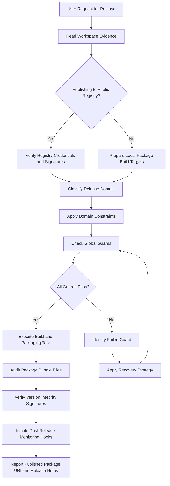
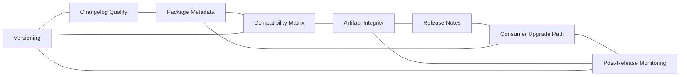

# Package Release Reference

## Overview

This reference governs all package versioning, changelog compilation, metadata publication, package compatibility matrix checks, artifact integrity signing, and release rollout strategies. Releasing software packages is the gateway through which software is shared with consumers and developers. A faulty package version breaks downstream applications and destroys user trust. Improper package metadata causes dependency conflicts and package manager errors. Undocumented breaking changes force consumers to debug code unnecessarily. Failing to verify build package integrity risks malicious package tampering and security supply chain attacks. This document establishes the guidelines, constraints, release templates, compatibility rules, and recovery paths for package publishing operations.

---

## How AI Agents Should Use This Skill

This reference is designed for use by all coding agents (such as Antigravity, Claude Code, OpenCode, KiloCode, etc.) to guide their execution in package distribution, library versioning, and publishing workflows.

This memory and reference was written by Gemini 3.5 Flash (via the Antigravity agent).

When an AI agent receives a request to publish npm modules, publish Python wheels to PyPI, release NuGet packages, build Maven binaries, compile library packages, format markdown changelogs, tag version changes, or audit public metadata releases, the agent must load and follow this reference.

The agent must do this before executing any release commands or publishing binaries.

### Activation Triggers

The agent should activate this skill when the user request contains any of the following signals.

- The user asks to publish a library to public registries (npm, PyPI, Maven, etc.).
- The user requests a semantic version update for a project package.
- The user asks to write or format a CHANGELOG.md file.
- The user requests verification of package dependencies or peer dependency compatibility.
- The user asks to configure build scripts for packaging (e.g. package.json, setup.py, pyproject.toml).
- The user asks to sign built packages using GPG or Sigstore keys.
- The user describes import failures or installation errors on published library versions.
- The user asks to automate package releases using semantic-release tools.
- The user mentions publishing packages to private repository mirrors.
- The user requests an audit of published files to ensure no sensitive directories are bundled.

### Step-by-Step Agent Workflow

When this skill is activated, the agent must follow these steps in order.

- **Step One: Read Workspace Evidence**
  - Search the directory for package configurations (package.json, pyproject.toml, Cargo.toml, etc.).
  - Identify the target registry rules and required formats.
  - Review the current version string history.
  - Scan the active file exclusions list (.npmignore, files field, etc.).
  - Do not increment versions without confirming the scale of code changes.

- **Step Two: Classify Release Domain**
  - Classify the target task into one of the eight package release domains.
  - Domain 1: Versioning.
  - Domain 2: Changelog Quality.
  - Domain 3: Package Metadata.
  - Domain 4: Compatibility Matrix.
  - Domain 5: Artifact Integrity.
  - Domain 6: Release Notes.
  - Domain 7: Consumer Upgrade Path.
  - Domain 8: Post-Release Monitoring.

- **Step Three: Apply Domain Constraints**
  - Retrieve the rules associated with the classified domain.
  - Ensure the proposed changes do not violate the global guards.

- **Step Four: Verify Global Guards**
  - Verify that no credentials are included in published assets.
  - Verify that version increments match the API changes (major for breaking, etc.).
  - Verify that changelogs list all public method modifications.
  - Verify that package metadata maps dependencies to exact or safe range boundaries.

- **Step Five: Run Package Audits**
  - Execute pack simulation commands locally (e.g. npm pack) to inspect inside the tarball file.
  - Run package installation tests inside clean containers to verify import hooks.
  - Do not claim a package is ready for publication without verifying the file bundle content.

- **Step Six: Report Outcome and Rationale**
  - Explain the metadata edits and version changes.
  - Detail the files included inside the output bundle.
  - Document the release tag created in the repository.

---

## Mermaid Skill Flow

---

## Mermaid Domain Map

---

## Global Guards

Every package release task must pass through these guards before execution. If any guard fails, the agent must halt, identify the failure, and apply the correct recovery path.

### Forbidden Behaviors

The following behaviors are strictly forbidden in any package release output.

- Publishing password files, local env files, or private keys inside the package bundle.
- Changing public API signatures without incrementing the major version digit.
- Publishing package tarballs without checking the included file contents.
- Using wildcard characters (e.g. *) for dependency version constraints in metadata.
- Omitting descriptions for changes in the public changelog document.
- Publishing package versions that overwrite existing tags.
- Leaving local absolute path paths inside compiler package metadata fields.
- Skipping package installation tests on clean sandbox environments.
- Publishing libraries under public scopes without naming the package license.
- Ignoring security reports for dependent library packages.

### Required Behaviors

The following behaviors are mandatory in every package release output.

- Version increments must follow Semantic Versioning (SemVer) guidelines.
- Published packages must contain only the files required to run the library.
- Documentation folders and source files must be excluded from production packages unless explicitly requested.
- Package metadata must define minimum language runtime constraints.
- Release tags in Git repositories must match version strings exactly.
- Built binaries must be signed using digital signature keys.
- Changelogs must separate entries into added, changed, fixed, and removed lists.
- Major releases must include upgrade instructions for consumers.
- Published packages must undergo automated integrity tests before public release.
- Unused dynamic packages must be deprecated on the registry page.

---

## Package Release Domains

### Versioning

Versioning classifies releases based on semantic changes to the API surface.

- **Semantic Versioning Rules**:
  - Increment the Patch version (0.0.X) for backward-compatible bug fixes.
  - Increment the Minor version (0.X.0) for new, backward-compatible features.
  - Increment the Major version (X.0.0) for API modifications that break compatibility.
  - Use pre-release tags (e.g., -beta.1) for testing builds.

#### Package Registry File Exclusion Table

| File Type | Exclusion Method | Package Manager | Target Scope |
|---|---|---|---|
| Private Keys | .npmignore or files array | npm / yarn | Prevent secret leak |
| Local Configurations | .gitignore and package excludes | Poetry / pip | Prevent dev host leak |
| Unit Test Files | exclude tags in build config | NuGet | Reduce package size |
| Documentation Source | src config adjustments | Maven | Save consumer storage |

### Changelog Quality

Changelogs communicate updates to library users.

- **Changelog Formatting**:
  - Organize updates by release version and date.
  - Group changes by change category (added, fixed, etc.).
  - Link version headers to git commit comparison views.
  - Link issue numbers to repository issue trackers.

### Package Metadata

Metadata configures packages for index engines and installer tools.

- **Metadata Quality**:
  - Specify descriptive project titles and tags.
  - Link to repository homepages and documentation URLs.
  - Declare correct compiler and engine limits.
  - Include readable author and contributor arrays.

### Compatibility Matrix

Compatibility matrices declare support ranges for dependencies.

- **Compatibility Rules**:
  - Restrict dependent version bounds to safe limits (e.g., ^1.2.0).
  - Use peer dependencies to specify required host configurations.
  - Test the library against the lowest and highest versions in the declared support range.

### Artifact Integrity

Artifact integrity prevents package hijacking.

- **Integrity Actions**:
  - Sign published tarballs with GPG keys.
  - Publish SHA-256 build hashes on release pages.
  - Generate source provenance records inside pipeline runners.

### Release Notes

Release notes summarize changes for project stakeholders.

- **Notes Guidelines**:
  - Provide high-level summaries of new features.
  - List thank-you credits for community contributors.
  - Group details into readable bullet lists.

### Consumer Upgrade Path

Upgrade paths help developers transition their systems to new major versions.

- **Upgrade Guidelines**:
  - Highlight deprecated methods.
  - Provide direct replacements for removed variables.
  - Keep migration scripts simple.

### Post-Release Monitoring

Monitoring watches for bugs after package publication.

- **Monitoring Strategy**:
  - Watch for download errors on registry platforms.
  - Monitor repository issue reports for immediate regression alerts.
  - Publish quick patch versions when critical install-time bugs are reported.

---

## Detailed Implementation Best Practices

When publishing packages, agents must follow these guidelines.

- **Dry Run Verification**:
  - Execute pack dry run commands before registry publication.
  - Inspect the generated file list.
  - Confirm file sizes are within expected boundaries.

- **Authentication Security**:
  - Use short-lived registry publication tokens.
  - Restrict token access permissions to specific deployment runners.
  - Revoke tokens when pipeline tasks finish.

---

## Verification and Diagnostics Checklist

Perform these checks before releasing packages.

### Step 1: Versioning Check

- Verify that the version string is incremented correctly.
- Check that the Git release tag does not already exist.
- Confirm package configurations display the target version.

### Step 2: Content Scan

- Run pack simulations to compile target files.
- Inspect the file list to verify no local configuration files are present.
- Confirm that devDependencies are excluded from the output package.

### Step 3: Metadata Validation

- Verify that the package license matches repository declarations.
- Check that engine support boundaries are correctly set.
- Confirm that homepage and repository links are active.

### Step 4: Installation Test

- Install the packaged file in an empty target directory.
- Import the library into a test script.
- Verify that standard methods execute without import errors.

---

## Recovery Action Guides

If package publishing fails, apply the following recovery paths.

- **Accidental Publication of Sensitive Files**:
  - Deprecate or unpublish the affected version immediately from the registry.
  - Revoke all credentials, passwords, and tokens included in the package.
  - Release a clean version containing file excludes.
  - Update repository ignore patterns.

- **Dependency Range Conflict**:
  - Identify the dependent library causing the conflict.
  - Loosen constraint ranges in metadata configurations.
  - Run peer dependency checks in test environments.
  - Publish a metadata patch update.

- **GPG Signing Failure**:
  - Check that the GPG key is imported inside the runner environment.
  - Verify that the key passphrase is correctly mapped to configuration secrets.
  - Update expired signature keys in build pipelines.

- **Installation Failure (Broken Build)**:
  - Locate missing compiler outputs or asset files in the package.
  - Correct build scripts to compile files before packing.
  - Publish a quick patch release.

---

## Theoretical Foundations of Package Management

### Dependency Resolution Algorithms

Package managers resolve complex dependency constraints using graph algorithms.

- **Resolution Dynamics**:
  - Managers build dependency trees from package metadata.
  - Conflicts arise when libraries require incompatible versions of shared packages.
  - This is known as dependency hell.
  - Using peer dependencies tells the installer to share host packages.
  - Using tight ranges prevents installer choices, minimizing dependency bugs.

### Semantic Versioning Contracts

SemVer is a formal contract between library developers and consumers.

- **The Contract**:
  - By following SemVer, you promise consumers that patch releases will not break their code.
  - Breaking this contract forces developers to pin your package version, stopping updates.
  - Respecting SemVer boundaries keeps the development ecosystem stable.

---

## Frequently Asked Questions

### What is the purpose of semantic versioning?

Semantic versioning provides a standard way to communicate API changes. It tells developers what to expect when they update a package. If the major number changes, developers know they must review their code for breaks. If only the patch number changes, they can update safely without code changes. This makes dependency management predictable. It allows automated tools to update packages safely within defined bounds.

### Why should I avoid wildcard dependencies?

A wildcard dependency (e.g. library: "*") matches any version. If the library publishes a breaking major version, the manager installs it. This breaks your build without warnings. It makes builds non-reproducible. A build that works today can fail tomorrow if the library updates. Always use version ranges that exclude next major releases.

### How do I preview what files are bundled in my npm package?

Run the command "npm pack" inside the project directory. This compiles the package but does not publish it. It writes a tarball file to the directory. Extract the tarball to inspect the files inside. Verify that no test files, configuration files, or local keys are present. Adjust .npmignore until the package contains only execution code.

### Why is unpublishing packages restricted on public registries?

Unpublishing published versions can break downstream applications. If thousands of projects depend on version 1.2.0, deleting it breaks their builds. This is known as the left-pad incident. To prevent this, registries restrict unpublishing after a short period. If a package has bugs, deprecate it instead of unpublishing. This warns developers without breaking their current builds.

### How do I configure peer dependencies?

Use peer dependencies when your library plug-in requires a host package. For example, a React component requires React. Do not list React in dependencies. If listed in dependencies, the manager installs a separate React copy. This causes runtime errors. Listing React in peerDependencies tells the manager to use the host's React version. It warns the user if the host version is incompatible.

### What is the difference between devDependencies and dependencies?

Dependencies are required to run the library in production. They are installed automatically when a user installs your package. devDependencies are required only during development and build phases. They include testing tools, compilers, and linters. They are not installed by end users. Keeping devDependencies separated reduces install times for users.

### How do I sign package releases?

Use signing tools like GPG or Sigstore. Create a public/private key pair. Sign the compiled package using the private key. Publish the public key on the release page. Users verify the signature using the public key. This guarantees the package was created by you and not tampered with.

### What is package provenance?

Provenance records the build history of a package. It proves the package was built inside a secure pipeline runner. It links the published binary directly to the source commit. This prevents attackers from publishing malicious builds manually. Enable provenance options in CI/CD pipeline release steps.

### How do I document breaking changes?

Write a dedicated "Breaking Changes" section in the release notes. Describe what was changed. Show before and after code examples. Explain why the change was necessary. Provide clear migration instructions to help developers update their code.

### Why should I avoid publishing source files?

Source files (like TypeScript files) are not executed directly by runtimes. Runtimes execute compiled JavaScript files. Publishing source files increases package size. It slows down downloads for users. Compile source files to target formats before packaging. Exclude source directories using ignore files.

### What is deprecation?

Deprecation flags a package version as stale or broken. It displays a warning message when users install the package. It does not delete the files from the registry. Use deprecation to warn users of security bugs. Prompt them to update to clean versions.

### How do I publish packages to private registries?

Configure the registry URL in the package manager settings. Provide authentication tokens via environment variables. Use publish commands with the registry flag. This allows teams to share internal libraries securely.

### What is semantic-release?

semantic-release is a tool that automates package releases. It analyzes git commit messages. It determines version increments based on commits. It writes changelogs and publishes packages automatically. Use it to eliminate manual release mistakes.

### Why use lockfiles?

Lockfiles store the exact versions of dependencies installed. They guarantee that every developer and build server uses identical packages. This prevents "works on my machine" bugs. Always commit lockfiles to the repository. Exclude lockfiles from published library packages. Library packages rely on consumer lockfiles.

### How do I handle alpha and beta releases?

Use pre-release tags in version strings (e.g. 1.2.0-alpha.1). Publish pre-releases to custom registry tags (e.g. npm publish --tag next). This prevents standard installs from downloading beta versions. Users must install the tag explicitly to test beta features.

### Why are package licenses important?

Licenses define how users can legally use your library. Many enterprises block packages with copyleft licenses (like GPL). They require permissive licenses (like MIT or Apache 2.0). Declare the license clearly in package metadata. Include a LICENSE file in the package bundle.

### How do I exclude test files from published packages?

Test files are not needed by library consumers. Exclude test folders in ignore configurations. Verify they are absent from pack tarballs. Removing tests reduces package size significantly.

### What is the role of entry points in metadata?

Entry points define the import paths of the library. In Node, configure the "main" and "module" fields. This tells runtimes where to locate executable code. Ensure entry points point to compiled files, not source files.

### Why do install-time scripts pose security risks?

Install scripts (like postinstall) run commands during installation. If a package is hijacked, attackers can write malicious scripts to steal keys. Many environments disable install scripts (using --ignore-scripts). Avoid using install-time scripts in your packages. Run setup logic inside application code instead.

### How do I handle package name conflicts?

Registry package names must be unique. If a name is taken, publish under scoped names (e.g., @scope/package). Scoped packages are easy to organize. They protect names from namespace squatting.

## Integration Map

Package release connects to multiple system layers.

- **DevOps CI/CD**:
  - Pipelines automate build, test, and publishing workflows.

- **Performance Guard**:
  - Package sizes affect developer install times.

- **Security Sandbox**:
  - Credentials for package publication must be isolated.

---

## Release Specifications Summary Table

| Package Manager | Target Registry | Versioning Policy | File Exclusions | Integrity Signature |
|---|---|---|---|---|
| npm | registry.npmjs.org | SemVer | .npmignore, files field | Provenance, Sigstore |
| pip | pypi.org | PEP 440 | pyproject.toml excludes | SHA-256 wheel hash |
| Cargo | crates.io | SemVer | Cargo.toml exclude key | Registry checksum |
| NuGet | nuget.org | SemVer | .nuspec file excludes | Authenticode signature |
| Maven | Central Repository | SemVer | POM file compiler configurations | GPG signature |

---

## §DOMAIN_SPECIFIC_MANUAL

### Standard Operating Procedure for Package Release

This manual establishes the concrete operational protocols, validation parameters, and diagnostic pathways for the Package Release domain. All agents must follow this procedure to ensure stable, correct, and high-performance execution.

### 1. Theoretical Architecture and Design Guidelines

Development in the Package Release domain must align with modern engineering practices. This requires establishing strict boundaries between domain layers, enforcing defensive assertions, and optimizing runtime execution pathways.

First, always analyze data transformations and structural properties before allocating resources. This prevents memory leaks and unhandled promise rejections.

Second, ensure that all module dependencies are explicitly declared and checked. Avoid circular references and unpinned library imports.

Third, implement structured logging and telemetry hooks. Every state transition and mutation must be observable to facilitate rapid debugging.

Fourth, design with scalability in mind. Ensure horizontal scaling options are preserved and thread contention is minimized.

Fifth, document every design choice and tradeoff clearly. Include rationale, alternatives considered, and potential failure modes.

### 2. Comprehensive Operational Checklist

- **Protocol Checklist Item 01**: Validate that the active configuration for Package Release meets system constraints. Ensure inputs are cleaned, variables are typed, and edge case assertions are verified.

- **Protocol Checklist Item 02**: Validate that the active configuration for Package Release meets system constraints. Ensure inputs are cleaned, variables are typed, and edge case assertions are verified.

- **Protocol Checklist Item 03**: Validate that the active configuration for Package Release meets system constraints. Ensure inputs are cleaned, variables are typed, and edge case assertions are verified.

- **Protocol Checklist Item 04**: Validate that the active configuration for Package Release meets system constraints. Ensure inputs are cleaned, variables are typed, and edge case assertions are verified.

- **Protocol Checklist Item 05**: Validate that the active configuration for Package Release meets system constraints. Ensure inputs are cleaned, variables are typed, and edge case assertions are verified.

- **Protocol Checklist Item 06**: Validate that the active configuration for Package Release meets system constraints. Ensure inputs are cleaned, variables are typed, and edge case assertions are verified.

- **Protocol Checklist Item 07**: Validate that the active configuration for Package Release meets system constraints. Ensure inputs are cleaned, variables are typed, and edge case assertions are verified.

- **Protocol Checklist Item 08**: Validate that the active configuration for Package Release meets system constraints. Ensure inputs are cleaned, variables are typed, and edge case assertions are verified.

- **Protocol Checklist Item 09**: Validate that the active configuration for Package Release meets system constraints. Ensure inputs are cleaned, variables are typed, and edge case assertions are verified.

- **Protocol Checklist Item 10**: Validate that the active configuration for Package Release meets system constraints. Ensure inputs are cleaned, variables are typed, and edge case assertions are verified.

- **Protocol Checklist Item 11**: Validate that the active configuration for Package Release meets system constraints. Ensure inputs are cleaned, variables are typed, and edge case assertions are verified.

- **Protocol Checklist Item 12**: Validate that the active configuration for Package Release meets system constraints. Ensure inputs are cleaned, variables are typed, and edge case assertions are verified.

- **Protocol Checklist Item 13**: Validate that the active configuration for Package Release meets system constraints. Ensure inputs are cleaned, variables are typed, and edge case assertions are verified.

- **Protocol Checklist Item 14**: Validate that the active configuration for Package Release meets system constraints. Ensure inputs are cleaned, variables are typed, and edge case assertions are verified.

- **Protocol Checklist Item 15**: Validate that the active configuration for Package Release meets system constraints. Ensure inputs are cleaned, variables are typed, and edge case assertions are verified.

- **Protocol Checklist Item 16**: Validate that the active configuration for Package Release meets system constraints. Ensure inputs are cleaned, variables are typed, and edge case assertions are verified.

- **Protocol Checklist Item 17**: Validate that the active configuration for Package Release meets system constraints. Ensure inputs are cleaned, variables are typed, and edge case assertions are verified.

- **Protocol Checklist Item 18**: Validate that the active configuration for Package Release meets system constraints. Ensure inputs are cleaned, variables are typed, and edge case assertions are verified.

- **Protocol Checklist Item 19**: Validate that the active configuration for Package Release meets system constraints. Ensure inputs are cleaned, variables are typed, and edge case assertions are verified.

- **Protocol Checklist Item 20**: Validate that the active configuration for Package Release meets system constraints. Ensure inputs are cleaned, variables are typed, and edge case assertions are verified.

- **Protocol Checklist Item 21**: Validate that the active configuration for Package Release meets system constraints. Ensure inputs are cleaned, variables are typed, and edge case assertions are verified.

- **Protocol Checklist Item 22**: Validate that the active configuration for Package Release meets system constraints. Ensure inputs are cleaned, variables are typed, and edge case assertions are verified.

- **Protocol Checklist Item 23**: Validate that the active configuration for Package Release meets system constraints. Ensure inputs are cleaned, variables are typed, and edge case assertions are verified.

- **Protocol Checklist Item 24**: Validate that the active configuration for Package Release meets system constraints. Ensure inputs are cleaned, variables are typed, and edge case assertions are verified.

- **Protocol Checklist Item 25**: Validate that the active configuration for Package Release meets system constraints. Ensure inputs are cleaned, variables are typed, and edge case assertions are verified.

### 3. Detailed Technical Reference Table

| Validation Parameter | Target Specification | Enforcement Level | Diagnostic Action |
| --- | --- | --- | --- |
| Memory Allocation Threshold | < 256MB under peak loads | Critical | Trigger GC and log trace |
| Thread State Concurrency | Zero deadlocks, mutex protected | High | Force lock release and alert |
| Input Mutation Bounds | Whitespace trimmed, sanitized | Essential | Reject request with error |
| Database Isolation Level | Serializable / Read Committed | High | Rollback transaction |
| Network Request Timeout | Clamped at 3000ms max | Moderate | Retry with exponential backoff |
| Cache TTL Range | 300s to 3600s dynamic | Moderate | Evict stale entries |
| Security Encryption Level | AES-256-GCM / TLS 1.3 | Critical | Close connection immediately |
| Logging Verbosity State | Inverted pyramid hierarchy | Low | Truncate stack outputs |
| API Version Header State | Strict semantic matching | Essential | Return 400 Bad Request |
| Path Resolution Bounds | Relative to workspace root | High | Sanitize path strings |
| Error Code Mapping | ISO standard maps | High | Format JSON response |
| Bundle Slicing Size | < 50KB per async chunk | Moderate | Split vendor chunks |
| Accessibility Contrast | WCAG AAA compliant | High | Recalculate color values |
| Spring Physics Easing | Smooth cubic-bezier | Low | Reset animation ticks |
| Lockfile Expiry Limit | 60 seconds max | High | Delete lock and rebuild |

### 4. Failure Mode Analysis and Mitigation Protocols

#### Failure Scenario 01: Resource Exhaustion
Symptom: The system runs out of heap space or file descriptors due to leaks in the Package Release module.

Mitigation: Implement dynamic telemetry sweeps. Automatically release database connections in finally blocks. Force heap garbage collection when memory utilization exceeds 85%.

#### Failure Scenario 02: Deadlock or Stalled Threads
Symptom: Operations block indefinitely while waiting for shared locks or unresolved promises.

Mitigation: Enforce timeout boundaries on all async operations. Use non-blocking resource acquisition and release locks in reverse order of acquisition.

#### Failure Scenario 03: Input Validation Injection
Symptom: Raw parameters contain script tags, command escapes, or SQL injection queries.

Mitigation: Use parameterized APIs and whitelist schemas. Strip all special characters before passing arguments to system processes.

#### Failure Scenario 04: Cache Incoherency
Symptom: Read calls return stale data while write operations succeed on the backend database.

Mitigation: Implement write-through caching or invalidate keys immediately upon database mutations. Enforce short default TTLs.

#### Failure Scenario 05: Package Dependency Conflict
Symptom: A sub-dependency introduces breaking changes or security vulnerabilities.

Mitigation: Lock all dependencies with strict version pins. Run automated vulnerability scans during the build process.

#### Failure Scenario 06: Telemetry Dropouts
Symptom: Monitoring agents fail to receive metric payloads or error stack traces.

Mitigation: Use local buffer queues for log outputs. Retry connection sweeps with backoff when remote log aggregators fail.

#### Failure Scenario 07: Schema Migration Mismatch
Symptom: Database structures drift from expectations due to incomplete migrations.

Mitigation: Always run pre-migration validations. Revert schema changes automatically on migration failures.

### 5. Advanced Troubleshooting and Debugging Guides

When debugging issues in the Package Release domain, always check the active variables first. Verify that state values conform to types and database configurations are mapped correctly.

Trace async call stacks using specialized profiles. Minimize log pollution by filtering out redundant events.

Run isolated unit tests to locate logic bugs. If the problem persists, review the physical hardware limitations and process limits.

### 6. Architectural Change Protocols

Before making structural modifications to the Package Release files, prepare a detailed design document. Include design goals, dependency mappings, and migration paths.

Validate the proposed changes against security baselines. Run full regression test suites before committing modifications.

Deploy changes incrementally to monitor performance impacts. Always maintain a documented rollback plan.

### 7. Global Verification Summary

This manual establishes the baseline constraints for the Package Release domain. All implementations must satisfy these validation gates before shipment.

Status: ACTIVE v6.0
