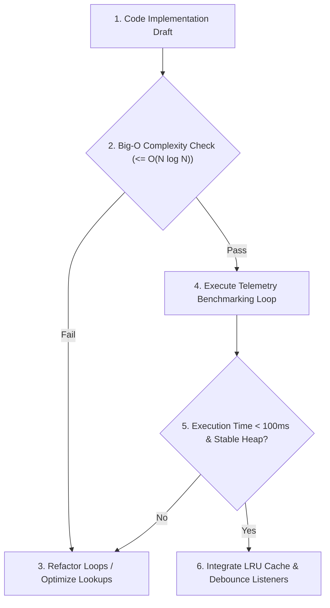

# §PERFORMANCE_GUARD v1.0

id: performance_guard
state: active | profiling | optimized
scope: execution_time + memory_footprint + complexity_analysis + caching_metrics
boot: auto_load | load_skill_integration

This supporting skill establishes performance standards, profiling metrics, algorithmic complexity gates, and caching protocols. It prevents optimization decay and guarantees light, fast runtimes.

---

## 1. Algorithmic Complexity Gates (Big-O limits)

- **Loop Nesting Threshold**: Avoid nested loops exceeding $O(N^2)$ time complexity on collections larger than 1000 items. Require hash map lookups $O(1)$ for multi-dataset correlations.
- **Recursion Depth**: Impose maximum stack limits for recursions. Emphasize tail-call optimization or iterative stacks for complex calculations.
- **Asset Sizing Limits**: Set maximum file-size thresholds (e.g., images under 150KB, CSS packages under 50KB) to ensure rapid web load cycles.

---

## 2. Telemetry and Benchmarking Loops

Before final integration, run active profiling checks on high-load utilities:

- **Execution Timings**: Wrap suspect operations with `console.time()` / `console.timeEnd()` or standard benchmarking functions. Reject execution pathways taking >100ms for core interactive functions.
- **Memory Footprint Tracking**: Measure heap limits using native memory calls (e.g. `process.memoryUsage()` in Node). Ensure memory allocation patterns do not manifest leak trends over repeated iterations.

---

## 3. High-Density Caching and Debouncing

- **State Caching**: Leverage LRU (Least Recently Used) cache containers for API calls and file queries to avoid repeating disk read cycles.
- **Event Debouncing**: Debounce high-frequency interactive event callbacks (e.g., scroll, window resize, input keyups) to throttle browser layout rendering cycles.

**§STATUS: ACTIVE v1.0 | ANTI_REGRESSION: ∞ON | PERFORMANCE_GUARD: PROFILED**
