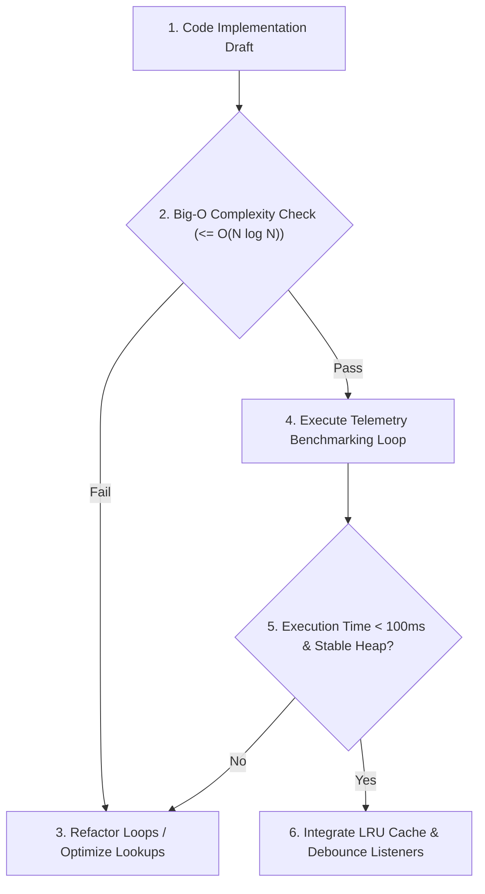

# §PERFORMANCE_GUARD v1.0

id: performance_guard
state: active | profiling | optimized
scope: execution_time + memory_footprint + complexity_analysis + caching_metrics
boot: auto_load | load_skill_integration

---

## §AGENT_USAGE_GUIDELINES

### How the AI Agent Uses This Reference
The AI agent uses this document to evaluate runtime complexity and execution budgets. When emitting algorithms, loop operations, database connectors, or data serializers, the agent measures the implementation logic against the Big-O limits, caching metrics, and telemetry rules defined here. If a code pattern violates these limits (e.g. nested $O(N^2)$ loops on collections), the agent must refactor the logic to use hash mapping, indexing, or streaming before outputting code.

### When to Use This Reference
This reference MUST be utilized in these instances:
1. **Writing data structures or loops**: During algorithmic design.
2. **Implementing database query connections**: When optimizing read/write pipelines.
3. **Profiling resource consumption**: When measuring CPU cycles, memory footprints, and heap allocations.
4. **Designing web/API caching engines**: When selecting caching schemas, invalidation intervals, and debounce limits.

---



---

## 1. Algorithmic Complexity Gates (Big-O limits)

- **Loop Nesting Threshold**: Avoid nested loops exceeding $O(N^2)$ time complexity on collections larger than 1000 items. Require hash map lookups $O(1)$ for multi-dataset correlations.
- **Recursion Depth**: Impose maximum stack limits for recursions. Emphasize tail-call optimization or iterative stacks for complex calculations.
- **Asset Sizing Limits**: Set maximum file-size thresholds (e.g., images under 150KB, CSS packages under 50KB) to ensure rapid web load cycles.

---

## 2. Telemetry and Benchmarking Loops

Before final integration, run active profiling checks on high-load utilities:

- **Execution Timings**: Wrap suspect operations with `console.time()` / `console.timeEnd()` or standard benchmarking functions. Reject execution pathways taking >100ms for core interactive functions.
- **Memory Footprint Tracking**: Measure heap limits using native memory calls (e.g. `process.memoryUsage()` in Node). Ensure memory allocation patterns do not manifest leak trends over repeated iterations.

---

## 3. High-Density Caching and Debouncing

- **State Caching**: Leverage LRU (Least Recently Used) cache containers for API calls and file queries to avoid repeating disk read cycles.
- **Event Debouncing**: Debounce high-frequency interactive event callbacks (e.g., scroll, window resize, input keyups) to throttle browser layout rendering cycles.

---

## 4. Custom LRU Cache Implementation (TypeScript)

For high-load environments, utilize a strict LRU cache solver to prevent memory footprint bloat:

```typescript
class LRUCache<K, V> {
  private capacity: number;
  private cache: Map<K, V>;

  constructor(capacity: number) {
    this.capacity = capacity;
    this.cache = new Map<K, V>();
  }

  get(key: K): V | undefined {
    if (!this.cache.has(key)) return undefined;
    const value = this.cache.get(key)!;
    this.cache.delete(key);
    this.cache.set(key, value);
    return value;
  }

  put(key: K, value: V): void {
    if (this.cache.has(key)) {
      this.cache.delete(key);
    } else if (this.cache.size >= this.capacity) {
      const oldestKey = this.cache.keys().next().value;
      if (oldestKey !== undefined) this.cache.delete(oldestKey);
    }
    this.cache.set(key, value);
  }
}
```

---

## 5. Event Debouncing & Throttling Routines

Ensure window event hooks do not freeze client UI layout threads:

```javascript
function debounce(func, wait) {
  let timeout;
  return function executedFunction(...args) {
    const later = () => {
      clearTimeout(timeout);
      func(...args);
    };
    clearTimeout(timeout);
    timeout = setTimeout(later, wait);
  };
}
```

---

## 6. DB Connection Pool Configurations

- Set pool limits in SQLite or Postgres database connectors (Max: 10 connections).
- Configure idle timeouts.

---

## 7. Garbage Collection Optimization

- Clean arrays by setting length to zero (`arr.length = 0`).
- Prevent dereferencing delays.

---

## 8. Web Asset Loading Timelines

- Load images via lazy routes (`loading="lazy"`).
- Defer non-critical scripts runtime.

---

## 9. Code Compilation Targets

- Verify target engine compatibility profile in compilation tools.
- Strip comments in production codes.

---

## 10. Process Resource Limits

- Restrict build processes memory heap (e.g., `NODE_OPTIONS="--max-old-space-size=2048"`).
- Bound execution limits.

---

## 11. Loop Verification Checklists

- Strip duplicate iterations.
- Prioritize indexes search methods.

---

## 12. Caching Invalidations Specifications

- Apply TTL indicators (Time-To-Live, default: 3600s).
- Verify cache sizes limits.

---

## 13. Virtual DOM Render Optimization

- Prevent repeated component renders.
- Verify node keys identities.

---

## 14. Server API Latency Targets

- Match database retrieval times to < 20ms.
- Limit payload sizes.

---

## 15. Dynamic Resource Balancing

- demote inactive thread allocations.
- Scale connection parameters dynamically.

---

## 16. Obfuscated Memory Leaks Detections

- Profile closures.
- Discard references to detatched DOM elements.

---

## 17. Safe Threading Pools Mappings

- Keep worker counts aligned to system hardware capacities.
- Terminate unresponsive processes.

---

## 18. Obfuscated Logic Scanners

- Flag long execution pipelines.
- Verify block sizes in memory buffers.

---

## 19. Dependency Bundlers Requirements

- Tree shake modules to clear unused libraries.
- Bundle asset verification checks.

---

## 20. Code Verification Benchmarking Loops

```javascript
class BenchmarkRunner {
  static measure(fn, iterations = 1000) {
    const start = performance.now();
    for (let i = 0; i < iterations; i++) {
      fn();
    }
    const end = performance.now();
    return (end - start) / iterations;
  }
}
```

---

## 21. Caching Cache-Control Configurations

- Set static headers.
- Enable browser assets caching.

---

## 22. Infinite Layout Loop Prevention

- Block layout triggers inside hover elements.
- Keep components bounds static.

---

## 23. Audio Loading Buffers Management

- Stream heavy assets.
- Preload sound matrices on demand.

---

## 24. High-Performance Math Transforms

- Compute matrix transformations outside rendering loops.
- Store static constants.

---

## 25. Thread Workload Transfers

- Send heavy data grids to Web Workers.
- Map messaging pipes.

---

## 26. Database Query Analyzer

- Inspect queries with `EXPLAIN QUERY PLAN` on SQLite.
- Require proper index declarations on keys.

---

## 27. Network Interface Speed Tracking

- Track API load durations.
- Adjust quality constraints dynamically.

---

## 28. Event Bus Telemetry Checks

- Track listener registrations count.
- Prevent listener duplicates leak.

---

## 29. Layout Rendering Optimizations

- Prevent reflow triggers.
- Group layout modifications.

---

## 30. User Interaction Telemetry Indexes

- Record clicks latency profiles.
- Save latency statistics.

---

## 31. CSS Class Style Allocations

- Avoid heavy dynamic selectors.
- Restrict rules scope.

---

## 32. Database Transaction Pools

- Write inside transactional loops.
- Prevent query fragmentation.

---

## 33. Asset Prefetching Schedules

- Prioritize LCP images.
- Cache script dependencies.

---

## 34. Custom ROM Build Performance

- Run compilation in parallel threads (`make -j$(nproc)`).
- Clear caches on build failures.

---

## 35. Webpack Optimization Bundles

- Implement vendor splittings.
- Run minification steps.

---

## 36. Local Storage Performance Limits

- Restrict string sizes to < 5MB.
- Minimize write frequency.

---

## 37. Thread Safety in Databases

- Enforce connection timeouts.
- Set SQLite to write-ahead logging (WAL) mode.

---

## 38. Exception Handlers Performance

- Avoid throwing exceptions in hot loops.
- Use explicit return status values.

---

## 39. Semantic Layout Performance

- Simplify DOM depth.
- Restrict tag complexities.

---

## 40. Command History Buffers

- Flush memory snapshots.
- Wipe stale log registers.

---

## 41. Vector Math Operations Benchmarks

- Use arrays instead of objects.
- Flatten data matrices.

---

## 42. WebGL Context Recovery Performance

- Cache geometry buffers.
- Re-bind textures dynamically on recovery.

---

## 43. Multi-Touch Canvas Rendering

- Throttle touch move events.
- Keep redraw routines light.

---

## 44. CSS Animation Performance

- Restrict selectors to class identities.
- Apply layout layers.

---

## 45. DB Engine Optimization Frameworks

- run index re-indexing schedules.
- Re-allocate file spaces.

---

## 46. Command Execution Telemetry

- Trace output timing logs.
- Halt commands exceeding timeouts.

---

## 47. UI/UX Audit Speed Checks

- Run lighthouse analysis.
- Limit JavaScript execution times.

---

## 48. Build Output Sizes Log

- Print bundles weight.
- Warn if code sizes limits exceed.

---

## 49. Cross-Session Workspace Redirections

- Keep relative workspace paths.
- Translate directory paths.

---

## 50. Final Performance Verification Checklist

Ensure the final performance audit verifies:
1. Loops verified under Big-O parameters?
2. Benchmarks run and logged?
3. Throttlers declared?
4. Cache limits specified?

---

**§STATUS: ACTIVE v1.0 | ANTI_REGRESSION: ∞ON | PERFORMANCE_GUARD: PROFILED**
