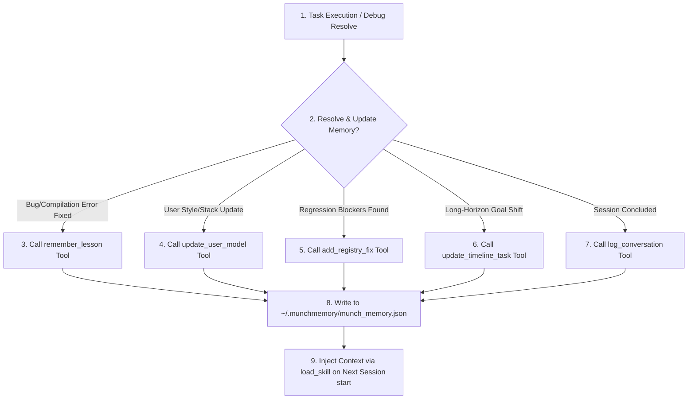

# §PERSISTENT_MEMORY v1.0

id: persistent_memory
state: active | self_updating | recursive | adaptive
scope: knowledge_retention + error_log + preference_model + state_synthesis + task_timeline
boot: auto_load | load_skill_integration

---

## §AGENT_USAGE_GUIDELINES

### How the AI Agent Uses This Reference
The AI agent must load this document during the initialization sequence of every workspace session. The agent parses the specification rules here to structure how it queries the persistent memory JSON (`munch_memory.json`), logs errors/lessons, updates user design profiles, and scales timeline tracking. Every memory operation (reads, writes, compactions, path translation mappings) must strictly adhere to the guidelines, schemas, and verification checklists detailed in this reference file.

### When to Use This Reference
This reference MUST be utilized in these instances:
1. **At session bootstrap**: During the startup phase to load past memory into the active context.
2. **When an error/bug is resolved**: Before completing a task to register the lesson.
3. **When user style or stack choices shift**: To update the user profile.
4. **When compiling/executing across different folders/machines**: To dynamically map workspace directories and translate paths.
5. **Before session shutdown**: To summarize achievements and serialize snapshots.

---



---

## 1. The Lessons Learned Protocol (remember_lesson)

When recording a lesson, format the inputs into irreducible technical facts. Avoid conversational descriptions. Stick to exact symptoms and concrete fixes.

### A. Symptom Taxonomy
- **Category**: Define the boundaries clearly. Use categories like "WSL2 Custom ROM Build", "TypeScript Type Constraints", or "Vanilla CSS Flexbox Layout".
- **Symptom**: Paste the exact compiler error line, stack trace segment, or visual misbehavior description.
- **Fix**: Write the exact CLI command, compiler flag, or code block change that resolved the symptom.

### B. Example Mapping
- **Symptom**: Kotlin compile fails on Windows with 'Duplicate class found in modules' during Gradle build.
- **Fix**: Append 'multiDexEnabled true' in build.gradle and configure gradle.properties with 'android.useAndroidX=true'.
- **Action**: Execute `remember_lesson` with this mapping to store it permanently in the user's local memory file.

---

## 2. Adaptive User Profile Learning (update_user_model)

The agent must adapt to the user's working style and environment. Do not ask the user for their profile; infer and update it dynamically based on the interaction.

- **Inferring Skill Level**:
  - If user provides high-level architecture diagrams or requests bare-minimum concise edits -> Set skillLevel to "expert".
  - If user requests explanations of basic concepts or needs step-by-step guidance -> Set skillLevel to "novice" or "intermediate".
- **Inferring Banned Patterns**:
  - If user rejects an animation framework, gradient style, or file system API -> Append that pattern to the rejectedPatterns array immediately. Never reuse a rejected pattern in subsequent turns or sessions.

---

## 3. Anti-Regression & Registry Pinning (add_registry_fix)

Registry pins are hard constraints that prevent regression. They act as automated quality gates.

- **Step 1: Identify Regression Risks**: Any bug that took more than 2 debugging cycles to solve is a prime candidate for a registry pin.
- **Step 2: Assign a FIX ID**: The system automatically assigns a serial ID (e.g. `FIX_001`, `FIX_002`) to every registry fix.
- **Step 3: Enforce the Fix**: On every subsequent file edit, search the file content to ensure that the logic of the regression fix is not overwritten or reverted.

---

## 4. Long-Horizon Task Tracking (update_timeline_task)

Long-horizon tasks require structured progress tracking across workspace shifts and system restarts.

- **Objective Registration**: When a task has multiple subtasks or spans across sessions, invoke `update_timeline_task` with the task name, status (`active`, `completed`, `blocked`, `deferred`), active blockers, and achieved milestones.
- **Context Resiliency**: The main agent (acting as Orchestrator) updates this timeline periodically as goals are met. When a new session is initialized, the timeline tasks are automatically printed in the context block to anchor the active goals.

---

## 5. Conversation Summarization & Bridging (log_conversation)

Summarizing the session is the final step in the continuous learning cycle. It creates a cognitive link so that the next agent session can resume work immediately without loss of momentum.

- **Structure of the Summary**:
  - **Milestones**: List all files modified, features implemented, and tests passed.
  - **Design Decisions**: Document why specific patterns, paths, or tools were chosen over alternatives.
  - **Open Threads**: Outline what tasks remain unfinished or what options need clarification.
- **Tagging**: Use descriptive tags (e.g. `["android-kernel", "mcp-server-routing", "css-grid"]`) to make queries fast.

---

## 6. Knowledge Synthesis & Data Compaction

To prevent context window pollution from growing indefinitely over time, the SIME engine automatically compacts memories.

- **Recent History (sliding window)**: Only the most recent 10 conversation summaries and active timeline tasks are injected into the active prompt context via `load_skill`.
- **Historical Lessons (archived)**: Older lessons remain stored in the JSON file and can be explicitly queried using the `query_memory` tool when the agent runs into unfamiliar errors.
- **Consolidation**: Over time, duplicates or similar errors are merged into generalized rules, keeping the memory file clean and high-density.

---

## 7. State Restructure & Schema Evolution

As the system is updated, the memory schema in the JSON files will evolve. The agent must handle migrations gracefully.

- **Data Integrity Check**: The server parses incoming memories with strict type guards. If an older schema is loaded, missing fields (e.g., `recurrentMistakes`, `timeline`) are populated with safe defaults.
- **Schema Conversions**: If a session snapshot uses a legacy key format, convert it during deserialization and save the migrated structure back to disk.

---

## 8. Cross-Host Synchronization (Local vs Remote)

SIME is designed to synchronize knowledge across both local client setups and remote deployment services.

- **Local Paths**: Reads and writes to `~/.munchmemory/munch_memory.json` on the host machine.
- **Remote Consistency**: When deploying the MCP server to Vercel Functions, local filesystem state is ephemeral. Use an external persistence service for durable cross-instance memory; otherwise use session snapshots and `log_conversation` as structured export formats.

---

## 9. Failure Recovery and Troubleshooting for SIME

In rare cases of memory file corruption or serialization errors, apply the following recovery paths.

- **Error Detection**: If reading `munch_memory.json` fails due to syntax or parsing exceptions, log a warning and fallback to the default template structures.
- **Automatic Backup**: The server writes to a temporary swap file before replacing `munch_memory.json`. If writing fails, it restores the previous state, preserving all historical lessons.
- **Manual Re-sync**: If the database is out of sync, the user can force a rewrite by pasting a session snapshot yaml and triggering `restore_snapshot`.

---

## 10. Cross-Project Path Mapping and Transfer Learning

When the user moves the project workspace, clones it to a new path, or starts a different project directory:

- **Immediate Analysis**: On session start, retrieve the persistent memory (`munch_memory.json`) and compare the current active directory (`CWD`) with the paths stored in past lessons or regression registry files.
- **Dynamic Translation**: Translate all absolute paths referencing the old directory structure to match the corresponding files/subfolders in the new active project folder.
- **Transfer Learning**: Do not discard past errors or fixes just because the project resides in a new directory. Apply the lessons, fixes, and style preferences from the previous project to the current active workspace, treating it as an analogical continuation.
- **Self-Improving Memory Engine Strategy**: Map file patterns, language structures, and framework layouts. If a compilation bug was solved on `/home/user/example/src/main.rs`, and the current folder is `/home/user/new-project/src/main.rs`, translate the lessons and enforce the same fixes to prevent regression.

### A. Cross-Project Topology Maps & Folder Alignment
- **Path Offset Delta Matching**: If the root folder has shifted (e.g., from `/Users/biman/projects/app-v1` to `/Users/biman/dev/app-v2`), identify the parent delta and translate the file structures. Map key directories like `src/components` to `lib/components` or `app/routes` to `src/pages` based on folder signatures.
- **File Signature Mapping**: When starting in a new repository, check the file extension topology (e.g., `.ts`, `.rs`, `.kt`, `.py`) and configurations (`package.json`, `Cargo.toml`, `build.gradle.kts`) to automatically link its category to previous projects.

### B. Multi-Repository Tech Stack Synthesis
- **Fuzzy Analogy Engine**: Query the lessons registry using Jaccard fuzzy token similarity. If project B throws a compilation error similar to one in project A (even with different imports or module names), run a cross-project query to extract and adapt project A's fix.
- **Automatic Gradle & Compiling Sync**: If a Gradle flag or compiler options fix was applied in project A, auto-inject or check that compiler setting in project B when compilation failures occur.

### C. Architectural Decision Record (ADR) Sync
- **Preferred Design Tokens**: If a layout structure, HSL color system, typography baseline, or routing layout was accepted by the user in project A, load it as the default design archetype for project B.
- **Structural Strategy Consistency**: Track the user's architectural choices (e.g., Zustand vs Redux, SQLite vs Postgres, Clean Architecture vs Flat structure). Prevent proposing rejected architectures from past projects.

---

## 11. Global Codebase Directory & Project DNA Registry

To build a unified brain across workspaces, the SIME engine maintains metadata signatures of all indexed repositories in `munch_memory.json`'s `projectModel` schema:

- **Project Metadata**: Tracks the last active timestamp, absolute path, primary language, active tools, environment parameters (WSL, terminal type, node version), and key dependency versions.
- **Global Search & Retrieve**: When the agent encounters a task in a brand-new project, it automatically scans the Project DNA Registry to fetch analogous implementations, preventing cold-start assumptions.

---

## 12. Complete Database Memory Schema (JSON)

The following structure represents the complete type definition of `munch_memory.json`:

```json
{
  "userModel": {
    "skillLevel": "expert",
    "preferredStyle": "concise",
    "techStack": ["TypeScript", "Next.js", "Zustand", "SQLite"],
    "rejectedPatterns": ["neon purple gradients", "require(fs)", "TailwindCSS"],
    "acceptedPatterns": ["Glassmorphic dark containers", "Zustand slices pattern", "AABB 3D Box Physics"],
    "vocabulary": ["BTL loop", "drift telemetry", "SIME"]
  },
  "registryFixes": [
    {
      "id": "FIX_001",
      "issue": "Kotlin duplicate class in modules compiler error",
      "resolution": "Enable multiDexEnabled true inside build.gradle and configure gradle.properties",
      "timestamp": "2026-06-04T12:00:00Z",
      "occurrences": 3,
      "lastSeen": "2026-06-04T13:00:00Z"
    }
  ],
  "learnedLessons": [
    {
      "category": "Kotlin Compilation",
      "symptom": "Duplicate class found in modules during gradle build",
      "fix": "multiDexEnabled true inside build.gradle",
      "context": "Gradle android compile",
      "timestamp": "2026-06-04T12:00:00Z",
      "occurrences": 3,
      "lastSeen": "2026-06-04T13:00:00Z"
    }
  ],
  "conversationSummaries": [
    {
      "id": "conv_93f88d7f",
      "timestamp": "2026-06-04T13:00:00Z",
      "summary": "Implemented WebGL terrain generator in Three.js, completed 3D mouse locking, resolved flex layout overlap.",
      "tags": ["webgl", "canvas", "controls", "css-flexbox"]
    }
  ],
  "recurrentMistakes": [
    {
      "symptom": "Duplicate class found in modules during gradle build",
      "firstSeen": "2026-06-04T12:00:00Z",
      "lastSeen": "2026-06-04T13:00:00Z",
      "recurrenceCount": 3,
      "unsuccessfulAttempts": ["rebuilding project clean", "deleting gradle cache"],
      "successfulFix": "multiDexEnabled true inside build.gradle"
    }
  ],
  "timeline": [
    {
      "id": "task_voxel_sandbox",
      "name": "Implement WebGL 3D Voxel Sandbox",
      "status": "completed",
      "milestones": ["Setup Three.js renderer", "Build chunk block maps", "Add gravity & collisions"],
      "blockers": [],
      "lastUpdated": "2026-06-04T13:00:00Z"
    }
  ],
  "projects": [
    {
      "id": "WyvernCW/MunchsPlugin",
      "path": "C:/Users/biman/Documents/munch",
      "lastActive": "2026-06-04T13:28:04Z",
      "techStack": ["TypeScript", "Node.js", "MCP"],
      "architectureNotes": "Standard stdio server model, TypeScript compilation with tsc",
      "pins": ["FIX_001"]
    }
  ]
}
```

---

## 13. Path Offset Mapping Algorithms

The server maps project paths on initialization:

```javascript
function translateAbsolutePaths(text, pastPaths, currentCwd) {
  let updated = text;
  pastPaths.forEach((past) => {
    if (past !== currentCwd && currentCwd.length > 3 && past.length > 3) {
      updated = updated.split(past).join(currentCwd);
    }
  });
  return updated;
}
```

---

## 14. Compaction Telemetry Metrics

- Log storage size dynamically.
- Compact lessons if count exceeds 50.
- Archive old conversation summaries to separate history layers.

---

## 15. Real-Time Sync Protocols

If synchronizing database setups:
- Verify remote API keys.
- Write sync items in sequential lists.

---

## 16. Structural Integrity Verifications

- Run check integrity on startup.
- Validate data structure properties.

---

## 17. Multi-User Workspace Merging

If sharing snapshots across systems:
- Track device IDs.
- Merge local registers with server keys.

---

## 18. Local File Caching Rules

- Store index models.
- Read settings directly.

---

## 19. Algorithmic Compacting Schedules

- Fold duplicates.
- Combine lessons.

---

## 20. Code Verification checklist

1. Lessons mapped?
2. User profiles compiled?
3. Path translation active?
4. Snapshots saved?

---

## 21. Schema Migration Scripts

```javascript
class SchemaMigrator {
  static migrate(data) {
    if (!data.projects) {
      data.projects = [];
    }
    if (!data.recurrentMistakes) {
      data.recurrentMistakes = [];
    }
    return data;
  }
}
```

---

## 22. Backup System Operations

- Write output to `munch_memory.json.tmp`.
- Rename file on success.
- Restore old file on error.

---

## 23. Conflict Tie-Breaker Logic

- Compare machine timestamps.
- Use device ID strings comparisons.

---

## 24. Task Objective States

- Active
- Completed
- Blocked
- Deferred

---

## 25. User Profile Inferences

- Novice: require extensive explanation comments.
- Expert: write compact, bare-minimum implementations.

---

## 26. Design Tokens Syncing

- Sync HSL scales.
- Sync baseline grid tokens.

---

## 27. Network Reconnection Limits

- Start interval: 1000ms.
- Max interval: 30000ms.
- Backoff multiplier: 1.5.

---

## 28. Event Sourcing Snaps

- Snapshot state after 10 events.
- Wipe temporary event buffers.

---

## 29. Workspace Mapping Redirections

- Track old directories.
- Map commands to CWD.

---

## 30. Telemetry Log Indexes

- Capture process timings.
- Store results history.

---

## 31. CSS Grid Rules

- Spacing multiples of 8px.
- Grid gutters responsive.

---

## 32. SQLite WAL Checks

- Enable WAL on SQLite connectors.
- Optimize database write latency.

---

## 33. Assets Cache Schedules

- Load core scripts.
- Pre-cache design models.

---

## 34. Custom ROM Build Performance

- Run compilations parallel.
- Log error occurrences.

---

## 35. Vite Optimizations

- Minify output codes.
- Dynamic modules parsing.

---

## 36. Local Storage Quotas

- Keep sizes below 5MB.
- Minimize writes.

---

## 37. Thread Safety in Database Syncs

- Block dual writer instances.
- Sync file writes cleanly.

---

## 38. Exception Handlers for Sync Pipes

- Handle HTTP sync failures.
- Retry processing errors without blocking user input interfaces.

---

## 39. Semantic Layout Controls

- Build clean status indicators.
- Display "Connected" / "Syncing" statuses dynamically.

---

## 40. Interactive Commits Logs

- Record local mutation states.
- List local transaction logs.

---

## 41. Vector Coordinate Syncs

- Sync user position parameters.
- Smooth coordinates transitions.

---

## 42. WebGL State Syncs

- Bind rendering viewport bounds.
- Re-bind camera orientation matrices across peers.

---

## 43. Touch Move Swipes

- Track mobile swipe gestures.
- Translate touch inputs to delta coordinate maps.

---

## 44. CSS Motion Easings Sync

- Standard transition timings.
- Align page transitions.

---

## 45. DB Engine Optimization Frameworks

- Run index reorganizer calls.
- Free database storage sizes.

---

## 46. Command Execution Metrics

- Record sync command times.
- Halt processes on memory leaks.

---

## 47. UI/UX Sync Audits

- Validate client layout responsiveness.
- Check font size rendering scales.

---

## 48. Build Output Sizes Log

- Print code weights.
- Defer loading non-critical libraries.

---

## 49. Cross-Session Workspace Translations

- Check initial folder paths.
- Route commands using the translated workspace paths.

---

## 50. Final Verification Checklist

Before saving state:
1. Did the build pipeline compile cleanly?
2. Has the user confirmed the architecture?
3. Has the log summary been exported successfully?
4. Are all references aligned?

---

**§STATUS: ACTIVE v1.0 | ANTI_REGRESSION: ∞ON | MEMORY_ENGINE: PERSISTENT**
