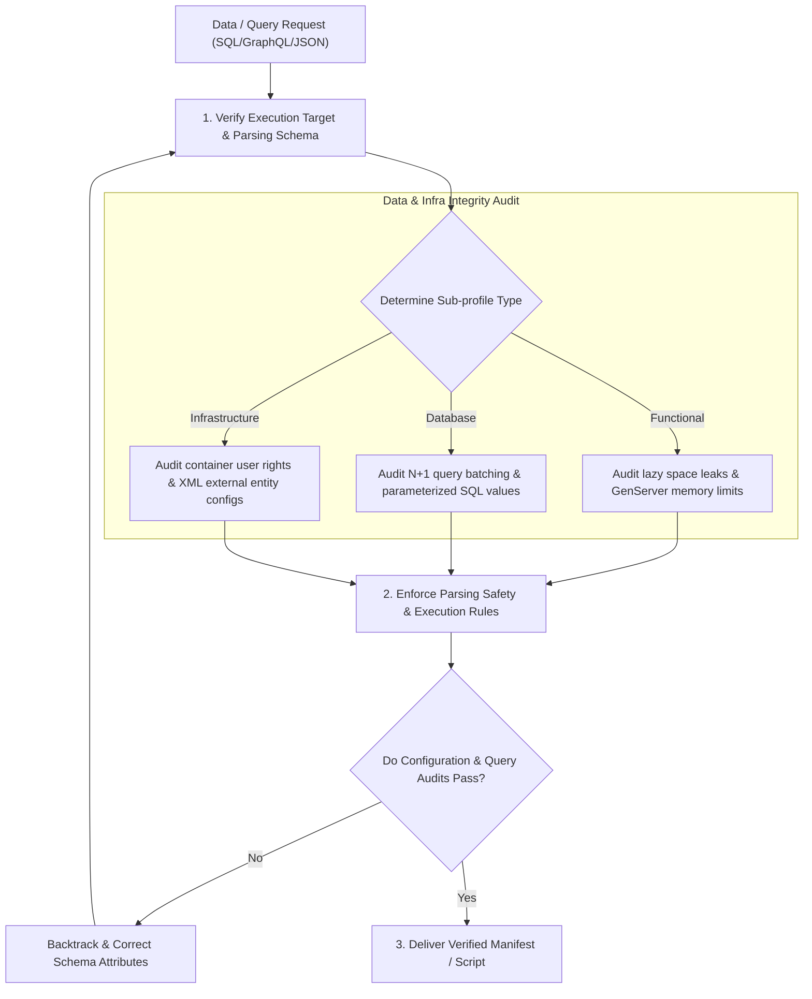

# §POLYGLOT_DATA_FUNCTIONAL v2.3 
> Code paradigms, security gates, and parsing configurations for functional programming, databases, and markup/config files.

---

## 1. §DATA_CONCURRENCY_FLOW 

---

## 2. How the AI Must Apply This Skill
When designing configurations, executing database queries, or structuring functional applications under this supporting skill, the AI agent must apply these constraints:
1. **Configure Supervisor Restarts Appropriately**: When designing concurrent worker systems (like Elixir GenServers), implement a robust supervision structure, selecting restarts policies that prevent cascades.
2. **Mitigate GraphQL N+1 Issues**: Enforce batch-loading patterns for nested query resolution, avoiding single-record database calls in loops.
3. **Parameterize Cypher and SQL statements**: Never concatenate strings to construct statements. Pass dynamic values inside parameterized map parameters.
4. **Harden Runtime Manifests**: Use least-privilege service accounts and restrict administrative permissions.
5. **Secure XML Parsing Contexts**: Disable external entity resolution (DTD checking) on all XML parser initialization routines.

---

## 3. Pure Functional & Concurrent Programming (Haskell, Elixir, Erlang, Clojure)

### A. Elixir OTP Concurrency & Supervision
* **Let It Crash Philosophy**: Do not trap exits inside worker processes. Let processes crash and configure a robust supervision tree to restart them to a known healthy state.
* **Avoid Shared Mutable State**: Use Elixir Agent or GenServer states strictly. Never update state without passing it through immutable function pipelines.
* **Supervisor Strategies**: Select correct supervisor behaviors (One-For-One, One-For-All, Rest-For-One) depending on how dependent worker processes are on one another.
* **Process Mailbox Congestions**: Avoid blocking GenServer calls inside high-throughput pathways. Offload long operations to separate task workers to prevent message mailboxes from overflowing.
* **State Recovery Lifecycle**: Implement structured database backups or database persistence layers to save state parameters during unexpected supervisor restarts.

### B. Haskell Lazy Evaluation Boundaries
* **Avoid Space Leaks**: Laziness can hold references to large data graphs in memory. Enforce strict evaluation using strict operator applications or compile-time strictness flags when accumulating values in loops.
* **Data Constructor Strictness**: Enforce strict fields in custom data types using strictness annotations to prevent nesting unevaluated expressions (thunks) in memory.
* **Deep Evaluation**: Apply deep evaluation parameters when returning complex nested results to catch stack evaluation issues before runtime.

### C. Clojure Functional State
* **State References**: Manage mutable references strictly using Clojure Atoms, Refs, and Agents. Combine mutations using software transactional memory (STM) transactions to ensure atomicity.

---

## 4. Databases & Querying (SQL, GraphQL, Cypher, SPARQL)

### A. GraphQL N+1 Query Prevention
* **Batch Loading**: Never resolve nested lists of child properties using inline database calls inside your resolvers. Implement a Batch Loader to consolidate single queries.
* **Query Depth Limits**: Configure maximum query depth checks on your server to prevent users from executing recursively nested queries that exhaust resources.
* **Query Complexity Checks**: Limit the volume of requested columns or fields to prevent database timeouts.

### B. Cypher (Graph Databases) Injection Protection
* **Parameterize Graph Queries**: Never concatenate strings to build Cypher statements. Always use parameter maps to pass inputs safely.
* **Graph Indexing**: Analyze execution plans (using EXPLAIN or PROFILE targets) to verify that queries utilize index lookups instead of scanning the entire node repository.

### C. SQL Query Tuning
* **Avoid SELECT Star**: Explicitly list columns in select queries to reduce data serialization overhead and leverage covering indexes.
* **Transaction Isolation Levels**: Set appropriate database transaction isolation levels to prevent dirty reads or serialization deadlocks.

---

## 5. Configuration & Infrastructure (Terraform, YAML, XML, Service Manifests)

### A. Runtime Privilege Mitigation
* **Container Hardening**: Never let containers run as the root user. Always define a custom, unprivileged user and restrict file permissions.
* **Multi-Stage Builds**: Separate build-time dependencies (like compilers and headers) from the final runtime image using multi-stage builds to minimize the attack surface.

### B. XML External Entity (XXE) Injection Prevention
* **Disable External DTDs**: When configuring parser engines (like SAX or DOM in Java), explicitly disable external entity parsing to prevent system file disclosure.

### C. Terraform State Security
* **State Encryption**: Secure backend state configurations using encryption-at-rest. Always enforce state-locking using database tables to prevent concurrent updates from corrupting deployment plans.
