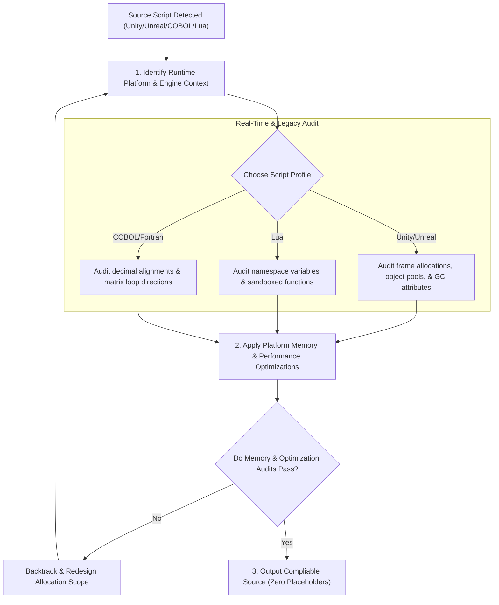

# §POLYGLOT_GAME_LEGACY_ESOLANG v2.3 
> Architecture patterns, memory rules, and performance tricks for Game Engines, Enterprise Legacy systems, and esoteric languages.

---

## 1. §GAME_LEGACY_EXECUTION_FLOW 

---

## 2. How the AI Must Apply This Skill
When designing components, writing scripts, or configuring environments for games, sandboxed engines, or legacy enterprise platforms under this supporting skill, the AI agent must apply these rules:
1. **Minimize Allocations in Real-Time Loops**: When writing game engine scripts, do not allocate heap objects (like instantiating prefabs or combining dynamic strings) inside frame updates. Cache all references in startup methods and utilize object pool patterns.
2. **Decorate Unreal Pointers Appropriately**: Mark all UObject references with property metadata macros to prevent the garbage collection system from removing references.
3. **Cache GDScript Node Paths**: Enforce cached node referencing paths in Godot script files, checking that event connections are un-linked during node removal.
4. **Isolate Lua Script Execution**: Clean the global namespace when launching user-supplied Lua scripts, replacing OS commands and IO routines with safe, local mock functions.
5. **Optimize Legacy Matrix Traversals**: When writing Fortran, access memory cells column-by-column to match column-major storage layout patterns.

---

## 3. Game Development Engines (C# Unity, C++ Unreal, GDScript, Lua)

### A. C# & Unity Garbage Collection Minimization
* **Object Pooling**: Avoid instantiating and destroying objects dynamically during runtime loops, which causes memory fragmentation and garbage collection spikes. Implement object pooling.
* **Cache Components**: Never call component queries inside updates. Cache component references inside startup methods.
* **Struct vs Class Allocation**: Pass small data records as structs to allocate them on the stack, avoiding heap allocation garbage collections.
* **String Concatenation in Loops**: Avoid dynamic string combinations inside updates. Use string builders or predefined message arrays to prevent string heap allocations.
* **Avoid Physics Allocations**: Limit dynamic memory allocations inside physics ticks by caching collision parameter arrays.

### B. C++ Unreal Engine Garbage Collection
* **GC Property Decoration**: Always mark pointers referencing Unreal objects with property metadata macros. Failing to do so hides reference relationships, leading to dangling pointers and memory corruption.
* **Smart Reference Containers**: Utilize Unreal specific smart pointer wrappers (like shared references, shared pointers, and weak pointers) for non-UObject heap allocations.
* **Delegate Binding Lifecycles**: Unbind dynamic delegate listeners when objects are destroyed or deleted to prevent executing callbacks on missing objects.
* **Actor Component Caching**: Store references to actor components during initialization to avoid expensive dynamic component lookups during ticks.

### C. GDScript (Godot)
* **Enforce Static Typings**: Define explicit parameter types and return type configurations on all script functions to optimize performance.
* **Node Referencing**: Cache node references on initialization rather than searching node paths dynamically inside process ticks.
* **Signal Connections**: Check that signals are disconnected when dynamic nodes are removed from the active scene tree to prevent memory leaks.

---

## 4. Sandboxed Game Scripting (Lua)

* **Local Scopes**: Declare variables using local scopes to prevent namespace pollution and optimize variable access in the Lua register stack.
* **Safe Sandboxing**: When loading user-supplied scripts, override unsafe functions with a restricted, monitored environment.
* **Metatable Performance**: Avoid chaining deep prototype lookups inside metatables. Cache metatable lookups inside local references to optimize execution speed.
* **String Manipulations**: Minimize dynamic string modifications in Lua as every edit creates a new immutable string entry in the global string pool.
* **Memory Registry Limits**: Manage table entries strictly, removing unreferenced objects from global tables to prevent leaks.

---

## 5. Legacy Enterprise Software (COBOL, Fortran, Ada)

* **COBOL Data Declarations**: Set strict alignments and sizes using picture clauses. Minimize floating point operations by using packed decimal structures for precision arithmetic.
* **Ada Strong Typing & Tasks**: Utilize Ada's strong typing engine to prevent range errors. When designing concurrency, use task entry points and rendezvous models rather than manual thread locks.
* **Fortran Column-Major Layouts**: Optimize multi-dimensional matrix operations by traversing arrays column-by-column, maximizing hardware cache utilization.
* **ColdFusion Deserialization Safeguards**: Disable binary object deserialization handlers in ColdFusion application configurations to protect the server from execution vulnerabilities.
* **JCL Step Configurations**: Configure step return codes explicitly to check execution integrity in legacy systems.
