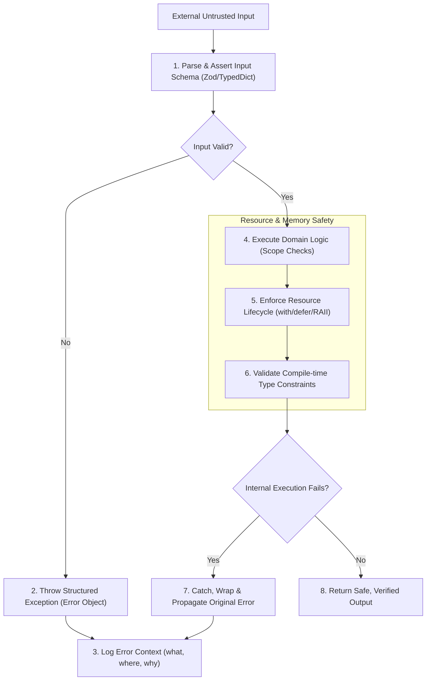

# §POLYGLOT_IDIOMS v2.2
> Clean coding paradigms, strict error handling, and type-safety rules for Tier 1 languages.

---

## 1. §IDIOM_VERIFICATION_FLOW

---

## 2. How the AI Must Apply This Skill
When emitting code segments or reviewing source integrity under this supporting skill, the AI agent must apply these constraints dynamically:
1. **Enforce Absolute Schema Separation**: Never process raw, unverified data arrays or objects directly. Parse inputs through schema validation layers first to check properties before usage.
2. **Standardize Exceptions**: Throw only formal error classes. Do not let low-level network or IO errors fail silently; wrap them inside customized error structures containing descriptive tracing keys.
3. **Assert Resource Lifecycles**: Ensure every resource is enclosed in memory-managed wrapper blocks (e.g. `with` in Python, `defer` in Go, or smart pointers in C++) to prevent reference leaks.
4. **Implement Boundary Type Guards**: Write explicit checks or custom guards to verify parameters, preventing null pointer crashes or type evaluation mismatches during execution.
5. **Manage Thread Execution Safely**: Use select-timeouts, cancellation channels, or thread pools to bound the lifetime of concurrent routines.

---

## 3. TypeScript & JavaScript (Advanced Paradigms)

### A. Type Assertions & Schema Validation
* **Avoid any and as any**: Reject compile-time type-safety escapes. Use the unknown type for unverified external inputs (API payloads, user inputs, disk reads) to enforce explicit compiler assertions.
* **Type Guarding & Narrowing**: Leverage user-defined type predicates and runtime validation schemas to parse and guarantee payload structures before execution.
* **Structural Safety**: Map data records strictly. Validate nested objects recursively to protect the runtime environment from unexpected property access failures.
* **Array Index Checking**: Guard all array and list index access operations. Verify arrays contain items before accessing specific elements to prevent out-of-bounds errors.

### B. Error Handling & Exception Flow
* **Exceptions as Objects**: Always throw standard instances of the Error class (or subclass thereof). Never throw strings or raw literals, which drop native stack traces.
* **Chained Error Wrapping**: Wrap low-level exceptions (like database or filesystem errors) inside high-level context errors, retaining the original message and stack trace.
* **Error Log Content**: Ensure error messages contain clear (`what`, `where`, `why`) structures without exposing sensitive database strings, user-identifiable information, or system keys.
* **Reject Promises with Error Objects**: When rejecting promises or returning asynchronous failures, resolve error objects rather than strings to allow diagnostics tools to print stack traces.

---

## 4. Python (Type Hints & Resource Integrity)

### A. Strict Type Annotations
* **Function Signatures**: Annotate parameter names, default arguments, and return types explicitly for all functions, methods, and generators.
* **Structural Typing**: Use typing protocols and structural definitions (like typing.Protocol or typing.TypedDict) to declare component expectations without concrete inheritance.
* **Union & Optional Types**: Use explicit Union or Optional markers to manage conditional variable lifetimes, guarding against unexpected NoneType exceptions.
* **Type Casting Guards**: Restrict raw type overrides or casting declarations unless verifying variable states explicitly using checks.

### B. Context Managers & Resource Management
* **Resource Scopes**: Wrap file streams, sockets, database transactions, and thread-locks inside with contexts to ensure deterministic cleanup.
* **Custom Managers**: Enforce resource handling for custom elements by implementing enter and exit operations to guarantee memory and connection release even under exception scenarios.
* **Generators Lifecycles**: Ensure generator runs are closed or consumed completely when handling file or data buffers to avoid memory leaks.

---

## 5. Go (Error Wrapping & Concurrency Safety)

### A. Explicit Error Checking & Wrapping
* **Zero Ignored Errors**: Check all returned error variables immediately at the call site.
* **Wrapping Semantics**: Combine custom context with error wrapping using `%w` to build traceable error chains while retaining the capability to assert original error instances.
* **Failure Actions**: Explicitly clean up resources (closing files, releasing locks) before executing function returns on failure paths.

### B. Goroutine Lifetime & Timeout Orchestrations
* **Routine Lifetime Control**: Ensure every spawned goroutine has a guaranteed, clean exit path triggered by channel signals or context cancellations.
* **Select Call Logic**: Coordinate multi-channel actions using select statements with explicit timeout cases to prevent deadlocks and blockages.
* **Channel Buffer Allocations**: Set bounds on channel capacities to prevent memory starvation when channels are blocked.

---

## 6. Rust (Memory Safety & Pattern Matching)

### A. Safe Match Chains
* **Pattern Compilation**: Utilize match chains to handle options and results exhaustively, avoiding raw un-wrapping or unchecked indexing.
* **Combinator Flow**: Chain calculations using monad operations (like map, and_then, and map_err) to avoid verbose conditional checks.

### B. Ownership, References, and Safe Slicing
* **Borrowing Rules**: Enforce strict reference checks, preferring slices (`&str`, `&[T]`) over cloning heap allocations (`String`, `Vec<T>`).
* **Lifetimes**: Declare variable references explicitly when crossing structural bounds to ensure compilation validity.
* **Slice Index Validation**: Protect slice lookups by using safe search parameters, preventing panic crashes on access actions.
