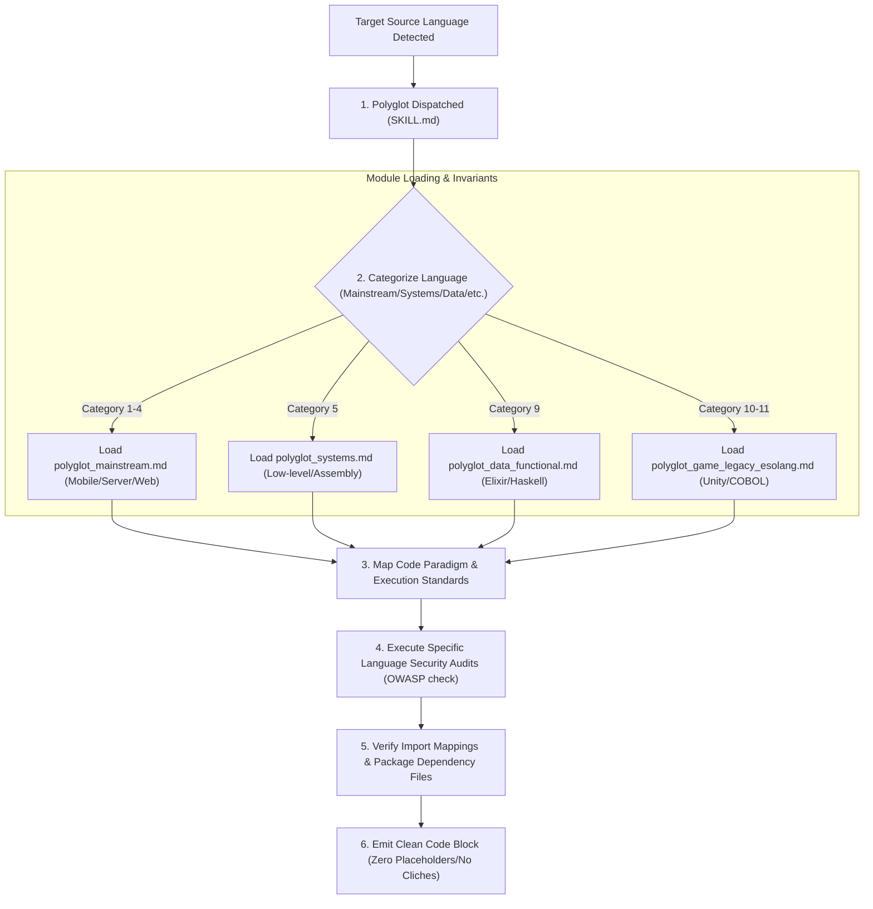

# §POLYGLOT_INDEX v2.3
> The ultimate cross-language index mapping all programming languages in the world to their clean coding paradigms, security checks, and compiler configurations.

---

## 1. §POLYGLOT_DISPATCH_FLOW

---

## 2. How the AI Must Apply This Skill
When loaded into the AI agent's session, this supporting skill governs how the agent handles polyglot operations:
1. **Identify and Categorize the Target Language**: Before writing any file or snippet, identify which of the 18 categories the target language belongs to using this index.
2. **Load the Correct Profile**: Dynamically load the rules, guidelines, and security checks from the corresponding supporting reference module (e.g. `polyglot_systems.md` for C/C++ or `polyglot_data_functional.md` for SQL/Elixir).
3. **Assert Coding Idioms**: Strictly apply the type-safety, error handling, and memory constraints defined in `polyglot_idioms.md` for the target language.
4. **Follow Language Security Rules**: Run the specific security scan checks defined in the target language profile (such as preventing SQLi in backend scripts, or memory leaks in C++ code).
5. **Zero Coding Placeholders**: Produce complete, compilable implementations. Do not truncate files, skip classes, or leave incomplete segments regardless of length.

---

## 3. Mainstream & Must-Know Languages
* **Languages**: Python, JavaScript, TypeScript, Java, C, C++, C#, Go, Rust, PHP, Ruby, Swift, Kotlin, Dart, Objective-C, Scala, R, MATLAB, Julia, Lua, Perl, Haskell, Elixir, Erlang, F#, OCaml, Zig, Nim, Crystal, D, Delphi/Object Pascal, Visual Basic, VB.NET.
* **Core Paradigm**: High performance, structural typing, object-oriented/functional abstractions, and robust package environments.
* **Security Checks**: Ensure compiler type-safety, correct dependency version matching, and secure memory allocations.
* **Runtimes & Toolchains**: GCC, Clang, JVM, V8, Node.js, .NET CLR, Python interpreter, Rustc, Go compiler.
* **AI Guideline**: Enforce absolute syntax compliance, correct compiler version matching, and secure resource disposal.

---

## 4. Web / Frontend / Scripting
* **Languages**: JavaScript, TypeScript, CoffeeScript, Elm, PureScript, ReasonML, ReScript, ClojureScript, Dart, ActionScript, VBScript, LiveScript.
* **Core Paradigm**: Reactive interfaces, component nesting, asynchronous event loops, DOM rendering control, and event propagation.
* **Security Checks**: Direct browser cross-site scripting (XSS) prevention, prototype pollution safeguards, dynamic script execution controls, and CORS header limits.
* **UI Frameworks**: React, Vue, Angular, Svelte, SolidJS, Flutter Web.
* **AI Guideline**: Prevent cross-site scripting (XSS), prototype pollution, state leaks, and slow rendering paths.

---

## 5. Backend / Server Systems
* **Languages**: Python, Java, Go, C#, PHP, Ruby, JavaScript/Node.js, TypeScript, Rust, Kotlin, Scala, Elixir, Erlang, Perl, Clojure, Haskell, Lua.
* **Core Paradigm**: High concurrency, thread-pool scheduling, network routing, database connection pooling, and REST/GraphQL interface handling.
* **Security Checks**: Command injection prevention, SQL injection (SQLi) blocks, cross-site request forgery (CSRF) defenses, and server-side request forgery (SSRF) checks.
* **Web Frameworks**: Django, Flask, Express, NestJS, Spring Boot, Gin, Actix, Rails, Laravel.
* **AI Guideline**: Prevent SQL Injections (SQLi), cross-site request forgery (CSRF), server-side request forgery (SSRF), and resource exhaustion.

---

## 6. Mobile Platforms
* **Languages**: Swift, Objective-C, Kotlin, Java, Dart, C#, JavaScript, TypeScript, Lua.
* **Core Paradigm**: Native layout renders, hardware resource limits (memory, CPU, battery), platform event loops, and secure sandboxed local databases.
* **Security Checks**: Secure keychain data storage, URL scheme deep link validation, background data leaks prevention, and dynamic class load limits.
* **SDK Tools**: Xcode, Android SDK, Gradle, CocoaPods, Flutter, React Native.
* **AI Guideline**: Handle application lifecycle states correctly, minimize garbage collection allocations, and store credentials securely.

---

## 7. Systems / Low-Level / Performance
* **Languages**: C, C++, Rust, Zig, D, Nim, Assembly, Ada, Fortran, Pascal, Go, Carbon, Odin, V, Jai.
* **Core Paradigm**: Manual memory management, explicit pointer allocations, register allocations, static binary linking, and custom memory management.
* **Security Checks**: Buffer overflow prevention, memory leak audits, use-after-free diagnostics, double-free checks, and address space layout randomization (ASLR) validations.
* **Low-Level Tools**: Make, CMake, Ninja, GDB, LLDB, Valgrind.
* **AI Guideline**: Defend against buffer overflows, null pointer dereferencing, double-free, use-after-free, and compiler optimization pitfalls.

---

## 8. Data / AI / Stats
* **Languages**: Python, R, Julia, MATLAB, SAS, Stata, Wolfram Language, Scala, SQL, Stan, JAGS, BUGS.
* **Core Paradigm**: Mathematical vectors, tensor matrix manipulations, training statistical runs, parallel execution, and structured query manipulations.
* **Security Checks**: Safe math computations, input boundary validation, numerical overflow safeguards, and safe model loading.
* **Libraries & Systems**: NumPy, PyTorch, TensorFlow, Pandas, Scikit-learn.
* **AI Guideline**: Optimize mathematical execution, prevent array boundary overflows, and ensure numerical type stability.

---

## 9. Database / Query Languages
* **Languages**: SQL, PL/SQL, T-SQL, PostgreSQL PL/pgSQL, MySQL SQL, SQLite SQL, Cypher, GraphQL, SPARQL, Datalog, XQuery, MDX, DAX.
* **Core Paradigm**: Declarative data extraction, transaction control, relationship traversals, query optimizations, and index mappings.
* **Security Checks**: Parameter validation, dynamic query parsing blocks, access permission verification, and injection blocks.
* **Engines**: PostgreSQL, MySQL, SQLite, Oracle, Neo4j, MongoDB, Redis.
* **AI Guideline**: Prevent injections, minimize join complexities, avoid N+1 resolver loops, and utilize structural database indexes.

---

## 10. Shell / Terminal Scripting
* **Languages**: Bash, Zsh, Fish, PowerShell, Batch, CMD, sh, csh, tcsh, ksh, AWK, Sed.
* **Core Paradigm**: Command orchestrations, environment configurations, parsing string outputs, file pipe flows, and directory updates.
* **Security Checks**: Input parameter escaping, command exit code verification, file path sanitization, and execution path verification.
* **AI Guideline**: Quote variables to prevent word splitting, catch command return codes, and handle platform differences.

---

## 11. Functional Programming
* **Languages**: Haskell, Lisp, Scheme, Common Lisp, Clojure, F#, OCaml, Standard ML, Erlang, Elixir, Elm, PureScript, Racket, Agda, Idris, Coq/Rocq, Lean.
* **Core Paradigm**: Purity, immutability, pattern matching, recursion, algebraic data structures, and lazy evaluation.
* **Security Checks**: Stack size validation, memory exhaustion checks, state variable updates isolation, and pattern matching completeness.
* **AI Guideline**: Prevent space leaks in lazy evaluation, ensure structural completeness in pattern matches, and use tail-recursion.

---

## 12. Game Dev / Engine Scripting
* **Languages**: C++, C#, Lua, GDScript, JavaScript, TypeScript, Python, AngelScript, UnrealScript, Verse, Squirrel, Papyrus, GameMaker Language.
* **Core Paradigm**: Real-time rendering loops, frame-rate target constraints, script trigger controls, object reuse, and component loops.
* **Security Checks**: Minimise dynamic memory allocations, implement object pool managers, and check scripting execution limits.
* **Engines**: Unreal Engine, Unity, Godot, GameMaker.
* **AI Guideline**: Minimize allocations, use object pools, cache component lookups, and ensure thread safety inside rendering bounds.

---

## 13. Enterprise / Legacy Systems
* **Languages**: COBOL, Fortran, Ada, ABAP, PL/I, RPG, JCL, Smalltalk, Visual Basic, Delphi, FoxPro, PowerBuilder, ColdFusion.
* **Core Paradigm**: High precision calculations, record-based processing, linear logic, transaction monitors, and database linkages.
* **Security Checks**: Boundary audits, stack integrity, decimal format configurations, and input processing gates.
* **AI Guideline**: Follow standard structural layouts, enforce precise decimal variables, and adhere to structural framework limitations.

---

## 14. Hardware / Embedded Systems
* **Languages**: C, C++, Rust, Assembly, Ada, VHDL, Verilog, SystemVerilog, Embedded C, Forth, nesC.
* **Core Paradigm**: Clock domains, register boundaries, concurrent signals, hardware constraints, timing accuracy, and interface buses.
* **Security Checks**: Clock synchronization, signal collision prevention, pin address boundary verification, and memory safety.
* **AI Guideline**: Eliminate glitches, synchronise clock transitions, and write hardware synthesizable configurations.

---

## 15. Scientific / Math Programming
* **Languages**: Fortran, MATLAB, Julia, Python, R, Mathematica/Wolfram, Maple, Octave, Scilab, APL, J, K, Q.
* **Core Paradigm**: Heavy array calculations, numeric modeling, symbolic math, high-precision calculations, and computational models.
* **Security Checks**: Array bounds verification, memory leak checks under massive datasets, and mathematical accuracy checks.
* **AI Guideline**: Implement vectorized operations, enforce type stability, and utilize hardware-accelerated numeric backends.

---

## 16. Blockchain / Smart Contracts
* **Languages**: Solidity, Vyper, Move, Rust, Clarity, Michelson, Scilla, Cairo, Plutus, Pact.
* **Core Paradigm**: Transaction safety, gas limits, state variables, immutable records, cryptography signatures, and smart contract frameworks.
* **Security Checks**: Reentrancy validation, overflow checks, authentication gates, math accuracy, and secure validation mechanisms.
* **Platforms**: Ethereum, Solana, Cosmos, Aptos/Sui.
* **AI Guideline**: Prevent reentrancy attacks, integer overflows/underflows, check authorization states, and validate contract calls.

---

## 17. Markup / Style / Config
* **Languages**: HTML, CSS, XML, JSON, YAML, TOML, Markdown, LaTeX, SVG, JSX, TSX, HCL, INI, service manifests, Makefile.
* **Core Paradigm**: Structural descriptions, configuration parameters, document templates, build pipeline targets, and layout descriptions.
* **Security Checks**: Disable External Entities (XXE) in XML, restrict administrative runtime access, check configurations in Terraform files, and validate tags in XML/HTML schemas.
* **AI Guideline**: Prevent XML External Entity disclosure (XXE), enforce least-privilege runtime contexts, and follow structural configurations.

---

## 18. Historical / Academic / Weird-But-Real
* **Languages**: ALGOL, BASIC, Pascal, Modula-2, Simula, Smalltalk, Lisp, Prolog, Logo, Forth, APL, BCPL, B, SNOBOL, ML, Miranda, Oberon, Eiffel, Self, Dylan, Tcl, Rexx, CLU, Io, Factor, Mercury, Oz, Chapel, Fortress.
* **Core Paradigm**: Domain-specific logic, logic programming (Prolog), stack execution, and prototype-based programming.
* **Security Checks**: Check runtime environments, variable range checking, and stack usage limits.
* **AI Guideline**: Map execution styles, respect runtime architectures, and adhere to strict compiler limitations.

---

## 19. Esolang (Cursed Compiler Developers)
* **Languages**: Brainfuck, Befunge, Malbolge, Whitespace, LOLCODE, INTERCAL, Piet, Shakespeare, Chef, ArnoldC, Ook!, GolfScript, Jelly, 05AB1E, Charcoal.
* **Core Paradigm**: Turing-completeness via esoteric patterns, tape instructions, visual coordinates, and stack manipulations.
* **Security Checks**: Memory boundaries verification, tape size limitation configurations, and infinite loop mitigations.
* **AI Guideline**: Track memory pointers, stack variations, and instruction limits.

---

## 20. A-Z Quick Index
* **Alphabetical List**: Ada, Agda, ALGOL, Apex, APL, Assembly, AutoHotkey, AWK, Bash, BASIC, C, C++, C#, Carbon, Chapel, Clojure, COBOL, CoffeeScript, Common Lisp, Crystal, CSS, Dart, Delphi, D, Elixir, Elm, Erlang, F#, Factor, Fish, Fortran, Forth, GDScript, Go, Groovy, Hack, Haskell, HTML, Idris, Java, JavaScript, Julia, Kotlin, Lean, Lisp, Lua, MATLAB, Nim, Objective-C, OCaml, Odin, Pascal, Perl, PHP, PowerShell, Prolog, Python, R, Racket, Ruby, Rust, Scala, Scheme, Scratch, Shell, Solidity, SQL, Swift, Tcl, TypeScript, V, VB.NET, Verilog, VHDL, Visual Basic, Wolfram, Zig.
* **Execution Standard**: Use the target configuration standard of the matched language as specified in the corresponding supporting skill profile.
