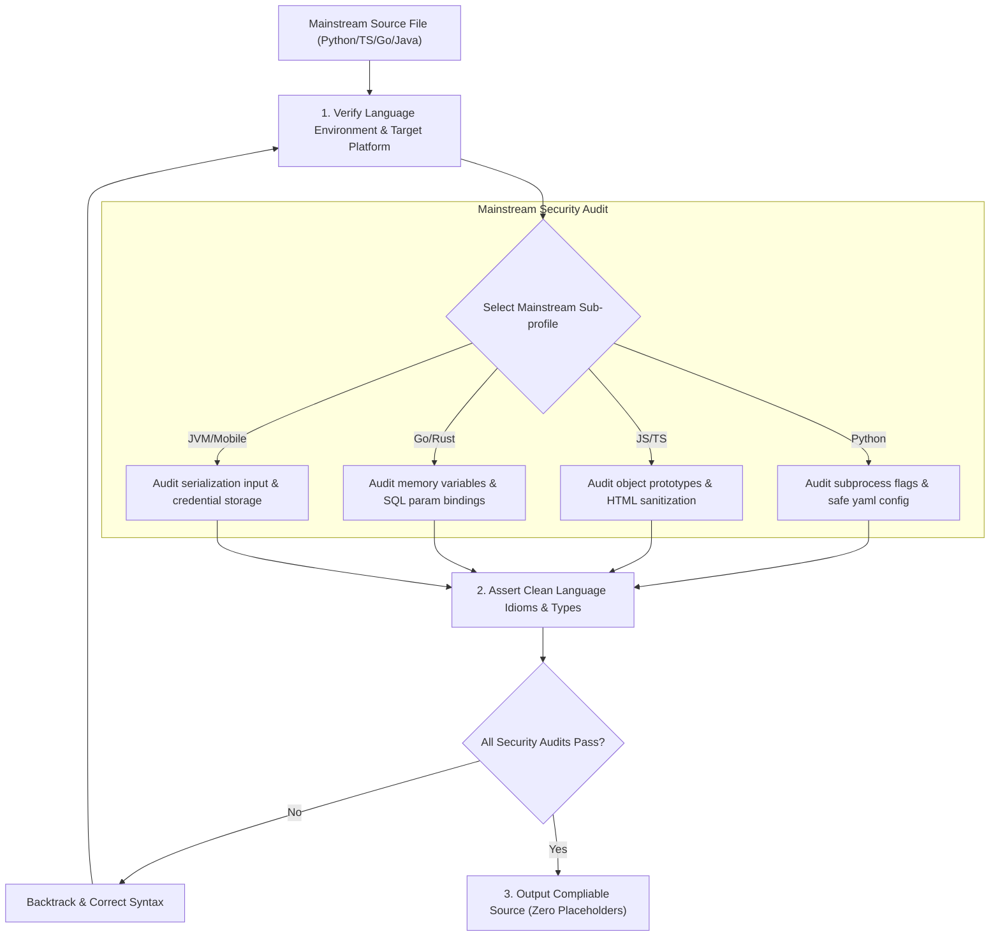

# §POLYGLOT_MAINSTREAM v2.3 
> Security rules, idiomatic design, and code patterns for mainstream, backend, and mobile languages.

---

## 1. §MAINSTREAM_LANGUAGE_FLOW 

---

## 2. How the AI Must Apply This Skill
When designing or debugging mainstream scripts, backend tools, or mobile projects under this supporting skill, the AI agent must apply these rules:
1. **Apply the Subprocess Sanitization Checklist**: Ensure all command calls are executed using parameter array arguments. Never pass un-escaped variables directly to terminal runners.
2. **Execute Prototype & HTML Audits**: When modifying JavaScript or TypeScript files, verify that property copies exclude prototype keys and all HTML injections are sanitized.
3. **Verify Database Parameter Binding**: Block SQL concatenation. Pass parameters separately using database-driver parameter bindings.
4. **Audit JVM Serialization Filters**: Ensure all object deserialization operations utilize class filters to block arbitrary class loader loading.
5. **Manage Memory Retain Loops on Mobile**: When writing Swift or Dart scripts, verify that closures capture variables using weak reference flags to prevent retain leaks.

---

## 3. Web Frontend & Scripting (Python, JavaScript, TypeScript)

### A. Python
* **Secure Subprocesses**: Avoid calling command execution shells. Never configure commands with variable strings or shell execution flags enabled. Always pass arguments as clean, separate parameter arrays to block command injections.
* **Safe Serialization**: Restrict arbitrary data deserialization. Standard loaders (like pickle or yaml default configs) run arbitrary code upon extraction. Always load variables using safe configurations.
* **Global Interpreter Lock (GIL) & Concurrency**: For CPU-bound tasks, utilize multi-processing instead of multi-threading to bypass the GIL. For I/O-bound tasks, utilize asyncio loops and prevent blocking calls inside async loops by offloading them to thread pools.
* **Memory Management in Extensions**: When writing C extensions or using ctypes, verify memory allocations explicitly. Free allocated buffers on all exit paths to prevent memory leaks in Python runtimes.
* **Imports Isolation**: Explicitly verify import dependencies before compiling, checking that paths are localized to active module files.

### B. JavaScript / TypeScript
* **Prototype Pollution Protection**: When merging deep objects, audit and block property configurations targeting prototype attributes (`__proto__`, `constructor`, and `prototype`) to prevent runtime script injections.
* **XSS Defense**: Restrict raw, unescaped HTML assignments in browser documents. Sanitize all dynamic string content before inserting it into dynamic templates, preventing cross-site scripting (XSS).
* **Asynchronous Resource Leaks**: Clean up event listeners, clear active timeouts/intervals, and abort outstanding fetch requests using AbortController when components unmount or operations complete.
* **Strict Null Checks**: Enforce strict null checks in TypeScript configurations. Guard all property accesses on optional parameters with explicit checks or default mappings to prevent runtime errors.
* **Dynamic Property Lookups**: Verify property names before dynamic dictionary access to ensure no prototype override vulnerabilities are executed.

---

## 4. Systems Backend (Go & Rust)

### A. Go
* **Goroutine Leak Protection**: Always bind goroutine lifecycles using cancelable context channels to prevent them from remaining active in the background.
* **SQL Injection Avoidance**: Never construct query statements via string formatting or concatenation. Pass parameters separately using database-driver parameter bindings.
* **Channel Coordination**: Always close channels from the sender side to avoid panics on writes. Utilize select statements with default cases or timeout channels to prevent goroutines from blocking indefinitely.
* **Memory Allocations**: Utilize sync.Pool for recycling frequently allocated structs in high-throughput network code to reduce garbage collection pressure.
* **Pointer Conversions**: Prevent unsafe pointer castings unless checking boundary limits and type allocations explicitly.

### B. Rust
* **Minimize Unsafe**: Restrict unsafe memory blocks to performance-critical modules, document safety invariants, and verify safety boundaries before execution.
* **Integer Casting Safety**: Avoid lossy data conversion casts that truncate integer values (e.g. converting 64-bit indexes directly into 8-bit variables). Check index bounds explicitly using safe conversion operations.
* **Error Handling Invariants**: Never call unwrap() or expect() in production code. Propagate errors using Result and Option combinators, and map them to domain-specific error structures.
* **Lifetime Constraints**: Define references with explicit lifetimes when passing values across threads or structs to prevent compilation errors and guarantee memory isolation.

---

## 5. Enterprise JVM Environments (Java, Kotlin, Scala)

### A. Java & Kotlin
* **Safe Deserialization**: Restrict reading serialized byte arrays from untrusted connections. Use input object filters to restrict JVM class loader execution.
* **Kotlin Null Safety Interoperability**: When calling Java libraries in Kotlin, treat returned signatures as nullable unless explicitly marked with non-null annotations.
* **Class Loading Sandboxing**: Limit class loader permissions when dynamically loading external plugins to prevent unauthorized access to system files or network routes.
* **Stream Performance**: Enforce efficient collection sizes inside stream maps to avoid exhausting heap allocations.

### B. Scala
* **Future Execution Contexts**: Always specify execution contexts when spawning Futures. Avoid using the global context for blocking operations, separating thread pools for CPU and I/O tasks.
* **Immutability Collections**: Utilize Scala's immutable collection types strictly. Avoid mutating shared collections across parallel streams to prevent race conditions.

---

## 6. Mobile & Web Backend (Swift, Objective-C, PHP, Ruby, Dart)

### A. Swift & Objective-C (Structured Concurrency & Memory)
* **Retain Cycle Mitigations**: Enforce task boundaries using asynchronous await operations. Use weak or unowned references inside closures to prevent memory leaks and retain cycles.
* **Keychain Security**: Secure keychain data storage by applying hardware-backed encryption flags, preventing local data extraction.

### B. PHP & Ruby
* **PHP**: Sanitize user outputs before rendering them to standard templates to prevent injections. Use PHP 8+ typed properties to enforce strict type compliance.
* **Ruby**: Restrict mass parameter assignments in web forms. Explicitly permit and list fields using controller-level parameter filtering.

### C. Dart & Flutter
* **Widget Tree Allocations**: Optimize layout performance by caching stateless widgets and minimizing redraw triggers inside state classes.
