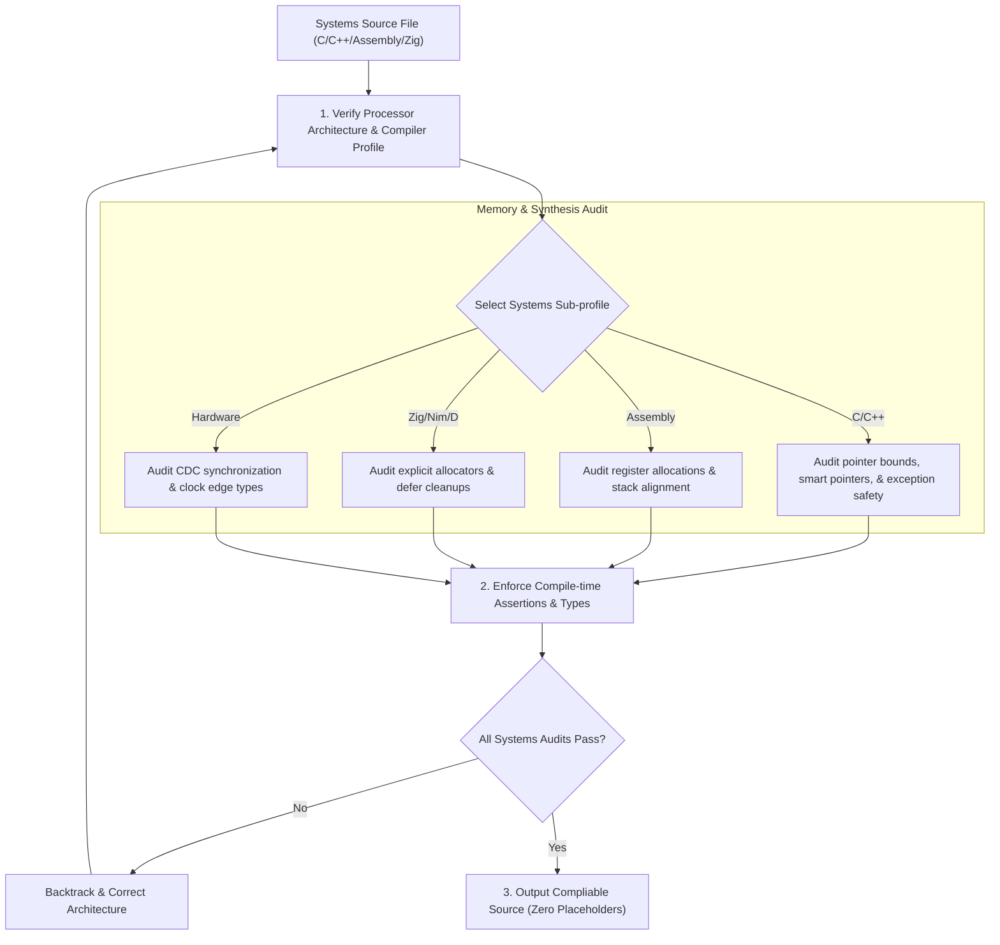

# §POLYGLOT_SYSTEMS v2.3 
> Code patterns, memory safety rules, and performance guidelines for low-level systems, hardware, and scientific computing.

---

## 1. §SYSTEMS_COMPILATION_FLOW 

---

## 2. How the AI Must Apply This Skill
When writing code or configuring scripts for low-level systems, hardware descriptions, or scientific environments under this supporting skill, the AI agent must apply these constraints:
1. **Audit Pointer and Copy Bounds**: When modifying C/C++ files, verify the size of target buffers and enforce bounded copy operations, ensuring manual pointer frees are paired with null re-assignments.
2. **Enforce Smart Pointer and Move Semantics**: Avoid raw allocations in C++. Utilize unique/shared pointers and implement move reference exchanges to manage dynamic resource transfers.
3. **Verify Assembly stack boundary alignment**: Check stack alignments before executing jumps or calling external targets.
4. **Adhere to Explicit Allocations**: When writing Zig, check that heap allocations are paired with explicit allocators and cleanup defer parameters.
5. **Enforce CDC and Blocking / Non-Blocking Assignment rules**: When writing hardware modules, ensure signals crossing clock domains have synchronization registers.

---

## 3. Low-Level Systems Programming (C, C++, Assembly)

### A. C Memory Safety & Pointer Bounds
* **Buffer Overflow Prevention**: Never use unbounded string/memory copying functions. Always use bounded safe alternatives and explicitly terminate buffers, ensuring memory size calculations include the null terminator.
* **Heap Discipline**: Maintain a single, clear owner for every allocated pointer. Force pointers to NULL immediately after freeing them to prevent double-free and use-after-free vulnerabilities.
* **Pointer Arithmetic Boundaries**: Check that pointer offsets do not cross allocated boundary limits. Validate size variables to prevent integer overflows when computing buffer allocations.
* **Memory Copy Integrity**: Use memory copy functions carefully. Verify source and destination buffers do not overlap, or use overlapping-safe memory copying functions.
* **Header Configurations**: Restrict raw array access configurations unless asserting bound variables explicitly.

### B. C++ Resource Acquisition Is Initialization (RAII)
* **Smart Pointers**: Avoid raw pointers and manual memory allocation. Use unique pointer wrappers for singular ownership and shared/weak pointer wrappers for shared reference counting.
* **Move Semantics**: Implement move constructors and move assignment operators to transfer ownership of heavy heap resources without copying, using reference swaps.
* **Avoid Memory Fragmentation**: Cache allocations and use custom pool allocators inside performance-critical real-time loops, reducing OS allocation delays.
* **Destructor Exception Safety**: Never let destructors throw exceptions. Ensure all cleanup code handles internal failures silently or logs them without propagating errors during stack unwinding.
* **Template compilation limitations**: Match template nesting variables to prevent compiler stack exhaustion.

### C. Assembly Programming
* **Register Calling Conventions**: Adhere strictly to the target ABI register conventions (like System V AMD64 ABI or Microsoft x64 Calling Convention) when writing assembly functions to prevent stack corruption.
* **Stack Alignments**: Enforce boundary alignments (e.g. 16-byte stack alignments) before calling external functions to prevent hardware faults.
* **Inline Assembly Security**: Declare read/write variables explicitly in inline assembly registers mapping interfaces to prevent compilers from optimization misalignments.
* **Segment Memory Mapping**: Verify stack offsets when writing inline assembly routines, protecting register values.

---

## 4. Compile-Time & Typed Systems (Zig, Nim, D)

### A. Zig (Manual Allocation & Comptime)
* **Explicit Allocators**: Zig has no hidden allocator. Pass allocators explicitly to functions that require heap memory, and clean up allocations with defer.
* **Comptime Execution**: Utilize comptime blocks to run logic, validation, and generic types at compile time.
* **Error Defer Handling**: Use errdefer blocks to clean up dynamic allocations or open resources only on execution failure paths.
* **Pointer Alignment Checks**: Verify target alignments when casting slices to different pointer profiles.

### B. Nim & D
* **Nim Garbage Collector Tuning**: Configure Nim compile parameters (like ARC or ORC memory management modes) to match the real-time requirements of systems targets.
* **D GC Restrictions**: Declare performance-sensitive systems blocks with GC-free attributes to prevent garbage collection pauses during critical computations.

---

## 5. Scientific Computing (R, Julia, MATLAB)

* **Julia Type Stability**: Ensure all functions are type-stable. Avoid returning variables of different types depending on inputs, preventing dynamic dispatch performance loss.
* **Vectorization**: Prefer vectorized matrix operations over raw for loops to leverage optimized BLAS/LAPACK binaries.
* **Memory Matrix Layouts**: Understand memory layout differences (Column-major in Fortran/Julia/MATLAB vs Row-major in C/C++) to optimize matrix traversal directions.

---

## 6. Hardware Description Languages (VHDL, Verilog, SystemVerilog)

* **Clock Domain Crossing (CDC)**: Enforce double-flop synchronization on all asynchronous signals migrating across distinct clock domains to prevent metastability.
* **Assignment Boundaries**: In Verilog, use Non-blocking assignments for sequential logic (triggered by clock edges) and Blocking assignments for combinational logic blocks.
* **Latch Prevention**: Ensure all conditionals (if-else, case statements) have complete default assignments to prevent the unintended inference of hardware latches.
