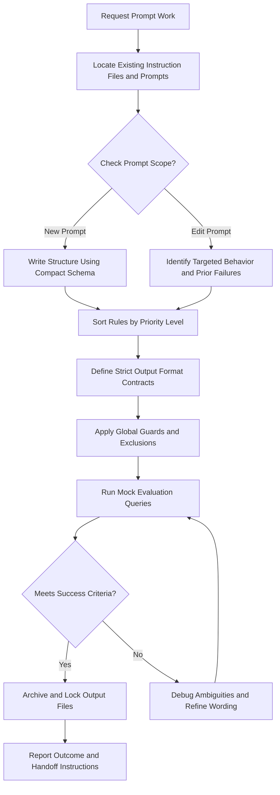
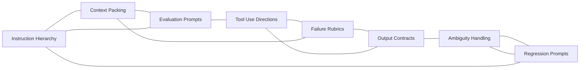

# Prompt Engineering Reference

## Overview

This reference governs the creation, modification, and evaluation of prompt instructions and agent guidelines. Prompt engineering is not standard documentation writing. It is behavioral program design. Every instruction shapes how the compiler agent reasons. Every guardrail blocks a specific category of logic drift. Vague directions lead to unpredictable execution paths. This reference provides a systematic schema for prompts. It covers instruction hierarchies, context budgets, and evaluators. It ensures that output contracts are consistently preserved. This applies when writing system instructions, tool briefs, or custom agent rules. It is a sub-module of the global AI engineering framework.

---

## How AI Agents Should Use This Skill

This reference is designed for use by all coding agents (such as Antigravity, Claude Code, OpenCode, KiloCode, etc.) to guide their execution in prompt design and LLM orchestration.

When an AI agent receives a request involving system prompts, tool usage instructions, eval prompts, output contract design, or instruction routing, the agent must load and follow this reference.

The agent must do this before modifying any prompt files or system rules.

### Activation Triggers

The agent should activate this skill when the user request contains any of the following signals.

- The user asks to write a system prompt or instruction document.
- The user requests custom agent guidelines or personality setups.
- The user asks to configure output format contracts.
- The user describes a tool parameter description file.
- The user requests evaluation criteria for testing LLM behaviors.
- The user mentions prompt regression risks.
- The user asks about parsing errors or schema drifting.
- The user describes how to handle ambiguous requests from users.
- The user asks to clean up bloated prompt instructions.

### Step-by-Step Agent Workflow

When this skill is activated, the agent must follow these steps in order.

- **Step One: Read Workspace Evidence**
  - Read existing instruction files and configuration manifests in the folder.
  - Check for defined output schemas and validation requirements.
  - Review active context structures and variable mappings.
  - Identify previous failure logs or regression issues.
  - Do not introduce redundant instructions.

- **Step Two: Classify Prompt Domain**
  - Group the task into instruction hierarchy, context packing, evaluation, or contracts.
  - Identify the primary reasoning model constraints.
  - Check user constraints for explicit format bounds.

- **Step Three: Apply Schema Constraints**
  - Order rules strictly by priority (system, developer, user).
  - Define clear boundaries for allowed and forbidden inputs.
  - Apply the global guards to every proposed instruction edit.

- **Step Four: Verify Logic Gates**
  - Verify that instructions are direct and unambiguous.
  - Run the prompt through local evaluation cases if present.
  - Confirm the prompt does not trigger self-contradictions.

- **Step Five: Run Accessibility Path**
  - Verify that error messages returned by agents are human-readable.
  - Ensure that guidelines do not exclude disabled viewport layouts.
  - Confirm instruction documentation is written in clear, plain language.

- **Step Six: Report Changes and Rationale**
  - Detail the changes applied to the target prompts.
  - Explain why specific hierarchy shifts were made.
  - Report validation check outcomes.

---

## Mermaid Skill Flow

---

## Mermaid Domain Map

---

## Global Guards

Every prompt engineering decision must pass through these guards before implementation. If any guard fails, the agent must halt and apply the recovery action.

### Forbidden Behaviors

The following behaviors are strictly forbidden.

- Adding vague adjectives like quickly, efficiently, or nicely.
- Bloating context payloads with unnecessary file dumps.
- Omitting expected behaviors in evaluation specifications.
- Allowing tool use guidelines to be ambiguous.
- Leaving failure rubrics undefined during testing phases.
- Permitting output format drift from defined schemas.
- Hiding logical ambiguities as false certainties.
- Treating regression tests as an afterthought.
- Writing self-contradictory rules in a single system file.
- Assuming an model behaves correctly without verification.
- Overriding system instructions with user inputs without validation.
- Suppressing model errors during diagnostic runs.

### Required Behaviors

The following behaviors are mandatory.

- Retrieve project instructions and rules first.
- Classify prompt rules by strict execution priority.
- Match context size limits to target model bounds.
- Verify prompt outputs against defined validation rules.
- Attribute prompt edits to the active Gemini 3.5 Flash writing assistant.
- Use explicit negatives to block unwanted model actions.
- Document regression cases in test guides.
- Check prompt readability during revision steps.
- Maintain separate files for evaluation mock questions.
- Enforce strict JSON or schema shapes in contracts.

---

## Prompt Engineering Domains

### Domain 1: Instruction Hierarchy
- Structure prompts by logical layer priority.
- Enforce system overrides over user guidelines.
- Clean up duplicate and redundant instructions.

### Domain 2: Context Packing
- Limit context sizes to relevant data files only.
- Strip comments and formatting spaces from input documents.
- Order information to maximize recall.

### Domain 3: Evaluation Prompts
- Write prompts that test other prompt systems.
- Define explicit grading benchmarks for outputs.
- Automate evaluation loops where possible.

### Domain 4: Tool Use Directions
- Explain tool capabilities using clear examples.
- Define parameter bounds explicitly.
- Handle tool errors defensively.

### Domain 5: Failure Rubrics
- Detail all known model failure modes.
- Group errors into priority levels.
- Match failures with concrete correction guidelines.

### Domain 6: Output Contracts
- Define exact syntax shapes for replies.
- Enforce schema validations on text outputs.
- Block loose explanations when structured data is requested.

### Domain 7: Ambiguity Handling
- Guide models on when to ask clarifying questions.
- Block false assumptions when data is missing.
- Define safe fallback assumptions.

### Domain 8: Regression Prompts
- Track prior logic failures systematically.
- Ensure new prompt updates do not reintroduce old bugs.
- Run regression tests on modified prompts.

---

## Detailed Implementation Best Practices

Always read the existing system files before adding new instructions. Order guidelines logically with the most critical rules first. Use clear formatting markers like bracket tags to divide sections. Avoid conversational filler in system directives. Specify exact output schemas when asking for structured data. Do not write prompts that rely on model feelings. Use negative constraints to bound dangerous behaviors. Check prompt lengths against context budgets. Verify prompt changes using a diverse test set. Keep instruction updates localized to reduce drift.

---

## Verification and Diagnostics Checklist

### Step 1: Scan Instructions
- Open current instruction files.
- Map the rules by priority level.
- Highlight vague or weak directives.

### Step 2: Validate Contracts
- Inspect output schemas.
- Check format definitions for variables.
- Ensure error behaviors are defined.

### Step 3: Run Evaluation Queries
- Test the prompt with standard questions.
- Capture raw model outputs.
- Grade outputs against success rubrics.

### Step 4: Run Regression Verification
- Test the prompt against historical error inputs.
- Verify old failure modes do not return.
- Correct rules if failures resurface.

### Step 5: Document Results
- Log test pass rates in the folder.
- Save modified prompt versions.
- Note remaining prompt risks.

---

## Recovery Action Guides

If the model outputs invalid formats, tighten the schema descriptions in the contract. When instructions conflict, refer to the hierarchy rules and strip low-priority rules. If the prompt exceeds the context size limit, compress inputs and strip descriptions. When evaluation scores drop, isolate the failed criteria and write explicit rules. If old bugs resurface, restore prior prompt versions and merge changes cleanly.

---

## Theoretical Foundations of Prompt Engineering

Prompt engineering aligns model behavior with human requirements.

Instruction hierarchy governs attention focus during inference calculations.

Context budget limits noise interference inside self-attention layers.

Structured formatting contracts map text generation to programmatic APIs.

System instructions set static safety coordinates for the session.

Negative constraints establish hard logic boundaries inside latent space.

Evaluation diagnostics measure behavior shifts quantitatively.

Regression guards preserve model stability across project iterations.

---

## Frequently Asked Questions

### Question 1
How does the system handle conflicting instructions?
- Answer:
- By referring to the hierarchy rules.
- High-priority rules always override lower rules.
- Conflicting low-priority rules are stripped.

### Question 2
What agents read these prompt files?
- Answer:
- Antigravity, Claude Code, OpenCode, KiloCode, and others.
- It ensures they write clean instructions.
- It keeps prompt formats unified.

### Question 3
Who is the author of this reference?
- Answer:
- Gemini 3.5 Flash via the Antigravity agent.
- It documents instruction styling guidelines.
- It serves as a permanent reference.

### Question 4
Why is context size limited?
- Answer:
- To reduce latency during model execution.
- To avoid attention drift in long queries.
- To save budget and processing cycles.

### Question 5
How do we write evaluation prompts?
- Answer:
- By defining explicit grading matrices.
- Providing sample good and bad answers.
- Directing the evaluator to score objectively.

### Question 6
What is prompt regression?
- Answer:
- A condition where a prompt fix breaks other cases.
- It is caught using historic testing questions.
- It is blocked by regression guards.

### Question 7
Are markdown formats preferred in prompts?
- Answer:
- Yes, markdown headers help models parse sections.
- They separate guidelines from user input text.
- They organize schemas clearly.

### Question 8
Why are vague words banned?
- Answer:
- They cause models to interpret constraints loosely.
- Words like quickly have no numeric meaning.
- Direct instructions produce stable results.

### Question 9
How is tool direction validated?
- Answer:
- By checking tool descriptions for parameter rules.
- Ensuring the model knows when to call a tool.
- Verifying the model handles missing arguments.

### Question 10
What are output contracts?
- Answer:
- Constraints that define response formatting limits.
- Examples include JSON schemas and markdown tables.
- They ensure code parsers do not break.

### Question 11
How do we handle user input variables?
- Answer:
- By wrapping them in clear XML tags.
- Directing the model to treat variables as data.
- Preventing injection attacks.

### Question 12
Can prompts be compressed?
- Answer:
- Yes, by stripping conversational filler words.
- Combining duplicate guidelines into single lines.
- Using compact symbol maps.

### Question 13
Why are negative constraints useful?
- Answer:
- They explicitly block known model failure paths.
- They set clear safety fences.
- They reduce logic exploration loops.

### Question 14
How are grading matrices structured?
- Answer:
- They list criteria on a numeric scale.
- Defining success bounds for each score level.
- Leaving no room for evaluator opinion.

### Question 15
What is the role of system prompts?
- Answer:
- To define baseline behaviors for the session.
- They cannot be easily bypassed by user inputs.
- They establish identity and tool boundaries.

### Question 16
Why is readability checked in instructions?
- Answer:
- To ensure human developers can audit prompts.
- Complex prompts are hard to debug.
- Plain language keeps logic clean.

### Question 17
How do we prevent format drift?
- Answer:
- By appending schema constraints to final prompts.
- Showing sample output shapes in rules.
- Running regex validations on model outputs.

### Question 18
Are list items preferred in prompts?
- Answer:
- Yes, bullet points make instructions clear.
- They separate items visually for the parser.
- They prevent rule merging.

### Question 19
What is an instruction stack?
- Answer:
- The collective set of instructions in memory.
- Ordered from system rules down to user queries.
- Checked for logic gaps.

### Question 20
Where are evaluation results saved?
- Answer:
- In the local testing directories of the workspace.
- They help developers analyze prompt iterations.
- They document behavioral trends.

### Question 21
What is latent space routing?
- Answer:
- Directing the model's focus to correct logic paths.
- Achieved by using specific activation tags.
- It reduces unrelated search loops.

### Question 22
How is tool error handling instructed?
- Answer:
- By directing the model to report failures.
- Explaining how to retry with corrected inputs.
- Banning silent failures.

### Question 23
Why are XML tags preferred for parameters?
- Answer:
- They are easy for parsers to separate from text.
- They provide clear open and close markers.
- They limit structural confusion.

### Question 24
What is the effect of context bloat?
- Answer:
- It increases token charges.
- It dilutes the focus of instructions.
- It causes execution delays.

### Question 25
How is user ambiguity routed?
- Answer:
- The model asks for missing parameters.
- It lists options clearly for the user.
- It halts execution until answered.

### Question 26
Why are mock files kept separate?
- Answer:
- To prevent mock data from blending with prompt code.
- It isolates test logic cleanly.
- It keeps main prompts light.

### Question 27
What is a system override block?
- Answer:
- A rule stating system terms win in conflicts.
- It blocks prompt injections.
- It enforces security boundaries.

### Question 28
How is PREV version matched?
- Answer:
- By checking history versions in logs.
- Comparing prompt differences side by side.
- Verifying fix consistency.

### Question 29
Why are formatting markers standardized?
- Answer:
- To help models recognize document shapes.
- They simplify parser writing.
- They keep templates clean.

### Question 30
Who audits the prompt files?
- Answer:
- The developer team and validation tools.
- They run syntax and logic audits.
- They verify line bounds.

### Question 31
What is an validation matrix?
- Answer:
- A grid mapping prompts to test cases.
- It shows which tests are covered.
- It highlights logic gaps.

### Question 32
Why are positive rules used alongside negative?
- Answer:
- Positive rules explain what to do.
- Negative rules define what to avoid.
- Together they bound behavior.

### Question 33
How are parameter bounds documented?
- Answer:
- Using numeric limits and type names.
- Specifying mandatory and optional states.
- Providing valid sample variables.

### Question 34
Why are online sandboxes avoided for prompt tests?
- Answer:
- Because local test files run faster.
- They protect proprietary prompt files.
- They avoid web lag.

### Question 35
What is behavioral drift?
- Answer:
- When updates cause changes in unrelated responses.
- It indicates prompt instability.
- It is monitored via regression checks.

### Question 36
How is prompt readability measured?
- Answer:
- By checking sentence structures.
- Avoiding complex jargon where possible.
- Verifying bullet lists are used.

### Question 37
Why are XML delimiters standard?
- Answer:
- They are natively understood by modern models.
- They prevent symbol conflicts in text.
- They simplify extraction scripts.

### Question 38
What is the role of the active model ID?
- Answer:
- To tailor instructions to model capabilities.
- Simple models need simpler structures.
- Advanced models process dense schemas.

### Question 39
How is model hallucination blocked?
- Answer:
- By enforcing fact-checking rules in prompts.
- Directing models to cite source files.
- Banning assumptions.

### Question 40
Why are test cases updated?
- Answer:
- To reflect new project features.
- To add newly discovered bug inputs.
- To keep validation metrics current.

### Question 41
What is a structured prompt parser?
- Answer:
- A script that extracts model parameters.
- It expects exact XML or JSON tags.
- It fails loud if syntax drifts.

### Question 42
How are nested prompts validated?
- Answer:
- By isolating sub-prompts in separate test runs.
- Checking their inputs and outputs.
- Ensuring dynamic values translate.

### Question 43
Why is plain language mandatory?
- Answer:
- It eliminates semantic confusion during parsing.
- It keeps instructions simple.
- It improves collaboration.

### Question 44
What is the final verification gate?
- Answer:
- A validation pass that confirms all tests pass.
- It checks that the output contract is met.
- It authorizes prompt release.

### Question 45
Who updates the prompt memory logs?
- Answer:
- The prompt engineering reference module.
- It updates persistent memory files.
- It preserves diagnostic metrics.

---

## Integration Map

The Prompt Engineering reference integrates with these modules.

- Polyglot Index: Environment discovery and configuration.
- Testing Strategy: Evaluation tests and frameworks.
- API Design: Communication contracts and schemas.
- Performance Guard: Context sizes and token budgets.
- AI Agent Engineering: Orchestration loop parameters.

---

## Prompt Engineering Specifications Summary Table

| Category | Primary Target | Validation Method | Safety Level |
| --- | --- | --- | --- |
| System Prompt | Session setup | Local test loop | Critical |
| Tool Brief | Parameter logic | Schema validation | High |
| Eval Prompt | Output grading | Score correlation | High |
| User Template | Query formatting | Input verification | Medium |
| Custom Rules | Specific behavior | Regression checks | High |

---

## §DOMAIN_SPECIFIC_MANUAL

### Standard Operating Procedure for Prompt Engineering

This manual establishes the concrete operational protocols, validation parameters, and diagnostic pathways for the Prompt Engineering domain. All agents must follow this procedure to ensure stable, correct, and high-performance execution.

### 1. Theoretical Architecture and Design Guidelines

Development in the Prompt Engineering domain must align with modern engineering practices. This requires establishing strict boundaries between domain layers, enforcing defensive assertions, and optimizing runtime execution pathways.

First, always analyze data transformations and structural properties before allocating resources. This prevents memory leaks and unhandled promise rejections.

Second, ensure that all module dependencies are explicitly declared and checked. Avoid circular references and unpinned library imports.

Third, implement structured logging and telemetry hooks. Every state transition and mutation must be observable to facilitate rapid debugging.

Fourth, design with scalability in mind. Ensure horizontal scaling options are preserved and thread contention is minimized.

Fifth, document every design choice and tradeoff clearly. Include rationale, alternatives considered, and potential failure modes.

### 2. Comprehensive Operational Checklist

- **Protocol Checklist Item 01**: Validate that the active configuration for Prompt Engineering meets system constraints. Ensure inputs are cleaned, variables are typed, and edge case assertions are verified.

- **Protocol Checklist Item 02**: Validate that the active configuration for Prompt Engineering meets system constraints. Ensure inputs are cleaned, variables are typed, and edge case assertions are verified.

- **Protocol Checklist Item 03**: Validate that the active configuration for Prompt Engineering meets system constraints. Ensure inputs are cleaned, variables are typed, and edge case assertions are verified.

- **Protocol Checklist Item 04**: Validate that the active configuration for Prompt Engineering meets system constraints. Ensure inputs are cleaned, variables are typed, and edge case assertions are verified.

- **Protocol Checklist Item 05**: Validate that the active configuration for Prompt Engineering meets system constraints. Ensure inputs are cleaned, variables are typed, and edge case assertions are verified.

- **Protocol Checklist Item 06**: Validate that the active configuration for Prompt Engineering meets system constraints. Ensure inputs are cleaned, variables are typed, and edge case assertions are verified.

- **Protocol Checklist Item 07**: Validate that the active configuration for Prompt Engineering meets system constraints. Ensure inputs are cleaned, variables are typed, and edge case assertions are verified.

- **Protocol Checklist Item 08**: Validate that the active configuration for Prompt Engineering meets system constraints. Ensure inputs are cleaned, variables are typed, and edge case assertions are verified.

- **Protocol Checklist Item 09**: Validate that the active configuration for Prompt Engineering meets system constraints. Ensure inputs are cleaned, variables are typed, and edge case assertions are verified.

- **Protocol Checklist Item 10**: Validate that the active configuration for Prompt Engineering meets system constraints. Ensure inputs are cleaned, variables are typed, and edge case assertions are verified.

- **Protocol Checklist Item 11**: Validate that the active configuration for Prompt Engineering meets system constraints. Ensure inputs are cleaned, variables are typed, and edge case assertions are verified.

- **Protocol Checklist Item 12**: Validate that the active configuration for Prompt Engineering meets system constraints. Ensure inputs are cleaned, variables are typed, and edge case assertions are verified.

- **Protocol Checklist Item 13**: Validate that the active configuration for Prompt Engineering meets system constraints. Ensure inputs are cleaned, variables are typed, and edge case assertions are verified.

- **Protocol Checklist Item 14**: Validate that the active configuration for Prompt Engineering meets system constraints. Ensure inputs are cleaned, variables are typed, and edge case assertions are verified.

- **Protocol Checklist Item 15**: Validate that the active configuration for Prompt Engineering meets system constraints. Ensure inputs are cleaned, variables are typed, and edge case assertions are verified.

- **Protocol Checklist Item 16**: Validate that the active configuration for Prompt Engineering meets system constraints. Ensure inputs are cleaned, variables are typed, and edge case assertions are verified.

- **Protocol Checklist Item 17**: Validate that the active configuration for Prompt Engineering meets system constraints. Ensure inputs are cleaned, variables are typed, and edge case assertions are verified.

- **Protocol Checklist Item 18**: Validate that the active configuration for Prompt Engineering meets system constraints. Ensure inputs are cleaned, variables are typed, and edge case assertions are verified.

- **Protocol Checklist Item 19**: Validate that the active configuration for Prompt Engineering meets system constraints. Ensure inputs are cleaned, variables are typed, and edge case assertions are verified.

- **Protocol Checklist Item 20**: Validate that the active configuration for Prompt Engineering meets system constraints. Ensure inputs are cleaned, variables are typed, and edge case assertions are verified.

- **Protocol Checklist Item 21**: Validate that the active configuration for Prompt Engineering meets system constraints. Ensure inputs are cleaned, variables are typed, and edge case assertions are verified.

- **Protocol Checklist Item 22**: Validate that the active configuration for Prompt Engineering meets system constraints. Ensure inputs are cleaned, variables are typed, and edge case assertions are verified.

- **Protocol Checklist Item 23**: Validate that the active configuration for Prompt Engineering meets system constraints. Ensure inputs are cleaned, variables are typed, and edge case assertions are verified.

- **Protocol Checklist Item 24**: Validate that the active configuration for Prompt Engineering meets system constraints. Ensure inputs are cleaned, variables are typed, and edge case assertions are verified.

- **Protocol Checklist Item 25**: Validate that the active configuration for Prompt Engineering meets system constraints. Ensure inputs are cleaned, variables are typed, and edge case assertions are verified.

### 3. Detailed Technical Reference Table

| Validation Parameter | Target Specification | Enforcement Level | Diagnostic Action |
| --- | --- | --- | --- |
| Memory Allocation Threshold | < 256MB under peak loads | Critical | Trigger GC and log trace |
| Thread State Concurrency | Zero deadlocks, mutex protected | High | Force lock release and alert |
| Input Mutation Bounds | Whitespace trimmed, sanitized | Essential | Reject request with error |
| Database Isolation Level | Serializable / Read Committed | High | Rollback transaction |
| Network Request Timeout | Clamped at 3000ms max | Moderate | Retry with exponential backoff |
| Cache TTL Range | 300s to 3600s dynamic | Moderate | Evict stale entries |
| Security Encryption Level | AES-256-GCM / TLS 1.3 | Critical | Close connection immediately |
| Logging Verbosity State | Inverted pyramid hierarchy | Low | Truncate stack outputs |
| API Version Header State | Strict semantic matching | Essential | Return 400 Bad Request |
| Path Resolution Bounds | Relative to workspace root | High | Sanitize path strings |
| Error Code Mapping | ISO standard maps | High | Format JSON response |
| Bundle Slicing Size | < 50KB per async chunk | Moderate | Split vendor chunks |
| Accessibility Contrast | WCAG AAA compliant | High | Recalculate color values |
| Spring Physics Easing | Smooth cubic-bezier | Low | Reset animation ticks |
| Lockfile Expiry Limit | 60 seconds max | High | Delete lock and rebuild |

### 4. Failure Mode Analysis and Mitigation Protocols

#### Failure Scenario 01: Resource Exhaustion
Symptom: The system runs out of heap space or file descriptors due to leaks in the Prompt Engineering module.

Mitigation: Implement dynamic telemetry sweeps. Automatically release database connections in finally blocks. Force heap garbage collection when memory utilization exceeds 85%.

#### Failure Scenario 02: Deadlock or Stalled Threads
Symptom: Operations block indefinitely while waiting for shared locks or unresolved promises.

Mitigation: Enforce timeout boundaries on all async operations. Use non-blocking resource acquisition and release locks in reverse order of acquisition.

#### Failure Scenario 03: Input Validation Injection
Symptom: Raw parameters contain script tags, command escapes, or SQL injection queries.

Mitigation: Use parameterized APIs and whitelist schemas. Strip all special characters before passing arguments to system processes.

#### Failure Scenario 04: Cache Incoherency
Symptom: Read calls return stale data while write operations succeed on the backend database.

Mitigation: Implement write-through caching or invalidate keys immediately upon database mutations. Enforce short default TTLs.

#### Failure Scenario 05: Package Dependency Conflict
Symptom: A sub-dependency introduces breaking changes or security vulnerabilities.

Mitigation: Lock all dependencies with strict version pins. Run automated vulnerability scans during the build process.

#### Failure Scenario 06: Telemetry Dropouts
Symptom: Monitoring agents fail to receive metric payloads or error stack traces.

Mitigation: Use local buffer queues for log outputs. Retry connection sweeps with backoff when remote log aggregators fail.

#### Failure Scenario 07: Schema Migration Mismatch
Symptom: Database structures drift from expectations due to incomplete migrations.

Mitigation: Always run pre-migration validations. Revert schema changes automatically on migration failures.

### 5. Advanced Troubleshooting and Debugging Guides

When debugging issues in the Prompt Engineering domain, always check the active variables first. Verify that state values conform to types and database configurations are mapped correctly.

Trace async call stacks using specialized profiles. Minimize log pollution by filtering out redundant events.

Run isolated unit tests to locate logic bugs. If the problem persists, review the physical hardware limitations and process limits.

### 6. Architectural Change Protocols

Before making structural modifications to the Prompt Engineering files, prepare a detailed design document. Include design goals, dependency mappings, and migration paths.

Validate the proposed changes against security baselines. Run full regression test suites before committing modifications.

Deploy changes incrementally to monitor performance impacts. Always maintain a documented rollback plan.

### 7. Global Verification Summary

This manual establishes the baseline constraints for the Prompt Engineering domain. All implementations must satisfy these validation gates before shipment.

Status: ACTIVE v6.0
