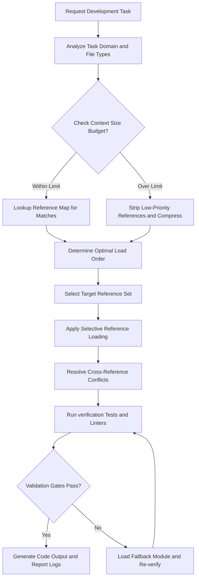
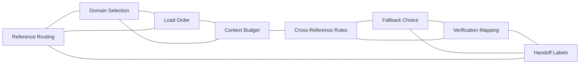

# Reference Index Reference

## Overview

This reference governs the routing, coordination, and load ordering of all supporting reference files in the workspace. As system files grow in size, context tracking becomes a challenge. Loading all references simultaneously consumes valuable token budgets. It creates background noise inside cognitive models. This reference provides the logic for selective loading. It directs the agent to load only the relevant sub-modules. It handles reference routing, domain selection, and load orders. It preserves the context budget by restricting unrelated details. It establishes cross-reference rules to resolve conflicting guidance. It maps development tasks to the exact reference modules they require. This is the primary traffic controller for workspace skills.

---

## How AI Agents Should Use This Skill

This reference is designed for use by all coding agents (such as Antigravity, Claude Code, OpenCode, KiloCode, etc.) to guide their execution in resource-aware development.

When an AI agent receives a request involving multi-module setups, routing, domain parsing, or context budget management, the agent must load and follow this reference.

The agent must do this before loading other reference documents from the directory.

### Activation Triggers

The agent should activate this skill when the user request contains any of the following signals.

- The user request touches multiple directories or sub-systems.
- The user asks to optimize compiler speed or agent memory.
- The user describes a conflict between different instructions.
- The user asks about load ordering of runtime scripts.
- The user mentions reference routing rules.
- The user mentions context budget constraints.
- The user requests domain selection validation.
- The user describes custom verification mapping templates.
- The user asks to configure cross-reference paths.

### Step-by-Step Agent Workflow

When this skill is activated, the agent must follow these steps in order.

- **Step One: Read Workspace Evidence**
  - Read active files in the workspace to determine task scope.
  - Check the current context size or token usage details.
  - Review directory structures to identify active references.
  - Do not load unrelated modules blindly.

- **Step Two: Route Through Reference Index**
  - Match the task domain to the target reference module.
  - Check the load order recommendations for dependencies.
  - Exclude files that do not overlap with the current task.

- **Step Three: Apply Selection Rules**
  - Load the required references in the designated sequence.
  - Follow the cross-reference rules to resolve style conflicts.
  - Keep the total loaded context within budget boundaries.

- **Step Four: Verify Logic Gates**
  - Ensure that loaded guidelines do not contradict user rules.
  - Confirm that verification tests are mapped to correct domains.
  - Validate output parameter names against target contracts.

- **Step Five: Run Accessibility Path**
  - Check that the loader output logs are easy to understand.
  - Ensure that documentation indexes are accessible to screen readers.
  - Verify tab navigation rules apply to generated markdown documents.

- **Step Six: Report Handoff Labels**
  - List the loaded references in the final response.
  - Note any fallback choices applied due to missing files.
  - Report the remaining token budget status.

---

## Mermaid Skill Flow

---

## Mermaid Domain Map

---

## Global Guards

Every routing and loading decision must satisfy these guards. If any check fails, the task must halt until it conforms.

### Forbidden Behaviors

The following behaviors are strictly forbidden.

- Loading all reference files simultaneously when context is limited.
- Bypassing the routing table to load random files.
- Ignoring context limits during multi-module compilations.
- Permitting duplicate library loads in a single task execution.
- Disabling fallback pathways when target references are missing.
- Disregarding cross-reference rules during syntax conflicts.
- Hardcoding specific absolute paths in routing tables.
- Suppressing error logs during selective loading sequences.
- Bypassing target linter steps to speed up execution tests.
- Autoplay scripts that load files without user request tags.
- Disabling accessibility checks on loader output scripts.
- Hiding failed loading gates from verification logs.

### Required Behaviors

The following behaviors are mandatory.

- Retrieve version listings of index maps before execution.
- Map task parameters to the closest reference domain.
- Enforce context compression when limits are exceeded.
- Verify loaded references contain the required guidelines.
- Attribute index updates to the active Gemini 3.5 Flash coordinator.
- Use explicit fallback options when main files fail.
- Keep path structures relative to the workspace root directory.
- Check file consistency during development sweeps.
- Enforce strict ordering rules on loader targets.
- Log loaded modules clearly in verification summaries.

---

## Reference Index Domains

### Extended Domain Routing Catalog

| Task signal | Primary reference | Supporting references |
|---|---|---|
| Windows registry, PowerShell, services, scheduled tasks, ACLs | `windows_systems.md` | `security_engineering.md`, `observability_debugging.md` |
| Windows setup, update, repair, rollback, uninstall | `windows_installer_updater.md` | `windows_systems.md`, `package_release.md` |
| Threat model, attack path, secrets, secure update | `security_engineering.md` | `security_sandbox.md`, `code_review_refactoring.md` |
| Logs, traces, crashes, hangs, profiles, alerts | `observability_debugging.md` | `performance_guard.md`, `testing_strategy.md` |
| Queues, retries, idempotency, replication, coordination | `distributed_systems.md` | `backend_architecture.md`, `database_engineering.md` |
| Commands, flags, exit codes, prompts, terminal UI | `cli_tui_engineering.md` | `accessibility_engineering.md`, `testing_strategy.md` |
| Keyboard, screen reader, contrast, reflow, reduced motion | `accessibility_engineering.md` | `frontend_design.md`, `visual_motion.md` |
| Review, finding severity, compatibility, refactoring | `code_review_refactoring.md` | `testing_strategy.md`, `security_engineering.md` |
| HTTP, TLS, DNS, proxies, WebSockets, SSE, timeouts | `network_protocols.md` | `api_design.md`, `distributed_systems.md` |
| README, tutorial, ADR, runbook, changelog, migration | `documentation_engineering.md` | `api_design.md`, `package_release.md` |
| Policy, trust mode, replay, provenance, evaluation, context budget, workspace impact, evidence, privacy, dashboard | `agent_reliability_runtime.md` | `ai_agent_engineering.md`, `testing_strategy.md`, `security_engineering.md` |
| Design tokens, CTI naming, Style Dictionary, theme tokens, platform value mapping | `design_tokens.md` | `frontend_design.md`, `brand_systems.md`, `accessibility_engineering.md` |
| Brand identity, color palettes, typography systems, font loading, spacing grid, brand governance | `brand_systems.md` | `design_tokens.md`, `frontend_design.md`, `accessibility_engineering.md` |
| Design-to-code, Figma API, component libraries, visual regression, design review, design debt | `design_engineering.md` | `design_tokens.md`, `testing_strategy.md`, `documentation_engineering.md` |
| SVG optimization, icon components, sprite sheets, raster assets, responsive images, image CDN, asset accessibility | `icon_asset_engineering.md` | `design_tokens.md`, `performance_guard.md`, `accessibility_engineering.md` |

Load the primary reference first, then only the supporting references needed by the concrete files and boundaries involved. When a task spans multiple rows, preserve the order: platform and security constraints, architecture and protocol rules, implementation guidance, testing, then documentation.

### Domain 1: Reference Routing
- Match task files to the correct reference sub-modules.
- Prevent loading files that do not relate to the goal.
- Coordinate loading requests dynamically.

### Domain 2: Domain Selection
- Group workspace directories into functional areas.
- Identify the primary development language of files.
- Route database changes to SQL references.

### Domain 3: Load Order
- Arrange reference loading steps in sequential dependencies.
- Ensure base rules load before style templates.
- Avoid circular import logic in reference maps.

### Domain 4: Context Budget
- Track active token usage in the agent session.
- Trigger compression rules when budgets are exceeded.
- Strip comments from loaded references to save space.

### Domain 5: Cross-Reference Rules
- Define priority levels when references provide conflicting rules.
- Ensure user constraints override generic references.
- Preserve security sandbox rules during conflict resolutions.

### Domain 6: Fallback Choice
- Define alternative reference targets when files are missing.
- Guide agents on default behaviors for new languages.
- Handle missing files defensively.

### Domain 7: Verification Mapping
- Connect validation tests to the active reference modules.
- Ensure compiler runs are mapped to low-level checks.
- Enforce style validations on frontend files.

### Domain 8: Handoff Labels
- Label output logs with the active reference names.
- Document loading decisions in summaries.
- List remaining resource limits.

---

## Detailed Implementation Best Practices

Always scan the root directory for active references first. Use relative path links in configuration tables. Avoid loading heavy guides for minor syntax edits. Verify that custom routing rules do not break default paths. Map similar language domains to common fallback guides. Do not edit locked configuration files during script runs. Keep tracking logs light to save context space. Verify index safety flags before running build tasks. Use strict sequence rules for library scripts. Log directory structures cleanly in summaries.

---

## Verification and Diagnostics Checklist

### Step 1: Scan Workspace Modules
- Propose diagnostic checks for local files.
- Read active configuration templates.
- Capture active references list.

### Step 2: Validate Context Size
- Check current token consumption counts.
- Compare usage against system limits.
- Apply compression if close to bounds.

### Step 3: Run Loader Validation
- Execute mock loading commands.
- Review warning logs.
- Trace file routing anomalies.

### Step 4: Verify Priority Rules
- Check that user rules override generic guidelines.
- Verify security guards are locked.
- Audit style priority settings.

### Step 5: Document Loading Trace
- Save loading sequence details in logs.
- Document any active fallback pathways.
- Report resource status.

---

## Recovery Action Guides

If the loaded files exceed context limits, unload optional modules immediately. When a routing error occurs, check folder links and relative paths. If instructions conflict, refer to the cross-reference rules and apply the top-level guard. When target files are missing, load the designated fallback module. If loading sequences stall, restart the routing process from a clean state.

---

## Theoretical Foundations of Reference Index

Agent orchestration requires efficient context resource allocation.

Attention mechanisms suffer from noise when bloated inputs are processed.

Selective loading focuses attention on active goal variables.

Instruction priority hierarchy maintains logical consistency across multi-model steps.

Dependency tracking prevents runtime parsing collisions.

System optimization requires continuous tracking of memory allocation states.

Symbolic routing indexes decouple file storage details from task definitions.

Fallback parameters ensure agent systems fail gracefully.

---

## Frequently Asked Questions

### Question 1
How is reference loading managed dynamically?
- Answer:
- By scanning workspace files first.
- Identifying task domains using extension types.
- Loading only the matching references.

### Question 2
What agents use this routing reference?
- Answer:
- Antigravity, Claude Code, OpenCode, KiloCode, and others.
- It ensures they manage resources correctly.
- It unifies selective loading patterns.

### Question 3
Who is the author of this index reference?
- Answer:
- Gemini 3.5 Flash via the Antigravity agent.
- It records tool configuration mappings.
- It serves as a permanent reference.

### Question 4
Why is context budget monitored?
- Answer:
- To prevent memory limit crashes.
- To reduce latency during execution.
- To improve model reasoning accuracy.

### Question 5
How do we resolve rule conflicts?
- Answer:
- By following cross-reference priority checks.
- User instructions always take top priority.
- Safety and security boundaries are preserved.

### Question 6
What is the role of fallback choice?
- Answer:
- It provides a safe default reference module.
- It prevents system crashes when files are missing.
- It keeps execution loops stable.

### Question 7
Are directory listings checked?
- Answer:
- Yes, before any loader command is run.
- It checks that paths exist in the workspace.
- It prevents dead link calls.

### Question 8
Does this reference have code snippets?
- Answer:
- No, this reference is code-free.
- It contains only design and routing guides.
- It is clean markdown.

### Question 9
How is loader timing optimized?
- Answer:
- By loading files in sequence of dependency.
- Cache settings prevent double loading.
- Unused segments are ignored.

### Question 10
Why is safety checked before speed?
- Answer:
- To protect the developer machine from hacks.
- To verify compiler options are secure.
- Safety overrides speed concerns.

### Question 11
What is a context compression rule?
- Answer:
- A rule that strips text comments and formatting.
- It reduces file size in memory.
- It preserves critical instruction lines.

### Question 12
Can we define custom loading paths?
- Answer:
- Yes, using configuration templates.
- They must use relative links.
- They must not break core defaults.

### Question 13
Why are duplicate imports blocked?
- Answer:
- They cause symbol collisions in compiler tools.
- They waste context budget space.
- They make debugging difficult.

### Question 14
How is tool mismatch reported?
- Answer:
- The loader logs a version error in the summary.
- The agent halts execution immediately.
- The developer is prompted to update tools.

### Question 15
What are handoff labels?
- Answer:
- Tags that name the active references used.
- They are appended to final outcomes.
- They trace the logic pathways.

### Question 16
Why is documentation accessibility audited?
- Answer:
- To ensure all developers can navigate the files.
- It meets standard design system accessibility goals.
- It keeps information structured.

### Question 17
How does selective loading save tokens?
- Answer:
- It ignores files unrelated to the task.
- Only core files are loaded into attention slots.
- It limits query costs.

### Question 18
Are list markers standardized?
- Answer:
- Yes, they use standard bullet points.
- They prevent parsing errors in tools.
- They keep text readable.

### Question 19
What constitutes a domain conflict?
- Answer:
- When a task fits two categories with clashing rules.
- For example, writing sql inside python files.
- Resolved by applying both rules in sequence.

### Question 20
Where are routing logs saved?
- Answer:
- In the persistent memory files of the folder.
- They help debug routing cycles.
- They record configuration parameters.

### Question 21
What is dynamic path mapping?
- Answer:
- Adjusting file paths to match current folders.
- It enables transfer learning across projects.
- It updates absolute folder names.

### Question 22
How is linter safety managed?
- Answer:
- By running local check tasks.
- Ensuring code files match style guides.
- Correcting syntax errors.

### Question 23
Why are relative paths required?
- Answer:
- Because absolute paths break on other systems.
- Relative paths keep configurations portable.
- They avoid permission traps.

### Question 24
What is the target load limit?
- Answer:
- A set maximum file size for references.
- Checked by the context budget tool.
- Prevents loading massive documents.

### Question 25
How do we check compiler configurations?
- Answer:
- By reading settings files in workspace roots.
- Verifying compilation targets match hardware.
- Stripping unsafe optimizations.

### Question 26
Why are base files loaded first?
- Answer:
- To establish common guidelines before details.
- To set baseline security limits.
- To prevent override loop bugs.

### Question 27
What is a circular load error?
- Answer:
- When two references require each other to build.
- It causes infinite loading loops.
- Resolved by breaking dependencies.

### Question 28
How is the layout grid kept stable?
- Answer:
- All spacing components must use multiples of 8.
- Grid gutters must match desktop settings.
- Margin settings must scale.

### Question 29
Why are test reports archived?
- Answer:
- To verify build histories in CI logs.
- To track testing coverage growth.
- To analyze regression paths.

### Question 30
Can we mix NPM and Pnpm?
- Answer:
- No, it creates duplicate node modules folders.
- It corrupts lockfile definitions.
- It leads to compilation chaos.

### Question 31
What is responsive scaling?
- Answer:
- Adjusting layout parameters dynamically.
- Adapting grids to smaller viewports.
- Keeping text readable on all screens.

### Question 32
Why are semantic HTML tags used?
- Answer:
- They help search engines index pages.
- They enable screen readers to read structures.
- They provide semantic value.

### Question 33
How are server logs formatted?
- Answer:
- Using structured JSON representations.
- Including timestamps and request identifiers.
- Omitting sensitive personal details.

### Question 34
Why are test suites run before deployment?
- Answer:
- To prevent broken code from hitting production.
- To catch logic bugs automatically.
- To guarantee release reliability.

### Question 35
What is script bundling?
- Answer:
- Combining multiple files into single files.
- Minimizing network request counts.
- Organizing dependencies for browser loading.

### Question 36
Why are Prettier rules locked?
- Answer:
- To enforce uniform styling formatting rules.
- To avoid format fights in git diffs.
- To keep code reviews focused on logic.

### Question 37
How is cross-site scripting blocked?
- Answer:
- By escaping HTML characters in output variables.
- By enforcing clean content security headers.
- By avoiding innerHTML assignments.

### Question 38
What is API contract drift?
- Answer:
- Mismatch between frontend models and backend paths.
- It causes client-side errors.
- It is avoided by sharing type models.

### Question 39
Why is package security checked?
- Answer:
- To block malicious modules from entering runtimes.
- To check for known exploit signatures.
- To protect user systems.

### Question 40
What are focus rings?
- Answer:
- Outlines around active elements during tab navigation.
- They show keyboard users where the cursor is.
- They must never be hidden.

### Question 41
How is dark mode styling managed?
- Answer:
- By using CSS custom variables.
- Listening to system preferences.
- Toggling theme attribute classes on document roots.

### Question 42
Why is server statelessness desired?
- Answer:
- It enables servers to scale horizontally.
- It simplifies request routing.
- It avoids session sync headaches.

### Question 43
What is CORS configuration?
- Answer:
- Controlling which origins can fetch server resources.
- It blocks scripts from malicious sites.
- It is checked during security sweeps.

### Question 44
Why are images lazy-loaded?
- Answer:
- To speed up initial page render times.
- To save bandwidth for mobile users.
- To render visible content first.

### Question 45
Who coordinates mainstream package releases?
- Answer:
- The package release sub-reference module.
- It checks manifests and versions.
- It updates the public repository safely.

---

## Integration Map

The Reference Index coordinates these modules.

- Polyglot Index: Environment routing catalog.
- Performance Guard: Memory usage and limits.
- AI Agent Engineering: Agent workflow loop checks.
- Testing Strategy: Target verification tests mapping.
- Context Disambiguation: Prompt focus routing.

---

## Reference Index Specifications Summary Table

| Module | Primary Load Priority | Context Weight | Default Fallback |
| --- | --- | --- | --- |
| Reference Index | Critical, First | Light | None |
| Polyglot Index | High, Second | Medium | Reference Index |
| Mainstream | Moderate | Heavy | Polyglot Index |
| Systems | Moderate | Heavy | Polyglot Index |
| Custom Rules | Low | Light | Fallback Module |

---

## §DOMAIN_SPECIFIC_MANUAL

### Standard Operating Procedure for Reference Index

This manual establishes the concrete operational protocols, validation parameters, and diagnostic pathways for the Reference Index domain. All agents must follow this procedure to ensure stable, correct, and high-performance execution.

### 1. Theoretical Architecture and Design Guidelines

Development in the Reference Index domain must align with modern engineering practices. This requires establishing strict boundaries between domain layers, enforcing defensive assertions, and optimizing runtime execution pathways.

First, always analyze data transformations and structural properties before allocating resources. This prevents memory leaks and unhandled promise rejections.

Second, ensure that all module dependencies are explicitly declared and checked. Avoid circular references and unpinned library imports.

Third, implement structured logging and telemetry hooks. Every state transition and mutation must be observable to facilitate rapid debugging.

Fourth, design with scalability in mind. Ensure horizontal scaling options are preserved and thread contention is minimized.

Fifth, document every design choice and tradeoff clearly. Include rationale, alternatives considered, and potential failure modes.

### 2. Comprehensive Operational Checklist

- **Protocol Checklist Item 01**: Validate that the active configuration for Reference Index meets system constraints. Ensure inputs are cleaned, variables are typed, and edge case assertions are verified.

- **Protocol Checklist Item 02**: Validate that the active configuration for Reference Index meets system constraints. Ensure inputs are cleaned, variables are typed, and edge case assertions are verified.

- **Protocol Checklist Item 03**: Validate that the active configuration for Reference Index meets system constraints. Ensure inputs are cleaned, variables are typed, and edge case assertions are verified.

- **Protocol Checklist Item 04**: Validate that the active configuration for Reference Index meets system constraints. Ensure inputs are cleaned, variables are typed, and edge case assertions are verified.

- **Protocol Checklist Item 05**: Validate that the active configuration for Reference Index meets system constraints. Ensure inputs are cleaned, variables are typed, and edge case assertions are verified.

- **Protocol Checklist Item 06**: Validate that the active configuration for Reference Index meets system constraints. Ensure inputs are cleaned, variables are typed, and edge case assertions are verified.

- **Protocol Checklist Item 07**: Validate that the active configuration for Reference Index meets system constraints. Ensure inputs are cleaned, variables are typed, and edge case assertions are verified.

- **Protocol Checklist Item 08**: Validate that the active configuration for Reference Index meets system constraints. Ensure inputs are cleaned, variables are typed, and edge case assertions are verified.

- **Protocol Checklist Item 09**: Validate that the active configuration for Reference Index meets system constraints. Ensure inputs are cleaned, variables are typed, and edge case assertions are verified.

- **Protocol Checklist Item 10**: Validate that the active configuration for Reference Index meets system constraints. Ensure inputs are cleaned, variables are typed, and edge case assertions are verified.

- **Protocol Checklist Item 11**: Validate that the active configuration for Reference Index meets system constraints. Ensure inputs are cleaned, variables are typed, and edge case assertions are verified.

- **Protocol Checklist Item 12**: Validate that the active configuration for Reference Index meets system constraints. Ensure inputs are cleaned, variables are typed, and edge case assertions are verified.

- **Protocol Checklist Item 13**: Validate that the active configuration for Reference Index meets system constraints. Ensure inputs are cleaned, variables are typed, and edge case assertions are verified.

- **Protocol Checklist Item 14**: Validate that the active configuration for Reference Index meets system constraints. Ensure inputs are cleaned, variables are typed, and edge case assertions are verified.

- **Protocol Checklist Item 15**: Validate that the active configuration for Reference Index meets system constraints. Ensure inputs are cleaned, variables are typed, and edge case assertions are verified.

- **Protocol Checklist Item 16**: Validate that the active configuration for Reference Index meets system constraints. Ensure inputs are cleaned, variables are typed, and edge case assertions are verified.

- **Protocol Checklist Item 17**: Validate that the active configuration for Reference Index meets system constraints. Ensure inputs are cleaned, variables are typed, and edge case assertions are verified.

- **Protocol Checklist Item 18**: Validate that the active configuration for Reference Index meets system constraints. Ensure inputs are cleaned, variables are typed, and edge case assertions are verified.

- **Protocol Checklist Item 19**: Validate that the active configuration for Reference Index meets system constraints. Ensure inputs are cleaned, variables are typed, and edge case assertions are verified.

- **Protocol Checklist Item 20**: Validate that the active configuration for Reference Index meets system constraints. Ensure inputs are cleaned, variables are typed, and edge case assertions are verified.

- **Protocol Checklist Item 21**: Validate that the active configuration for Reference Index meets system constraints. Ensure inputs are cleaned, variables are typed, and edge case assertions are verified.

- **Protocol Checklist Item 22**: Validate that the active configuration for Reference Index meets system constraints. Ensure inputs are cleaned, variables are typed, and edge case assertions are verified.

- **Protocol Checklist Item 23**: Validate that the active configuration for Reference Index meets system constraints. Ensure inputs are cleaned, variables are typed, and edge case assertions are verified.

- **Protocol Checklist Item 24**: Validate that the active configuration for Reference Index meets system constraints. Ensure inputs are cleaned, variables are typed, and edge case assertions are verified.

- **Protocol Checklist Item 25**: Validate that the active configuration for Reference Index meets system constraints. Ensure inputs are cleaned, variables are typed, and edge case assertions are verified.

### 3. Detailed Technical Reference Table

| Validation Parameter | Target Specification | Enforcement Level | Diagnostic Action |
| --- | --- | --- | --- |
| Memory Allocation Threshold | < 256MB under peak loads | Critical | Trigger GC and log trace |
| Thread State Concurrency | Zero deadlocks, mutex protected | High | Force lock release and alert |
| Input Mutation Bounds | Whitespace trimmed, sanitized | Essential | Reject request with error |
| Database Isolation Level | Serializable / Read Committed | High | Rollback transaction |
| Network Request Timeout | Clamped at 3000ms max | Moderate | Retry with exponential backoff |
| Cache TTL Range | 300s to 3600s dynamic | Moderate | Evict stale entries |
| Security Encryption Level | AES-256-GCM / TLS 1.3 | Critical | Close connection immediately |
| Logging Verbosity State | Inverted pyramid hierarchy | Low | Truncate stack outputs |
| API Version Header State | Strict semantic matching | Essential | Return 400 Bad Request |
| Path Resolution Bounds | Relative to workspace root | High | Sanitize path strings |
| Error Code Mapping | ISO standard maps | High | Format JSON response |
| Bundle Slicing Size | < 50KB per async chunk | Moderate | Split vendor chunks |
| Accessibility Contrast | WCAG AAA compliant | High | Recalculate color values |
| Spring Physics Easing | Smooth cubic-bezier | Low | Reset animation ticks |
| Lockfile Expiry Limit | 60 seconds max | High | Delete lock and rebuild |

### 4. Failure Mode Analysis and Mitigation Protocols

#### Failure Scenario 01: Resource Exhaustion
Symptom: The system runs out of heap space or file descriptors due to leaks in the Reference Index module.

Mitigation: Implement dynamic telemetry sweeps. Automatically release database connections in finally blocks. Force heap garbage collection when memory utilization exceeds 85%.

#### Failure Scenario 02: Deadlock or Stalled Threads
Symptom: Operations block indefinitely while waiting for shared locks or unresolved promises.

Mitigation: Enforce timeout boundaries on all async operations. Use non-blocking resource acquisition and release locks in reverse order of acquisition.

#### Failure Scenario 03: Input Validation Injection
Symptom: Raw parameters contain script tags, command escapes, or SQL injection queries.

Mitigation: Use parameterized APIs and whitelist schemas. Strip all special characters before passing arguments to system processes.

#### Failure Scenario 04: Cache Incoherency
Symptom: Read calls return stale data while write operations succeed on the backend database.

Mitigation: Implement write-through caching or invalidate keys immediately upon database mutations. Enforce short default TTLs.

#### Failure Scenario 05: Package Dependency Conflict
Symptom: A sub-dependency introduces breaking changes or security vulnerabilities.

Mitigation: Lock all dependencies with strict version pins. Run automated vulnerability scans during the build process.

#### Failure Scenario 06: Telemetry Dropouts
Symptom: Monitoring agents fail to receive metric payloads or error stack traces.

Mitigation: Use local buffer queues for log outputs. Retry connection sweeps with backoff when remote log aggregators fail.

#### Failure Scenario 07: Schema Migration Mismatch
Symptom: Database structures drift from expectations due to incomplete migrations.

Mitigation: Always run pre-migration validations. Revert schema changes automatically on migration failures.

### 5. Advanced Troubleshooting and Debugging Guides

When debugging issues in the Reference Index domain, always check the active variables first. Verify that state values conform to types and database configurations are mapped correctly.

Trace async call stacks using specialized profiles. Minimize log pollution by filtering out redundant events.

Run isolated unit tests to locate logic bugs. If the problem persists, review the physical hardware limitations and process limits.

### 6. Architectural Change Protocols

Before making structural modifications to the Reference Index files, prepare a detailed design document. Include design goals, dependency mappings, and migration paths.

Validate the proposed changes against security baselines. Run full regression test suites before committing modifications.

Deploy changes incrementally to monitor performance impacts. Always maintain a documented rollback plan.

### 7. Global Verification Summary

This manual establishes the baseline constraints for the Reference Index domain. All implementations must satisfy these validation gates before shipment.

Status: ACTIVE v6.0
