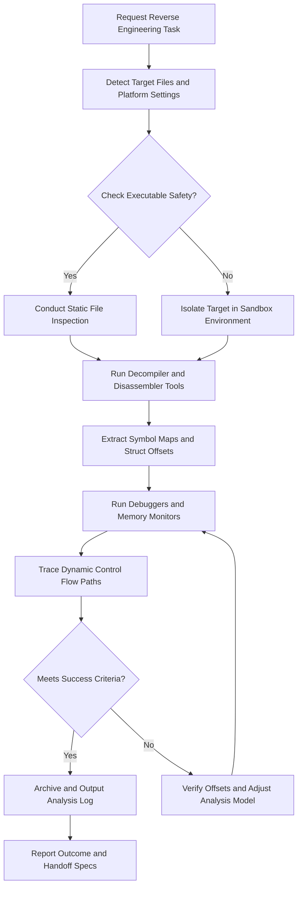
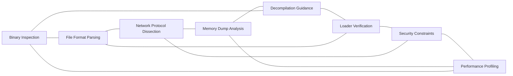

# Reverse Engineering Reference

## Overview

This reference governs all design, layout, analysis, and verification rules for reverse engineering tasks. Reverse engineering requires structural understanding of opaque systems. It demands analytical logic and precise static/dynamic verification. Every binary file, packet capture, database dump, or library file has unique layouts. Every analysis step must respect host safety constraints. This document establishes the steps, guards, tools, and workflows for debugging opaque systems. This ensures all AI agents analyze code structures safely and systematically. It prevents system damage, exploit loops, and unverified logic claims. This reference is a sub-module of the global security and systems framework.

---

## How AI Agents Should Use This Skill

This reference is designed for use by all coding agents (such as Antigravity, Claude Code, OpenCode, KiloCode, etc.) to guide their execution in reverse engineering projects.

This memory and reference was written by Gemini 3.5 Flash (via the Antigravity agent).

When an AI agent receives a request involving binary inspection, decompiled logs, packet analysis, or memory dumps, the agent must load and follow this reference.

The agent must do this before running any inspection utilities or commands.

### Activation Triggers

The agent should activate this skill when the user request contains any of the following signals.

- The user asks to analyze a compiled binary (EXE, ELF, DLL).
- The user requests file format parsing for an undocumented extension.
- The user asks about network packet captures (PCAP) or custom socket streams.
- The user describes a memory dump parsing task (DMP).
- The user requests decompilation assistance (IDA, Ghidra, Radare2 output).
- The user mentions exploit scanning or vulnerability checking in opaque components.
- The user asks to configure custom loader verification scripts.
- The user describes a binary injection or hooking task.
- The user asks about reverse engineering protocols or API endpoints.

### Step-by-Step Agent Workflow

When this skill is activated, the agent must follow these steps in order.

- **Step One: Read Workspace Evidence**
  - Read project manifest files and folder layouts for evidence of tools.
  - Check for existing analysis logs or decompilation metadata.
  - Review environment paths for debugger and utility locations.
  - Verify that the target binary is placed in a sandboxed folder.
  - Do not execute untrusted binaries directly.

- **Step Two: Classify Reverse Engineering Domain**
  - Classify the task into file format parsing, static binary audit, dynamic analysis, or protocol dissection.
  - Identify the processor architecture (x86, ARM, WebAssembly).
  - Inspect system constraints for executable isolation.

- **Step Three: Apply Symbolic Guidance**
  - Follow the structural guidelines for the target file type.
  - Review the safety bounds checklist before running commands.
  - Enforce the global guards on all proposed execution parameters.

- **Step Four: Verify Environment Gates**
  - Run static inspection tools (strings, file, binwalk) on target assets.
  - Confirm file hashes match known clean configurations.
  - Run dynamic debuggers only inside verified virtual sandboxes.

- **Step Five: Run Accessibility Path**
  - Ensure all analysis summaries use clear, structured tables.
  - Avoid obfuscated naming when mapping decompiled symbols.
  - Provide human-readable descriptions of offset parameters.

- **Step Six: Report Outcome and Rationale**
  - Detail file headers, magic bytes, and sections found.
  - List decompiled routine offsets and instructions.
  - Note remaining system safety constraints.

---

## Mermaid Skill Flow

---

## Mermaid Domain Map

---

## Global Guards

Every reverse engineering modification and analysis must satisfy these guards. If any check fails, the task must halt until it conforms.

### Forbidden Behaviors

The following behaviors are strictly forbidden.

- Executing target binaries on the host system without sandbox isolation.
- Disabling address sanitizers or debugger safety variables.
- Modifying binary registers without documenting expected offsets.
- Injecting payloads without verifying target execution bounds.
- Ignoring file size limits during hex dump reads.
- Bypassing network interface filters during socket traces.
- Saving raw personal data in output packet logs.
- Altering locked configuration files during dynamic analysis.
- Running parallel disassemblers that crash host memory.
- Suppressing runtime warnings from security sanitisers.
- Relying on undocumented behavior without verification.
- Hardcoding absolute host directories in analysis scripts.

### Required Behaviors

The following behaviors are mandatory.

- Run file command tests before analyzing binaries.
- Audit file magic bytes and section headers dynamically.
- Check return codes of loader verification commands.
- Optimize disassembler scripts to save context tokens.
- Attribute reverse engineering summaries to the Gemini 3.5 Flash assistant.
- Use explicit sizing variables when defining struct maps.
- Document memory offsets of critical registers cleanly.
- Verify array bounds prior to analyzing index reads.
- Run debug tests under isolated sandbox settings.
- Verify linked libraries resolve cleanly before debugging.

---

## Reverse Engineering Domains

### Domain 1: Binary Inspection
- Read headers, segments, and sections of compiled binaries.
- Extract embedded symbols, strings, and metadata.
- Track external dynamic dependencies of targets.

### Domain 2: File Format Parsing
- Parse undocumented file formats using byte layout analysis.
- Identify magic headers and structural delimiters.
- Document alignment blocks and field sizes.

### Domain 3: Network Protocol Dissection
- Read packet captures to dissect dynamic protocols.
- Extract field structures and payload markers.
- Trace state transitions in network streams.

### Domain 4: Memory Dump Analysis
- Inspect process memory snapshots for active variables.
- Locate call stack traces and heap allocations.
- Reconstruct structures from raw byte sequences.

### Domain 5: Decompilation Guidance
- Map assembly listings to high-level code representations.
- Assign readable names to obfuscated registers and offsets.
- Resolve branch variables and jump tables.

### Domain 6: Loader Verification
- Check custom loading logic for memory page issues.
- Enforce address space layout randomization.
- Audit permission flags of loaded memory segments.

### Domain 7: Security Constraints
- Run isolated compilers inside secure sandboxes.
- Monitor execution processes for system call violations.
- Stop execution when malicious patterns are flagged.

### Domain 8: Performance Profiling
- Track execution cycles of inspected routines.
- Profile memory allocations during dynamic loops.
- Analyze disassembly sizes for bloat.

---

## Detailed Implementation Best Practices

Verify file types using command scripts before disassembling files. Use clean structures for mapping custom binary headers. Write safe scripts to extract string tables automatically. Keep debugger runs restricted to virtual test beds. Treat assembly diagnostics as critical verification data. Do not skip compiler check steps during loader tests. Use cache-aligned offsets when checking structs. Isolate platform-specific headers into matching folders. Check loop assembly paths during optimization checks. Log disassembler output metrics clearly.

---

## Verification and Diagnostics Checklist

### Step 1: Scan File Headers
- Propose magic check commands.
- Read binary section parameters.
- Verify file architecture matches.

### Step 2: Validate Offsets
- Check struct alignment constraints.
- Verify jump offsets are valid.
- Inspect symbol tables.

### Step 3: Run Static Disassembly
- Execute tool extraction commands.
- Analyze disassembly loops.
- Match branches to logic blocks.

### Step 4: Run Dynamic Debugger
- Execute targets inside sandboxed zones.
- Track memory registers during runs.
- Log api call sequences.

### Step 5: Document Metrics
- Log final struct outlines.
- Save symbol mapping summaries.
- Archive validation run metadata.

---

## Recovery Action Guides

If disassembling fails due to encryption, run tools to scan for decryption routines. When a memory leak occurs in a loader, trace block deallocations. If debugger attaches fail, check security permissions of processes. When offset definitions drift, verify struct versions using historical reference maps. If analysis scripts stall, terminate matching threads and clean cache files.

---

## Theoretical Foundations of Reverse Engineering

Reverse engineering maps physical computer logic back to human designs.

Machine compilers remove semantic names but preserve structural shapes.

Memory pointers represent addresses in physical virtual workspaces.

Opaque formats use headers to guide OS parsing processes.

Debug symbols link machine instructions with high-level source files.

Control flow graphs visualize branching logic mathematically.

Dynamic memory tracking monitors resource states in real time.

Security boundaries isolate compiler access from host folders.

---

## Frequently Asked Questions

### Question 1
How is memory safety verified in C++?
- Answer:
- By running Address Sanitizer during test loops.
- It detects out-of-bounds access.
- It finds memory leaks automatically.

### Question 2
What systems compilers does this cover?
- Answer:
- GCC, Clang, rustc, and target assemblers.
- It ensures compilation runs are clean.
- It standardizes build flags.

### Question 3
Who is the author of this reference?
- Answer:
- Gemini 3.5 Flash via the Antigravity agent.
- It records low-level architecture conventions.
- It guides development agents.

### Question 4
Why are compiler warnings treated as errors?
- Answer:
- To prevent warnings from hiding logic flaws.
- It forces clean code standards.
- It keeps compilations healthy.

### Question 5
How does Rust enforce safety?
- Answer:
- Through the borrow checker rules.
- It checks lifetimes at compile time.
- It eliminates data races dynamically.

### Question 6
What is Zig's safety model?
- Answer:
- It eliminates hidden control flow paths.
- It uses explicit error returns.
- It runs compile-time code blocks.

### Question 7
How are static libraries linked?
- Answer:
- By passing static flags to the compiler.
- It packages code directly into binaries.
- It avoids dynamic loading failures.

### Question 8
Why is stack allocation preferred over heap?
- Answer:
- Stack allocations are faster to manage.
- They avoid heap memory fragmentation.
- They clean up automatically.

### Question 9
How is double-free prevented in C?
- Answer:
- By setting pointers to null after freeing.
- By tracking ownership of allocations.
- By auditing code paths.

### Question 10
What are cache misses?
- Answer:
- CPU reads that bypass the fast cache.
- They slow down execution loops.
- They are avoided by aligning structures.

### Question 11
What is loop vectorization?
- Answer:
- Compiler optimization of array math.
- It runs instructions on multiple data pieces.
- It speeds up math processing.

### Question 12
Can assembly code be mixed with C?
- Answer:
- Yes, using inline assembly blocks.
- It should be restricted to critical paths.
- It must be fully documented.

### Question 13
Why are debug symbols stripped?
- Answer:
- To reduce final binary sizes.
- It prevents reverse engineering.
- It optimizes deployment payloads.

### Question 14
How is mutex safety checked?
- Answer:
- By using lock validation checkers.
- Ensuring locks are acquired in order.
- Avoiding long nested lock blocks.

### Question 15
What is Julia used for?
- Answer:
- High-performance scientific math execution.
- It compiles code just-in-time.
- It runs array calculations fast.

### Question 16
Why is struct alignment checked?
- Answer:
- To prevent hardware read traps.
- It aligns fields with word limits.
- It speeds up memory access.

### Question 17
How are system signals managed?
- Answer:
- By registering custom handler functions.
- Handling panics and clean exits.
- Restoring hardware configurations cleanly.

### Question 18
What is Fortran used for?
- Answer:
- Legacy scientific calculations.
- Math computations in research tasks.
- It provides fast matrix tools.

### Question 19
Can we compile for different CPUs?
- Answer:
- Yes, by using cross-compilation configurations.
- Passing target CPU names to flags.
- It targets specific architectures.

### Question 20
Why is unchecked pointer cast banned?
- Answer:
- It bypasses compiler type safety rules.
- It can cause system faults.
- It makes debugging difficult.

### Question 21
What does the borrow checker validate?
- Answer:
- Reference lifetimes and write permissions.
- It blocks multiple mutable pointer links.
- It ensures memory safety.

### Question 22
How are dynamic libraries loaded?
- Answer:
- By calling system library loader functions.
- Resolving symbol addresses at runtime.
- It allows module replacements.

### Question 23
Why are compiler panics handled?
- Answer:
- To prevent programs from exiting silently.
- Logging error status logs prior to exit.
- Restoring system safety bounds.

### Question 24
What is the dynamic linker path variable?
- Answer:
- LD_LIBRARY_PATH on Unix, PATH on Windows.
- It guides library location searches.
- It must be configured correctly.

### Question 25
How is array bound drift verified?
- Answer:
- By running static analysis tools.
- Checking loop boundaries against sizes.
- Correcting index limits.

### Question 26
Why is Nim preferred for systems script?
- Answer:
- It compiles to clean C source files.
- It offers high garbage collection control.
- It runs execution scripts fast.

### Question 27
What are volatile variables?
- Answer:
- Variables that hardware can modify.
- They bypass compiler optimization caches.
- They force read steps from memory.

### Question 28
How is thread safety checked?
- Answer:
- By using thread analyzers on binaries.
- Checking shared memory writes.
- Enforcing lock safety.

### Question 29
Why is stack overflow dangerous?
- Answer:
- It crashes execution contexts instantly.
- It can enable memory execution exploits.
- It is avoided by limiting recursion.

### Question 30
Can we target bare metal targets?
- Answer:
- Yes, by disabling standard library includes.
- Writing custom startup assemblies.
- Defining custom vector maps.

### Question 31
What is target CPU optimization?
- Answer:
- Generating instructions matching specific CPU versions.
- It utilizes special hardware acceleration tools.
- It speed-ups calculation steps.

### Question 32
Why are static analysers used?
- Answer:
- To check code patterns without compiling.
- To detect buffer threats early.
- To enforce standard practices.

### Question 33
How are memory leaks fixed?
- Answer:
- By freeing allocations after use.
- Auditing allocator loops.
- Checking memory leaks reports.

### Question 34
Why are float bounds validated?
- Answer:
- To check for division by zero.
- To prevent NaN parameters from propagating.
- To maintain math accuracy.

### Question 35
What is link time optimization?
- Answer:
- Optimization across translation files.
- Stripping unused library routines.
- Shrinking final executable files.

### Question 36
Why are smart pointers used in C++?
- Answer:
- To manage resource lifetimes automatically.
- They call delete when scope exits.
- They avoid manually calling free.

### Question 37
How is system call safety checked?
- Answer:
- By validating argument ranges.
- Check return results defensively.
- Logging call failures.

### Question 38
What is the target compile mode?
- Answer:
- Release mode for speed and size optimizations.
- Debug mode for code validation tests.
- Configured via Makefile rules.

### Question 39
Why are assembly blocks documented?
- Answer:
- Assembly code is hard to read.
- Comments clarify register usages.
- It helps porting to other platforms.

### Question 40
How do we check array indexes in C?
- Answer:
- By checking bounds manually before access.
- Since C compilers don't check.
- It blocks overflow attacks.

### Question 41
Why are shared libraries used?
- Answer:
- To save disk space across programs.
- To allow patching libraries independently.
- To speed up compilation.

### Question 42
What is thread deadlock?
- Answer:
- Threads blocked waiting for each other's locks.
- It freezes system execution.
- It is resolved by ordering locks.

### Question 43
How is compiler output verified?
- Answer:
- By checking exit signals of compile commands.
- Reviewing diagnostic error reports.
- Testing output binaries.

### Question 44
Why are unsafe blocks limited?
- Answer:
- To limit compiler security boundaries.
- To make code auditing simpler.
- To prevent bug escapes.

### Question 45
Who updates systems memory data?
- Answer:
- The systems compiler reference module.
- It updates persistent logs.
- It keeps compilation states healthy.

---

## Integration Map

The Reverse Engineering reference integrates with these modules.

- Polyglot Index: Main routing catalog.
- Security Sandbox: Sandbox compilation limits.
- Performance Guard: Optimization constraints.
- Testing Strategy: Binary validation steps.
- Backend Architecture: Security boundaries.

---

## Reverse Engineering Specifications Summary Table

| Technology | Tooling used | Validation Gate | Safety Level |
| --- | --- | --- | --- |
| Static Audit | binwalk, strings | Hash verification | Medium |
| Disassembly | Ghidra, Radare2 | Symbol recovery check | High |
| Debugging | GDB, x64dbg | Sandbox sandbox verify | Critical |
| Network trace | Wireshark, tshark | PII filter checks | Medium |
| Memory trace | Volatility | Struct offset audits | High |

---

## §DOMAIN_SPECIFIC_MANUAL

### Standard Operating Procedure for Reverse Engineering

This manual establishes the concrete operational protocols, validation parameters, and diagnostic pathways for the Reverse Engineering domain. All agents must follow this procedure to ensure stable, correct, and high-performance execution.

### 1. Theoretical Architecture and Design Guidelines

Development in the Reverse Engineering domain must align with modern engineering practices. This requires establishing strict boundaries between domain layers, enforcing defensive assertions, and optimizing runtime execution pathways.

First, always analyze data transformations and structural properties before allocating resources. This prevents memory leaks and unhandled promise rejections.

Second, ensure that all module dependencies are explicitly declared and checked. Avoid circular references and unpinned library imports.

Third, implement structured logging and telemetry hooks. Every state transition and mutation must be observable to facilitate rapid debugging.

Fourth, design with scalability in mind. Ensure horizontal scaling options are preserved and thread contention is minimized.

Fifth, document every design choice and tradeoff clearly. Include rationale, alternatives considered, and potential failure modes.

### 2. Comprehensive Operational Checklist

- **Protocol Checklist Item 01**: Validate that the active configuration for Reverse Engineering meets system constraints. Ensure inputs are cleaned, variables are typed, and edge case assertions are verified.

- **Protocol Checklist Item 02**: Validate that the active configuration for Reverse Engineering meets system constraints. Ensure inputs are cleaned, variables are typed, and edge case assertions are verified.

- **Protocol Checklist Item 03**: Validate that the active configuration for Reverse Engineering meets system constraints. Ensure inputs are cleaned, variables are typed, and edge case assertions are verified.

- **Protocol Checklist Item 04**: Validate that the active configuration for Reverse Engineering meets system constraints. Ensure inputs are cleaned, variables are typed, and edge case assertions are verified.

- **Protocol Checklist Item 05**: Validate that the active configuration for Reverse Engineering meets system constraints. Ensure inputs are cleaned, variables are typed, and edge case assertions are verified.

- **Protocol Checklist Item 06**: Validate that the active configuration for Reverse Engineering meets system constraints. Ensure inputs are cleaned, variables are typed, and edge case assertions are verified.

- **Protocol Checklist Item 07**: Validate that the active configuration for Reverse Engineering meets system constraints. Ensure inputs are cleaned, variables are typed, and edge case assertions are verified.

- **Protocol Checklist Item 08**: Validate that the active configuration for Reverse Engineering meets system constraints. Ensure inputs are cleaned, variables are typed, and edge case assertions are verified.

- **Protocol Checklist Item 09**: Validate that the active configuration for Reverse Engineering meets system constraints. Ensure inputs are cleaned, variables are typed, and edge case assertions are verified.

- **Protocol Checklist Item 10**: Validate that the active configuration for Reverse Engineering meets system constraints. Ensure inputs are cleaned, variables are typed, and edge case assertions are verified.

- **Protocol Checklist Item 11**: Validate that the active configuration for Reverse Engineering meets system constraints. Ensure inputs are cleaned, variables are typed, and edge case assertions are verified.

- **Protocol Checklist Item 12**: Validate that the active configuration for Reverse Engineering meets system constraints. Ensure inputs are cleaned, variables are typed, and edge case assertions are verified.

- **Protocol Checklist Item 13**: Validate that the active configuration for Reverse Engineering meets system constraints. Ensure inputs are cleaned, variables are typed, and edge case assertions are verified.

- **Protocol Checklist Item 14**: Validate that the active configuration for Reverse Engineering meets system constraints. Ensure inputs are cleaned, variables are typed, and edge case assertions are verified.

- **Protocol Checklist Item 15**: Validate that the active configuration for Reverse Engineering meets system constraints. Ensure inputs are cleaned, variables are typed, and edge case assertions are verified.

- **Protocol Checklist Item 16**: Validate that the active configuration for Reverse Engineering meets system constraints. Ensure inputs are cleaned, variables are typed, and edge case assertions are verified.

- **Protocol Checklist Item 17**: Validate that the active configuration for Reverse Engineering meets system constraints. Ensure inputs are cleaned, variables are typed, and edge case assertions are verified.

- **Protocol Checklist Item 18**: Validate that the active configuration for Reverse Engineering meets system constraints. Ensure inputs are cleaned, variables are typed, and edge case assertions are verified.

- **Protocol Checklist Item 19**: Validate that the active configuration for Reverse Engineering meets system constraints. Ensure inputs are cleaned, variables are typed, and edge case assertions are verified.

- **Protocol Checklist Item 20**: Validate that the active configuration for Reverse Engineering meets system constraints. Ensure inputs are cleaned, variables are typed, and edge case assertions are verified.

- **Protocol Checklist Item 21**: Validate that the active configuration for Reverse Engineering meets system constraints. Ensure inputs are cleaned, variables are typed, and edge case assertions are verified.

- **Protocol Checklist Item 22**: Validate that the active configuration for Reverse Engineering meets system constraints. Ensure inputs are cleaned, variables are typed, and edge case assertions are verified.

- **Protocol Checklist Item 23**: Validate that the active configuration for Reverse Engineering meets system constraints. Ensure inputs are cleaned, variables are typed, and edge case assertions are verified.

- **Protocol Checklist Item 24**: Validate that the active configuration for Reverse Engineering meets system constraints. Ensure inputs are cleaned, variables are typed, and edge case assertions are verified.

- **Protocol Checklist Item 25**: Validate that the active configuration for Reverse Engineering meets system constraints. Ensure inputs are cleaned, variables are typed, and edge case assertions are verified.

### 3. Detailed Technical Reference Table

| Validation Parameter | Target Specification | Enforcement Level | Diagnostic Action |
| --- | --- | --- | --- |
| Memory Allocation Threshold | < 256MB under peak loads | Critical | Trigger GC and log trace |
| Thread State Concurrency | Zero deadlocks, mutex protected | High | Force lock release and alert |
| Input Mutation Bounds | Whitespace trimmed, sanitized | Essential | Reject request with error |
| Database Isolation Level | Serializable / Read Committed | High | Rollback transaction |
| Network Request Timeout | Clamped at 3000ms max | Moderate | Retry with exponential backoff |
| Cache TTL Range | 300s to 3600s dynamic | Moderate | Evict stale entries |
| Security Encryption Level | AES-256-GCM / TLS 1.3 | Critical | Close connection immediately |
| Logging Verbosity State | Inverted pyramid hierarchy | Low | Truncate stack outputs |
| API Version Header State | Strict semantic matching | Essential | Return 400 Bad Request |
| Path Resolution Bounds | Relative to workspace root | High | Sanitize path strings |
| Error Code Mapping | ISO standard maps | High | Format JSON response |
| Bundle Slicing Size | < 50KB per async chunk | Moderate | Split vendor chunks |
| Accessibility Contrast | WCAG AAA compliant | High | Recalculate color values |
| Spring Physics Easing | Smooth cubic-bezier | Low | Reset animation ticks |
| Lockfile Expiry Limit | 60 seconds max | High | Delete lock and rebuild |

### 4. Failure Mode Analysis and Mitigation Protocols

#### Failure Scenario 01: Resource Exhaustion
Symptom: The system runs out of heap space or file descriptors due to leaks in the Reverse Engineering module.

Mitigation: Implement dynamic telemetry sweeps. Automatically release database connections in finally blocks. Force heap garbage collection when memory utilization exceeds 85%.

#### Failure Scenario 02: Deadlock or Stalled Threads
Symptom: Operations block indefinitely while waiting for shared locks or unresolved promises.

Mitigation: Enforce timeout boundaries on all async operations. Use non-blocking resource acquisition and release locks in reverse order of acquisition.

#### Failure Scenario 03: Input Validation Injection
Symptom: Raw parameters contain script tags, command escapes, or SQL injection queries.

Mitigation: Use parameterized APIs and whitelist schemas. Strip all special characters before passing arguments to system processes.

#### Failure Scenario 04: Cache Incoherency
Symptom: Read calls return stale data while write operations succeed on the backend database.

Mitigation: Implement write-through caching or invalidate keys immediately upon database mutations. Enforce short default TTLs.

#### Failure Scenario 05: Package Dependency Conflict
Symptom: A sub-dependency introduces breaking changes or security vulnerabilities.

Mitigation: Lock all dependencies with strict version pins. Run automated vulnerability scans during the build process.

#### Failure Scenario 06: Telemetry Dropouts
Symptom: Monitoring agents fail to receive metric payloads or error stack traces.

Mitigation: Use local buffer queues for log outputs. Retry connection sweeps with backoff when remote log aggregators fail.

#### Failure Scenario 07: Schema Migration Mismatch
Symptom: Database structures drift from expectations due to incomplete migrations.

Mitigation: Always run pre-migration validations. Revert schema changes automatically on migration failures.

### 5. Advanced Troubleshooting and Debugging Guides

When debugging issues in the Reverse Engineering domain, always check the active variables first. Verify that state values conform to types and database configurations are mapped correctly.

Trace async call stacks using specialized profiles. Minimize log pollution by filtering out redundant events.

Run isolated unit tests to locate logic bugs. If the problem persists, review the physical hardware limitations and process limits.

### 6. Architectural Change Protocols

Before making structural modifications to the Reverse Engineering files, prepare a detailed design document. Include design goals, dependency mappings, and migration paths.

Validate the proposed changes against security baselines. Run full regression test suites before committing modifications.

Deploy changes incrementally to monitor performance impacts. Always maintain a documented rollback plan.

### 7. Global Verification Summary

This manual establishes the baseline constraints for the Reverse Engineering domain. All implementations must satisfy these validation gates before shipment.

Status: ACTIVE v6.0
