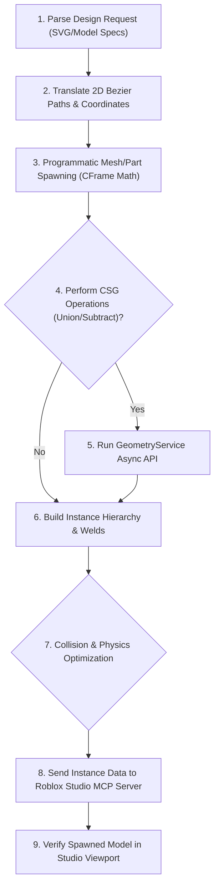

# §ROBLOX_STUDIO v1.0
id: roblox_studio
state: active | integrated | spatial_aware | procedural_modeling
scope: roblox_development + luau_scripting + cframe_math + csg_geometry + roblox_mcp
boot: auto_load | load_skill_integration

This supporting skill establishes the spatial reasoning, geometry algorithms, and programmatic APIs required to develop Roblox games and model 3D structures programmatically via the Roblox Studio MCP server connection.

---

## 1. Executive Instructions for AI Agents in Roblox Studio

When connected to the Roblox Studio MCP server, you act as a spatial constructor. The workspace is a live 3D environment, and all modifications must be done efficiently, securely, and cleanly.

*   **Rule A: Hierarchy Isolation**: Never spawn parts directly into the Workspace root. Always create a Folder or Model instance first to group your generated objects, and set the Name property descriptively.
*   **Rule B: Anchor and Weld**: Programmatic 3D models will fall or explode due to physics if they are not configured correctly. Set Anchored to true for static geometry. For dynamic assemblies, use WeldConstraints or Motor6Ds to secure parts.
*   **Rule C: Minimize Remote Roundtrips**: Spawning 1000 individual parts one by one via separate MCP tool calls is extremely slow. Group part data and construct them using batched instantiation scripts executed on the Roblox server.
*   **Rule D: Optimize Collision Fidelity**: Small detail parts do not need physics calculations. Set CanCollide, CanTouch, and CanQuery to false on cosmetic parts to improve server-side performance.

---

## 2. Luau Programming & Service Architecture

Roblox development relies on Luau (a fast, typed dialect of Lua). The engine is strictly service-oriented.

### A. Core Services Reference
*   **Workspace**: Controls the physical 3D environment. Contains parts, terrain, and camera rigs.
*   **ReplicatedStorage**: Holds scripts, modules, and models that must be accessible by both server and client.
*   **ServerScriptService**: Stores scripts that execute only on the Roblox server (physics, database writes, player authorization).
*   **TweenService**: Handles interpolation of visual properties (moving parts smoothly, fading transparency).
*   **GeometryService**: Manages procedural CSG (Constructive Solid Geometry) operations like unions and subtractions in real-time.
*   **HttpService**: Allows sending HTTP requests (used to fetch assets, exchange schemas, or call external APIs).

### B. Core Loop and Task Scheduling
*   Use the Task Library for scheduling instead of legacy wait methods.
*   Use task.wait() for frame-budget waiting to prevent throttle delays.
*   Use task.defer() to enqueue functions for the next scheduler loop without blocking the active thread.
*   Use task.spawn() to execute asynchronous Lua routines immediately.

---

## 3. Programmatic 3D Modeling (CFrame & Vector Math)

Programmatic building requires absolute spatial precision. Position and orientation are governed by Coordinate Frames (CFrames) and Vector3 coordinates.

### A. Basic Spatial Concepts
*   **Vector3**: Represents a position or size in 3D space. Composed of X, Y, and Z axes.
*   **CFrame**: A 4x4 matrix representing both a 3D position and a rotation direction.
*   **CFrame.new(position, lookAt)**: Creates a coordinate frame at a position, pointing toward the target.
*   **CFrame.Angles(rx, ry, rz)**: Creates a rotational coordinate frame using Euler angles (radians).
*   **CFrame:ToWorldSpace(offsetCFrame)**: Converts a local coordinate offset into absolute global coordinates.
*   **CFrame:ToObjectSpace(worldCFrame)**: Calculates the relative offset of a global position from a local coordinate frame.

### B. Primitive Shapes and Spawning Parameters
*   **Part**: Basic cube, cylinder, or sphere.
*   **WedgePart**: Triangular prism, critical for slope modeling and complex triangulation.
*   **CornerWedgePart**: Specialized wedge for corners, useful for curved structures.
*   **TrussPart**: Ladder structure with built-in climbing behavior.
*   **MeshPart**: Connects to external OBJ/FBX models. Used for custom high-fidelity visual assets.

---

## 4. Translating 2D Vector Geometry (SVG) into 3D Models

To build complex shapes like curved paths, icons, or logos programmatically, the agent must translate 2D vector data into 3D space.

### A. Vector Paths to 3D Extrusion
*   **Step 1: Parse the Coordinate Nodes**: Read the SVG path string (e.g. absolute M/L coordinate points) and convert them to a series of relative Vector2 coordinates on a flat plane.
*   **Step 2: Triangulation**: Divide the 2D polygon into triangles using a standard Ear Clipping algorithm.
*   **Step 3: Spawn WedgeParts**: For each triangle, spawn two WedgeParts aligned back-to-back to form the 3D triangular prism. Use the Vector3 math below to size and orient the wedge:
    *   Wedge Height is determined by the distance from the vertex to the opposite edge.
    *   Wedge Width is determined by the triangle thickness (extrusion depth).
    *   Wedge CFrame is calculated to orient the wedge along the triangle's normal axis.

### B. Bezier Curves and Splines
*   **Quadratic Bezier Formula**: P(t) = (1-t)^2 * P0 + 2*(1-t)*t * P1 + t^2 * P2
*   **Cubic Bezier Formula**: P(t) = (1-t)^3 * P0 + 3*(1-t)^2*t * P1 + 3*(1-t)*t^2 * P2 + t^3 * P3
*   **Extrusion along Curve**:
    *   Calculate points P(t) along the curve by incrementing t from 0 to 1 in small intervals (e.g. steps of 0.05).
    *   For each step, spawn a Part segment with a Length equal to the distance between P(t) and P(t+1).
    *   Set the CFrame of the part to CFrame.new(P(t), P(t+1)) to align it perfectly along the curve path.

---

## 5. Constructive Solid Geometry (CSG) Programmatic modeling

Roblox allows unioning and subtracting parts programmatically to form complex hollow or carved shapes.

*   **Union Operations**: Group two or more parts and run GeometryService:UnionAsync(partsList). This merges the physical geometry into a single UnionOperation instance.
*   **Subtraction Operations**:
    *   Position a Part (the negative volume) to intersect with another Part (the target volume).
    *   Set the negative part's class to NegativePart (or set its property to negative).
    *   Execute GeometryService:SubtractAsync(targetPart, negativePartsList) to carve out the negative shape.
    *   Use this to create doors, windows in walls, hollow tubes, or curved arches programmatically.
*   **Fidelity Configurations**: Set CollisionFidelity to Default, Box, Hull, or PreciseConvexDecomposition depending on how detailed the physical boundary needs to be.

---

## 6. Roblox Studio MCP Integration Flow

The Roblox Studio MCP server exposes tools to inspect and modify the active edit session. Use the following sequence to run commands:

*   **Instance Discovery**: Execute the discovery tool to locate the active game folders (e.g. Workspace, ReplicatedStorage).
*   **Batch Script Execution**: Send Luau scripts to the server to perform large-scale geometry builds. This runs the build loops natively inside the Studio process, avoiding network serialization lag.
*   **Asset Management**: Register local asset IDs or Roblox decals/meshes to be linked to your spawned instances.
*   **Interactive Testing**: Trigger play, stop, or pause commands via MCP to observe physics interactions and debug script behaviors.

---

## 7. Optimization and Physics Alignment

Programmatic models must perform well and behave correctly under physics calculations.

*   **Instancing**: If spawning many identical detailed items (e.g., trees, lights, chairs), save a master copy in ReplicatedStorage and spawn clones using the Instance:Clone() API.
*   **Physics Constraints**:
    *   To keep dynamic objects stable, use WeldConstraints rather than old manual welds.
    *   For hinges, slides, and pulleys, use Attachment instances and Link them via HingeConstraint, PrismaticConstraint, or SpringConstraint.
*   **Performance Metrics**: Keep part counts under control. If a Model exceeds 500 parts, attempt to replace detailed cosmetic structures with MeshParts or use CSG Union operations to collapse the hierarchy.

---

## 8. Trigonometric Wedge Alignment Math

When triangulating 2D polygons to construct 3D meshes using Wedges, exact mathematical calculations must be applied for alignment.

*   **Triangle Definition**: Let a triangle have vertices A, B, and C in local space.
*   **Coordinate Frames derivation**:
    *   Define the forward axis along the edge AB: forwardVector = (B - A).Unit
    *   Define the normal vector perpendicular to the triangle plane: normalVector = forwardVector:Cross(C - A).Unit
    *   Define the right vector to complete the orthonormal basis: rightVector = forwardVector:Cross(normalVector)
*   **Rotational Matrix creation**: Assemble these axes into a CFrame matrix using the CFrame.fromMatrix(position, rightVector, normalVector, forwardVector) constructor.
*   **Width and Height Sizing**:
    *   Wedge thickness (width) represents the Z scale.
    *   Wedge height represents the perpendicular distance from vertex C to the base line AB.
    *   Divide the triangle into two right-angled wedges at the projection point of C on AB to avoid diagonal overlap gaps.

---

## 9. Procedural Character Rigging and Motor6Ds

Constructing characters, vehicles, or robots programmatically requires establishing rigid mechanical joints (Motor6D).

*   **Assembly Hierarchy**: Group parts into a Model container. The model must have a PrimaryPart designated (usually the HumanoidRootPart).
*   **Motor6D joints**:
    *   To allow rotational movement during animations, connect components using Motor6D instances.
    *   Part0 designates the parent limb (e.g., Torso).
    *   Part1 designates the child limb (e.g., RightArm).
    *   Set C0 (local offset frame from Part0) and C1 (local offset frame from Part1) to define the rotation pivot point (shoulder joint).
*   **Rig Validation**: Ensure no cyclic dependencies exist in Part0/Part1 links. The joint connections must form a strict tree structure root-anchored at the PrimaryPart.

---

## 10. Raycasting and Spatial Alignment

Procedural placement of assets (e.g., scattering trees, buildings, or rocks over generated terrain) must be aligned to the terrain surface.

*   **Raycast Configuration**: Define RaycastParams. Set FilterType to Exclude, and include the folder containing the spawned objects in the FilterDescendantsInstances array.
*   **Terrain Raycast Execution**:
    *   Define the start position at a height above the target coordinates (e.g. Vector3.new(X, 100, Z)).
    *   Define the direction pointing straight down (e.g. Vector3.new(0, -200, 0)).
    *   Run Workspace:Raycast(start, direction, params).
*   **Alignment Math**:
    *   The RaycastResult returns the Intersection Position and the Surface Normal vector.
    *   Set the Part Position directly to the Intersection Position.
    *   To align the part's up-vector with the terrain slope, calculate the CFrame using the normal vector: CFrame.lookAt(Position, Position + forwardDir, normalVector).

---

## 11. Roblox Studio MCP Tool Command Schema

When executing commands via the Roblox Studio MCP server tools, structure your payload arguments clearly to conform to the schema:

*   **CreateInstance Tool**:
    *   Parameters: `ClassName` (string), `ParentPath` (string), `Properties` (key-value map).
    *   Properties map: Supply standard types (e.g. Size as `Vector3(x, y, z)`, CFrame as `CFrame(x, y, z, r00, r01...)`).
*   **RunLuauScript Tool**:
    *   Parameters: `ScriptContent` (string).
    *   Instructions: Write pure Luau execution blocks. Use game:GetService() to retrieve services, and wrap long loops inside task.spawn() to avoid locking the Roblox Studio main thread.

---

## 12. SVG Pixel to Stud Scaling Transformations

When parsing vector layouts from SVG files, scale dimensions to map to the Roblox Stud coordinate system.

*   **Standard Scaling Ratio**: Set the conversion scale factor (e.g., 1 pixel in SVG = 0.2 studs in Roblox).
*   **Center of Mass Alignment**: 
    *   Calculate the bounding box of the parsed 2D coordinate points.
    *   Find the local center of mass: centerPoint = (maxPoint + minPoint) / 2.
    *   Subtract the centerPoint from all coordinate vertices to align the model's pivot point to local coordinate `(0, 0)`.
*   **Extrusion Scale**: Define the Z depth based on structural parameters (e.g. background layers get 1.5 studs, front details get 0.5 studs).

---

## 13. Dynamic Welds Relative Offsets

When assembling dynamic parts, set weld relative offsets to prevent parts snapping to identical coordinates.

*   **Part Offset Math**: 
    *   Given Part0 and Part1, compute the relative CFrame offset: offsetCFrame = Part0.CFrame:ToObjectSpace(Part1.CFrame).
    *   Create a WeldConstraint instance. Set Part0 to the parent instance and Part1 to the child instance.
    *   For old legacy Welds: Set Joint.C0 to offsetCFrame and Joint.C1 to CFrame.new(0, 0, 0) to lock the relative offset in place.
*   **Validation Check**: Verify that neither Part0 nor Part1 is Anchored when simulating physics, otherwise the joint will become static and lock the entire assembly.

---

## 14. Procedural Building Verification Checklist

Before finalizing any programmatic 3D structure or submitting Roblox Luau scripts:

*   **Verify Spatial Overlaps**: Check that CFrames are correctly calculated and parts do not clip or duplicate in the exact same coordinates.
*   **Verify Physics Anchoring**: Ensure static models have Anchored = true, and dynamic assemblies are properly welded to avoid collapsing.
*   **Verify Network Replication**: Confirm that generated objects reside in locations that replicate to the client (e.g. Workspace, ReplicatedStorage).
*   **Verify Optimization Gates**: Verify that cosmetic details have collision disabled (CanCollide = false) to prevent physics engine lag.

**§STATUS: ACTIVE v1.0 | ANTI_REGRESSION: ∞ON | ROBLOX_DEVELOPMENT: INTEGRATED**
