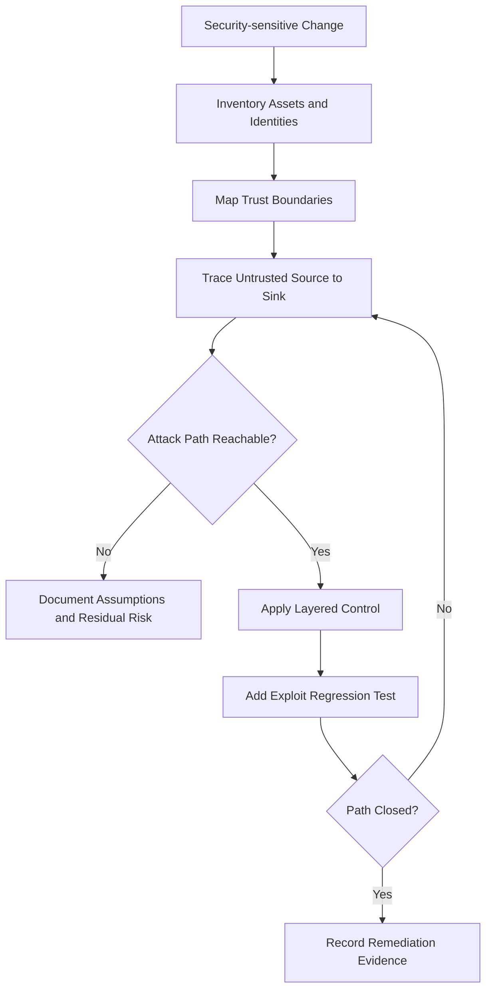
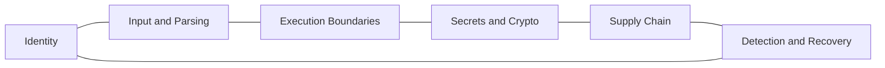

# Security Engineering Reference

## Overview

This reference governs threat modeling, trust boundaries, secrets, dependency integrity, secure defaults, update trust, exploitability analysis, and remediation validation. Security findings must be evidence-based and tied to reachable attack paths rather than generic checklists.

---

## How AI Agents Should Use This Skill

Load this reference whenever code crosses a trust boundary, processes untrusted input, stores credentials, executes commands, updates itself, exposes a network service, or changes permissions. Identify assets and attacker capabilities before selecting controls. Separate confirmed vulnerabilities from defense-in-depth improvements.

### Activation Triggers

- Authentication, authorization, sessions, tokens, secrets, or encryption.
- Shell execution, file upload, parsing, deserialization, or remote fetches.
- Dependency upgrades, package publication, signatures, or self-update.
- Privileged installation, system configuration, or cross-user access.
- Security review, threat model, incident response, or vulnerability fix.

### Step-by-Step Agent Workflow

1. Inventory assets, entry points, identities, and trust boundaries.
2. Trace data from attacker-controlled source to sensitive sink.
3. Establish prerequisites, reachability, and impact.
4. Select preventive, detective, and recovery controls.
5. Patch at the narrowest reliable boundary.
6. Add a regression test and verify the attack path is closed.

---

## Mermaid Threat Analysis Flow

## Mermaid Security Domain Map

---

## Global Guards

### Forbidden Behaviors

- Calling a pattern vulnerable without proving source, sink, and reachability.
- Logging credentials, tokens, private keys, or sensitive payloads.
- Building shell commands from untrusted strings.
- Disabling certificate, signature, origin, or authorization checks.
- Treating encoding as validation or hashing as encryption.

### Required Behaviors

- Deny by default and apply least privilege.
- Validate at trust boundaries using explicit schemas.
- Keep secrets out of source, logs, command lines, and distributable artifacts.
- Verify downloaded or updated artifacts using authenticated metadata.
- State residual risk and operational assumptions.

## Domain Rules

### Identity and Authorization

- Authenticate the actor and authorize the specific object and action.
- Prevent confused-deputy behavior across services and tools.

### Injection and Execution

- Prefer structured APIs and argument arrays.
- Canonicalize paths before enforcing containment.
- Treat archives, templates, parsers, and plugins as execution-adjacent.

### Supply Chain

- Pin reproducible dependencies where practical.
- Inspect release contents and provenance.
- Make update failure preserve the last trusted version.

### Detection and Recovery

- Log security decisions without sensitive data.
- Define revocation, rotation, rollback, and incident evidence.

## Verification Checklist

- Assets and attacker capabilities are documented.
- Each finding has a reachable source-to-sink path.
- Controls cover prevention and recovery.
- Negative tests exercise hostile input.
- Secrets and release artifacts are scanned.
- Residual risk is explicit.

## Integration Map

- Use `network_protocols.md` for transport and protocol trust boundaries.
- Use `package_release.md` for artifact provenance and publication.
- Use `windows_systems.md` for privileged Windows controls.
- Use `code_review_refactoring.md` for severity-ranked review output.

## Completion Contract

Security work is complete only when the relevant attack path is demonstrated, mitigated, regression-tested, and documented with remaining assumptions.
