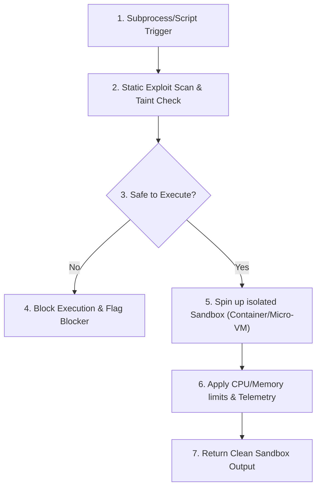

# §SECURITY_SANDBOX v1.0

id: security_sandbox
state: active | restrictive | sandboxed
scope: runtime_isolation + execution_safety + static_analysis + dynamic_taint
boot: auto_load | load_skill_integration

This supporting skill establishes parameters for secure script execution, local sandboxing, dynamic runtime checks, and exploit auditing. It protects the host machine from unverified executions and logic leaks.

---

## 1. Sandbox Isolation Requirements

When executing third-party scripts, untrusted test files, or arbitrary commands:

- **Isolated Execution Runtimes**: Prefer running commands inside isolated Docker containers, virtual machines, or process sandboxes (e.g. gVisor, firejail) if available.
- **Port & Network Restriction**: Block outbound network connections by default for all test runs unless specifically required.
- **File System Guard**: Execute in read-only directories, restricting write permissions exclusively to designated temporary folders (e.g. `./scratch/sandbox_tmp`).

---

## 2. Static Exploit Scanning

Before shipping any terminal command or script wrapper:

- **Taint Check**: Analyze user inputs or configurations mapped to shell commands to prevent arbitrary command injection.
- **Dependency Audit**: Inspect new packages against known vulnerability databases (e.g., Snyk, npm audit, pip audit) to avoid incorporating malicious packages.
- **Secrets Prevention**: Actively scan for API keys, passwords, database URLs, and credentials in active buffers, raising a blocker if any are detected.

---

## 3. Dynamic Telemetry & Mitigation

- **Memory/CPU Restraints**: Limit sandbox container memory usage to 512MB and CPU quota to 1 core max during test execution.
- **Command Whitelist**: Restrict subprocess execution to standard development binaries (`node`, `python`, `npm`, `cargo`, `git`). Flag any usage of generic network transfer utilities like `wget` or `curl` unless explicitly authorized.

**§STATUS: ACTIVE v1.0 | ANTI_REGRESSION: ∞ON | SECURITY_SANDBOX: ENFORCED**
