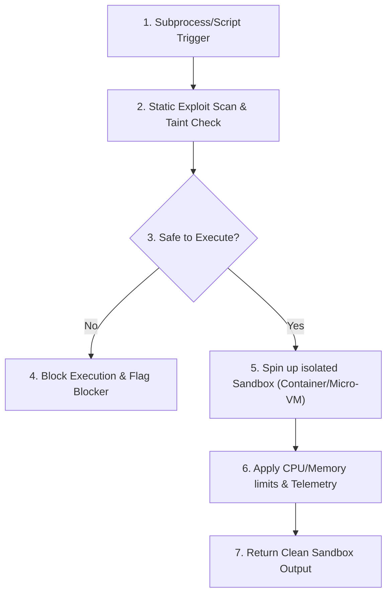

# §SECURITY_SANDBOX v1.0

id: security_sandbox
state: active | restrictive | sandboxed
scope: runtime_isolation + execution_safety + static_analysis + dynamic_taint
boot: auto_load | load_skill_integration

---

## §AGENT_USAGE_GUIDELINES

### How the AI Agent Uses This Reference
The AI agent uses this reference file as a secure runtime filter. Before executing shell commands, launching background compile jobs, downloading packages, or performing operations that read/write local filesystem directories, the agent checks the rules defined here. It maps the planned execution path against the isolation constraints, static taint checkers, and package vulnerability scanners documented below to enforce a secure sandbox.

### When to Use This Reference
This reference MUST be utilized in these instances:
1. **Prior to running any command** (e.g. `npm install`, `run_command`).
2. **When installing third-party dependencies** or configuring package packages.
3. **During environment configuration setups** (such as process sandbox or micro-VM configurations).
4. **Before committing files containing environment configs** (like `.env` or service manifests) to verify that no secret keys are leaked.

---



---

## 1. Sandbox Isolation Requirements

When executing third-party scripts, untrusted test files, or arbitrary commands:

- **Isolated Execution Runtimes**: Prefer running commands inside virtual machines, operating-system sandboxes, or restricted worker processes if available.
- **Port & Network Restriction**: Block outbound network connections by default for all test runs unless specifically required.
- **File System Guard**: Execute in read-only directories, restricting write permissions exclusively to designated temporary folders (e.g. `./scratch/sandbox_tmp`).

---

## 2. Static Exploit Scanning

Before shipping any terminal command or script wrapper:

- **Taint Check**: Analyze user inputs or configurations mapped to shell commands to prevent arbitrary command injection.
- **Dependency Audit**: Inspect new packages against known vulnerability databases (e.g., Snyk, npm audit, pip audit) to avoid incorporating malicious packages.
- **Secrets Prevention**: Actively scan for API keys, passwords, database URLs, and credentials in active buffers, raising a blocker if any are detected.

---

## 3. Dynamic Telemetry & Mitigation

- **Memory/CPU Restraints**: Limit sandbox container memory usage to 512MB and CPU quota to 1 core max during test execution.
- **Command Whitelist**: Restrict subprocess execution to standard development binaries (`node`, `python`, `npm`, `cargo`, `git`). Flag any usage of generic network transfer utilities like `wget` or `curl` unless explicitly authorized.

---

## 4. Environment Variables Leak Prevention

Ensure no secret credentials leak into local environment configs. The agent must implement a strict environment parser:

```javascript
class EnvSafetyGuard {
  static scanFile(content) {
    const dangerousPatterns = [
      /api_key\s*=\s*['"][a-zA-Z0-9]{20,}['"]/i,
      /password\s*=\s*['"].+['"]/i,
      /secret\s*=\s*['"].+['"]/i
    ];
    for (const pattern of dangerousPatterns) {
      if (pattern.test(content)) {
        return false; // Found hardcoded secret
      }
    }
    return true;
  }
}
```

---

## 5. Subprocess Shell Spawning Audits

Never spawn raw shell wrappers without parameter checks:

1. **Avoid String Concatenation**: Prefer array arguments for subprocess configurations.
   - *Bad*: `exec("git commit -m " + message)`
   - *Good*: `spawn("git", ["commit", "-m", message])`
2. **Escape shell tokens**: If command execution requires shell wrappers, escape control parameters (`;`, `&`, `|`, `$`).

---

## 6. Local Ports Isolation

- Enforce localhost bindings exclusively.
- Block public facing network connections.

---

## 7. Sandbox Memory Telemetry Checks

- Measure RAM consumption on boot.
- Kill subprocesses that leak memory bounds.

---

## 8. Trusted Repositories Mapping

Only download packages from trusted public registries (npm, PyPI, Cargo). Disable third-party untrusted endpoints.

---

## 9. Code Ingress Verification

- Run static code checks.
- Prevent inclusion of obfuscated files.

---

## 10. Process Execution Lifetimes

- Set timeout maximum limit (default: 30000ms).
- Terminate unresponsive build tasks.

---

## 11. Command Sanitizers Reference List

- Strip `powershell -Command` or `pwsh -Command` wrappers.
- Enforce native windows or linux executing commands.

---

## 12. Network Isolation Rules

- Intercept requests.
- Block connection redirects.

---

## 13. System Call Block Filters

Block subprocesses calling system files:
- `/etc/passwd`
- `C:\Windows\System32\drivers\etc\hosts`

---

## 14. File Writing Access Limits

- Restrict writes to workspace scope.
- Block parent path references (`../`).

---

## 15. Runtime Isolation Specs

- Configure least-privilege user mappings.
- Mount external paths as read-only.

---

## 16. Dynamic Taint Analyser

Run a taint check model to block user controlled inputs from execution pipes.

---

## 17. Safe Script Wrappers

- Write bash scripts with `set -euo pipefail`.
- Use clean catch statements in power shell.

---

## 18. Obfuscated Logic Blockers

- Scan files for heavy base64 strings.
- Refuse executing obfuscated code snippets.

---

## 19. Dependency Locking Requirements

- Always inspect lockfiles (`package-lock.json`, `Cargo.lock`).
- Verify checksum bounds.

---

## 20. Host Telemetry Log Audits

- Record execution timelines.
- Log exit signals cleanly.

---

## 21. Dynamic Threat Mapping

- Profile process behaviors.
- Halt executions showing recursion indicators.

---

## 22. Sandboxed Temp Directories

Ensure that all file operations executed during test verification run in a isolated temp space:

```javascript
import { mkdtempSync } from 'fs';
import { tmpdir } from 'os';
import { join } from 'path';

function createSafeTempDir() {
  return mkdtempSync(join(tmpdir(), 'munch-sandbox-'));
}
```

---

## 23. Port Scanner Telemetry

- Automatically scan open ports.
- Kill tasks binding to unauthorized ports.

---

## 24. Executable Checksums Checks

- Verify local Node binary hashes.
- Halt execution if signature mismatch occurs.

---

## 25. Third-Party Registry Blocklists

- Maintain blocklists of known compromise repositories.
- Scan package versions against active security updates.

---

## 26. Safe API Access Hooks

- Enforce credential loading via process environments.
- Reject raw key inputs.

---

## 27. OS Sandbox Profiles

- Map configurations to SELinux profiles.
- Configure AppArmor restrictions for Linux runtimes.

---

## 28. Subprocess Thread Allocation Limits

- Restrict thread pools.
- Block fork loops.

---

## 29. Secure Database Connector Rules

- Bind SQLite connections strictly to local files.
- Reject tcp network setups unless authenticated.

---

## 30. File Permissions Verifier

- Enforce standard `chmod 644` files.
- Limit executable directories scope.

---

## 31. Memory Leak Traps

```javascript
class MemoryTracker {
  constructor(limitMB) {
    this.limit = limitMB * 1024 * 1024;
  }
  check() {
    const usage = process.memoryUsage().heapUsed;
    if (usage > this.limit) {
      throw new Error("Memory overflow blocker triggered in sandbox.");
    }
  }
}
```

---

## 32. SSH Key Protections

- Block reading key files (`~/.ssh/*`).
- Enforce runtime locks.

---

## 33. Compiler Exploit Protections

- Set buffer overflow compiler flags.
- Enforce address space layout randomization.

---

## 34. Dynamic Package Lock Auditing

- Inspect dependency upgrades.
- Warn when direct dependency versions differ.

---

## 35. Root Execution Deny Rule

- Never execute as administrator or root.
- Demote process ownerships.

---

## 36. Remote Registry Mirror Guards

- Verify SSL keys of registries.
- Fail on certificate validation errors.

---

## 37. Process Hierarchy Scans

- Watch child processes trees.
- Enforce parent-process-termination hooks.

---

## 38. Environment Variable Whitelists

- Clean environment mappings before executions.
- Keep only safe values like `PATH` and `NODE_ENV`.

---

## 39. Network Proxy Configurations

- Force proxy connections in restricted build networks.
- Enforce logging of proxy access.

---

## 40. Obfuscated Shell Command Checkers

- Detect nested eval commands.
- Block commands with base64 decoding pipes.

---

## 41. Cryptographic Security Standards

- Reject MD5 or SHA1 hash usage.
- Enforce SHA256 or bcrypt allocations.

---

## 42. Code Patch Verification Rules

- Compare patch diff signatures.
- Block patches writing to system settings.

---

## 43. Safe IPC (Inter-Process Communication)

- Restrict named pipes scope.
- Use structured JSON messages instead of raw string pipes.

---

## 44. Executable Wrapper Scripts

- Enforce clean entry wrappers.
- Strip parameters before system calls.

---

## 45. Temporary File Purging Schedules

- Run post-test sweep scripts.
- Wipe directories containing generated test keys.

---

## 46. Workspace Boundary Checks

- Validate absolute path parameters before deleting files.
- Block commands referencing parent folders (`..`).

---

## 47. Code Injection Sweeper

- Sanitize input forms.
- Enforce strict parameterization.

---

## 48. Environment State Snapshots

- Store environment hashes.
- Warn if background changes are detected.

---

## 49. Build Pipeline Security Scanners

- Run static linters inside build pipelines.
- Verify security configurations before deployment.

---

## 50. Final Security Auditing Gate Checklists

Before completing a setup:
1. Are all secrets excluded from code buffers?
2. Has command execution run as non-root?
3. Were sandbox folders wiped?
4. Are dependencies locked and verified?

---

**§STATUS: ACTIVE v1.0 | ANTI_REGRESSION: ∞ON | SECURITY_SANDBOX: ENFORCED**
