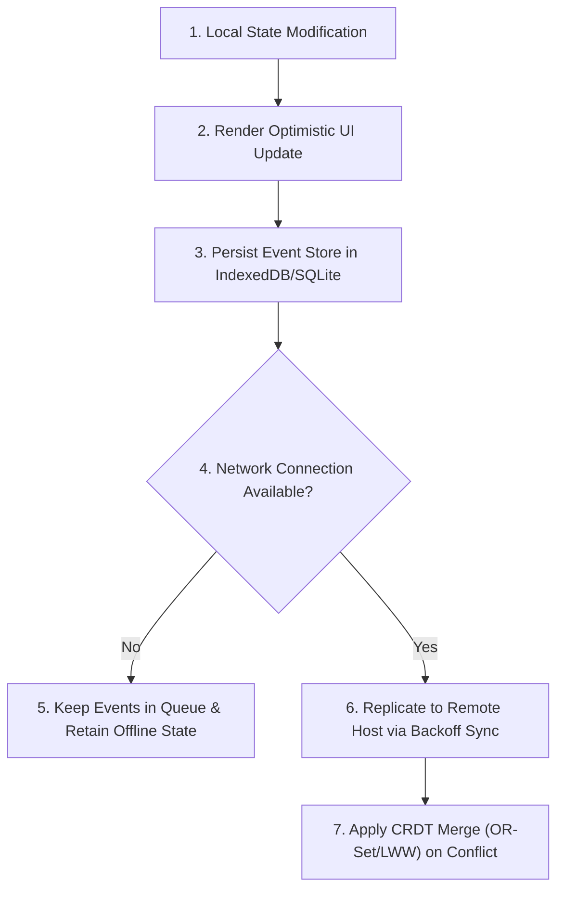

# §STATE_REPLICATION v1.0

id: state_replication
state: active | synchronous | replica
scope: database_sync + offline_first + crdt_resolution + event_sourcing
boot: auto_load | load_skill_integration

This supporting skill establishes standard guidelines for real-time state synchronization, offline-first databases, Conflict-Free Replicated Data Types (CRDTs), and transactional event sourcing.

---

## 1. Offline-First Synchronization Architecture

To support resilient local applications, the synchronization layer must treat the client as the source of truth, replicating to secondary hosts asynchronously:

- **Optimistic State Updates**: Immediately update client state graphs and UI blocks, pushing sync operations to background queues.
- **Queue Persistence**: Store outgoing event mutations in local persistent storage (e.g. IndexedDB, SQLite) to avoid data loss across network transitions or application shutdowns.
- **Heartbeat & Backoff**: Reconnect to server hosts using exponential backoff retry algorithms when connection dropouts occur.

---

## 2. CRDT & Conflict Resolution Protocols

When concurrent modifications happen on multiple replicas:

- **Last-Write-Wins (LWW-Element-Set)**: Apply LWW only for non-critical properties, using accurate synchronized UTC time registers.
- **Observed-Remove Set (OR-Set)**: Use OR-Sets or Grow-Only Sets for structural lists (e.g., adding/removing team members, files structure).
- **Yjs/Automerge Integration**: For real-time document editing, prioritize structured text CRDT frameworks to merge character offsets seamlessly.

---

## 3. Transactional Event Sourcing

- **Append-Only Event Store**: Save all state updates as immutable event records (e.g., `TASK_CREATED`, `TASK_COMPLETED`) rather than mutating row layouts directly.
- **Snapshot Consolidation**: Periodically fold event logs into current snapshots to accelerate database bootstrap speeds.

**§STATUS: ACTIVE v1.0 | ANTI_REGRESSION: ∞ON | STATE_REPLICATION: SYNCHRONIZED**
