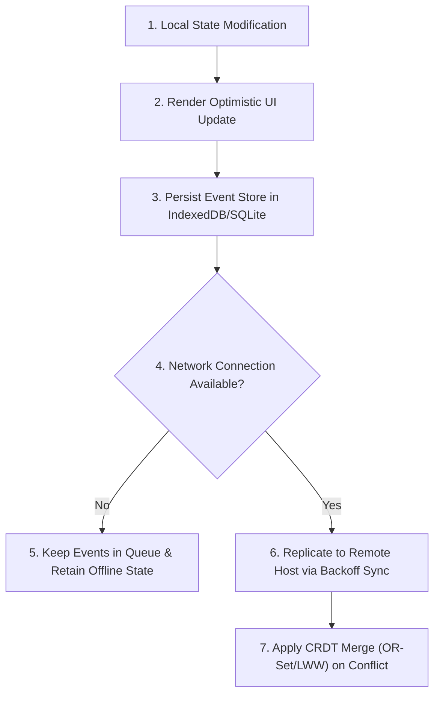

# §STATE_REPLICATION v1.0

id: state_replication
state: active | synchronous | replica
scope: database_sync + offline_first + crdt_resolution + event_sourcing
boot: auto_load | load_skill_integration

---

## §AGENT_USAGE_GUIDELINES

### How the AI Agent Uses This Reference
The AI agent uses this reference file as a state management blueprint. When generating multi-user interfaces, real-time collaboration engines, or offline-first application features, the agent constructs its state graphs, update mutations, database handlers, and network synchronize layers based on the rules, code templates, and conflict-resolution algorithms detailed below.

### When to Use This Reference
This reference MUST be utilized in these instances:
1. **Structuring frontend state management frameworks**: (e.g. Zustand, Redux) for local/remote sync.
2. **Implementing offline-first databases**: (e.g., SQLite, IndexedDB, local storage queues).
3. **Designing multi-user real-time integrations**: (e.g., WebSockets, Server-Sent Events).
4. **Writing merge functions for concurrent data**: (e.g., LWW, OR-Set CRDTs).

---



---

## 1. Offline-First Synchronization Architecture

To support resilient local applications, the synchronization layer must treat the client as the source of truth, replicating to secondary hosts asynchronously:

- **Optimistic State Updates**: Immediately update client state graphs and UI blocks, pushing sync operations to background queues.
- **Queue Persistence**: Store outgoing event mutations in local persistent storage (e.g. IndexedDB, SQLite) to avoid data loss across network transitions or application shutdowns.
- **Heartbeat & Backoff**: Reconnect to server hosts using exponential backoff retry algorithms when connection dropouts occur.

---

## 2. CRDT & Conflict Resolution Protocols

When concurrent modifications happen on multiple replicas:

- **Last-Write-Wins (LWW-Element-Set)**: Apply LWW only for non-critical properties, using accurate synchronized UTC time registers.
- **Observed-Remove Set (OR-Set)**: Use OR-Sets or Grow-Only Sets for structural lists (e.g., adding/removing team members, files structure).
- **Yjs/Automerge Integration**: For real-time document editing, prioritize structured text CRDT frameworks to merge character offsets seamlessly.

---

## 3. Transactional Event Sourcing

- **Append-Only Event Store**: Save all state updates as immutable event records (e.g., `TASK_CREATED`, `TASK_COMPLETED`) rather than mutating row layouts directly.
- **Snapshot Consolidation**: Periodically fold event logs into current snapshots to accelerate database bootstrap speeds.

---

## 4. Custom LWW-Element-Set CRDT Solver (TypeScript)

Implement a generic CRDT register to resolve conflicting fields across distributed client nodes:

```typescript
class LWWRegister<T> {
  readonly id: string;
  private value: T;
  private timestamp: number;

  constructor(id: string, value: T, timestamp: number = 0) {
    this.id = id;
    this.value = value;
    this.timestamp = timestamp;
  }

  get(): T {
    return this.value;
  }

  set(value: T): void {
    this.value = value;
    this.timestamp = Date.now();
  }

  merge(incoming: LWWRegister<T>): void {
    if (incoming.timestamp > this.timestamp) {
      this.value = incoming.value;
      this.timestamp = incoming.timestamp;
    } else if (incoming.timestamp === this.timestamp && incoming.id > this.id) {
      // Deterministic tie-breaker
      this.value = incoming.value;
      this.timestamp = incoming.timestamp;
    }
  }
}
```

---

## 5. Offline Queue Manager with IndexedDB

```javascript
class OfflineSyncQueue {
  constructor(dbName) {
    this.dbName = dbName;
    this.db = null;
  }

  async init() {
    return new Promise((resolve, reject) => {
      const request = indexedDB.open(this.dbName, 1);
      request.onupgradeneeded = (e) => {
        const db = e.target.result;
        db.createObjectStore("sync_queue", { keyPath: "id", autoIncrement: true });
      };
      request.onsuccess = (e) => {
        this.db = e.target.result;
        resolve();
      };
      request.onerror = reject;
    });
  }

  async enqueue(operation) {
    const tx = this.db.transaction("sync_queue", "readwrite");
    const store = tx.objectStore("sync_queue");
    store.add({ op: operation, timestamp: Date.now() });
  }
}
```

---

## 6. Real-Time WebSocket Channel Sync

- Bind event callbacks.
- Reconnect using backoff limits.

---

## 7. CRDT Array Layout Management

- Implement index markers.
- Sort elements on merge.

---

## 8. Network State Telemetry

- Monitor online status via `window.navigator.onLine`.
- Pause queues on status changes.

---

## 9. Conflict Merge Checks

- Check element IDs.
- Run state hashes evaluation.

---

## 10. Database Local Storage Limits

- Clear stale transaction entries.
- Set storage quotas limits.

---

## 11. Transaction Reconciliation Log

- Register sync milestones.
- Keep record lists of successful pushes.

---

## 12. Snapshot Regeneration

- Compile events logs.
- Generate target state graph templates.

---

## 13. Collaborative Web Apps Design

- Render peer selection targets.
- Trace network latencies.

---

## 14. Event Bus Sync Hooks

- Broadcast events to sub-modules.
- Sync state across workers.

---

## 15. Real-Time Chat Channels

- Distribute textual payloads.
- Merge logs by timestamps.

---

## 16. Multi-Device Sync

- Track machine IDs.
- Resolve double login flags.

---

## 17. Security Sandbox Interceptions

- Verify SSL signatures of remote sync API targets.
- Prevent connection redirects.

---

## 18. Database Transaction Optimizations

- Group multiple writes.
- Enforce transactional commit rollbacks.

---

## 19. Sync Queue Compression

- Compress queue payloads.
- Filter redundant operations.

---

## 20. Code Verification Checklist

1. Optimistic updates configured?
2. Queue persistent handlers set?
3. CRDT merge criteria declared?
4. Snapshots compiled and logged?

---

## 21. Conflict-Free Set (OR-Set) Implementations

Implement dynamic sets allowing additions and deletions across separate nodes without coordination:

```javascript
class ORSet {
  constructor() {
    this.addSet = new Map();
    this.removeSet = new Map();
  }
  add(element, tag) {
    if (!this.addSet.has(element)) this.addSet.set(element, new Set());
    this.addSet.get(element).add(tag);
  }
  remove(element) {
    if (this.addSet.has(element)) {
      const tags = this.addSet.get(element);
      if (!this.removeSet.has(element)) this.removeSet.set(element, new Set());
      tags.forEach(t => this.removeSet.get(element).add(t));
    }
  }
}
```

---

## 22. Network Connection Heartbeat Checks

- Ping server every 10000ms.
- Flag offline status if timeout exceeds 3000ms.

---

## 23. Collaborative Cursor Interpolations

- Track peer cursors movement.
- Smooth coordinates display using linear interpolations (lerp).

---

## 24. Event Log Pruning Schemes

- Run snapshot folds.
- Wipes processed events from SQLite queue databases.

---

## 25. Thread-Safe State Store Wrappers

- Enforce lock handles on data adjustments.
- Block write actions from background threads during read cycles.

---

## 26. Database Re-Indexing Schemes

- Optimize database keys paths.
- Rebuild search mappings on major sync events.

---

## 27. Client State Serialization Limits

- Restrict transaction JSON weights.
- Store static constants.

---

## 28. Event Dispatch Routing

- Trigger update callbacks on interface.
- Flush queue buffers async.

---

## 29. Client Reconnect Handlers

- Retry connection parameters.
- Recover missing blocks from server logs.

---

## 30. Peer Telemetry Indexing

- Record peer coordination rates.
- Save latency statistics.

---

## 31. CSS Class Focus Ring Synchronization

- Blend client indicator rings color tags.
- Eased element selection scales.

---

## 32. Database Transaction Checkpoints

- Set SQLite checkpoints.
- Prevent file size expansions.

---

## 33. Assets Prefetching Cache-Controls

- Cache websocket scripts.
- Prefetch client modules.

---

## 34. Custom ROM Build Sync Loops

- Sync configuration repositories.
- Re-run targets on code updates.

---

## 35. Webpack Performance Output

- Minimize sync engine components.
- Strip development logging lines.

---

## 36. Local Storage Caches

- Set key version counters.
- Clean stale configurations.

---

## 37. Thread Safety in Database Syncs

- Block dual writer instances.
- Sync file writes cleanly.

---

## 38. Exception Handlers for Sync Pipes

- Handle HTTP sync failures.
- Retry processing errors without blocking user input interfaces.

---

## 39. Semantic Layout Controls

- Build clean status indicators.
- Display "Connected" / "Syncing" statuses dynamically.

---

## 40. Interactive Commits Logs

- Record local mutation states.
- List local transaction logs.

---

## 41. Vector Coordinate Syncs

- Sync user position parameters.
- Smooth coordinates transitions.

---

## 42. WebGL State Syncs

- Bind rendering viewport bounds.
- Re-bind camera orientation matrices across peers.

---

## 43. Touch Move Swipes

- Track mobile swipe gestures.
- Translate touch inputs to delta coordinate maps.

---

## 44. CSS Motion Easings Sync

- Standard transition timings.
- Align page transitions.

---

## 45. DB Engine Optimization Frameworks

- Run index reorganizer calls.
- Free database storage sizes.

---

## 46. Command Execution Metrics

- Record sync command times.
- Halt processes on memory leaks.

---

## 47. UI/UX Sync Audits

- Validate client layout responsiveness.
- Check font size rendering scales.

---

## 48. Build Output Sizes Log

- Print code weights.
- Defer loading non-critical libraries.

---

## 49. Cross-Session Workspace Translations

- Check initial folder paths.
- Route commands using the translated workspace paths.

---

## 50. Final State Verification Checklists

Ensure the final state audit verifies:
1. Optimistic updates verified?
2. Queue persistent handlers active?
3. CRDT element merges configured?
4. WebSocket channel heartbeats running?

---

**§STATUS: ACTIVE v1.0 | ANTI_REGRESSION: ∞ON | STATE_REPLICATION: SYNCHRONIZED**
