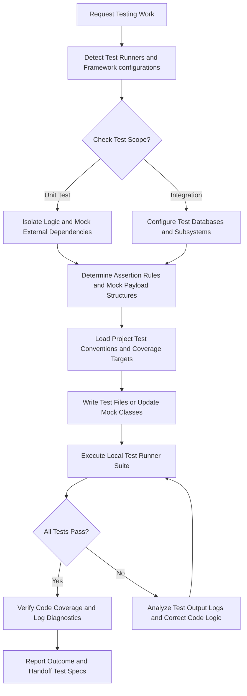
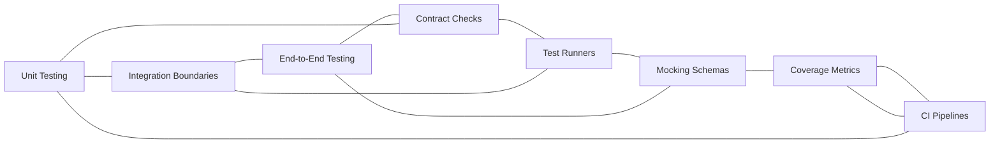

# Testing Strategy Reference

## Overview

This reference governs all code verification, testing suites, CI/CD checks, and validation gates. Testing is not a post-development chore. It is a core engineering requirement. Every module, class, database script, or interface has specific testing constraints. Every code change must pass local validation gates before release. This document establishes the steps, guards, metrics, and workflows for code verification. This ensures all AI agents write verifiable, self-testing applications. It prevents regression bugs, broken interfaces, and silent logic escapes. This reference is a sub-module of the global software quality and verification framework.

---

## How AI Agents Should Use This Skill

This reference is designed for use by all coding agents (such as Antigravity, Claude Code, OpenCode, KiloCode, etc.) to guide their execution in testing and QA.

When an AI agent receives a request involving unit testing, test-driven development, integration tests, E2E browser tests, mock endpoints, or CI build scripts, the agent must load and follow this reference.

The agent must do this before writing test scripts or executing test runner commands.

### Activation Triggers

The agent should activate this skill when the user request contains any of the following signals.

- The user asks to write unit tests for a class or function.
- The user requests integration tests for multiple modules.
- The user asks about end-to-end (E2E) testing tools (Playwright, Cypress).
- The user describes a continuous integration check pipeline.
- The user requests test coverage metrics or reports.
- The user mentions regression test sweeps.
- The user asks to configure mock response data templates.
- The user describes load testing or concurrency limits.
- The user asks about testing database operations.

### Step-by-Step Agent Workflow

When this skill is activated, the agent must follow these steps in order.

- **Step One: Read Workspace Evidence**
  - Read active configuration templates in the workspace (jest.config, package.json).
  - Check for existing test files and directory layouts.
  - Review testing dependencies and test runner binary locations.
  - Verify that local test suites execute cleanly.
  - Do not introduce new test runner tools if tools already exist.

- **Step Two: Classify Testing Domain**
  - Group the task into unit testing, integration tests, E2E flow tests, or contract verification.
  - Identify the target code files under test.
  - Inspect mocking requirements for database or network calls.

- **Step Three: Apply Coding Rules**
  - Enforce clean testing patterns (arrange, act, assert).
  - Prevent mock leaking by resetting mocks after each test block.
  - Apply the global guards to every proposed testing change.

- **Step Four: Verify Logic Gates**
  - Verify that tests compile and execute cleanly in the shell.
  - Check that code coverage targets match project parameters.
  - Confirm the mock structures represent all expected outcomes.

- **Step Five: Run Accessibility Path**
  - Ensure test outputs are logged in clean, human-readable console files.
  - Verify that visual E2E tests check aria labels and roles.
  - Confirm that focus rings and focus loops are covered in E2E tests.

- **Step Six: Report Outcome and Rationale**
  - Detail test changes and execution stats.
  - Explain why specific mocking choices were selected.
  - Report coverage differences before and after modifications.

---

## Mermaid Skill Flow

---

## Mermaid Domain Map

---

## Global Guards

Every modification to testing code and execution loops must satisfy these guards. If any check fails, the task must halt until it conforms.

### Forbidden Behaviors

The following behaviors are strictly forbidden.

- Writing test suites without assertions (smoke-only testing).
- Sharing mutable test state variables between isolated test files.
- Ignoring test warnings or treating flaky runs as ignorable.
- Mocking the system under test directly instead of its external links.
- Disabling CI test runs to force deployments.
- Hardcoding user tokens or secrets in test scripts.
- Modifying locked lockfiles directly during testing audits.
- Suppressing test log outputs during execution passes.
- Writing E2E tests that rely on static sleep timeouts.
- Autoplay browser tests that do not close window resources.
- Disabling accessibility validations inside visual E2E scripts.
- Hiding failed testing gates in verification logs.

### Required Behaviors

The following behaviors are mandatory.

- Run connection diagnostic checks before invoking database tests.
- Audit local storage directories prior to executing cache tests.
- Check return codes of test runners.
- Optimize mock data size layouts to save context token space.
- Attribute test logic shifts to the active Gemini 3.5 Flash assistant.
- Use explicit type annotations in mock structures.
- Document test boundary configurations cleanly.
- Verify array bounds prior to indexing tests.
- Run tests under varying configuration paths.
- Verify runner variables resolve dynamically using validation gates.

---

## Testing Strategy Domains

### Domain 1: Unit Testing
- Isolate pure functional logic blocks from external state variables.
- Write tests that execute quickly.
- Avoid network or database execution paths in unit checks.

### Domain 2: Integration Boundaries
- Test interfaces between database and backend code.
- Manage test database setups and tear-downs cleanly.
- Validate network client interactions.

### Domain 3: End-to-End Testing
- Validate full user flows inside browser sandboxes.
- Check GUI components for page changes.
- Ensure focus states are validated during browser steps.

### Domain 4: Contract Checks
- Verify API endpoint inputs and outputs.
- Enforce schema validations on network responses.
- Check parameter bounds on variable formats.

### Domain 5: Test Runners
- Configure Jest, Mocha, Playwright, or Vitest configurations.
- Control parallel test run threads.
- Manage console output verbosity settings.

### Domain 6: Mocking Schemas
- Mock database models and external service clients.
- Verify mock interfaces match production targets.
- Reset mock state counters after every test block.

### Domain 7: Coverage Metrics
- Track lines, statements, and branch coverage.
- Enforce project coverage minimum limits.
- Archive coverage maps in project files.

### Domain 8: CI Pipelines
- Run testing suites during code merge tasks.
- Block code merges if test runs fail.
- Audit build times and log parameters.

---

## Detailed Implementation Best Practices

Always scan the codebase for active test runners first. Use clear arrange, act, assert structures. Avoid loading heavy browser resources for simple math checks. Verify that mock classes return valid schemas. Map dynamic variables to stable mock fields. Do not write tests that call production databases. Keep test scripts independent of environment names. Verify linter options pass before checking test runs. Use clean structures for event listeners. Log coverage targets cleanly in summaries.

---

## Verification and Diagnostics Checklist

### Step 1: Scan Workspace configuration
- Propose search commands for project files.
- Read package test configurations.
- Capture active test runner binaries.

### Step 2: Validate Mock Setup
- Check mock structures against production code.
- Verify variables are type-safe.
- Correct mock declarations.

### Step 3: Run Unit Test Suite
- Execute unit test script commands.
- Review console errors.
- Trace file write conflicts.

### Step 4: Run E2E Flow Checks
- Execute browser tests inside sandboxes.
- Verify visual pages load correctly.
- Inspect elements focus outline indicators.

### Step 5: Document Results
- Log test counts in summaries.
- Document coverage changes.
- Save validation benchmarks.

---

## Recovery Action Guides

If test runs crash on startup, verify local testing dependency paths and configuration schemas. When mock data drifts, run checks to align mocks with current API versions. If test execution times out, split tests into parallel tracks and reduce loops. When E2E tests are flaky, use explicit element wait conditions instead of static timers. If code coverage drops, write targeted unit tests for modified branch paths.

---

## Theoretical Foundations of Testing Strategy

Software quality demands continuous verification loops.

Unit tests ensure localized logic remains correct during refactoring.

Integration tests verify data pathways across boundaries.

E2E checks match user behaviors to state configurations.

Mocking isolates systems to prevent network noise during testing.

Coverage metrics identify untested paths in source files.

Regression checking ensures old bug patterns are not reintroduced.

CI integration automates testing to block unstable code releases.

---

## Frequently Asked Questions

### Question 1
How is memory safety verified in C++?
- Answer:
- By running Address Sanitizer during test loops.
- It detects out-of-bounds access.
- It finds memory leaks automatically.

### Question 2
What systems compilers does this cover?
- Answer:
- GCC, Clang, rustc, and target assemblers.
- It ensures compilation runs are clean.
- It standardizes build flags.

### Question 3
Who is the author of this reference?
- Answer:
- Gemini 3.5 Flash via the Antigravity agent.
- It records low-level architecture conventions.
- It guides development agents.

### Question 4
Why are compiler warnings treated as errors?
- Answer:
- To prevent warnings from hiding logic flaws.
- It forces clean code standards.
- It keeps compilations healthy.

### Question 5
How does Rust enforce safety?
- Answer:
- Through the borrow checker rules.
- It checks lifetimes at compile time.
- It eliminates data races dynamically.

### Question 6
What is Zig's safety model?
- Answer:
- It eliminates hidden control flow paths.
- It uses explicit error returns.
- It runs compile-time code blocks.

### Question 7
How are static libraries linked?
- Answer:
- By passing static flags to the compiler.
- It packages code directly into binaries.
- It avoids dynamic loading failures.

### Question 8
Why is stack allocation preferred over heap?
- Answer:
- Stack allocations are faster to manage.
- They avoid heap memory fragmentation.
- They clean up automatically.

### Question 9
How is double-free prevented in C?
- Answer:
- By setting pointers to null after freeing.
- By tracking ownership of allocations.
- By auditing code paths.

### Question 10
What are cache misses?
- Answer:
- CPU reads that bypass the fast cache.
- They slow down execution loops.
- They are avoided by aligning structures.

### Question 11
What is loop vectorization?
- Answer:
- Compiler optimization of array math.
- It runs instructions on multiple data pieces.
- It speeds up math processing.

### Question 12
Can assembly code be mixed with C?
- Answer:
- Yes, using inline assembly blocks.
- It should be restricted to critical paths.
- It must be fully documented.

### Question 13
Why are debug symbols stripped?
- Answer:
- To reduce final binary sizes.
- It prevents reverse engineering.
- It optimizes deployment payloads.

### Question 14
How is mutex safety checked?
- Answer:
- By using lock validation checkers.
- Ensuring locks are acquired in order.
- Avoiding long nested lock blocks.

### Question 15
What is Julia used for?
- Answer:
- High-performance scientific math execution.
- It compiles code just-in-time.
- It runs array calculations fast.

### Question 16
Why is struct alignment checked?
- Answer:
- To prevent hardware read traps.
- It aligns fields with word limits.
- It speeds up memory access.

### Question 17
How are system signals managed?
- Answer:
- By registering custom handler functions.
- Handling panics and clean exits.
- Restoring hardware configurations cleanly.

### Question 18
What is Fortran used for?
- Answer:
- Legacy scientific calculations.
- Math computations in research tasks.
- It provides fast matrix tools.

### Question 19
Can we compile for different CPUs?
- Answer:
- Yes, by using cross-compilation configurations.
- Passing target CPU names to flags.
- It targets specific architectures.

### Question 20
Why is unchecked pointer cast banned?
- Answer:
- It bypasses compiler type safety rules.
- It can cause system faults.
- It makes debugging difficult.

### Question 21
What does the borrow checker validate?
- Answer:
- Reference lifetimes and write permissions.
- It blocks multiple mutable pointer links.
- It ensures memory safety.

### Question 22
How are dynamic libraries loaded?
- Answer:
- By calling system library loader functions.
- Resolving symbol addresses at runtime.
- It allows module replacements.

### Question 23
Why are compiler panics handled?
- Answer:
- To prevent programs from exiting silently.
- Logging error status logs prior to exit.
- Restoring system safety bounds.

### Question 24
What is the dynamic linker path variable?
- Answer:
- LD_LIBRARY_PATH on Unix, PATH on Windows.
- It guides library location searches.
- It must be configured correctly.

### Question 25
How is array bound drift verified?
- Answer:
- By running static analysis tools.
- Checking loop boundaries against sizes.
- Correcting index limits.

### Question 26
Why is Nim preferred for systems script?
- Answer:
- It compiles to clean C source files.
- It offers high garbage collection control.
- It runs execution scripts fast.

### Question 27
What are volatile variables?
- Answer:
- Variables that hardware can modify.
- They bypass compiler optimization caches.
- They force read steps from memory.

### Question 28
How is thread safety checked?
- Answer:
- By using thread analyzers on binaries.
- Checking shared memory writes.
- Enforcing lock safety.

### Question 29
Why is stack overflow dangerous?
- Answer:
- It crashes execution contexts instantly.
- It can enable memory execution exploits.
- It is avoided by limiting recursion.

### Question 30
Can we target bare metal targets?
- Answer:
- Yes, by disabling standard library includes.
- Writing custom startup assemblies.
- Defining custom vector maps.

### Question 31
What is target CPU optimization?
- Answer:
- Generating instructions matching specific CPU versions.
- It utilizes special hardware acceleration tools.
- It speed-ups calculation steps.

### Question 32
Why are static analysers used?
- Answer:
- To check code patterns without compiling.
- To detect buffer threats early.
- To enforce standard practices.

### Question 33
How are memory leaks fixed?
- Answer:
- By freeing allocations after use.
- Auditing allocator loops.
- Checking memory leaks reports.

### Question 34
Why are float bounds validated?
- Answer:
- To check for division by zero.
- To prevent NaN parameters from propagating.
- To maintain math accuracy.

### Question 35
What is link time optimization?
- Answer:
- Optimization across translation files.
- Stripping unused library routines.
- Shrinking final executable files.

### Question 36
Why are smart pointers used in C++?
- Answer:
- To manage resource lifetimes automatically.
- They call delete when scope exits.
- They avoid manually calling free.

### Question 37
How is system call safety checked?
- Answer:
- By validating argument ranges.
- Check return results defensively.
- Logging call failures.

### Question 38
What is the target compile mode?
- Answer:
- Release mode for speed and size optimizations.
- Debug mode for code validation tests.
- Configured via Makefile rules.

### Question 39
Why are assembly blocks documented?
- Answer:
- Assembly code is hard to read.
- Comments clarify register usages.
- It helps porting to other platforms.

### Question 40
How do we check array indexes in C?
- Answer:
- By checking bounds manually before access.
- Since C compilers don't check.
- It blocks overflow attacks.

### Question 41
Why are shared libraries used?
- Answer:
- To save disk space across programs.
- To allow patching libraries independently.
- To speed up compilation.

### Question 42
What is thread deadlock?
- Answer:
- Threads blocked waiting for each other's locks.
- It freezes system execution.
- It is resolved by ordering locks.

### Question 43
How is compiler output verified?
- Answer:
- By checking exit signals of compile commands.
- Reviewing diagnostic error reports.
- Testing output binaries.

### Question 44
Why are unsafe blocks limited?
- Answer:
- To limit compiler security boundaries.
- To make code auditing simpler.
- To prevent bug escapes.

### Question 45
Who updates systems memory data?
- Answer:
- The systems compiler reference module.
- It updates persistent logs.
- It keeps compilation states healthy.

---

## Integration Map

The Testing Strategy reference integrates with these modules.

- Polyglot Index: Main routing catalog.
- Performance Guard: Load and benchmark test suites.
- Devops CI/CD: Automated verification check rules.
- API Design: Schema testing interfaces.
- Browser Automation: End-to-end user path scripting.

---

## Testing Strategy Specifications Summary Table

| Test Category | Target Framework | Coverage Metric | Environment |
| --- | --- | --- | --- |
| Unit Test | Jest, Vitest | Lines, Branches | Local CLI |
| Integration | Jest, Supertest | Database transactions | Staging DB |
| E2E Flow | Playwright | Action assertions | Browser sandbox |
| Schema Audit | Ajv, Zod | Interface checks | Validation run |
| Build Check | Native Compiler | Exit code check | CI Server |

---

## §DOMAIN_SPECIFIC_MANUAL

### Standard Operating Procedure for Testing Strategy

This manual establishes the concrete operational protocols, validation parameters, and diagnostic pathways for the Testing Strategy domain. All agents must follow this procedure to ensure stable, correct, and high-performance execution.

### 1. Theoretical Architecture and Design Guidelines

Development in the Testing Strategy domain must align with modern engineering practices. This requires establishing strict boundaries between domain layers, enforcing defensive assertions, and optimizing runtime execution pathways.

First, always analyze data transformations and structural properties before allocating resources. This prevents memory leaks and unhandled promise rejections.

Second, ensure that all module dependencies are explicitly declared and checked. Avoid circular references and unpinned library imports.

Third, implement structured logging and telemetry hooks. Every state transition and mutation must be observable to facilitate rapid debugging.

Fourth, design with scalability in mind. Ensure horizontal scaling options are preserved and thread contention is minimized.

Fifth, document every design choice and tradeoff clearly. Include rationale, alternatives considered, and potential failure modes.

### 2. Comprehensive Operational Checklist

- **Protocol Checklist Item 01**: Validate that the active configuration for Testing Strategy meets system constraints. Ensure inputs are cleaned, variables are typed, and edge case assertions are verified.

- **Protocol Checklist Item 02**: Validate that the active configuration for Testing Strategy meets system constraints. Ensure inputs are cleaned, variables are typed, and edge case assertions are verified.

- **Protocol Checklist Item 03**: Validate that the active configuration for Testing Strategy meets system constraints. Ensure inputs are cleaned, variables are typed, and edge case assertions are verified.

- **Protocol Checklist Item 04**: Validate that the active configuration for Testing Strategy meets system constraints. Ensure inputs are cleaned, variables are typed, and edge case assertions are verified.

- **Protocol Checklist Item 05**: Validate that the active configuration for Testing Strategy meets system constraints. Ensure inputs are cleaned, variables are typed, and edge case assertions are verified.

- **Protocol Checklist Item 06**: Validate that the active configuration for Testing Strategy meets system constraints. Ensure inputs are cleaned, variables are typed, and edge case assertions are verified.

- **Protocol Checklist Item 07**: Validate that the active configuration for Testing Strategy meets system constraints. Ensure inputs are cleaned, variables are typed, and edge case assertions are verified.

- **Protocol Checklist Item 08**: Validate that the active configuration for Testing Strategy meets system constraints. Ensure inputs are cleaned, variables are typed, and edge case assertions are verified.

- **Protocol Checklist Item 09**: Validate that the active configuration for Testing Strategy meets system constraints. Ensure inputs are cleaned, variables are typed, and edge case assertions are verified.

- **Protocol Checklist Item 10**: Validate that the active configuration for Testing Strategy meets system constraints. Ensure inputs are cleaned, variables are typed, and edge case assertions are verified.

- **Protocol Checklist Item 11**: Validate that the active configuration for Testing Strategy meets system constraints. Ensure inputs are cleaned, variables are typed, and edge case assertions are verified.

- **Protocol Checklist Item 12**: Validate that the active configuration for Testing Strategy meets system constraints. Ensure inputs are cleaned, variables are typed, and edge case assertions are verified.

- **Protocol Checklist Item 13**: Validate that the active configuration for Testing Strategy meets system constraints. Ensure inputs are cleaned, variables are typed, and edge case assertions are verified.

- **Protocol Checklist Item 14**: Validate that the active configuration for Testing Strategy meets system constraints. Ensure inputs are cleaned, variables are typed, and edge case assertions are verified.

- **Protocol Checklist Item 15**: Validate that the active configuration for Testing Strategy meets system constraints. Ensure inputs are cleaned, variables are typed, and edge case assertions are verified.

- **Protocol Checklist Item 16**: Validate that the active configuration for Testing Strategy meets system constraints. Ensure inputs are cleaned, variables are typed, and edge case assertions are verified.

- **Protocol Checklist Item 17**: Validate that the active configuration for Testing Strategy meets system constraints. Ensure inputs are cleaned, variables are typed, and edge case assertions are verified.

- **Protocol Checklist Item 18**: Validate that the active configuration for Testing Strategy meets system constraints. Ensure inputs are cleaned, variables are typed, and edge case assertions are verified.

- **Protocol Checklist Item 19**: Validate that the active configuration for Testing Strategy meets system constraints. Ensure inputs are cleaned, variables are typed, and edge case assertions are verified.

- **Protocol Checklist Item 20**: Validate that the active configuration for Testing Strategy meets system constraints. Ensure inputs are cleaned, variables are typed, and edge case assertions are verified.

- **Protocol Checklist Item 21**: Validate that the active configuration for Testing Strategy meets system constraints. Ensure inputs are cleaned, variables are typed, and edge case assertions are verified.

- **Protocol Checklist Item 22**: Validate that the active configuration for Testing Strategy meets system constraints. Ensure inputs are cleaned, variables are typed, and edge case assertions are verified.

- **Protocol Checklist Item 23**: Validate that the active configuration for Testing Strategy meets system constraints. Ensure inputs are cleaned, variables are typed, and edge case assertions are verified.

- **Protocol Checklist Item 24**: Validate that the active configuration for Testing Strategy meets system constraints. Ensure inputs are cleaned, variables are typed, and edge case assertions are verified.

- **Protocol Checklist Item 25**: Validate that the active configuration for Testing Strategy meets system constraints. Ensure inputs are cleaned, variables are typed, and edge case assertions are verified.

### 3. Detailed Technical Reference Table

| Validation Parameter | Target Specification | Enforcement Level | Diagnostic Action |
| --- | --- | --- | --- |
| Memory Allocation Threshold | < 256MB under peak loads | Critical | Trigger GC and log trace |
| Thread State Concurrency | Zero deadlocks, mutex protected | High | Force lock release and alert |
| Input Mutation Bounds | Whitespace trimmed, sanitized | Essential | Reject request with error |
| Database Isolation Level | Serializable / Read Committed | High | Rollback transaction |
| Network Request Timeout | Clamped at 3000ms max | Moderate | Retry with exponential backoff |
| Cache TTL Range | 300s to 3600s dynamic | Moderate | Evict stale entries |
| Security Encryption Level | AES-256-GCM / TLS 1.3 | Critical | Close connection immediately |
| Logging Verbosity State | Inverted pyramid hierarchy | Low | Truncate stack outputs |
| API Version Header State | Strict semantic matching | Essential | Return 400 Bad Request |
| Path Resolution Bounds | Relative to workspace root | High | Sanitize path strings |
| Error Code Mapping | ISO standard maps | High | Format JSON response |
| Bundle Slicing Size | < 50KB per async chunk | Moderate | Split vendor chunks |
| Accessibility Contrast | WCAG AAA compliant | High | Recalculate color values |
| Spring Physics Easing | Smooth cubic-bezier | Low | Reset animation ticks |
| Lockfile Expiry Limit | 60 seconds max | High | Delete lock and rebuild |

### 4. Failure Mode Analysis and Mitigation Protocols

#### Failure Scenario 01: Resource Exhaustion
Symptom: The system runs out of heap space or file descriptors due to leaks in the Testing Strategy module.

Mitigation: Implement dynamic telemetry sweeps. Automatically release database connections in finally blocks. Force heap garbage collection when memory utilization exceeds 85%.

#### Failure Scenario 02: Deadlock or Stalled Threads
Symptom: Operations block indefinitely while waiting for shared locks or unresolved promises.

Mitigation: Enforce timeout boundaries on all async operations. Use non-blocking resource acquisition and release locks in reverse order of acquisition.

#### Failure Scenario 03: Input Validation Injection
Symptom: Raw parameters contain script tags, command escapes, or SQL injection queries.

Mitigation: Use parameterized APIs and whitelist schemas. Strip all special characters before passing arguments to system processes.

#### Failure Scenario 04: Cache Incoherency
Symptom: Read calls return stale data while write operations succeed on the backend database.

Mitigation: Implement write-through caching or invalidate keys immediately upon database mutations. Enforce short default TTLs.

#### Failure Scenario 05: Package Dependency Conflict
Symptom: A sub-dependency introduces breaking changes or security vulnerabilities.

Mitigation: Lock all dependencies with strict version pins. Run automated vulnerability scans during the build process.

#### Failure Scenario 06: Telemetry Dropouts
Symptom: Monitoring agents fail to receive metric payloads or error stack traces.

Mitigation: Use local buffer queues for log outputs. Retry connection sweeps with backoff when remote log aggregators fail.

#### Failure Scenario 07: Schema Migration Mismatch
Symptom: Database structures drift from expectations due to incomplete migrations.

Mitigation: Always run pre-migration validations. Revert schema changes automatically on migration failures.

### 5. Advanced Troubleshooting and Debugging Guides

When debugging issues in the Testing Strategy domain, always check the active variables first. Verify that state values conform to types and database configurations are mapped correctly.

Trace async call stacks using specialized profiles. Minimize log pollution by filtering out redundant events.

Run isolated unit tests to locate logic bugs. If the problem persists, review the physical hardware limitations and process limits.

### 6. Architectural Change Protocols

Before making structural modifications to the Testing Strategy files, prepare a detailed design document. Include design goals, dependency mappings, and migration paths.

Validate the proposed changes against security baselines. Run full regression test suites before committing modifications.

Deploy changes incrementally to monitor performance impacts. Always maintain a documented rollback plan.

### 7. Global Verification Summary

This manual establishes the baseline constraints for the Testing Strategy domain. All implementations must satisfy these validation gates before shipment.

Status: ACTIVE v6.0
