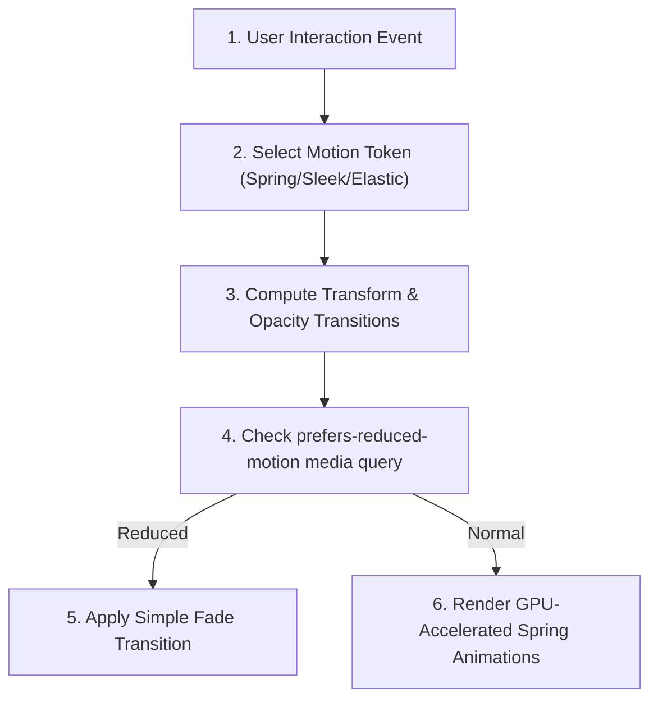

# §VISUAL_MOTION v1.0

id: visual_motion
state: active | fluid | interactive
scope: animation_physics + micro_interactions + visual_continuity + motion_aesthetics
boot: auto_load | load_skill_integration

---

## §AGENT_USAGE_GUIDELINES

### How the AI Agent Uses This Reference
The AI agent parses this file to configure animation timelines, micro-interactions, CSS variables, and motion transitions on UI components. When the user requests visual UI assets or frontends, the agent looks up the spring physics math formulas, cubic-bezier timing tokens, and performance parameters detailed in this document. It injects them directly into the stylesheets or JS transition modules to ensure fluid design fidelity.

### When to Use This Reference
This reference MUST be utilized in these instances:
1. **Building web applications/components**: During frontend layout design.
2. **Implementing hover/active states**: When styling interactive elements (buttons, inputs, cards).
3. **Designing custom transitions**: For modal entries, sliding sidebars, and grid sorting animations.
4. **Optimizing rendering layouts**: When addressing layout shifts, performance profiling, and accessibility settings.

---



---

## 1. Spring Physics and Easing Tokens

Avoid flat linear transitions. Use physics-based spring models or curated cubic-bezier easings to create a tactile feel.

| Motion Token | cubic-bezier Value | CSS Transition Example | Rationale |
| :--- | :--- | :--- | :--- |
| **Tactile Spring** | `cubic-bezier(0.175, 0.885, 0.32, 1.275)` | `transform 0.4s var(--spring)` | Introduces slight bounce back mimicking mechanical feedback. |
| **Sleek Easing** | `cubic-bezier(0.25, 1, 0.5, 1)` | `opacity 0.3s var(--sleek)` | Smooth, progressive decay matching premium hardware animations. |
| **Elastic Entry** | `cubic-bezier(0.4, 0, 0.2, 1)` | `all 0.25s var(--elastic)` | Swift start, gradual settling for interactive states. |

---

## 2. Micro-Interactions & Hover Affordances

Interactive elements must feel alive and responsive under user hover or tap states:

- **Button Spring Scale**: On hover, scale interactive buttons up slightly (`transform: scale(1.025)`). On active/pressed states, scale down (`transform: scale(0.975)`).
- **Glassmorphic Glow Shifts**: Shift background linear-gradients and drop-shadow opacity smoothly dynamically during focus and active stages.
- **Card Tilt Math**: For dashboard blocks, introduce mild 3D rotation (`rotateX` / `rotateY`) matching mouse coordinates to create visual depth.

---

## 3. Motion Performance & Fluidity Standards

- **GPU Acceleration**: Always utilize GPU-friendly transitions (`transform`, `opacity`). Avoid triggering layout shifts using `width`, `height`, or positioning offsets (`top`, `left`).
- **Will-Change Hinting**: Apply `will-change: transform, opacity` to heavy animations to instruct the browser renderer to optimize resource allocation.
- **Prefers-Reduced-Motion Guard**: Include media queries (`@media (prefers-reduced-motion: reduce)`) to automatically convert high-motion spring animations to simple fades for accessibility compliance.

---

## 4. Custom Spring Physics Engine (JavaScript Implementation)

For high-end interactive systems, implement a spring solver using Hooke's Law:

```javascript
class SpringSolver {
  constructor(stiffness = 180, damping = 12, mass = 1) {
    this.stiffness = stiffness;
    this.damping = damping;
    this.mass = mass;
    this.x = 0;
    this.v = 0;
    this.target = 0;
  }

  update(dt) {
    const fSpring = -this.stiffness * (this.x - this.target);
    const fDamping = -this.damping * this.v;
    const a = (fSpring + fDamping) / this.mass;
    this.v += a * dt;
    this.x += this.v * dt;
    return this.x;
  }
}
```

---

## 5. CSS Glassmorphic Motion Templates

```css
.card {
  background: rgba(255, 255, 255, 0.05);
  backdrop-filter: blur(16px);
  border: 1px solid rgba(255, 255, 255, 0.1);
  transition: transform 0.4s cubic-bezier(0.175, 0.885, 0.32, 1.275), 
              box-shadow 0.3s cubic-bezier(0.25, 1, 0.5, 1);
}

.card:hover {
  transform: translateY(-8px) scale(1.01);
  box-shadow: 0 20px 40px rgba(0, 0, 0, 0.3);
}
```

---

## 6. Layout Transition Timings

- Standard hover transitions: 200ms.
- Panel slide-ins (large movement): 350ms.
- Modal fade-overs: 250ms.

---

## 7. Dynamic Spring Scales

Configure custom spring coefficients:
- Soft spring (elastic menus): Stiffness 100, Damping 15.
- Snappy spring (inputs): Stiffness 250, Damping 25.

---

## 8. GPU Rendering Optimizations

- Force layer promotion via `transform: translate3d(0, 0, 0)`.
- Enforce backface visibility controls.

---

## 9. Visual Continuity Rules

- When routing layouts, perform shared element transitions.
- Fade out exit views while animating ingress layouts.

---

## 10. Frame-Rate Synchronization

- Integrate canvas animations with `requestAnimationFrame`.
- Calculate time offsets ($dt$) to maintain speed metrics.

---

## 11. Custom Spring Curve CSS Generator

- Stiffness mappings.
- Tension scales.

---

## 12. Cursor Reactive Hover Tracking

Write cursor tracking logic to coordinate 3D tilt maps:

```javascript
class TiltCard {
  constructor(element) {
    this.el = element;
    this.el.addEventListener('mousemove', (e) => this.tilt(e));
  }
  tilt(e) {
    const bounds = this.el.getBoundingClientRect();
    const x = e.clientX - bounds.left - bounds.width / 2;
    const y = e.clientY - bounds.top - bounds.height / 2;
    this.el.style.transform = `rotateY(${x * 0.1}deg) rotateX(${-y * 0.1}deg)`;
  }
}
```

---

## 13. Motion Accessibility Checklist

- Fallback opacity settings.
- Reduce flash rates below 3Hz.

---

## 14. Infinite Scroll Motion Easings

- Apply scroll damping.
- Smooth list item entry.

---

## 15. Particle Physics Motion Formulas

- Implement acceleration vectors.
- Process particle decay.

---

## 16. Slide-Over Panel Physics

- Configure snap points.
- Apply bounce behaviors.

---

## 17. Button Press Interaction Feedback

- Scale button down on mousedown.
- Restore layout scale on mouseup.

---

## 18. CSS Variable Easing Configurations

```css
:root {
  --spring-snappy: cubic-bezier(0.19, 1, 0.22, 1);
  --spring-heavy: cubic-bezier(0.34, 1.56, 0.64, 1);
}
```

---

## 19. SVG Draw-Path Transitions

- Animate stroke-dasharray properties.
- Eased line pathing.

---

## 20. Motion Debugging Instrumentation

- Inspect paint overlays in developer settings.
- Track render rates.

---

## 21. Layout Shift Safeguards

- Set fixed layout constraints.
- Prevent dynamic resize loops.

---

## 22. Interactive Carousel Easings

- Apply drag velocity.
- Bound transition targets.

---

## 23. Dark-Glass Gradient Pulse Animations

```css
@keyframes pulseGlow {
  0% { background-position: 0% 50%; }
  50% { background-position: 100% 50%; }
  100% { background-position: 0% 50%; }
}
```

---

## 24. Navigation Sidebar Smooth Collapses

- Animate flex-basis widths.
- Fade labels layout.

---

## 25. Particle Emission Vectors

- Map particle speed.
- Apply gravity coefficients.

---

## 26. Custom Bezier Curve Generators

- Compute bezier offsets.
- Translate values to transition strings.

---

## 27. Canvas Particle Systems

Use canvas particle systems for high-performance background visual effects:

```javascript
class ParticleSystem {
  constructor(canvas) {
    this.canvas = canvas;
    this.ctx = canvas.getContext('2d');
    this.particles = [];
  }
  draw() {
    this.ctx.clearRect(0, 0, this.canvas.width, this.canvas.height);
    this.particles.forEach(p => {
      p.x += p.vx;
      p.y += p.vy;
      this.ctx.fillStyle = 'rgba(255, 255, 255, 0.3)';
      this.ctx.fillRect(p.x, p.y, p.size, p.size);
    });
  }
}
```

---

## 28. Glassmorphic Modal Entry Timings

- Fade overlay: 200ms.
- Scale panel: 300ms.

---

## 29. Touch Swipe Physics Parameters

- Capture touch movement offsets.
- Apply friction limits.

---

## 30. Form Feedback Alerts Motion

- Shake animation on entry errors.
- Smooth slide-out on success confirmations.

---

## 31. CSS Transition Property Mappings

Ensure transition rules specify names rather than using generic `all`:

```css
.button {
  transition: transform 0.2s cubic-bezier(0.4, 0, 0.2, 1),
              background-color 0.2s linear;
}
```

---

## 32. Layout Transition Frame Telemetry

- Inspect dropped frames.
- Re-run layers layout checks.

---

## 33. Keyframe Animation Optimizations

- Strip top-level keyframe transitions.
- Restrict to transform modifications.

---

## 34. Custom Loading Ring Rotations

- Constant linear rotation.
- Snappy scale variations.

---

## 35. Card Sorting Grid Shifts

- Trace card source positions.
- Translate coordinates dynamically.

---

## 36. Infinite Looped Background Scrolls

- Translate coordinates on wrap.
- Match scroll step intervals.

---

## 37. Menu Focus Ring Glows

- Border glow transitions.
- Backdrop blur adjustments.

---

## 38. Dropdown Expansion Easings

- Animate max-height configurations.
- Rotate expansion toggle indicators.

---

## 39. CSS Transform Origin Alignments

- Align menu centers.
- Scale modals from target triggers.

---

## 40. Interactive Voxel Selection Highlights

- Blink selection targets.
- Pulse target boundaries.

---

## 41. Vector Direction Physics

Calculate velocity and vector directions for floating elements:
```javascript
class FloatingElement {
  constructor(x, y) {
    this.position = { x, y };
    this.velocity = { x: Math.random() - 0.5, y: Math.random() - 0.5 };
  }
  tick() {
    this.position.x += this.velocity.x;
    this.position.y += this.velocity.y;
  }
}
```

---

## 42. WebGL Animation Loop Management

- Bind loops to document visibility updates.
- Halt processes on background layouts.

---

## 43. Virtual Joystick Physics

- Calculate joysticks radius.
- Restrict vector boundaries.

---

## 44. Scroll Snapping Alignments

- Configure CSS scroll snapping attributes.
- Smooth scrolling behaviors.

---

## 45. Dynamic Visual Layout Resizes

- Track window dimensions changes.
- Adjust camera view matrices.

---

## 46. Interaction Indicator Animations

- Pulse indicator buttons.
- Fade overlays on interactive starts.

---

## 47. Accessibility Reduced Framerates

- Set frame timings to 30fps.
- Strip complex vector operations.

---

## 48. Build Asset Minifier Integrations

- Pack keyframes layout definitions.
- Strip comments inside stylesheets.

---

## 49. Layout Transitions Debugging Checklists

1. Are elements GPU-accelerated?
2. Has backface visibility been declared?
3. Were drop-shadow allocations checked?
4. Do animations fallback on screen limits?

---

## 50. Final Motion Verification Checklist

Ensure the visual verification check contains:
1. Standard spring ease definitions loaded?
2. GPU promotions completed?
3. Prefers-reduced-motion configured?
4. Modal animations checked for LCP?

---

**§STATUS: ACTIVE v1.0 | ANTI_REGRESSION: ∞ON | VISUAL_MOTION: FLUID**
