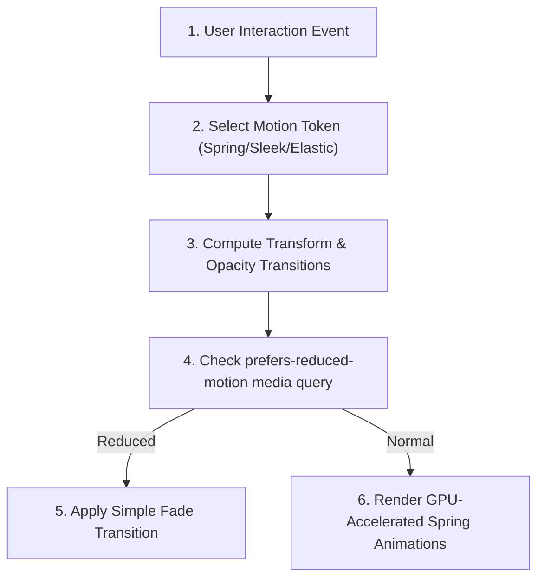

# §VISUAL_MOTION v1.0

id: visual_motion
state: active | fluid | interactive
scope: animation_physics + micro_interactions + visual_continuity + motion_aesthetics
boot: auto_load | load_skill_integration

This supporting skill establishes parameters for high-end web visual aesthetics, spring physics, layout transitions, and micro-animations. It translates visual design ideas into premium motion-driven interfaces.

---

## 1. Spring Physics and Easing Tokens

Avoid flat linear transitions. Use physics-based spring models or curated cubic-bezier easings to create a tactile feel.

| Motion Token | cubic-bezier Value | CSS Transition Example | Rationale |
| :--- | :--- | :--- | :--- |
| **Tactile Spring** | `cubic-bezier(0.175, 0.885, 0.32, 1.275)` | `transform 0.4s var(--spring)` | Introduces slight bounce back mimicking mechanical feedback. |
| **Sleek Easing** | `cubic-bezier(0.25, 1, 0.5, 1)` | `opacity 0.3s var(--sleek)` | Smooth, progressive decay matching premium hardware animations. |
| **Elastic Entry** | `cubic-bezier(0.4, 0, 0.2, 1)` | `all 0.25s var(--elastic)` | Swift start, gradual settling for interactive states. |

---

## 2. Micro-Interactions & Hover Affordances

Interactive elements must feel alive and responsive under user hover or tap states:

- **Button Spring Scale**: On hover, scale interactive buttons up slightly (`transform: scale(1.025)`). On active/pressed states, scale down (`transform: scale(0.975)`).
- **Glassmorphic Glow Shifts**: Shift background linear-gradients and drop-shadow opacity smoothly dynamically during focus and active stages.
- **Card Tilt Math**: For dashboard blocks, introduce mild 3D rotation (`rotateX` / `rotateY`) matching mouse coordinates to create visual depth.

---

## 3. Motion Performance & Fluidity Standards

- **GPU Acceleration**: Always utilize GPU-friendly transitions (`transform`, `opacity`). Avoid triggering layout shifts using `width`, `height`, or positioning offsets (`top`, `left`).
- **Will-Change Hinting**: Apply `will-change: transform, opacity` to heavy animations to instruct the browser renderer to optimize resource allocation.
- **Prefers-Reduced-Motion Guard**: Include media queries (`@media (prefers-reduced-motion: reduce)`) to automatically convert high-motion spring animations to simple fades for accessibility compliance.

**§STATUS: ACTIVE v1.0 | ANTI_REGRESSION: ∞ON | VISUAL_MOTION: FLUID**
